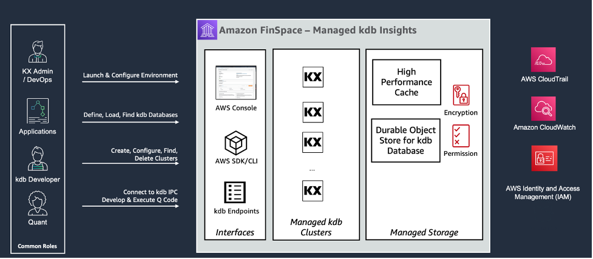

After careful consideration, we decided to end support for Amazon FinSpace, effective October 7, 2026. Amazon FinSpace will no longer accept new customers beginning October 7, 2025. As an existing customer with an Amazon FinSpace environment created before October 7, 2025, you can continue to use the service as normal. After October 7, 2026, you will no longer be able to use Amazon FinSpace. For more information, see
[Amazon FinSpace end of support](amazon-finspace-end-of-support.md "amazon-finspace-end-of-support.md").

# Managed kdb Insights

Amazon FinSpace with Managed kdb Insights provides a fully managed service for the latest version
of kdb’s analytics engine. Kdb Insights is the leading time-series analytics engine used by
capital markets customers to power their business-critical analytics workloads, such as
liquidity insights, pricing, transaction cost analysis, and back-testing.

With Amazon FinSpace Managed kdb Insights, you can deploy your existing real-time stream
processing and high-performance kdb code in the AWS cloud to power time-sensitive analytics
workloads. This is fundamental to running investment and trading businesses.

Using Managed kdb Insights’ clusters, you can quickly set up a managed data processing and
analytics hub. With a few clicks in the Managed kdb Insights application, you can migrate your
existing kdb datasets to FinSpace. By configuring Managed kdb Insights to auto scale the kdb
clusters up and down, you can meet the availability and runtime performance needs of each of
your kdb workloads. You can configure your Managed kdb Insights clusters to automatically
deploy across multiple Availability Zones and Regions to ensure that your analytics
environment is available during the most critical business hours.

As a result, you no longer require teams of specialists to monitor the infrastructure. This
is because Managed kdb Insights continuously monitors underlying server health and capacity,
and automatically replaces servers when they fail and patches servers in need of updates. In
addition, it simplifies the work required to set up and deploy new clusters so the kdb
administrators can focus more on business needs. Managed kdb Insights also supports running
the same customer-developed kdb scripts that they run today on premises, and provides the same
familiar kdb interfaces.

**How it works**

###### The diagram describes key components of Managed kdb Insights:

- You can manage Managed kdb Insights resources by using the AWS Management Console or the
  SDK/CLI.
- Data is stored in durable object store back databases.
- Compute clusters running kdb software access data in the database.
- Data can be cached from the database on high performance disk cache for fast access
  by the cluster.
- Developers and quantitative analysts (quants) can access clusters via kdb IPC
  connections.
- Access can be controlled through IAM.
- Activity is logged to CloudTrail and CloudWatch.

######

Topics

- [Permissions required for Managed kdb](permissions-managed-kdb.md "permissions-managed-kdb.md")
- [Managed kdb Insights
  environments](finspace-managed-kdb-environment.md "finspace-managed-kdb-environment.md")
- [Managed kdb Insights databases](finspace-managed-kdb-db.md "finspace-managed-kdb-db.md")
- [Managed kdb scaling groups](finspace-managed-kdb-scaling-groups.md "finspace-managed-kdb-scaling-groups.md")
- [Managed kdb volumes](finspace-managed-kdb-volumes.md "finspace-managed-kdb-volumes.md")
- [Managed kdb Insights clusters](finspace-managed-kdb-clusters.md "finspace-managed-kdb-clusters.md")
- [Logging and monitoring](kdb-cluster-logging-monitoring.md "kdb-cluster-logging-monitoring.md")
