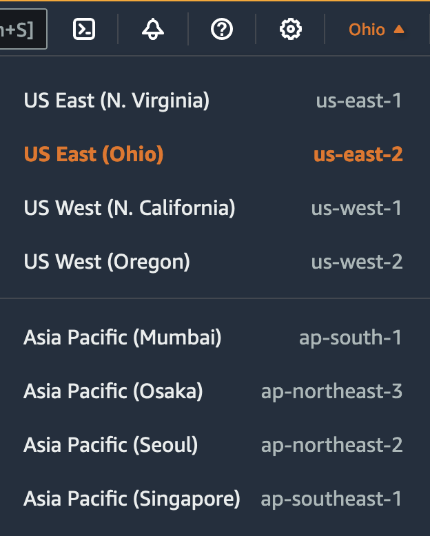

After careful consideration, we decided to end support for Amazon FinSpace, effective October 7, 2026. Amazon FinSpace will no longer accept new customers beginning October 7, 2025. As an existing customer with an Amazon FinSpace environment created before October 7, 2025, you can continue to use the service as normal. After October 7, 2026, you will no longer be able to use Amazon FinSpace. For more information, see
[Amazon FinSpace end of support](amazon-finspace-end-of-support.md "amazon-finspace-end-of-support.md").

# Amazon FinSpace service quotas

###### Important

Amazon FinSpace Dataset Browser will be discontinued on `March 26,
 2025`. Starting `November 29, 2023`, FinSpace will no longer accept the creation of new Dataset Browser
environments. Customers using [Amazon FinSpace with Managed Kdb Insights](https://aws.amazon.com/finspace/features/managed-kdb-insights/ "https://aws.amazon.com/finspace/features/managed-kdb-insights/") will not be affected. For more information, review the [FAQ](https://aws.amazon.com/finspace/faqs/ "https://aws.amazon.com/finspace/faqs/") or contact [AWS Support](https://aws.amazon.com/contact-us/ "https://aws.amazon.com/contact-us/") to assist with your
transition.

Amazon FinSpace provides different resources that you can use. These resources include resources
like environments, databases, volumes, clusters, scaling groups, etc. When you create your
AWS account, we set default quotas on these resources on a per-Region basis.

The Service Quotas is a central location where you can view and manage your quotas for AWS services, and request a quota increase for many of the resources that you use. Use the quota information that we provide to manage your AWS infrastructure. Plan to request any quota increases in advance of the time that you'll need them.

You can contact AWS Support to request a [quota](../../../general/latest/gr/aws_service_quotas.md "../../../general/latest/gr/aws_service_quotas.md")
increase for the service quotas listed in the AWS General Reference.

## View your current quotas

You can view your quotas for each Region using Service Quotas console.

###### To view your current quotas using the Service Quotas console

1. Open the Service Quotas console at [https://console.aws.amazon.com/servicequotas/home/services/finspace/quotas/](https://console.aws.amazon.com/servicequotas/home/services/finspace/quotas/ "https://console.aws.amazon.com/servicequotas/home/services/finspace/quotas/").
2. From the navigation bar (at the top of the screen), select a Region.

 3. Use the filter field to filter the list by resource name. For example, enter
`kx.s.xlarge nodes` to locate the quotas for these
nodes. 4. To view more information, choose the quota name to open the details page for the quota.

## Request an increase

You can request a quota increase for each Region.

###### To request an increase using the Service Quotas console

1. Open the Service Quotas console at [https://console.aws.amazon.com/servicequotas/home/services/finspace/quotas/](https://console.aws.amazon.com/servicequotas/home/services/finspace/quotas/ "https://console.aws.amazon.com/servicequotas/home/services/finspace/quotas/").
2. From the navigation bar (at the top of the screen), select a Region.
3. Use the filter field to filter the list by resource name. For example, enter
   `kx.s.xlarge nodes` to locate the quotas for these
   nodes.
4. If the quota is adjustable, choose the quota and then choose **Request
   quota increase**.
5. For **Increase quota value**, enter the new quota value.
6. Choose **Request**.
7. To view any pending or recently resolved requests in the console, choose
   **Dashboard** from the navigation pane. For pending requests,
   choose the status of the request to open the request receipt. The initial status of a
   request is **Pending**. After the status changes to **Quota
   requested**, you'll see the case number with Support. Choose the case
   number to open the ticket for your request.

## Quotas

The following table describes throttling quotas for application and user management within FinSpace.

| Name              | Quota | Adjustable | Description                                                                |
| ----------------- | ----- | ---------- | -------------------------------------------------------------------------- |
| Environments      | 2     | Yes        | The maximum number of FinSpace environments you can create per AWS account |
| Users             | 5     | Yes        | The maximum number of users that can exist in a FinSpace environment       |
| Permission groups | 20    | Yes        | The maximum number of permission groups per FinSpace environment           |

The following table describes the quotas for data within FinSpace.

| Name                                   | Quota        | Adjustable | Description                                                                                     |
| -------------------------------------- | ------------ | ---------- | ----------------------------------------------------------------------------------------------- |
| Datasets                               | 1500         | Yes        | The maximum number of datasets that can exist in a FinSpace environment.                        |
| Concurrent changesets processing       | 10           | Yes        | The maximum number of concurrent changesets that can be processing per FinSpace environment.    |
| Files per changeset                    | 100000       | No         | The maximum number of files in a single changeset.                                              |
| File size per changeset                | 50 Gigabytes | No         | The maximum file size of any single file in a changeset.                                        |
| Data views per dataset                 | 3            | Yes        | The maximum number of data views that can be created per dataset.                               |
| Concurrent data views processing       | 10           | Yes        | The maximum number of concurrently running data views processing per FinSpace environment.      |
| Controlled vocabularies and categories | 100          | Yes        | The maximum combined number of controlled vocabularies and categories per FinSpace environment. |
| Attribute sets                         | 100          | Yes        | The maximum number of attribute sets that can exist in a FinSpace environment.                  |
| Datasets per permission group          | 1500         | Yes        | The maximum number of datasets assigned per permission group.                                   |
| Notebook storage                       | 10 Gigabytes | No         | The maximum amount of EFS storage per user notebook environment.                                |

The following table describes the quotas for compute within FinSpace.

| Name              | Quota | Adjustable | Description                                                                     |
| ----------------- | ----- | ---------- | ------------------------------------------------------------------------------- |
| Clusters per user | 1     | No         | The maximum number of FinSpace Spark clusters that can be active for each user. |

The following table describes the quotas for FinSpace Managed kdb resources.

| Name                                        | Quota            | Adjustable | Description                                                                    |
| ------------------------------------------- | ---------------- | ---------- | ------------------------------------------------------------------------------ |
| Managed kdb Multi-AZ clusters               | 1                | Yes        | The maximum number of Multi-AZ clusters per environment.                       |
| Managed kdb Single-AZ clusters              | 5                | Yes        | The maximum number of Single-AZ clusters per environment.                      |
| Managed kdb cluster users                   | 1,000            | Yes        | The maximum number of cluster users per environment.                           |
| Managed kdb clusters                        | 10               | Yes        | The maximum number of clusters allowed per environment.                        |
| Managed kdb concurrent changeset ingestions | 10               | Yes        | The maximum number of concurrent changeset ingestions allowed per environment. |
| Managed kdb database cluster cache size     | 7,730 Gigabytes  | Yes        | The maximum amount of database cluster cache allowed per environment.          |
| Managed kdb databases                       | 1,500            | Yes        | The maximum number of databases allowed per environment.                       |
| Managed kdb nodes per cluster               | 5                | Yes        | The maximum number of nodes per cluster.                                       |
| Managed kdb savedown storage                | 17,179 Gigabytes | yes        | The maximum amount of savedown storage allowed per environment.                |
| Total kdb environments                      | 1                | Yes        | The maximum number of Managed kdb environments per AWS Account.                |
| kx.s.16xlarge nodes                         | 0                | Yes        | The maximum number of kx.s.16xlarge nodes allowed per environment.             |
| kx.s.2xlarge nodes                          | 5                | Yes        | The maximum number of kx.s.2xlarge nodes allowed per environment.              |
| kx.s.32xlarge nodes                         | 0                | Yes        | The maximum number of kx.s.32xlarge nodes allowed per environment.             |
| kx.s.4xlarge nodes                          | 1                | Yes        | The maximum number of kx.s.4xlarge nodes allowed per environment.              |
| kx.s.8xlarge nodes                          | 1                | Yes        | The maximum number of kx.s.8xlarge nodes allowed per environment.              |
| kx.s.large nodes                            | 5                | Yes        | The maximum number of kx.s.large nodes allowed per environment.                |
| kx.s.xlarge nodes                           | 5                | Yes        | The maximum number of kx.s.xlarge nodes allowed per environment.               |
| Managed kdb changeset files                 | 262144           | No         | The maximum number of files per changeset.                                  |
| Managed kdb changeset single file size      | 1 Terabyte       | No         | The maximum size of a single file in changesets.                            |
| Managed kdb changeset total size            | 5 Terabytes      | No         | The maximum limit for total file size per changeset.                           |

The following table describes the quotas for Managed kdb scaling groups and volumes within
FinSpace.

| Name                                | Quota          | Adjustable | Description                                                                               |
| ----------------------------------- | -------------- | ---------- | ----------------------------------------------------------------------------------------- |
| Managed kdb scaling groups          | 10             | Yes        | The maximum number of Managed kdb scaling groups per environment.                         |
| kx.sg.large                         | 1              | Yes        | The maximum number of kx.sg.large Managed kdb scaling group nodes per environment.     |
| kx.sg.xlarge group nodes            | 1              | Yes        | The maximum number of kx.sg.xlarge Managed kdb scaling group nodes per environment.    |
| kx.sg.2xlarge group nodes           | 1              | Yes        | The maximum number of kx.sg.2xlarge Managed kdb scaling group nodes per environment.   |
| kx.sg.4xlarge scaling group nodes   | 1              | Yes        | The maximum number of kx.sg.4xlarge Managed kdb scaling group nodes per environment.   |
| kx.sg.8xlarge scaling group nodes   | 1              | Yes        | The maximum number of kx.sg.8xlarge Managed kdb scaling group nodes per environment:   |
| kx.sg.16xlarge scaling group nodes  | 0              | Yes        | The maximum number of kx.sg.16xlarge Managed kdb scaling group nodes per environment.  |
| kx.sg.32xlarge scaling group nodes  | 0              | Yes        | The maximum number of kx.sg.32xlarge Managed kdb scaling group nodes per environment.  |
| kx.sg1.16xlarge scaling group nodes | 0              | Yes        | The maximum number of kx.sg1.16xlarge Managed kdb scaling group nodes per environment. |
| kx.sg1.24xlarge scaling group nodes | 0              | Yes        | The maximum number of kx.sg1.24xlarge Managed kdb scaling group nodes per environment. |
| Managed kdb volumes                 | 5              | Yes        | The maximum number of Managed kdb volumes per environment.                                |
| Managed kdb volume read mounts      | 5              | Yes        | The maximum number of read mounts per Managed kdb volume per environment.              |
| Managed kdb volume write mounts     | 5              | Yes        | The maximum number of write mounts per Managed kdb volume per environment.             |
| Managed kdb volume storage          | 7730 Gigabytes | Yes        | The maximum amount of storage for Managed kdb volumes per environment.                    |

The following table describes the quotas for kdb dataviews within FinSpace.

| Name                                   | Quota | Adjustable | Description                                                                  |
| -------------------------------------- | ----- | ---------- | ---------------------------------------------------------------------------- |
| Managed kdb dataviews                  | 4500  | Yes        | The maximum number of Managed kdb dataviews per environment.              |
| Concurrent dataview version processing | 10    | Yes        | The maximum number of concurrent Managed kdb dataview version processing. |
