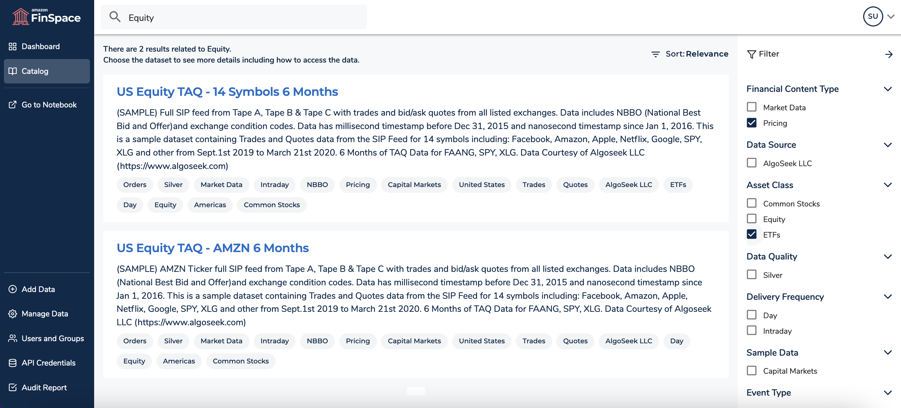
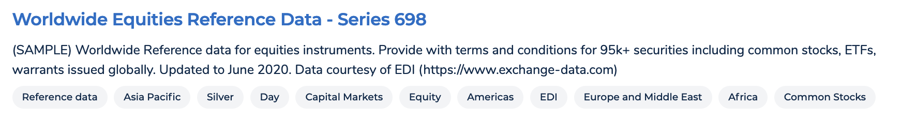

After careful consideration, we decided to end support for Amazon FinSpace, effective October 7, 2026. Amazon FinSpace will no longer accept new customers beginning October 7, 2025. As an existing customer with an Amazon FinSpace environment created before October 7, 2025, you can continue to use the service as normal. After October 7, 2026, you will no longer be able to use Amazon FinSpace. For more information, see
[Amazon FinSpace end of support](amazon-finspace-end-of-support.md "amazon-finspace-end-of-support.md").

# Search and browse data in Amazon FinSpace

###### Important

Amazon FinSpace Dataset Browser will be discontinued on `March 26,
 2025`. Starting `November 29, 2023`, FinSpace will no longer accept the creation of new Dataset Browser
environments. Customers using [Amazon FinSpace with Managed Kdb Insights](https://aws.amazon.com/finspace/features/managed-kdb-insights/ "https://aws.amazon.com/finspace/features/managed-kdb-insights/") will not be affected. For more information, review the [FAQ](https://aws.amazon.com/finspace/faqs/ "https://aws.amazon.com/finspace/faqs/") or contact [AWS Support](https://aws.amazon.com/contact-us/ "https://aws.amazon.com/contact-us/") to assist with your
transition.

Amazon FinSpace provides you the ability to search for data using key words or you can browse for data using the data browser which displays the categories defined in your environment.

## Search bar

**To search for datasets in FinSpace web application**

1. From the homepage, search for data using the search box on the top navigation bar.
2. When you type a keyword, for example `equity`, recent searches will appear on the **Catalog** page. Type \* for requesting all datasets. To search for all datasets starting with word `Equity`, type `Equity*`.
3. Use the return key to receive results. If you have datasets matching the keyword, results will be returned on the screen. The results will differ depending on the permissions assigned
   to a permission group that you are a member of.

For example, a superuser will see all datasets while an application user will only see a dataset if they are a member of a group with read permission
for that dataset.

You can sort results by recently updated datasets, relevance, alphabetical order.

 4. The right panel shows search filtering options that are created based on the attribute sets associated to the returned datasets. 5. You can search for related datasets by choosing the dataset attributes tags of the dataset result.

 6. To view the details of a dataset in the results, choose the name of the dataset that is displayed in bold.

## Data browser

You can also find datasets by using the data browser on the **Catalog** page. This is set up by your organization for users to easily search for datasets. All users will see the same categories
in the data browser. However, when browsing the categories they will only see datasets to which they have appropriate permissions. For example, a superuser will see all datasets, while an
application user will only see a dataset if they are a member of a group with read permission for that dataset.

You can search for related datasets by choosing the dataset attributes in the dataset attributes tags of the dataset result.

To view the details of a dataset in the result, choose the name of the dataset that is displayed in bold.
