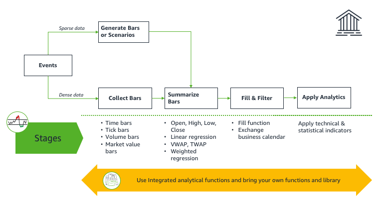

After careful consideration, we decided to end support for Amazon FinSpace, effective October 7, 2026. Amazon FinSpace will no longer accept new customers beginning October 7, 2025. As an existing customer with an Amazon FinSpace environment created before October 7, 2025, you can continue to use the service as normal. After October 7, 2026, you will no longer be able to use Amazon FinSpace. For more information, see
[Amazon FinSpace end of support](amazon-finspace-end-of-support.md "amazon-finspace-end-of-support.md").

# Amazon FinSpace Spark time series library

###### Important

Amazon FinSpace Dataset Browser will be discontinued on `March 26,
 2025`. Starting `November 29, 2023`, FinSpace will no longer accept the creation of new Dataset Browser
environments. Customers using [Amazon FinSpace with Managed Kdb Insights](https://aws.amazon.com/finspace/features/managed-kdb-insights/ "https://aws.amazon.com/finspace/features/managed-kdb-insights/") will not be affected. For more information, review the [FAQ](https://aws.amazon.com/finspace/faqs/ "https://aws.amazon.com/finspace/faqs/") or contact [AWS Support](https://aws.amazon.com/contact-us/ "https://aws.amazon.com/contact-us/") to assist with your
transition.

Amazon FinSpace PySpark Kernel delivers a time series analytics library to prepare and analyze historical financial time series data using FinSpace managed Spark clusters.
You can use the time series library to analyze high-density data like US options historical Options Price Reporting Authority (OPRA) with billions of daily
events or sparse time series data such as quotes for fixed income instruments. The time series library is available to use in the FinSpace notebook environment.

The time-series library is logically organized in four stages for a conceptual framework. Every stage provides a set of functions and you can plug your own functions.

1. **Collect** – The objective of this stage is to collect the series of events that arrive at an irregular frequency into uniform intervals called bars.
   You can perform collection with your functions or use the FinSpace functions to calculate bars such as time bars.
2. **Summarize** – The objective of this stage is to take collected data in bars from previous stage and summarize it using the events captures within a bar.
3. **Fill and Filter** – The data produced in the previous stage could have missing bars where no data was collected or contain data that is not desired to be used
   in the next stage. The objective of this stage is to prepare a dataset of features with evenly spaced intervals and filter out any data outside desired time
   window.
4. **Analytics** – At this stage, a prepared dataset of features is ready for application of technical and statistical indicators. You can bring your own indicator
   functions or choose one of the FinSpace functions for this stage.

See the following sections to learn more about supported functions in the time series library.

######

Topics

- [Collect time bars operations in Amazon FinSpace](time-series-collect.md "time-series-collect.md")
- [Summarize bars operations in Amazon FinSpace](time-series-summarize-bars.md "time-series-summarize-bars.md")
- [Fill and filter operations in Amazon FinSpace](time-series-fill-filter.md "time-series-fill-filter.md")
- [Analyze operations in Amazon FinSpace](time-series-analyze.md "time-series-analyze.md")
- [Using the Amazon FinSpace library](finspace-using-the-library.md "finspace-using-the-library.md")
