After careful consideration, we decided to end support for Amazon FinSpace, effective October 7, 2026. Amazon FinSpace will no longer accept new customers beginning October 7, 2025. As an existing customer with an Amazon FinSpace environment created before October 7, 2025, you can continue to use the service as normal. After October 7, 2026, you will no longer be able to use Amazon FinSpace. For more information, see
[Amazon FinSpace end of support](amazon-finspace-end-of-support.md "amazon-finspace-end-of-support.md").

# Using the Amazon FinSpace library

###### Important

Amazon FinSpace Dataset Browser will be discontinued on `March 26,
 2025`. Starting `November 29, 2023`, FinSpace will no longer accept the creation of new Dataset Browser
environments. Customers using [Amazon FinSpace with Managed Kdb Insights](https://aws.amazon.com/finspace/features/managed-kdb-insights/ "https://aws.amazon.com/finspace/features/managed-kdb-insights/") will not be affected. For more information, review the [FAQ](https://aws.amazon.com/finspace/faqs/ "https://aws.amazon.com/finspace/faqs/") or contact [AWS Support](https://aws.amazon.com/contact-us/ "https://aws.amazon.com/contact-us/") to assist with your
transition.

This following section provides a step-by-step example on how to use the time series library across all stage in the framework, using the **US Equity TAQ 6 months, AMZN Symbol**
dataset available with the [sample capital markets data bundle](sample-data-bundle.md "sample-data-bundle.md") with Amazon FinSpace.

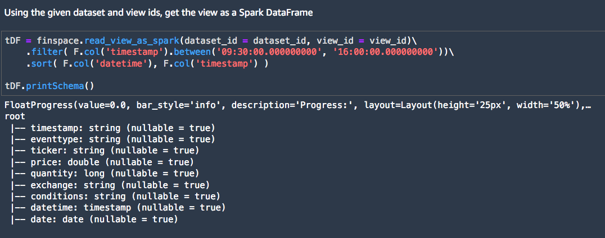

**Events** – The Data View now loaded into the DataFrame contains raw data events. The DataFrame is filtered on `ticker`, `eventtype`, `datetime`, `price`, `quantity`, `exchange`,
`conditions` fields.

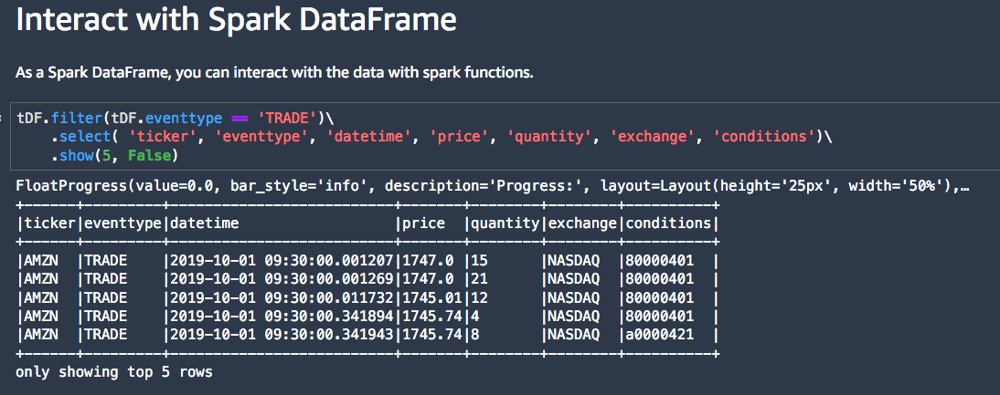

**Collect Bars** – In this stage, the FinSpace create_time_bars function is used to collect raw data events into 1-minute time bars.

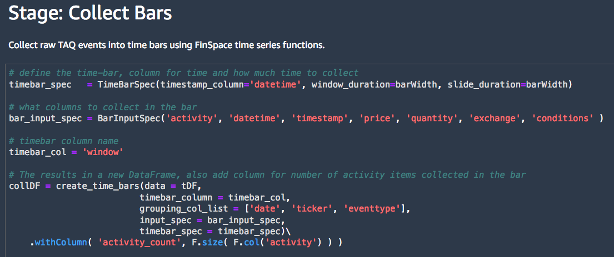
The window represents the 1-min time interval for the bar. The Activity count shows the number of events collected in each bar. Note that the data events collected
inside the bar are not shown.

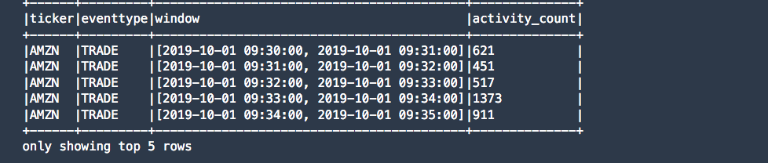

**Summarize Bars** – In this stage, the FinSpace summarize functions are applied to calculate 1-minute summaries of events collected in bars. Summaries are created for two-point
standard deviation, Volume Weighted Average Price, open(first), high, low, close(last) prices commonly referred as OHLC.

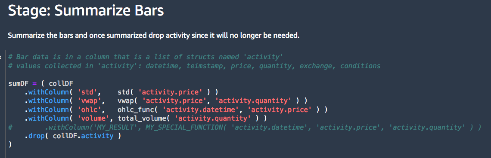
The activity count shows the number of events summarized in a single summary bar.

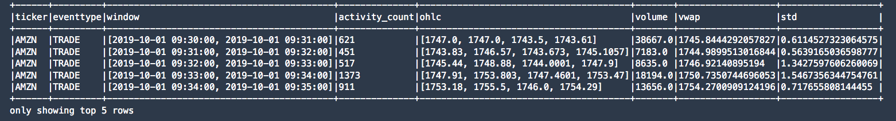

**Fill & Filter** – The resulting data set is filtered according to an exchange trading calendar.

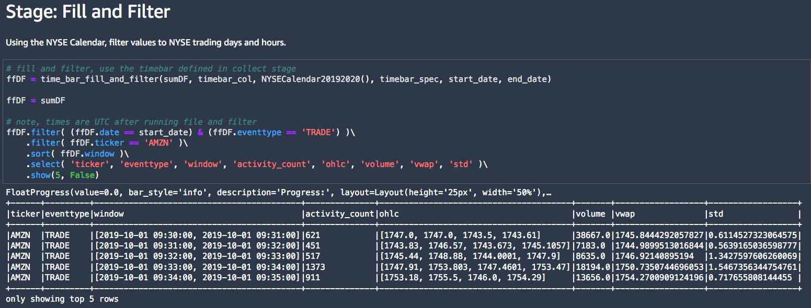
The schema is simplified to prepare a dataset of features. VWAP and standard deviation calculations are now displayed as well.

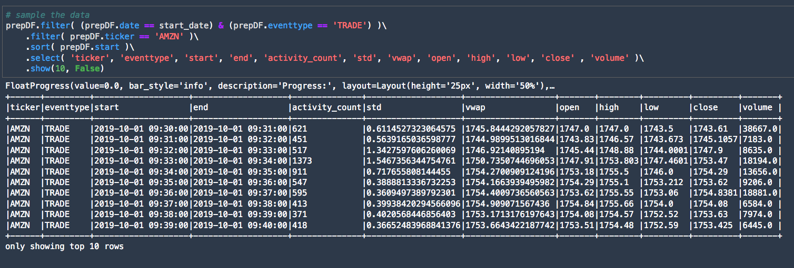

**Apply Analytics** – FinSpace Bollinger Bands function is applied on the features dataset. Note that the tenor window to perform the calculation is 15 which means that the
calculation is applied when 15 data events are available. As each event corresponds to a 1-min summary bar in the features dataset, the resulting dataset starts from timestamp
09:45 (see end column).

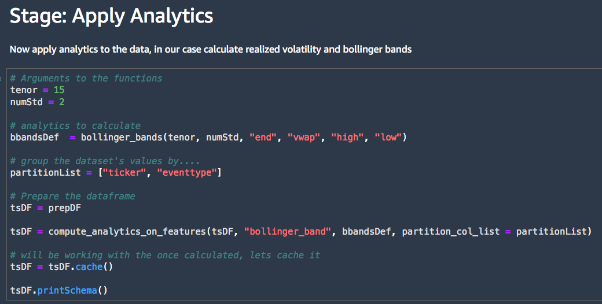

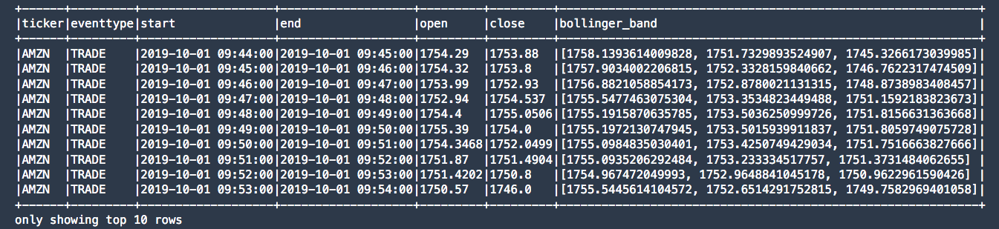
You can plot the output into a chart using matplotlib. The chart shows the Bollinger Bands for the entire 3 month history for AMZN.

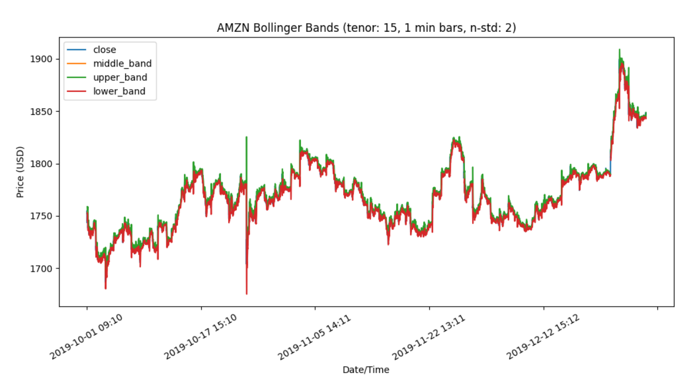
FinSpace time series library is provided with `aws.finspace.timeseries.spark` package used when working with
data that will be processed using a FinSpace Spark cluster in the FinSpace notebook.
