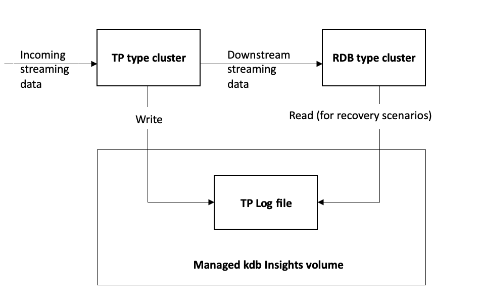

After careful consideration, we decided to end support for Amazon FinSpace, effective October 7, 2026. Amazon FinSpace will no longer accept new customers beginning October 7, 2025. As an existing customer with an Amazon FinSpace environment created before October 7, 2025, you can continue to use the service as normal. After October 7, 2026, you will no longer be able to use Amazon FinSpace. For more information, see
[Amazon FinSpace end of support](amazon-finspace-end-of-support.md "amazon-finspace-end-of-support.md").

# Cluster types

Amazon FinSpace supports a variety of kdb clusters that you can use for different uses cases
such as to implement a standard kdb tick architecture.

## General purpose

You can use a _general purpose_ cluster if your
kdb application doesn't require any specific features that are available on more
specialized clusters—like the multi-node, Multi-AZ read-only query of an HDB
cluster or the multi-node, Multi-AZ gateways.

With a general purpose cluster, you can mount a kdb Insights database for
read-only access, as well as storage ([savedown storage](#kdb-cluster-savedown-storage "#kdb-cluster-savedown-storage")) for writing. This ability to read a database and write
contents from a single cluster makes general purpose clusters suitable for various
maintenance tasks. For example, you can use a general purpose cluster for tasks that
require the ability to read and write data, and for creating derived datasets from an
HDB cluster, in support of use cases such as one-time analysis by quantitative
analysts (quants).

**Features of a general purpose cluster**

The following are the features of a general purpose cluster.

- The node count for this cluster type is fixed at 1.
- It only supports Single-AZ mode.
- It can mount a kdb Insights database for read-only access to data.
- You can configure savedown storage at the time of creating the cluster. You
  can use this space for writing savedown files before loading into a FinSpace
  database, or as a writeable space of other temporary files. For dedicated
  clusters, the savedown storage becomes unavailable when the cluster node is
  deleted.
- For clusters running on a scaling group, the savedown storage location will
  use a shared volume. This volume exists even after you delete the cluster and
  can be used by other clusters. You can remove the data on the volume before
  deleting the cluster or it remains available for use by other clusters.
- It can update databases and cache with the [UpdateKxClusterDatabase](../management-api/API_UpdateKxClusterDatabases.md "../management-api/API_UpdateKxClusterDatabases.md") operation.

## Tickerplant

A tickerplant (TP) acts as a message bus that subscribes to data or gets data pushed to it by Feed Handlers and then publishes it to one or more
consumers, typically a realtime database (RDB). It persists a copy of each message
received to a durable log of messages that are called the TP Log, so that downstream subscribers
can request a replay of messages if needed. The following diagram explains that you can
configure a TP cluster to save logs to a volume in Managed kdb Insights, from where you can
replay the logs from an RDB type cluster.

**Features of a tickerplant cluster**

Following are the features of a tickerplant type cluster:


- It supports only single-node that is only one kdb process.
- It shares storage with RDB clusters.
- It does not support the Multi-AZ mode. If you need Multi-AZ redundancy, run two TP type
  clusters in parallel.

## Gateway

In the vast majority of kdb+ systems, data is stored across several processes,
which results in the need to access data across these processes. You do this by using
a gateway to act as a single interface point that separates the end user from the
configuration of underlying databases or services. With a gateway, you don't need to
know where data is stored, and you don't need to make multiple requests to retrieve
it.

To support running your custom gateway logic, Managed kdb Insights provides a
_gateway_ cluster type. You can deploy your own
routing logic using the initialization scripts and custom code. You can configure
gateways to a multi-node, Multi-AZ deployment for resiliency.

**Features of a gateway cluster**

The following are the features of a gateway type cluster:


- It provides support to run gateways with your custom allocation hosted
  inside of a Managed kdb environment.
- It provides support for hosting code with custom allocation logic for
  allocating load across different kdb clusters or nodes.
- It integrates with the discovery service to understand available clusters,
  monitor their health status, and provide an endpoint for the cluster.
- It provides a network path from your custom code running on the gateway to
  the cluster supporting IPC connections.

## Real-time database (RDB)

You can use a _real-time database_ cluster to
capture all the data from another kdb process, such as a ticker plant, and store it
in memory for query or real-time processing. Because the data volume can eventually
exceed the amount of available memory, kdb customers typically move the data from the
RDB to a historical database (HDB) using a process called _savedown_. This process typically occurs at the end of a business day.

You can create, list, and delete RDB clusters with single or multiple nodes
through both console and FinSpace API operations.

### Savedown storage

RDB clusters require local space for temporary storage of data during the
savedown process. This temporary storage is used to hold data for the period
between when a cluster has flushed it from memory and when it is successfully
loaded into a kdb Insights database. To support this, RDB clusters have writeable
disk that is used as storage space for savedown data. You can use the data saved
down to the FinSpace database from and RDB by creating an HDB cluster that points to
the database.

**Considerations**

The following are some considerations related to savedown storage:

- You can configure savedown storage at the time of creating the cluster.
  You can use this space to write savedown files before loading into a
  FinSpace database, or as a writeable space for other temporary files.
- For dedicated clusters, the savedown storage becomes unavailable when
  you delete a cluster node.
- For clusters running on a scaling group, the savedown storage location
  will use a shared volume. This volume exists even after you delete the
  cluster and can be used by other clusters. You can remove the data on the
  volume before deleting the cluster or it remains available for use by other
  clusters.

## Historical database (HDB)

A historical database holds data from a day before the current day. Each day, new
records are added to the HDB at the end of day. To access data in Managed kdb
databases from an HDB cluster, you must attach the databases you want to access as an
option when launching the cluster. You can do this at the time of creating a cluster
through the console, or by using the [create cluster API
operation](../management-api/API_CreateKxCluster.md "../management-api/API_CreateKxCluster.md") in the _Amazon FinSpace Management API Reference_.
The HDB cluster can access this data in a read-only mode.

### Cache configuration

When you attach a database to a cluster for access, by default, the read
operations are performed directly against the object store that the database data
is stored in. Alternatively, you can also define a file cache, in which you can
load data for faster performance.

You do this by specifying cache configuration when you associate the database with
the cluster. You can specify a certain amount of cache, and then separately
specify the contents of the database that you want to cache.

FinSpace supports the following cache types:

- **CACHE_1000** – This type allows a throughput of 1000 MB/s per unit storage (TiB).
- **CACHE_250** – This type allows a throughput of 250 MB/s per unit storage (TiB).
- **CACHE_12** – This type allows a throughput of 12 MB/s per unit storage (TiB).

**Considerations**

The following are some considerations related to storage and billing:

- Caching is only available on dedicated clusters. For clusters running on
  a scaling group, use [dataviews](finspace-managed-kdb-dataviews.md "finspace-managed-kdb-dataviews.md").
- You can only configure initial cache size at the time of cluster
  creation. To run a cluster with a different sized cache, you need to
  terminate the cluster and launch a new one with smaller database cache
  size.
- Billing for cache storage starts when storage is available for use by the cluster and stops when the cluster is terminated.

### Auto scaling

With the HDB auto scaling feature, you can take away some nodes to save costs
when the usage is low, and add more nodes to improve availability and performance
when the usage is high. For auto scaling HDB clusters, you specify the CPU
utilization targets for your scaling policy. You can auto scale an HDB cluster at
the time of [cluster creation](create-kdb-clusters.md "create-kdb-clusters.md") in two
ways. You can use the console or use the [createKxCluster](../management-api/API_CreateKxCluster.md "../management-api/API_CreateKxCluster.md") API operation, where you provide minimum and maximum
node count, the metric policy, and a target utilization percentage. As a result,
FinSpace scales in or scales out the clusters based on service utilization that's
determined by CPU consumed by the kdb+ node.

###### Note

Auto scaling is only available for dedicated clusters and is not supported
for clusters running on scaling groups.

## Summary of capabilities by cluster

type

| Capability                                                    | General purpose | Gateway         | RDB             | TP     | HDB             |
| ------------------------------------------------------------- | --------------- | --------------- | --------------- | ------ | --------------- |
| Attaches a Managed kdb Insights database for read-only access | Yes             | No              | No              | No     | Yes             |
| Attaches writable local (savedown) storage to a node          | Yes             | No              | Yes             | No     | No              |
| Number of nodes supported                                     | Single          | Multi           | Multi           | Single | Multi           |
| Supports AZ configurations (for dedicated clusters)           | Single          | Single or Multi | Single or Multi | Single | Single or Multi |
