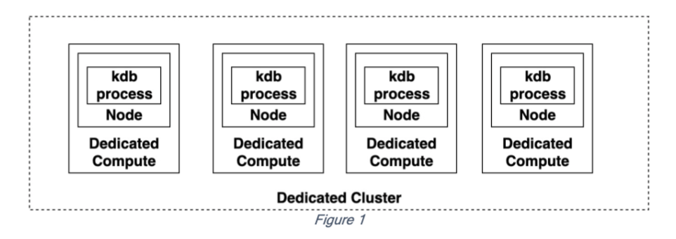
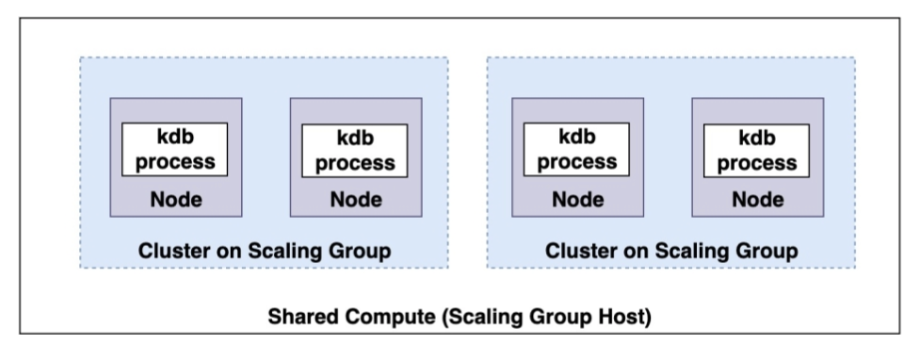

After careful consideration, we decided to end support for Amazon FinSpace, effective October 7, 2026. Amazon FinSpace will no longer accept new customers beginning October 7, 2025. As an existing customer with an Amazon FinSpace environment created before October 7, 2025, you can continue to use the service as normal. After October 7, 2026, you will no longer be able to use Amazon FinSpace. For more information, see
[Amazon FinSpace end of support](amazon-finspace-end-of-support.md "amazon-finspace-end-of-support.md").

# Running a clusters on scaling groups vs as a dedicated cluster

The original Amazon FinSpace Managed kdb cluster launch configuration is now referred to as a dedicated cluster. In a dedicated cluster, each node or kdb process in
the cluster runs on its own dedicated compute host.

This configuration provides strong workload isolation between clusters and nodes in a
single cluster at the expense of needing a fixed amount of compute per node.
In contrast, with a cluster on scaling group a single set of compute is shared by multiple
workloads (clusters) running on shared compute, allowing you to share a fixed amount
of compute.

**Considerations**

- Currently, a kdb scaling group is limited to only one host residing in one Availability
  Zone.
- The [HDB clusters](kdb-cluster-types.md#kdb-clusters-hdb "kdb-cluster-types.md#kdb-clusters-hdb") running on kdb scaling groups must
  use dataviews instead of cluster-specific [disk cache](kdb-cluster-types.md#kdb-cluster-cache-config "kdb-cluster-types.md#kdb-cluster-cache-config") to store database data for high-performance read access.
- RDB and General Purpose clusters running on scaling groups must use a [kdb volume](finspace-managed-kdb-volumes.md "finspace-managed-kdb-volumes.md") for their savedown
  storage configuration.
