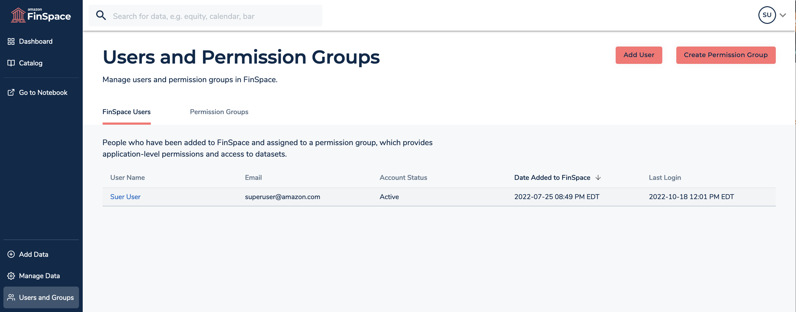
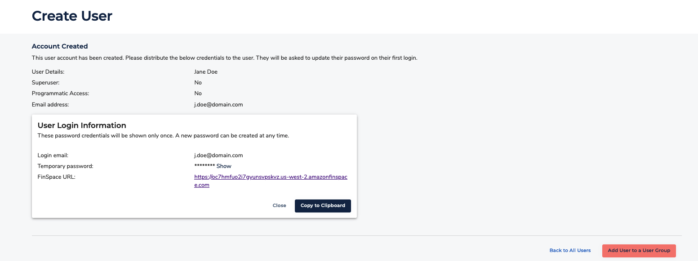

After careful consideration, we decided to end support for Amazon FinSpace, effective October 7, 2026. Amazon FinSpace will no longer accept new customers beginning October 7, 2025. As an existing customer with an Amazon FinSpace environment created before October 7, 2025, you can continue to use the service as normal. After October 7, 2026, you will no longer be able to use Amazon FinSpace. For more information, see
[Amazon FinSpace end of support](amazon-finspace-end-of-support.md "amazon-finspace-end-of-support.md").

# Managing user access with email and

password

###### Important

Amazon FinSpace Dataset Browser will be discontinued on `March 26,
 2025`. Starting `November 29, 2023`, FinSpace will no longer accept the creation of new Dataset Browser
environments. Customers using [Amazon FinSpace with Managed Kdb Insights](https://aws.amazon.com/finspace/features/managed-kdb-insights/ "https://aws.amazon.com/finspace/features/managed-kdb-insights/") will not be affected. For more information, review the [FAQ](https://aws.amazon.com/finspace/faqs/ "https://aws.amazon.com/finspace/faqs/") or contact [AWS Support](https://aws.amazon.com/contact-us/ "https://aws.amazon.com/contact-us/") to assist with your
transition.

This section describes how you can manage users in an Amazon FinSpace environment created
with Email and password based authentication.

###### Note

To create and manage users, you must be a superuser or a member of a group with
necessary permissions - **Manage Users and Permission
Groups**.

You can invite users by creating an account for them and sharing access
credentials.

## Creating the first

superuser

The first superuser must be created after a new FinSpace environment is created.
See details in [this
section](create-an-amazon-finspace-environment.md "create-an-amazon-finspace-environment.md"). Once the first superuser is created, they can sign in to FinSpace
web application and setup other superusers and application users. Subsequent
superusers can be created by the first superuser in the FinSpace web
application.

## Inviting users to access FinSpace

In FinSpace, you can invite users by creating an account for them and sharing
access credentials. FinSpace accounts are created in two steps. First, you create a
user in FinSpace. This creates an inactive account in FinSpace, credentials and a
temporary password is generated for the user which is shared with them. When the
user accepts the invitation and signs in for the first time, the user creates a
new password to activate the account.

For more information about signing in for the first time, see [Signing in to the Amazon FinSpace web application](signing-into-amazon-finspace.md "signing-into-amazon-finspace.md").

###### To create accounts and invite users to FinSpace

1. Sign in to the FinSpace web application. For more information, see [Signing in to the Amazon FinSpace web application](signing-into-amazon-finspace.md "signing-into-amazon-finspace.md").
2. On the left navigation bar of the home page, choose **Users and Groups**.
3. On the **Users and Permission Groups** page, choose
   **Add User**.
4. On the **Create User** page, specify the **User
   Details**.
5. For **Superuser**, choose **Yes** to
   designate the user as a superuser or **No** to designate
   this user as an application user.
6. For **Programmatic Access**, choose
   **Yes** to provide access to use FinSpace APIs and SDK or
   choose **No** to deny programmatic access.

When you choose **Yes**, you are required to specify the
**IAM Principal ARN** for this user in the format
`arn:partition:service::region::account::resource`. 7. Choose **Create User**. 8. After the account is created, copy the credentials to clipboard and share
them with the new user.

## Viewing user

details

###### To view details of a user

1. Sign in to the FinSpace web application. For more information, see [Signing in to the Amazon FinSpace web application](signing-into-amazon-finspace.md "signing-into-amazon-finspace.md").
2. On the left navigation bar of the home page, choose **Users and Groups**. The
   **Users and Permission Groups** page, displays the list
   of users under the **FinSpace Users** tab.
3. Select a user to view their details.

## Deactivating a user

###### To deactivate a user

1. Sign in to the FinSpace web application. For more information, see [Signing in to the Amazon FinSpace web application](signing-into-amazon-finspace.md "signing-into-amazon-finspace.md").
2. On the left navigation bar of the home page, choose **Users and Groups**.
3. Choose **FinSpace Users** tab.
4. Select a user to view their details.
5. On the top right corner, choose **More** menu.
6. Choose **Deactivate User**. This button is only visible
   to superusers and users with with necessary permissions – **Manage Users and Permission Groups**.
7. On the confirmation dialog box, choose **Deactivate**.
   You can activate a user again later if necessary.
