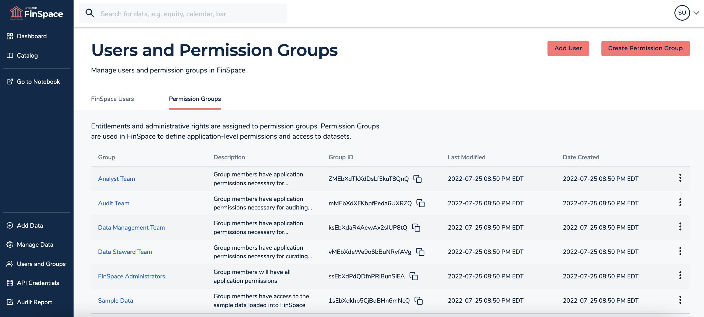
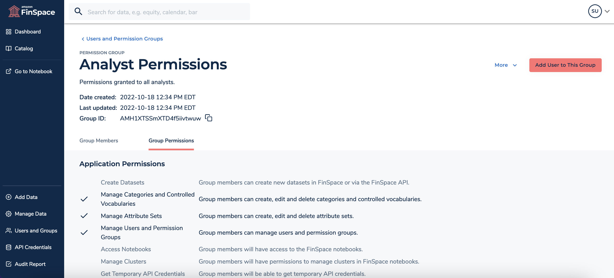
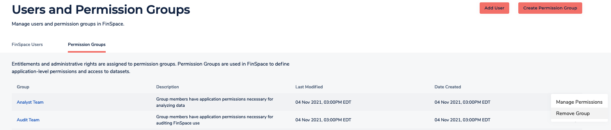

After careful consideration, we decided to end support for Amazon FinSpace, effective October 7, 2026. Amazon FinSpace will no longer accept new customers beginning October 7, 2025. As an existing customer with an Amazon FinSpace environment created before October 7, 2025, you can continue to use the service as normal. After October 7, 2026, you will no longer be able to use Amazon FinSpace. For more information, see
[Amazon FinSpace end of support](amazon-finspace-end-of-support.md "amazon-finspace-end-of-support.md").

# Managing user permissions with permission

groups

###### Important

Amazon FinSpace Dataset Browser will be discontinued on `March 26,
 2025`. Starting `November 29, 2023`, FinSpace will no longer accept the creation of new Dataset Browser
environments. Customers using [Amazon FinSpace with Managed Kdb Insights](https://aws.amazon.com/finspace/features/managed-kdb-insights/ "https://aws.amazon.com/finspace/features/managed-kdb-insights/") will not be affected. For more information, review the [FAQ](https://aws.amazon.com/finspace/faqs/ "https://aws.amazon.com/finspace/faqs/") or contact [AWS Support](https://aws.amazon.com/contact-us/ "https://aws.amazon.com/contact-us/") to assist with your
transition.

###### Note

In order to create and manage permission groups, you must be a superuser or a
member of a group with necessary permissions - **Manage
Users and Permission Groups**.

You can create permission groups inside Amazon FinSpace, so you do not have manage
permissions individually. Permissions are not assigned directly to a user but a
permission group is created with the appropriate permissions, and a user is assigned
to that permission group.

## Permissions

Permissions are assigned to permission groups and not to users. The are two
kinds of permissions in FinSpace - application permissions and dataset permissions.
Application permissions are assigned to a permission group when creating or
editing it (for example, create datasets). Dataset permissions are assigned on a
per dataset basis when associating a permission group to a dataset (for example,
read a view in a dataset).

###### Warning

When assigning application permissions, be aware that the permission
**Manage Users and Permission Groups** allows
users to grant themselves or others access to any functionality in their FinSpace
environment's application. It should only be granted to trusted users.

**Supported application permissions**

| Permission                                    | Description                                                                                                                                                                                                                                |
| --------------------------------------------- | ------------------------------------------------------------------------------------------------------------------------------------------------------------------------------------------------------------------------------------------ |
| Create Datasets                               | Group members can create new datasets in FinSpace or via the FinSpace API                                                                                                                                                               |
| Manage Categories and Controlled Vocabularies | Group members can create, edit and delete categories and controlled vocabularies                                                                                                                                                        |
| Manage Clusters                               | Group members will have permissions to manage clusters in FinSpace notebooks                                                                                                                                                            |
| Manage Users and Permission Groups            | Group members can manage users and permission groups. This is a privileged permission that allows users to grant themselves or others access to any functionality in the application. It should only be granted to trusted users. |
| Manage Attribute Sets                         | Group members will have menu option to manage Attribute Sets                                                                                                                                                                            |
| Manage Attribute Sets                         | Group members can create, edit and delete attribute sets                                                                                                                                                                                   |
| View Audit Data                               | Group members can view audit data                                                                                                                                                                                                          |
| Access Notebooks                              | Group members will have access to the FinSpace notebooks                                                                                                                                                                                   |
| Get Temporary Credentials                     | Group members will be able to get temporary API credentials                                                                                                                                                                             |

## Supported dataset

permissions

When a dataset is created by a user, all other members of the same permission
group will inherit access to the dataset. The members can permission the dataset
to other permission groups and specify the actions that the other groups they can
take on it. Users can only create a dataset if their permission group has
application permission for **Create
Datasets**.

| Permission            | Description                                                                                                                            |
| --------------------- | -------------------------------------------------------------------------------------------------------------------------------------- |
| View Dataset Details  | Group members can view dataset details                                                                                                 |
| Read Dataset Data     | Group members can read the data files, such as data views, provided on S3 for Spark, notebooks, and access from outside FinSpace |
| Add Dataset Data      | Data Group members can add new data files to this dataset to create a dataset update                                                |
| Create View           | Group members can create new data or file view on this dataset via the Web UI or API                                                |
| Edit Dataset Metadata | Group members will have permission to edit dataset metadata including permission to add additional attribute sets                   |
| Manage Permissions    | Group members can view and edit this dataset permissions                                                                               |
| Delete Dataset        | Group members can remove the dataset including all data and data views                                                              |

## Creating

and adding a user to the group

###### To create a permission group and add a new user to it

1. Sign in to the FinSpace web application. For more information, see [Signing in to the Amazon FinSpace web application](signing-into-amazon-finspace.md "signing-into-amazon-finspace.md").
2. On the left navigation bar of the home page, choose **Users and Groups**.
3. On the **Users and Permission Groups** page, choose
   **Create Permission Group**.
4. On the **Create Permission Group** page, enter the name
   and description for the permission group and select appropriate permissions
   for the group.
5. Choose **Create**. A new group is created with selected
   permissions.

 6. Choose **Add User to This Group**. 7. On the dialog box, select a user to add to this group. 8. Choose **Add**. A new user is now added to the
group.

## List all permission groups

###### To list all created permission groups

1. Sign in to the FinSpace web application. For more information, see [Signing in to the Amazon FinSpace web application](signing-into-amazon-finspace.md "signing-into-amazon-finspace.md").
2. On the left navigation bar of the home page, choose **Users and Groups**.
3. Choose the **Permission Groups** tab. A list of all the
   permission groups is displayed in the table.

## Delete a permission group

###### To delete a permission group

1. Sign in to the FinSpace web application. For more information, see [Signing in to the Amazon FinSpace web application](signing-into-amazon-finspace.md "signing-into-amazon-finspace.md").
2. On the left navigation bar of the home page, choose **Users and Groups**.
3. Choose the **Permission Groups** tab.
4. From the list, select a group and choose the more (
   
   ) icon.
5. Choose **Remove Group**.

 6. In the dialog box that appears, choose
**Remove**.
