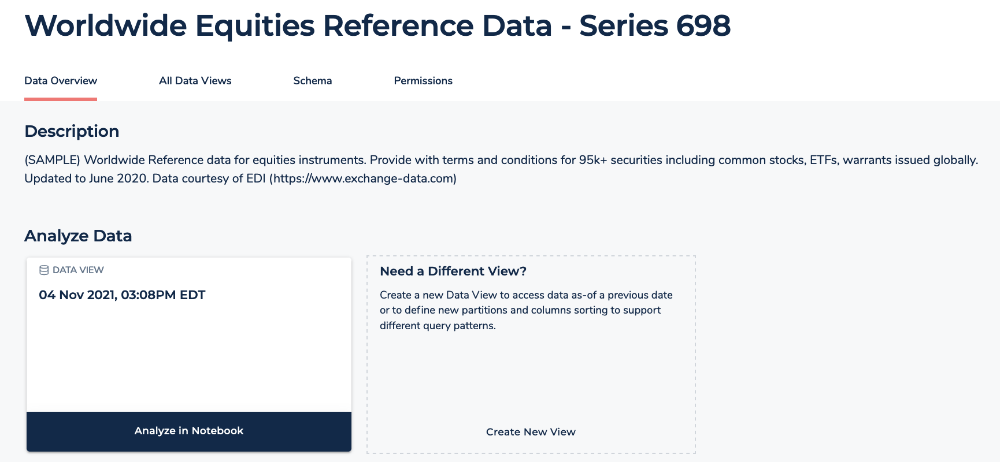
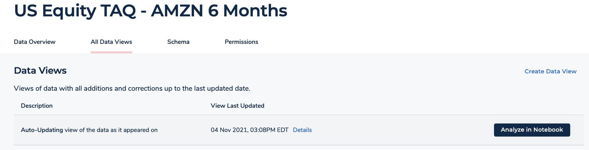

After careful consideration, we decided to end support for Amazon FinSpace, effective October 7, 2026. Amazon FinSpace will no longer accept new customers beginning October 7, 2025. As an existing customer with an Amazon FinSpace environment created before October 7, 2025, you can continue to use the service as normal. After October 7, 2026, you will no longer be able to use Amazon FinSpace. For more information, see
[Amazon FinSpace end of support](amazon-finspace-end-of-support.md "amazon-finspace-end-of-support.md").

# Opening the notebook environment

###### Important

Amazon FinSpace Dataset Browser will be discontinued on `March 26,
 2025`. Starting `November 29, 2023`, FinSpace will no longer accept the creation of new Dataset Browser
environments. Customers using [Amazon FinSpace with Managed Kdb Insights](https://aws.amazon.com/finspace/features/managed-kdb-insights/ "https://aws.amazon.com/finspace/features/managed-kdb-insights/") will not be affected. For more information, review the [FAQ](https://aws.amazon.com/finspace/faqs/ "https://aws.amazon.com/finspace/faqs/") or contact [AWS Support](https://aws.amazon.com/contact-us/ "https://aws.amazon.com/contact-us/") to assist with your
transition.

###### Note

- In order to open a notebook environment, you must be a superuser or a member of a group with necessary permissions - **Access Notebooks**.
- Expect a one-time setup delay of 15-20 minutes for the notebook environment after creating a new user.

**You can open a notebook environment in the following ways**

- Using the data view cards on homepage.
- From the dataset details page under **Data Overview** tab.
- From the dataset details page under **All Data Views** tab.

## Access notebook from homepage

###### To access notebook environment from the recently created data views

1. Sign in to the FinSpace web application. For more information, see [Signing in to the Amazon FinSpace web application](signing-into-amazon-finspace.md "signing-into-amazon-finspace.md").
2. From the homepage, under the **Status of Data Views** section, find the recently created data view.
3. On the data view card, choose **Analyze**. The notebook opens in a new tab on your browser.

## Access notebook from Data Overview tab

###### To access notebook environment from the overview tab

1. Sign in to the FinSpace web application. For more information, see [Signing in to the Amazon FinSpace web application](signing-into-amazon-finspace.md "signing-into-amazon-finspace.md").
2. From the homepage, search for a dataset.
3. Choose the dataset name to view the dataset details page.
4. From the **Data Overview** tab, under **Analyze Data** section, choose **Analyze in Notebook** in the data view card.

The notebook opens in a new tab on your browser.

## Access notebooks from All Data Views tab

###### To access notebook environment from the list of all data views for a dataset

1. Sign in to the FinSpace web application. For more information, see [Signing in to the Amazon FinSpace web application](signing-into-amazon-finspace.md "signing-into-amazon-finspace.md").
2. From the homepage, search for a dataset.
3. Choose the dataset name to view the dataset details page.
4. Choose **All Data Views** tab.
5. From the **Data Views** table, choose **Analyze in Notebook** for any of the data views.

The notebook opens in a new tab on your browser.

