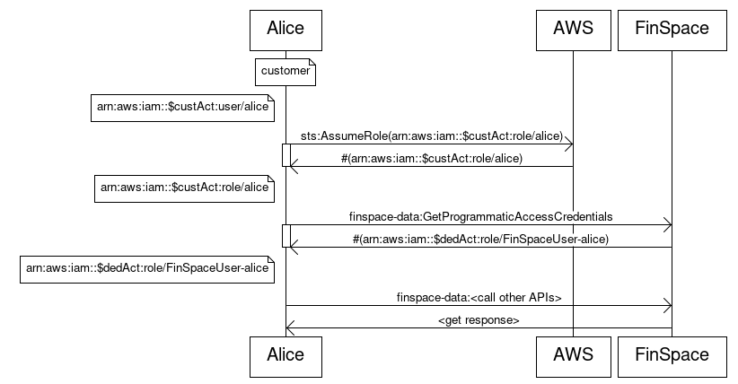

After careful consideration, we decided to end support for Amazon FinSpace, effective October 7, 2026. Amazon FinSpace will no longer accept new customers beginning October 7, 2025. As an existing customer with an Amazon FinSpace environment created before October 7, 2025, you can continue to use the service as normal. After October 7, 2026, you will no longer be able to use Amazon FinSpace. For more information, see
[Amazon FinSpace end of support](amazon-finspace-end-of-support.md "amazon-finspace-end-of-support.md").

# Temporary credentials in Amazon FinSpace

Amazon FinSpace has an internal application authorization model that controls access to
the functions in FinSpace and the FinSpace API operations. In order to use the FinSpace API
operations, you must first obtain temporary security credentials, which are used when
you call these API operations. These credentials are unique for each user and are
only valid for 60 minutes. After the credentials expire, you need to obtain new
credentials before making subsequent API calls.

## Obtaining the credentials using

FinSpace

You can obtain credentials from the web application if you're one of the
following:

- A superuser
- An application user who is a member of a FinSpace permission group with the
  **Get Temporary API Credentials** permission

###### To obtain the permissions

1. Sign in to the FinSpace web application. For more information, see [Signing in to the Amazon FinSpace web application](signing-into-amazon-finspace.md "signing-into-amazon-finspace.md").
2. On the left navigation bar of the home page, choose **API Credentials**.
3. On the **API Credentials** page, use the copy icon to
   copy the **Access Key ID**, **Secret Access
   Key**, and the **Session Token** values.
4. Use these copied credentials to access the FinSpace data API
   operations.

```
 #!/usr/bin/env python

 import boto3
 session = boto3.session.Session()
 finSpaceClient = session.client(
     region_name = 'us-east-1',
     service_name = 'finspace-data',
     aws_access_key_id = 'Specify Access Key ID',
     aws_secret_access_key = 'Specify Secret Access Key',
     aws_session_token = 'Specify Session Token'
 )

```

## Obtaining the credentials

programmatically

You can also obtain the credentials using a program or a script without signing
in to the FinSpace web application. For this, you can use the
`GetProgrammaticAccessCredentials` API operation to retrieve the
temporary credentials. You must call `GetProgrammaticAccessCredentials`
using the IAM role that exists in the AWS account that you used to create your
Amazon FinSpace environment.

Calling the `GetProgrammaticAccessCredentials` API operation returns
a set of temporary credentials that you can then use to call the other API
operations. Before you obtain the temporary credentials, you need to enable the
programmatic access for each user.

The following diagram illustrates how you can access and use the temporary
credentials.



- The diagram shows that first a request to `AssumeRole` is sent
  to AWS. For more information, see [AssumeRole](../../../STS/latest/APIReference/API_AssumeRole.md "../../../STS/latest/APIReference/API_AssumeRole.md") in
  the _AWS Security Token Service API Reference_.
- This request returns a set of security credentials that are used to
  access the AWS resources.
- Next, a request is sent to `finspace-data` to call the
  `GetProgrammaticAccessCredentials` API operation. This request
  returns the temporary credentials.
- Lastly, the temporary credentials are used to call the other FinSpace API
  operations.

**Configuring a user for programmatic access using FinSpace**

Use the following procedures to allow a specific user to obtain API credentials
programatically.

###### Note

To perform the following steps, you must either be a superuser or a member
of a group with necessary permissions – **Manage
Users and Groups**.

1. Sign in to the FinSpace web application. For more information, see [Signing in to the Amazon FinSpace web application](signing-into-amazon-finspace.md "signing-into-amazon-finspace.md").
2. On the left navigation bar of the home page, choose **Users and Groups**.
3. On the **Users and Permission Groups** page, choose a
   user that you want to enable programmatic access for.
4. On the user details page, choose **More** and then
   choose **Edit User**.
5. For **Programmatic Access**, choose
   **Yes**.
6. For **IAM Principal ARN**, enter the ARN identifier for
   an IAM role that will be used. This role is used to call
   `GetProgrammaticAccessCredentials` to obtain temporary API
   credentials.

The IAM role must reside in the AWS account that you used to create
your FinSpace environment and must have the following permission set: 7. To save your edits to the user, choose **Update
User**.

###### Note

Alternatively, you can also enable programmatic access for a user at the
time when you create a user. For more information, see [Adding users in FinSpace](managing-user-email-pwd.md#creating-accounts-and-inviting-users-to-access-amazon-finspace "managing-user-email-pwd.md#creating-accounts-and-inviting-users-to-access-amazon-finspace").

**Enabling programmatic access using the FinSpace
API**

You can also enable programmatic access for a user by using the `CreateUser` and `UpdateUser`
API operations. The following are examples of how you can use the API operations.

**Example JSON for the `CreateUser` API
operation**

```
{
    "emailAddress": "testemail1@amazon.com",
    "type": "APP_USER",
    "firstName": "test",
    "lastName": "user",
    "apiAccess": "ENABLED",
    "apiAccessPrincipalArn": "arn:aws:iam::012345678910:role/TestRole"
}
```

**Example JSON for the `UpdateUser` API
operation**

```
{
    "type": "SUPER_USER",
    "firstName": "test",
    "lastName": "user",
    "apiAccess": "ENABLED",
    "apiAccessPrincipalArn": "arn:aws:iam::012345678910:role/TestRole"
}
```
