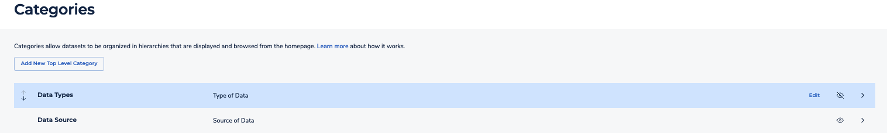

After careful consideration, we decided to end support for Amazon FinSpace, effective October 7, 2026. Amazon FinSpace will no longer accept new customers beginning October 7, 2025. As an existing customer with an Amazon FinSpace environment created before October 7, 2025, you can continue to use the service as normal. After October 7, 2026, you will no longer be able to use Amazon FinSpace. For more information, see
[Amazon FinSpace end of support](amazon-finspace-end-of-support.md "amazon-finspace-end-of-support.md").

# Tutorial: Configuring a business data catalog in Amazon FinSpace

###### Important

Amazon FinSpace Dataset Browser will be discontinued on `March 26,
 2025`. Starting `November 29, 2023`, FinSpace will no longer accept the creation of new Dataset Browser
environments. Customers using [Amazon FinSpace with Managed Kdb Insights](https://aws.amazon.com/finspace/features/managed-kdb-insights/ "https://aws.amazon.com/finspace/features/managed-kdb-insights/") will not be affected. For more information, review the [FAQ](https://aws.amazon.com/finspace/faqs/ "https://aws.amazon.com/finspace/faqs/") or contact [AWS Support](https://aws.amazon.com/contact-us/ "https://aws.amazon.com/contact-us/") to assist with your
transition.

The section outlines the procedures to configure a business data catalog for browsing datasets by using categories, controlled vocabularies, and attribute sets.
You will take following steps in this tutorial:

- Create categories – `Data Types` and `Data Source`.
- Create controlled vocabulary – `Data Classification`.
- Create attribute set with attributes of type category and controlled vocabulary – `Data and Source Information`.
- Create a dataset – `Industrial production total index`.
- Associate attribute set with the newly created Dataset.
- Verify if the dataset is accessible from business data catalog via categories menu.

## Prerequisites

Before you begin, learn about the concepts that are used for configuring a business data catalog by referring to [Core concepts and terms](concepts-terms.md "concepts-terms.md").

###### Note

In order to use this tutorial, you must be a member of a group with the necessary permissions -
**Create Datasets**, **Manage Categories and Controlled Vocabularies**, **Manage Attribute Sets**.

## Step 1: Create categories in Amazon FinSpace

Use the following procedures to create the `Data Types` and `Data Source` categories.

###### To create the `Data Types` Category

1. Sign in to the FinSpace web application. For more information, see [Signing in to the Amazon FinSpace web application](signing-into-amazon-finspace.md "signing-into-amazon-finspace.md").
2. On the left navigation bar of the home page, choose **Manage Data**.
3. On the **Manage Data** page, choose **Manage Categories**.
4. Choose **Add New Top Level Category**.
5. For category name, enter `Data Types`.
6. (Optional) Add a description for the category. For example, you can enter `Type of data`. This will show up as a tool tip when hovering over the menu.
7. Choose **Add Sub-Category** to add one or more sub-categories. You can add as many sub-categories as you like. In this example, for sub-category names enter `Economic Data`, `Commodities Data`, and `Alternative Data`.
8. Choose **Done** to add the sub-category.
9. Choose **Save**.

###### To create the `Data Source` category

1. Sign in to the FinSpace web application. For more information, see [Signing in to the Amazon FinSpace web application](signing-into-amazon-finspace.md "signing-into-amazon-finspace.md").
2. On the left navigation bar of the home page, choose **Manage Data**.
3. On the **Manage Data** page, choose **Manage Categories**.
4. Choose **Add New Top Level Category**.
5. For category name, enter `Data Source`.
6. (Optional) Add a description for the category. For example, you can enter `Source of data`. This will show up as a tool tip when hovering over the menu.
7. Choose **Add Sub-Category** to add one or more sub-categories. You can add as many sub-categories as you like. In this example, for sub-category names enter `Central Bank`, `Vendor`, and `Exchange`.
8. Choose **Done** to add the sub-category.
9. Choose **Save**.

**Change visibility of the categories in data browser**

On the **Categories** page, uncheck the eye () icon for both categories that you created in above procedures to make them visible in the data browser.

## Step 2: Create controlled vocabulary in Amazon FinSpace

###### To create the `Data Classification` controlled vocabulary

1. On the left navigation bar of the home page, choose **Manage Data**.
2. On the **Manage Data** page, choose **Manage Controlled Vocabularies**.
3. Choose **Create Controlled Vocabulary**.
4. For vocabulary name, enter `Data Classification`.
5. (Optional) Add a description for the vocabulary. For example, you can enter `Data Classification scheme`.
6. Choose **Add Field** to add one or more fields under a vocabulary. You can add as many fields as you like. In this example, for field names enter `Public Data`, `Internal Data`, and `Restricted Data`.
7. Choose **Save**.

## Step 3: Create attribute sets in Amazon FinSpace

###### To create the attribute set for `Data and Source Information`

1. On the left navigation bar of the home page, choose **Manage Data**.
2. On the **Manage Data** page, choose **Manage Attribute Sets**.
3. Choose **Create Attribute Set**.
4. For attribute name, enter `Data and Source Information`.
5. Choose **Categorization** to add a categorization field type.
6. On the **Add Categorization Field** page, do the following:
   1. Choose **Data Types** as the categorization field type.
   2. Choose **Add Field**.Repeat these steps again and choose **Data Source** as the as the categorization field type.

7. Choose **Controlled Vocabulary** to add a controlled vocabulary field type.
8. On the **Add Controlled Vocabulary Field** page, do the following:
   1. Choose **Data Classification** as the controlled vocabulary field type.
   2. Choose **Add Field**.

9. Choose **Save**.

## Step 4: Create a dataset in Amazon FinSpace

###### To create a dataset

1. On the left navigation bar of the home page, choose **Add Data**.
   The source of the data is [Federal reserve bank of St.Louis.](https://fred.stlouisfed.org/series/INDPRO "https://fred.stlouisfed.org/series/INDPRO") Download the `Industrial production total index.csv` file.
2. Drag and drop the `Industrial production total index.csv` file on the page or choose **Browse Files** to select a new file.
3. On the **Add Data** page, verify if the derived schema is correct.
4. If the derived schema is incorrect, choose **Edit Derived Schema** to edit it.

For example, in this sample file, the inferred data type for the column **date** is **String**, change it to **Date**. 5. After editing the schema, choose **Save Schema**. 6. Choose an appropriate perimission group that should be associated to the dataset when it gets created. You can add additional permission groups after the dataset creation is complete. 7. Choose **Confirm Schema & Upload File**.

This action creates a dataset with name `Industrial production total index` and takes you to the [Dataset details page](dataset-details-page.md "dataset-details-page.md").

###### Note

For small files of up to 100 megabytes, data view creation takes approximately 2 minutes.
For larger files of around 1 gigabyte, expect data view creation to take approximately 3-4 minutes. Views with partitioning and sorting
schemes may take longer.

Once the upload of the sample data file is complete, a process is kicked off to create a data view that can be analyzed in a notebook.

## Step 5: Associate an attribute set with a dataset in Amazon FinSpace

###### To associate `Data and Source Information` attribute set with `Industrial production total index dataset`

1. On the homepage, search for `Industrial production total index` dataset in the search box.
2. On the **Catalog** page, choose **Industrial production total index** from the results, to go to the [Dataset details page](dataset-details-page.md "dataset-details-page.md").
3. On the dataset details page for `Industrial production total index`, under **Details About This Dataset**, choose **Add Attribute Set**.
4. On **Add Attribute Set** page, do the following
   1. From the drop down menu, choose `Data and Source Information`.
   2. Choose **Add Attribute Set**.

5. Edit the values for `Data and Source Information` as following:
   1. For **Data Types**, enter `Economic Data`.
   2. For **Data Source**, enter `Central Bank`.
   3. For **Data Classification**, enter `Public Data`.

6. Choose **Save**.

## Step 6: Search the dataset from data browser in Amazon FinSpace

###### To search dataset `Industrial production total index` using the data browser

1. On the left navigation bar of the home page, choose **Catalog**.
2. On the **Catalog** page, under **CATEGORIES** on the data browser, choose the **Data Types** drop down.
3. Choose **Economic Data**. You should see **Industrial production total index** on the right.

Your business data catalog is now ready. The `Industrial production total index` dataset is now discoverable from the data browser.
