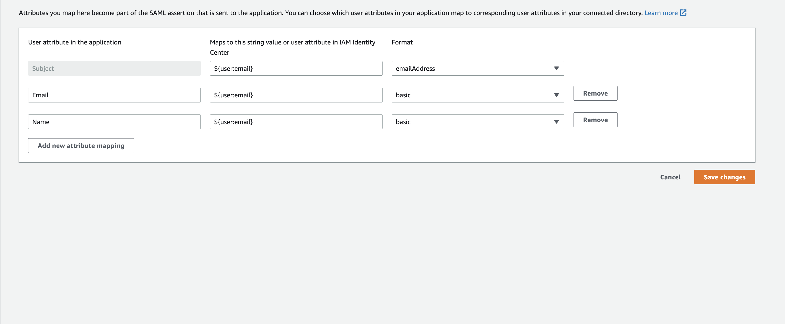

After careful consideration, we decided to end support for Amazon FinSpace, effective October 7, 2026. Amazon FinSpace will no longer accept new customers beginning October 7, 2025. As an existing customer with an Amazon FinSpace environment created before October 7, 2025, you can continue to use the service as normal. After October 7, 2026, you will no longer be able to use Amazon FinSpace. For more information, see
[Amazon FinSpace end of support](amazon-finspace-end-of-support.md "amazon-finspace-end-of-support.md").

# Tutorial: Creating an Amazon FinSpace environment

with IAM Identity Center

###### Important

Amazon FinSpace Dataset Browser will be discontinued on `March 26,
 2025`. Starting `November 29, 2023`, FinSpace will no longer accept the creation of new Dataset Browser
environments. Customers using [Amazon FinSpace with Managed Kdb Insights](https://aws.amazon.com/finspace/features/managed-kdb-insights/ "https://aws.amazon.com/finspace/features/managed-kdb-insights/") will not be affected. For more information, review the [FAQ](https://aws.amazon.com/finspace/faqs/ "https://aws.amazon.com/finspace/faqs/") or contact [AWS Support](https://aws.amazon.com/contact-us/ "https://aws.amazon.com/contact-us/") to assist with your
transition.

The following tutorial walks you through how FinSpace environment can be created using
AWS IAM Identity Center as an Identity provider (IdP).

## Prerequisites

Ensure that a user exists in IAM Identity Center for each person who will need access to
FinSpace. When creating users, make sure to include an email address for each user.
Email addresses are required to connect the users in Active Directory Federation
Services with their corresponding users in FinSpace.

## Step 1: Creating an

application in IAM Identity Center

###### Note

You need to have appropriate privileges in IAM Identity Center to create a SAML
application.

###### To create an application in IAM Identity Center

1. Sign in to AWS Management Console, and open IAM Identity Center.
2. Choose **Settings**.
3. For **Identity source**, choose
   **IAM Identity Center**.
4. From the left menu, choose **Applications**.
5. Choose **Add application**.
6. Choose **Add a custom SAML 2.0 application**.
7. Choose **Next**.
8. On the **Configure application** page, specify a display
   name for the application. For example, you can use
   `FinSpace-SAML-application`.
9. (Optional) Add a description.
10. Copy and
    save the URL for **IAM Identity Center SAML metadata file** or download
    it. You will need it when you create a FinSpace environment.
11. For **Application metadata**, choose **Manually
    type your metadata values**.
12. For **Application ACS URL**, enter
    `https://finspace.com/saml2/idpresponse`. For
    **Application SAML audience**, enter
    `urn:amazon:sp:*`.

###### Note

These are sample values. Return to application configuration and
replace these fields with the actual values after you create an
environment. 13. Choose **Submit**. The page for newly created
application opens. 14. On the application page, choose **Actions** and then
choose **Edit attribute mappings**. 15. On the attribute mappings page, enter the attribute mappings values as
shown in the following screenshot.

 16. Choose **Save changes**.

Now that you have the SAML metadata document or it's URL, create a FinSpace
environment next.

## Step 2: Creating a FinSpace

environment

###### To create a FinSpace environment

1. Sign in to the AWS Management Console and open the Amazon FinSpace console at [https://console.aws.amazon.com/finspace](https://console.aws.amazon.com/finspace/landing "https://console.aws.amazon.com/finspace/landing").
2. Choose **Create Environment**.
3. Enter a name for your FinSpace environment under **Environment
   name**. For example, enter `finspace-saml-aws-sso`
4. (Optional) Add **Environment
   description**.
5. Select an existing or create a new KMS key to encrypt data in your FinSpace
   environment. For more information, see [Managing
   keys](../../../kms/latest/developerguide/getting-started.md "../../../kms/latest/developerguide/getting-started.md").
6. For **Authentication method**, select **Single
   Sign On (SSO)**.
7. Enter your **Identity provider name**. For example,
   `IAM Identity Center`.
8. For **Metadata document URL**, choose **Provide
   a metadata document URL** and then paste the SAML metadata
   document URL in the text box. This is the same URL that you copied when
   [creating an application](#metadata-url "#metadata-url").
9. For **Attribute mapping**, enter the attribute set for
   email in IAM Identity Center. Since you set attribute as `Email` in SSO, set
   the same in mapping.
10. Choose **Create Environment**. The environment creation
    process starts and it will take 50-60 minutes to finish in the background.
    You can return to other activities while the environment is being
    created.
11. After the FinSpace environment is ready, copy and save the **Redirect
    / Sign-in URL** and **URN**.

## Step 3:

Finish application configuration in IAM Identity Center

Finish configuration of IAM Identity Center app with the **Redirect / Sign-in
URL** and **URN**.

1. Sign in to AWS Management Console, and open IAM Identity Center.
2. Choose **Applications**.
3. Choose **FinSpace-SAML-application** that you created in
   step 1 of this tutorial.
4. On the application details page, choose **Actions** and
   then choose **Edit configuration**.
5. In the **Application metadata** section, paste the
   following values that you copied in step 2 of this tutorial.
   1. For **Application ACS URL**, paste the
      **Redirect / Sign-in URL**.
   2. For **Application SAML audience**, paste the
      **URN**.

6. Choose **Submit**.

## Step

4: Assign user to the FinSpace application in IAM Identity Center

After setting up the application, assign at least one user to it in IAM Identity Center. You
can create this user as a superuser for FinSpace.

###### To assign a user

1. Sign in to AWS Management Console, and open IAM Identity Center.
2. Choose **Applications**.
3. Choose the `FinSpace-SAML-application` application.
4. Choose **Assign Users**.
5. From the list of users, choose and assign users to the
   application.

## Step 5:

Create superuser in your FinSpace environment

After assigning a user,you can create them as a superuser in FinSpace.

###### To create a superuser

1. Sign in to the AWS Management Console and open the Amazon FinSpace console at [https://console.aws.amazon.com/finspace](https://console.aws.amazon.com/finspace/landing "https://console.aws.amazon.com/finspace/landing").
2. Choose `finspace-saml-aws-sso` from the list of
   environments.
3. Under **Superusers**, choose **Add
   Superuser**.
4. On the **Specify Superuser details** page, enter the
   email that was used when assigning the user in IAM Identity Center.
5. Enter the **First name** and the **Last
   name**.
6. Choose **Next**.
7. Review the details and choose **Create and view
   credentials**. You will not receive a password as you will use
   the IAM Identity Center credentials for authentication.

## Step 6: Sign

in to FinSpace with IAM Identity Center credentials

###### To sign in with IAM Identity Center credentials

1. Sign in to the AWS Management Console and open the Amazon FinSpace console at [https://console.aws.amazon.com/finspace](https://console.aws.amazon.com/finspace/landing "https://console.aws.amazon.com/finspace/landing").
2. Choose `finspace-saml-aws-sso` from the list of
   environments.
3. Choose the **Application URL** link.

The IAM Identity Center authentication page opens. 4. Enter your SSO credentials to sign in to FinSpace.
