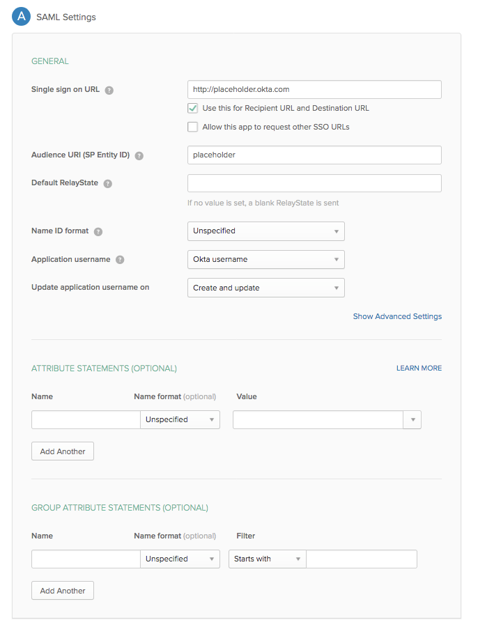
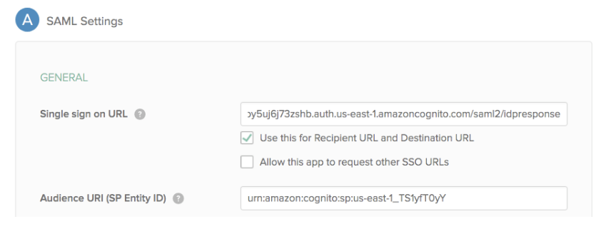

After careful consideration, we decided to end support for Amazon FinSpace, effective October 7, 2026. Amazon FinSpace will no longer accept new customers beginning October 7, 2025. As an existing customer with an Amazon FinSpace environment created before October 7, 2025, you can continue to use the service as normal. After October 7, 2026, you will no longer be able to use Amazon FinSpace. For more information, see
[Amazon FinSpace end of support](amazon-finspace-end-of-support.md "amazon-finspace-end-of-support.md").

# Tutorial: Creating an Amazon FinSpace environment

with Okta SSO

###### Important

Amazon FinSpace Dataset Browser will be discontinued on `March 26,
 2025`. Starting `November 29, 2023`, FinSpace will no longer accept the creation of new Dataset Browser
environments. Customers using [Amazon FinSpace with Managed Kdb Insights](https://aws.amazon.com/finspace/features/managed-kdb-insights/ "https://aws.amazon.com/finspace/features/managed-kdb-insights/") will not be affected. For more information, review the [FAQ](https://aws.amazon.com/finspace/faqs/ "https://aws.amazon.com/finspace/faqs/") or contact [AWS Support](https://aws.amazon.com/contact-us/ "https://aws.amazon.com/contact-us/") to assist with your
transition.

The following tutorial walks you through how Amazon FinSpace environment can be created
using Okta as an Identity provider (IdP).

## Prerequisites

Ensure that a user exists in Okta for each person who will need access to FinSpace.
When creating users, make sure to include an email address for each user. Email
addresses are required to connect the users in Active Directory Federation
Services with their corresponding users in FinSpace.

## Step 1: Creating an Okta

application

###### Note

You need to have administrator privileges in Okta for this tutorial.

###### To create an Okta application

1. Sign in to your Okta admin dashboard.

If you don't have an account, you can create a free [Okta developer
edition](https://developer.okta.com/quickstart/ "https://developer.okta.com/quickstart/") account. 2. Choose **Applications**. 3. Choose **Add Application**. 4. Choose **Create New App**. 5. On the **Create New Application Integration** page, for
**Platform** select **Web** from the
drop down menu. 6. For **Sign in method**, choose **SAML
2.0** and then choose **Create**. 7. Specify an **App name**. For example,
`FinSpace`. 8. Choose **Next**. 9. For the **Single sign on URL**, use
`http://placeholder.okta.com` .

###### Note

This is just a placeholder url to generate the SAML meta data
document. You will get the actual single sign on URL once FinSpace
environment is created.

 10. For **Audience URI (SP Entity ID)**, enter
`placeholder`.

###### Note

This is just a placeholder Uniform Resource Name (URN) to generate the
SAML meta data doc. You will get the actual URN once FinSpace environment is
created. 11. Under **ATTRIBUTE STATEMENTS** section, enter the
following:

    1. **Name** –
     `http://schemas.xmlsoap.org/ws/2005/05/identity/claims/emailaddress`
    2. **Value** – `user.email`

12. Choose **Next**.
13. Choose **I'm an Okta customer adding an internal
    app**.
14. Choose **Finish**.
15. Choose **Identity Provider metadata** and then choose
    **Copy Link Address**.
16. Save the link to a notepad. You can also choose to save SAML metadata
    document instead of the link.

Now that you have the SAML metadata document or its URL, let's create a FinSpace
environment.

## Step 2: Creating a FinSpace

environment

###### To create a FinSpace environment

1. Sign in to the AWS Management Console and open the Amazon FinSpace console at [https://console.aws.amazon.com/finspace](https://console.aws.amazon.com/finspace/landing "https://console.aws.amazon.com/finspace/landing").
2. Choose **Create Environment**.
3. Enter a name for your FinSpace environment under **Environment
   name**. For example, enter `finspace-saml-okta`
4. (Optional) Add **Environment description**.
5. Select an existing or create a new KMS key to encrypt data in your FinSpace
   environment. For more information, see [Managing
   keys](../../../kms/latest/developerguide/getting-started.md "../../../kms/latest/developerguide/getting-started.md").
6. For **Authentication method**, select **Single
   Sign On (SSO)**.
7. Enter your **Identity provider name**. For example,
   `Okta`.
8. For **Metadata document URL**, select **Provide
   a metadata document URL** and then paste the SAML metadata
   document URL in the text box.
9. For **Attribute mapping**, enter the attribute set for
   email in Okta. Since you set email attribute as
   `http://schemas.xmlsoap.org/ws/2005/05/identity/claims/emailaddress`,
   the same value should be set in this field.
10. Under **Initial Superuser**, enter the details to setup
    the first superuser.
11. Choose **Create Environment**. The environment creation
    process starts and it will take 50-60 minutes to finish in the background.
    You can return to other activities while the environment is being
    created.
12. After the FinSpace environment is ready, copy and save the **Redirect
    / Sign-in URL** and **URN**.

Your FinSpace is now created. Finish configuration in Okta.

## Step 3: Finish

application configuration in Okta

Finish configuration of your FinSpace Okta app with the **Redirect /
Sign-in URL** and **URN**.

1. Sign in to your Okta console.
2. Choose **Admin** on the top-right corner.
3. From the top bar menu bar, choose
   **Applications**.
4. Choose the **FinSpace** app that you had setup with
   placeholders.
5. Under the **General** tab, scroll to **General
   Settings** and choose **Edit** on SAML
   settings.
6. Choose **Next**.
7. For **Single Sign On URL**, paste the copied
   **Redirect / Sign-in URL** from FinSpace environment.
8. Select the **Use this for Recipient URL and Destination
   URL** check box.
9. For **Audience URI (SP Entity ID)**, enter the copied
   **URN** from the FinSpace environment.

 10. Choose **Next**. 11. Choose **Finish**.

## Step 4:

Assign user to the FinSpace application in Okta

Now that the application is setup. Assign at least one user to the FinSpace app in
Okta who can be created as a superuser for FinSpace.

###### To assign user to the FinSpace application in Okta

1. Sign in to your Okta console.
2. Choose **Admin** on the top-right corner.
3. From the top bar menu bar, choose
   **Applications**.
4. Choose the **FinSpace**.
5. Choose the **Assignments** tab.
6. Choose the **Assign** drop down menu. A list of users
   appears.
7. Choose **Assign next** for the user that you want to
   designate as the superuser in FinSpace. You may add multiple users at this point
   too.
8. Choose **Save and Go back**.

## Step 5:

Create superuser in your FinSpace environment

Now that a user is assigned, they can be created as a superuser in FinSpace.

###### To create a superuser

1. Sign in to the AWS Management Console and open the Amazon FinSpace console at [https://console.aws.amazon.com/finspace](https://console.aws.amazon.com/finspace/landing "https://console.aws.amazon.com/finspace/landing").
2. Choose `finspace-saml-okta` from the list of
   environments.
3. Under **Superusers**, choose **Add
   Superuser**.
4. On **Specify Superuser details** page, enter the email
   that was used when assigning the user in Okta.
5. Enter the **First name** and the **Last
   name**.
6. Choose **Create and view credentials**. You will not
   receive a password as you will use the Okta Idp credentials for
   authentication.

## Step 6:

Sign in to FinSpace with Okta IdP credentials

###### To sign in with Okta IdP credentials

1. Sign in to the AWS Management Console and open the Amazon FinSpace console at [https://console.aws.amazon.com/finspace](https://console.aws.amazon.com/finspace/landing "https://console.aws.amazon.com/finspace/landing").
2. Choose `finspace-saml-okta` from the list of
   environments.
3. Copy the link under **Environment domain** and paste it
   in your web browser.

You will be re-directed to your Okta Idp authentication page. 4. Enter your SSO credentials to sign in to FinSpace.
