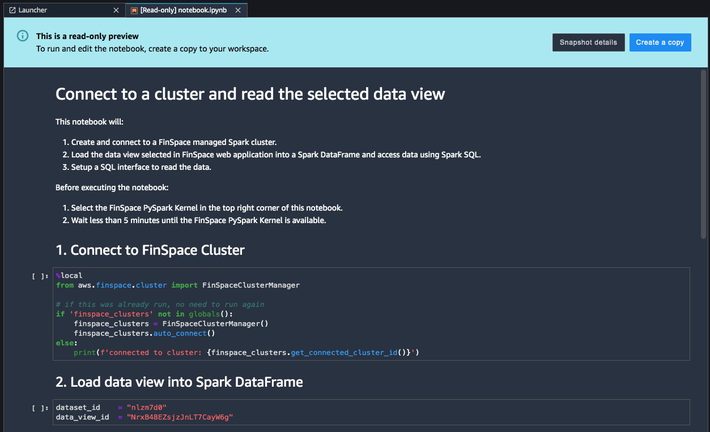
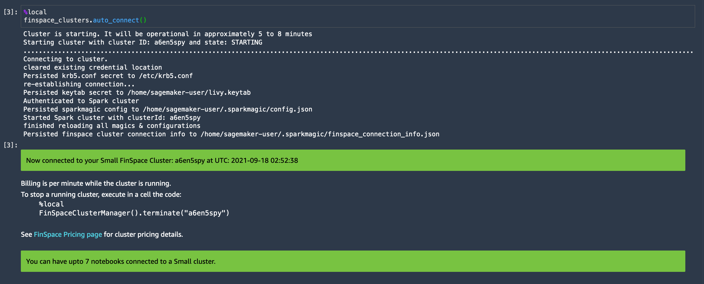
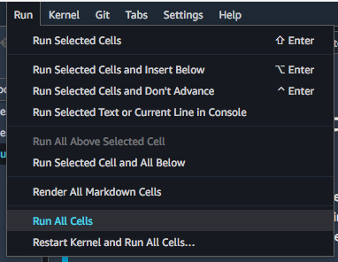
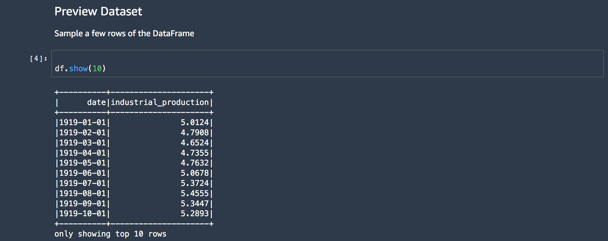

After careful consideration, we decided to end support for Amazon FinSpace, effective October 7, 2026. Amazon FinSpace will no longer accept new customers beginning October 7, 2025. As an existing customer with an Amazon FinSpace environment created before October 7, 2025, you can continue to use the service as normal. After October 7, 2026, you will no longer be able to use Amazon FinSpace. For more information, see
[Amazon FinSpace end of support](amazon-finspace-end-of-support.md "amazon-finspace-end-of-support.md").

# Loading and analyzing data in Amazon FinSpace

###### Important

Amazon FinSpace Dataset Browser will be discontinued on `March 26,
 2025`. Starting `November 29, 2023`, FinSpace will no longer accept the creation of new Dataset Browser
environments. Customers using [Amazon FinSpace with Managed Kdb Insights](https://aws.amazon.com/finspace/features/managed-kdb-insights/ "https://aws.amazon.com/finspace/features/managed-kdb-insights/") will not be affected. For more information, review the [FAQ](https://aws.amazon.com/finspace/faqs/ "https://aws.amazon.com/finspace/faqs/") or contact [AWS Support](https://aws.amazon.com/contact-us/ "https://aws.amazon.com/contact-us/") to assist with your
transition.

Before you proceed with this section, we recommend that you begin by reading [Adding and managing data in Amazon FinSpace](finspace-add-data.md "finspace-add-data.md").

**Use the following procedure to**

- Add sample data, create dataset, and data view using a CSV file. You can upload a CSV file of up to 2 GB directly from the FinSpace web application to add data.
- Analyze the data view in Amazon FinSpace notebook.

###### Note

In order to perform these steps, you must be a member of a permission group with the necessary permissions - **Create Datasets**, **Manage Clusters**, **Access Notebooks**.

## Add data, create dataset, and data view

###### To add data

1. Sign in to the FinSpace web application. For more information, see [Signing in to the Amazon FinSpace web application](signing-into-amazon-finspace.md "signing-into-amazon-finspace.md").
2. On the left navigation bar of the home page, choose **Add Data**.
3. On the next page, drag and drop the `Industrial production total index.csv` file on the page or choose **Browse Files** to select a new file.
4. On the **Add Data** page, verify if the derived schema is correct.
5. If the derived schema is incorrect, choose **Edit Derived Schema** to edit it.

For example, in this sample file, the inferred data type for the column **date** is **String**, change it to **Date**. 6. After editing the schema, choose **Save Schema**. 7. Choose an appropriate permission group that should be associated to the dataset when it gets created. You can add additional permission groups after the dataset creation is complete. 8. Choose **Confirm Schema & Upload File**.

This action creates a dataset with name **Industrial production total index** and takes you to the [Dataset details page](dataset-details-page.md "dataset-details-page.md").

###### Note

For small files of up to 100 megabytes, data view creation takes approximately 2 minutes.
For larger files of around 1 gigabyte, expect data view creation to take approximately 3-4 minutes. Views with partitioning and sorting
schemes may take longer.

Once the upload of the sample data file is complete, a process is kicked off to create a data view that can be analyzed in a notebook.

The data view card updates to show that the view is ready to be analyzed as it shows a new button with text **Analyze in Notebook**. 9. Choose **Analyze in Notebook** to access data in the data view in the integrated notebook environment.

###### Note

Starting up the FinSpace notebook environment for the first time may take 10-15 minutes. This is a one-time delay.

## Analyze the data view in Amazon FinSpace notebook

Before you proceed with this section, we recommend that you begin by reading [Working with Amazon FinSpace notebooks](working-with-amazon-finSpace-notebooks.md "working-with-amazon-finSpace-notebooks.md").

###### To analyze the data view in FinSpace notebook

1. Sign in to the FinSpace web application. For more information, see [Signing in to the Amazon FinSpace web application](signing-into-amazon-finspace.md "signing-into-amazon-finspace.md").
2. Open data view in a notebook. For more information, see [Opening the notebook environment](opening-the-notebook-environment.md "opening-the-notebook-environment.md").
3. A default notebook in read-only preview is populated with the details of the view. Choose **Create a copy.** The notebook is created with name **notebook.ipynb.** The notebook contains code for:
   - Starting a Spark cluster.
   - Loading the data view in a Spark DataFrame.
   - Print the schema and contents of the DataFrame.

   

   ###### Note

   If the kernel is starting for the first time, expect a one-time delay of approximately 5-7 minutes. The **FinSpace PySpark** kernel and a notebook instance is automatically selected.

4. Start the Spark cluster by running the first cell of the notebook. Spark cluster creation takes about 5-8 minutes. If a Spark cluster is
   already created, then the notebook will detect the cluster and connect to it.

 5. On the top menu bar, choose **Run** and then choose **Run all the cells**.

 6. The executed code shows the contents of the data view.

