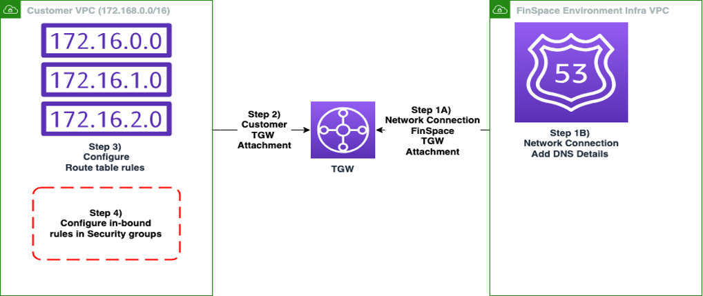

After careful consideration, we decided to end support for Amazon FinSpace, effective October 7, 2026. Amazon FinSpace will no longer accept new customers beginning October 7, 2025. As an existing customer with an Amazon FinSpace environment created before October 7, 2025, you can continue to use the service as normal. After October 7, 2026, you will no longer be able to use Amazon FinSpace. For more information, see
[Amazon FinSpace end of support](amazon-finspace-end-of-support.md "amazon-finspace-end-of-support.md").

# Tutorial: Configuring and validating outbound network connectivity through transit gateway

Amazon FinSpace Managed kdb environment allows you to connect to kdb or q processes in your account
through transit gateway, without going over the internet. This section demonstrates how to setup
outbound network connectivity from FinSpace Managed kdb environment to your virtual private cloud
(VPC) and validate connectivity from an RDB cluster to a q process on an Amazon EC2 instance in your
network.

###### Topics

- [Prerequisites](#prereq-kdb-tgw "#prereq-kdb-tgw")
- [Setup diagram](#tgw-setup-diag "#tgw-setup-diag")
- [Step 1: Configuring a network connection to create FinSpace VPC transit gateway attachment](step1-config-ntw.md "step1-config-ntw.md")
- [Step 2: Adding DNS details to your network connection](step2-dns-details.md "step2-dns-details.md")
- [Step 3: Setting up a transit gateway VPC attachment from your VPC](step3-setup-tgw-attachment.md "step3-setup-tgw-attachment.md")
- [Step 4: Configuring routes in your VPC route
  tables](step4-config-routing-tgw.md "step4-config-routing-tgw.md")
- [Step 5: Configuring security group inbound
  rules](step5-config-inbound-rule.md "step5-config-inbound-rule.md")
- [Step 6: Validating network connectivity](step6-validate-ntw.md "step6-validate-ntw.md")
- [Step 7: Validating connection using the
  DNS server configuration](step7-validate-connection-dns-server.md "step7-validate-connection-dns-server.md")

## Prerequisites

Before you proceed, complete the following prerequisites:

- Create a kdb environment. For more information, see [Creating a kdb environment](using-kdb-environment.md#create-kdb-environment "using-kdb-environment.md#create-kdb-environment").

###### Note

Note down the `Availability Zone Ids` after creating a kdb environment.
You will need them when you create an attachment from your VPC to a transit
gateway.

- Make sure that you create a transit gateway in AWS Transit Gateway. For more
  information, see [Creating the transit
  gateway](../../../vpc/latest/tgw/tgw-getting-started.md#step-create-tgw "../../../vpc/latest/tgw/tgw-getting-started.md#step-create-tgw") in the _Amazon VPC Transit Gateways User Guide_.

###### Note

When creating the transit gateway, you only need to specify the name and
description. For the rest of the fields, choose the default values. For example, for
DNS-Support, VPN ECMP support, Default route table association, and Default route table
propagation options should be selected by default.

- Make sure you are familiar with the process of [Creating a kdb environment](using-kdb-environment.md#create-kdb-environment "using-kdb-environment.md#create-kdb-environment"), [Creating a kdb user](finspace-managed-kdb-users.md#create-kdb-user "finspace-managed-kdb-users.md#create-kdb-user"), and [Creating a Managed kdb Insights cluster](create-kdb-clusters.md "create-kdb-clusters.md").

## Setup diagram

This diagram shows a high level of configuration steps that are further described in the following sections.

