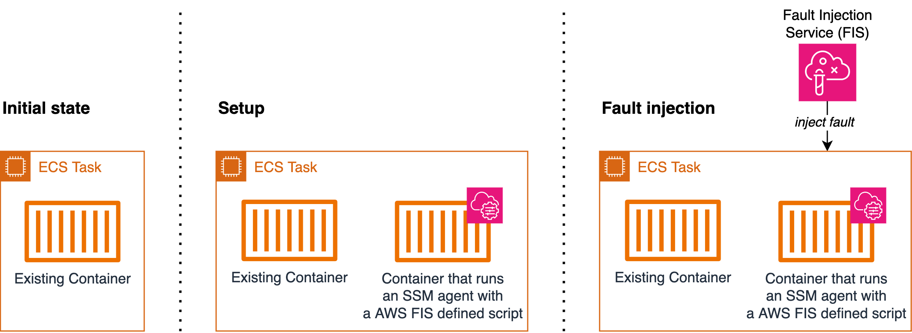

# Use the AWS FIS aws:ecs:task actions

You can use the **aws:ecs:task** actions to inject faults into your Amazon ECS tasks.
Amazon EC2 and Fargate capacity types are supported.

These actions use
[AWS Systems Manager (SSM) documents](actions-ssm-agent.md#fis-ssm-docs "actions-ssm-agent.md#fis-ssm-docs")
to inject faults. To use `aws:ecs:task` actions, you will need to add a container with an SSM Agent to
your Amazon Elastic Container Service (Amazon ECS) task definition. The container runs an
[AWS FIS defined script](#ecs-task-reference "#ecs-task-reference") that registers the Amazon ECS task as Managed Instance
in the SSM service. Additionally, the script retrieves task metadata to add tags to the Managed Instance. The
setup will allow AWS FIS to resolve the target task. This paragraph refers to the **Setup** in
the diagram below.

When you run an AWS FIS experiment targeting `aws:ecs:task`, AWS FIS maps the target Amazon ECS tasks you specify
in an AWS FIS experiment template to a set of SSM managed instances using a resource tag, `ECS_TASK_ARN`.
The tag value is the ARN of the associated Amazon ECS task where the SSM documents should be executed. This paragraph
refers to the **Fault Injection** in the diagram below.

The following diagram exemplifies the setup and fault injection on a task with one existing container.



## Actions

- [aws:ecs:task-cpu-stress](fis-actions-reference.md#task-cpu-stress "fis-actions-reference.md#task-cpu-stress")
- [aws:ecs:task-io-stress](fis-actions-reference.md#task-io-stress "fis-actions-reference.md#task-io-stress")
- [aws:ecs:task-kill-process](fis-actions-reference.md#task-kill-process "fis-actions-reference.md#task-kill-process")
- [aws:ecs:task-network-blackhole-port](fis-actions-reference.md#task-network-blackhole-port "fis-actions-reference.md#task-network-blackhole-port")
- [aws:ecs:task-network-latency](fis-actions-reference.md#task-network-latency "fis-actions-reference.md#task-network-latency")
- [aws:ecs:task-network-packet-loss](fis-actions-reference.md#task-network-packet-loss "fis-actions-reference.md#task-network-packet-loss")

## Limitations

- The following actions cannot run in parallel:
  - aws:ecs:task-network-blackhole-port
  - aws:ecs:task-network-latency
  - aws:ecs:task-network-packet-loss

- If you enabled Amazon ECS Exec, you must disable it before you can use these actions.
- The SSM document execution might have Status Cancelled even if the experiment has State Completed.
  When executing Amazon ECS actions, the customer-provided duration is used both for the action duration in
  the experiment and the Amazon EC2 Systems Manager (SSM) document duration. After the action is
  initiated, it takes some time for the SSM document to start running. Consequently, by the time
  the specified action duration is reached, the SSM document may still have a few seconds remaining
  to complete its execution. When the experiment action duration is reached, the action is stopped,
  and the SSM document execution is cancelled. The fault injection was successful.

## Requirements

- Add the following permissions to the AWS FIS [experiment role](getting-started-iam-service-role.md "getting-started-iam-service-role.md"):
  - `ecs:DescribeTasks`
  - `ssm:SendCommand`
  - `ssm:ListCommands`
  - `ssm:CancelCommand`

- Add the following permissions to the Amazon ECS [task IAM role](../../../AmazonECS/latest/developerguide/task-iam-roles.md "../../../AmazonECS/latest/developerguide/task-iam-roles.md"):

      + `ssm:CreateActivation`
      + `ssm:AddTagsToResource`
      + `iam:PassRole`

  Note that you can specify the ARN of the managed instance role as the resource
  for `iam:PassRole`.

- Create an Amazon ECS [task execution IAM role](../../../AmazonECS/latest/developerguide/task_execution_IAM_role.md "../../../AmazonECS/latest/developerguide/task_execution_IAM_role.md")
  and add the [AmazonECSTaskExecutionRolePolicy](../../../aws-managed-policy/latest/reference/AmazonECSTaskExecutionRolePolicy.md "../../../aws-managed-policy/latest/reference/AmazonECSTaskExecutionRolePolicy.md") managed policy.
- In the task definition, set the environment variable `MANAGED_INSTANCE_ROLE_NAME` to the name
  of the [managed instance role](../../../systems-manager/latest/userguide/hybrid-multicloud-service-role.md "../../../systems-manager/latest/userguide/hybrid-multicloud-service-role.md"). This is the role that will be attached to the tasks registered as managed instances in SSM.
- Add the following permissions to the managed instance role:
  - `ssm:DeleteActivation`
  - `ssm:DeregisterManagedInstance`

- Add the [AmazonSSMManagedInstanceCore](../../../aws-managed-policy/latest/reference/AmazonSSMManagedInstanceCore.md "../../../aws-managed-policy/latest/reference/AmazonSSMManagedInstanceCore.md") managed policy to the managed instance role.
- Add an SSM agent container to the Amazon ECS task definition. The command script registers
  Amazon ECS tasks as managed instances.

```
{
    "name": "amazon-ssm-agent",
    "image": "public.ecr.aws/amazon-ssm-agent/amazon-ssm-agent:latest",
    "cpu": 0,
    "links": [],
    "portMappings": [],
    "essential": false,
    "entryPoint": [],
    "command": [
        "/bin/bash",
        "-c",
        "set -e; dnf upgrade -y; dnf install jq procps awscli -y; term_handler() { echo \"Deleting SSM activation $ACTIVATION_ID\"; if ! aws ssm delete-activation --activation-id $ACTIVATION_ID --region $ECS_TASK_REGION; then echo \"SSM activation $ACTIVATION_ID failed to be deleted\" 1>&2; fi; MANAGED_INSTANCE_ID=$(jq -e -r .ManagedInstanceID /var/lib/amazon/ssm/registration); echo \"Deregistering SSM Managed Instance $MANAGED_INSTANCE_ID\"; if ! aws ssm deregister-managed-instance --instance-id $MANAGED_INSTANCE_ID --region $ECS_TASK_REGION; then echo \"SSM Managed Instance $MANAGED_INSTANCE_ID failed to be deregistered\" 1>&2; fi; kill -SIGTERM $SSM_AGENT_PID; }; trap term_handler SIGTERM SIGINT; if [[ -z $MANAGED_INSTANCE_ROLE_NAME ]]; then echo \"Environment variable MANAGED_INSTANCE_ROLE_NAME not set, exiting\" 1>&2; exit 1; fi; if ! ps ax | grep amazon-ssm-agent | grep -v grep > /dev/null; then if [[ -n $ECS_CONTAINER_METADATA_URI_V4 ]] ; then echo \"Found ECS Container Metadata, running activation with metadata\"; TASK_METADATA=$(curl \"${ECS_CONTAINER_METADATA_URI_V4}/task\"); ECS_TASK_AVAILABILITY_ZONE=$(echo $TASK_METADATA | jq -e -r '.AvailabilityZone'); ECS_TASK_ARN=$(echo $TASK_METADATA | jq -e -r '.TaskARN'); ECS_TASK_REGION=$(echo $ECS_TASK_AVAILABILITY_ZONE | sed 's/.$//'); ECS_TASK_AVAILABILITY_ZONE_REGEX='^(af|ap|ca|cn|eu|me|sa|us|us-gov)-(central|north|(north(east|west))|south|south(east|west)|east|west)-[0-9]{1}[a-z]{1}$'; if ! [[ $ECS_TASK_AVAILABILITY_ZONE =~ $ECS_TASK_AVAILABILITY_ZONE_REGEX ]]; then echo \"Error extracting Availability Zone from ECS Container Metadata, exiting\" 1>&2; exit 1; fi; ECS_TASK_ARN_REGEX='^arn:(aws|aws-cn|aws-us-gov):ecs:[a-z0-9-]+:[0-9]{12}:task/[a-zA-Z0-9_-]+/[a-zA-Z0-9]+$'; if ! [[ $ECS_TASK_ARN =~ $ECS_TASK_ARN_REGEX ]]; then echo \"Error extracting Task ARN from ECS Container Metadata, exiting\" 1>&2; exit 1; fi; CREATE_ACTIVATION_OUTPUT=$(aws ssm create-activation --iam-role $MANAGED_INSTANCE_ROLE_NAME --tags Key=ECS_TASK_AVAILABILITY_ZONE,Value=$ECS_TASK_AVAILABILITY_ZONE Key=ECS_TASK_ARN,Value=$ECS_TASK_ARN Key=FAULT_INJECTION_SIDECAR,Value=true --region $ECS_TASK_REGION); ACTIVATION_CODE=$(echo $CREATE_ACTIVATION_OUTPUT | jq -e -r .ActivationCode); ACTIVATION_ID=$(echo $CREATE_ACTIVATION_OUTPUT | jq -e -r .ActivationId); if ! amazon-ssm-agent -register -code $ACTIVATION_CODE -id $ACTIVATION_ID -region $ECS_TASK_REGION; then echo \"Failed to register with AWS Systems Manager (SSM), exiting\" 1>&2; exit 1; fi; amazon-ssm-agent & SSM_AGENT_PID=$!; wait $SSM_AGENT_PID; else echo \"ECS Container Metadata not found, exiting\" 1>&2; exit 1; fi; else echo \"SSM agent is already running, exiting\" 1>&2; exit 1; fi"
    ],
    "environment": [
        {
            "name": "MANAGED_INSTANCE_ROLE_NAME",
            "value": "`SSMManagedInstanceRole`"
        }
    ],
    "environmentFiles": [],
    "mountPoints": [],
    "volumesFrom": [],
    "secrets": [],
    "dnsServers": [],
    "dnsSearchDomains": [],
    "extraHosts": [],
    "dockerSecurityOptions": [],
    "dockerLabels": {},
    "ulimits": [],
    "logConfiguration": {},
    "systemControls": []
}
```

For a more readable version of the script, see [Reference version of the script](#ecs-task-reference "#ecs-task-reference").

- Enable the Amazon ECS Fault Injection APIs, by setting the `enableFaultInjection` field in the Amazon ECS task definition:

```
"enableFaultInjection": true,
```

- When using the `aws:ecs:task-network-blackhole-port`,`aws:ecs:task-network-latency`, or
  `aws:ecs:task-network-packet-loss` actions on Fargate tasks, the action must have
  the `useEcsFaultInjectionEndpoints` parameter set to `true`.
- When using the `aws:ecs:task-kill-process`, `aws:ecs:task-network-blackhole-port`,
  `aws:ecs:task-network-latency`, or
  `aws:ecs:task-network-packet-loss` actions, the Amazon ECS task definition must have `pidMode` set to `task`.
- When using the `aws:ecs:task-network-blackhole-port`,
  `aws:ecs:task-network-latency`, or
  `aws:ecs:task-network-packet-loss` actions on tasks with EC2 launch type, the [networking option in the task definition](../../../AmazonECS/latest/developerguide/task-networking.md "../../../AmazonECS/latest/developerguide/task-networking.md") must be set to `awsvpc` or `host`.

## Reference version of the script

The following is a more readable version of the script in the Requirements section,
for your reference.

```
#!/usr/bin/env bash

# This is the activation script used to register ECS tasks as Managed Instances in SSM
# The script retrieves information form the ECS task metadata endpoint to add three tags to the Managed Instance
#  - ECS_TASK_AVAILABILITY_ZONE: To allow customers to target Managed Instances / Tasks in a specific Availability Zone
#  - ECS_TASK_ARN: To allow customers to target Managed Instances / Tasks by using the Task ARN
#  - FAULT_INJECTION_SIDECAR: To make it clear that the tasks were registered as managed instance for fault injection purposes. Value is always 'true'.
# The script will leave the SSM Agent running in the background
# When the container running this script receives a SIGTERM or SIGINT signal, it will do the following cleanup:
#  - Delete SSM activation
#  - Deregister SSM managed instance

set -e # stop execution instantly as a query exits while having a non-zero

dnf upgrade -y
dnf install jq procps awscli -y

term_handler() {
  echo "Deleting SSM activation $ACTIVATION_ID"
  if ! aws ssm delete-activation --activation-id $ACTIVATION_ID --region $ECS_TASK_REGION; then
    echo "SSM activation $ACTIVATION_ID failed to be deleted" 1>&2
  fi

  MANAGED_INSTANCE_ID=$(jq -e -r .ManagedInstanceID /var/lib/amazon/ssm/registration)
  echo "Deregistering SSM Managed Instance $MANAGED_INSTANCE_ID"
  if ! aws ssm deregister-managed-instance --instance-id $MANAGED_INSTANCE_ID --region $ECS_TASK_REGION; then
    echo "SSM Managed Instance $MANAGED_INSTANCE_ID failed to be deregistered" 1>&2
  fi

  kill -SIGTERM $SSM_AGENT_PID
}
trap term_handler SIGTERM SIGINT

# check if the required IAM role is provided
if [[ -z $MANAGED_INSTANCE_ROLE_NAME ]] ; then
  echo "Environment variable MANAGED_INSTANCE_ROLE_NAME not set, exiting" 1>&2
  exit 1
fi

# check if the agent is already running (it will be if ECS Exec is enabled)
if ! ps ax | grep amazon-ssm-agent | grep -v grep > /dev/null; then

  # check if ECS Container Metadata is available
  if [[ -n $ECS_CONTAINER_METADATA_URI_V4 ]] ; then

    # Retrieve info from ECS task metadata endpoint
    echo "Found ECS Container Metadata, running activation with metadata"
    TASK_METADATA=$(curl "${ECS_CONTAINER_METADATA_URI_V4}/task")
    ECS_TASK_AVAILABILITY_ZONE=$(echo $TASK_METADATA | jq -e -r '.AvailabilityZone')
    ECS_TASK_ARN=$(echo $TASK_METADATA | jq -e -r '.TaskARN')
    ECS_TASK_REGION=$(echo $ECS_TASK_AVAILABILITY_ZONE | sed 's/.$//')

    # validate ECS_TASK_AVAILABILITY_ZONE
    ECS_TASK_AVAILABILITY_ZONE_REGEX='^(af|ap|ca|cn|eu|me|sa|us|us-gov)-(central|north|(north(east|west))|south|south(east|west)|east|west)-[0-9]{1}[a-z]{1}$'
    if ! [[ $ECS_TASK_AVAILABILITY_ZONE =~ $ECS_TASK_AVAILABILITY_ZONE_REGEX ]] ; then
      echo "Error extracting Availability Zone from ECS Container Metadata, exiting" 1>&2
      exit 1
    fi

    # validate ECS_TASK_ARN
    ECS_TASK_ARN_REGEX='^arn:(aws|aws-cn|aws-us-gov):ecs:[a-z0-9-]+:[0-9]{12}:task/[a-zA-Z0-9_-]+/[a-zA-Z0-9]+$'
    if ! [[ $ECS_TASK_ARN =~ $ECS_TASK_ARN_REGEX ]] ; then
      echo "Error extracting Task ARN from ECS Container Metadata, exiting" 1>&2
      exit 1
    fi

    # Create activation tagging with Availability Zone and Task ARN
    CREATE_ACTIVATION_OUTPUT=$(aws ssm create-activation \
      --iam-role $MANAGED_INSTANCE_ROLE_NAME \
      --tags Key=ECS_TASK_AVAILABILITY_ZONE,Value=$ECS_TASK_AVAILABILITY_ZONE Key=ECS_TASK_ARN,Value=$ECS_TASK_ARN Key=FAULT_INJECTION_SIDECAR,Value=true \
      --region $ECS_TASK_REGION)

    ACTIVATION_CODE=$(echo $CREATE_ACTIVATION_OUTPUT | jq -e -r .ActivationCode)
    ACTIVATION_ID=$(echo $CREATE_ACTIVATION_OUTPUT | jq -e -r .ActivationId)

    # Register with AWS Systems Manager (SSM)
    if ! amazon-ssm-agent -register -code $ACTIVATION_CODE -id $ACTIVATION_ID -region $ECS_TASK_REGION; then
      echo "Failed to register with AWS Systems Manager (SSM), exiting" 1>&2
      exit 1
    fi

    # the agent needs to run in the background, otherwise the trapped signal
    # won't execute the attached function until this process finishes
    amazon-ssm-agent &
    SSM_AGENT_PID=$!

    # need to keep the script alive, otherwise the container will terminate
    wait $SSM_AGENT_PID

  else
    echo "ECS Container Metadata not found, exiting" 1>&2
    exit 1
  fi

else
  echo "SSM agent is already running, exiting" 1>&2
  exit 1
fi
```

## Example experiment template

The following is an example experiment template for the [aws:ecs:task-cpu-stress](fis-actions-reference.md#task-cpu-stress "fis-actions-reference.md#task-cpu-stress")
action.

```
{
    "description": "Run CPU stress on the target ECS tasks",
    "targets": {
        "myTasks": {
            "resourceType": "aws:ecs:task",
            "resourceArns": [
                "arn:aws:ecs:`us-east-1`:`111122223333`:task/`my-cluster`/`09821742c0e24250b187dfed8EXAMPLE`"
            ],
            "selectionMode": "`ALL`"
        }
    },
    "actions": {
        "EcsTask-cpu-stress": {
            "actionId": "aws:ecs:task-cpu-stress",
            "parameters": {
                "duration": "`PT1M`"
            },
            "targets": {
                "Tasks": "myTasks"
            }
        }
    },
    "stopConditions": [
        {
            "source": "none",
        }
    ],
    "roleArn": "arn:aws:iam::`111122223333`:role/`fis-experiment-role`",
    "tags": {}
}
```
