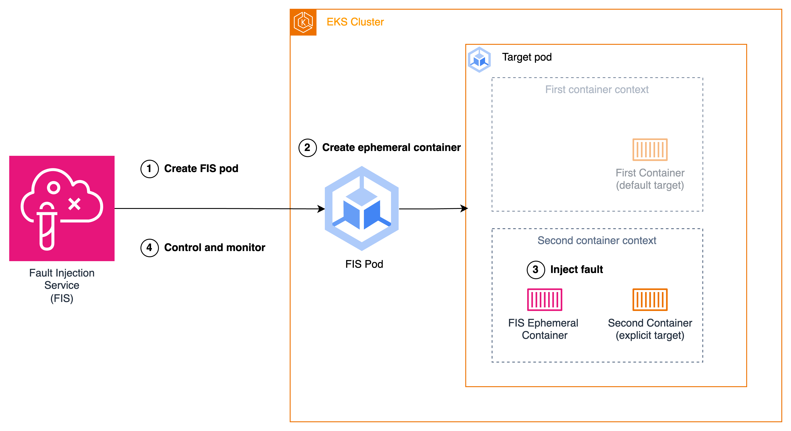

# Use the AWS FIS aws:eks:pod actions

You can use the **aws:eks:pod** actions to inject faults into the Kubernetes Pods
running in your EKS clusters.

When an action is initiated, FIS retrieves the
[FIS Pod container image](eks-pod-actions.md#eks-pod-container-images "eks-pod-actions.md#eks-pod-container-images").
This image is then used to create a Pod in the targeted EKS cluster. The newly-created Pod is responsible
for injecting, controlling and monitoring the fault. For all FIS EKS actions, except for
[aws:eks:pod-delete](fis-actions-reference.md#pod-delete "fis-actions-reference.md#pod-delete"),
the fault injection is achieved through the use of
[ephemeral containers](https://kubernetes.io/docs/concepts/workloads/pods/ephemeral-containers/ "https://kubernetes.io/docs/concepts/workloads/pods/ephemeral-containers/"),
a Kubernetes feature that allows for the creation of temporary containers within an existing Pod. The ephemeral container is started in the same namespace as the target container and executes the desired fault injection tasks. If no target container is specified, the first container in the Pod specification is selected as target.



1. FIS creates the FIS Pod in the target cluster specified in the experiment template.
2. The FIS Pod creates an ephemeral container in the Target Pod in the same namespace as target container.
3. The ephemeral container injects faults in the namespace of the target container.
4. The FIS Pod controls and monitors the fault injection of the ephemeral container and FIS controls
   and monitors the FIS Pod.

Upon experiment completion or if an error occurs, the ephemeral container and the FIS Pod are removed.

## Actions

- [aws:eks:pod-cpu-stress](fis-actions-reference.md#pod-cpu-stress "fis-actions-reference.md#pod-cpu-stress")
- [aws:eks:pod-delete](fis-actions-reference.md#pod-delete "fis-actions-reference.md#pod-delete")
- [aws:eks:pod-io-stress](fis-actions-reference.md#pod-io-stress "fis-actions-reference.md#pod-io-stress")
- [aws:eks:pod-memory-stress](fis-actions-reference.md#pod-memory-stress "fis-actions-reference.md#pod-memory-stress")
- [aws:eks:pod-network-blackhole-port](fis-actions-reference.md#pod-network-blackhole-port "fis-actions-reference.md#pod-network-blackhole-port")
- [aws:eks:pod-network-latency](fis-actions-reference.md#pod-network-latency "fis-actions-reference.md#pod-network-latency")
- [aws:eks:pod-network-packet-loss](fis-actions-reference.md#pod-network-packet-loss "fis-actions-reference.md#pod-network-packet-loss")

## Limitations

- The following actions do not work with AWS Fargate:
  - aws:eks:pod-network-blackhole-port
  - aws:eks:pod-network-latency
  - aws:eks:pod-network-packet-loss

- The following actions do not support the `bridge` [network mode](../../../AmazonECS/latest/bestpracticesguide/networking-networkmode.md "../../../AmazonECS/latest/bestpracticesguide/networking-networkmode.md"):
  - aws:eks:pod-network-blackhole-port
  - aws:eks:pod-network-latency
  - aws:eks:pod-network-packet-loss

- The following actions require root permissions within the ephemeral container.

      + aws:eks:pod-network-blackhole-port
      + aws:eks:pod-network-latency
      + aws:eks:pod-network-packet-loss

  The ephemeral container will inherit its permissions from the security context of the target Pod. If you need to run the containers in the Pod as non-root user, you can set separate security contexts for the containers in the target Pod.

- You can't identify targets of type **aws:eks:pod** in your
  experiment template using resource ARNs or resource tags. You must identify
  targets using the required resource parameters.
- The actions aws:eks:pod-network-latency and aws:eks:pod-network-packet-loss should not be run in parallel and target the same Pod. Depending on the value of the `maxErrors` parameter you specify, the action may end in completed or in failed state:
  - If `maxErrorsPercent` is 0 (default), the action will end in failed state.
  - Otherwise, the failure will add up to the `maxErrorsPercent` budget. If the number of failed injections do not reach the provided `maxErrors`, the action will end up in completed state.
  - You can identify these failures from the logs of the injected ephemeral container in the target Pod. It will fail with `Exit Code: 16`.

- The action aws:eks:pod-network-blackhole-port should not be run in parallel with
  other actions that target the same Pod and use the same `trafficType`. Parallel actions
  using different traffic types are supported.
- FIS can only monitor the status of fault injection when the `securityContext` of the target Pods is set to
  `readOnlyRootFilesystem: false`. Without this configuration, all EKS Pod actions will fail.

## Requirements

- Install the AWS CLI on your computer. This is needed only if you'll use the AWS CLI
  to create IAM roles. For more information, see [Installing or updating the AWS CLI](../../../cli/latest/userguide/getting-started-install.md "../../../cli/latest/userguide/getting-started-install.md").
- Install **kubectl** on your computer. This is needed only
  to interact with the EKS cluster to configure or monitor the target application.
  For more information, see
  [https://kubernetes.io/docs/tasks/tools/](https://kubernetes.io/docs/tasks/tools/ "https://kubernetes.io/docs/tasks/tools/").
- The minimum supported version of EKS is 1.23.

## Create an experiment role

To run an experiment, you need to configure an IAM role for the experiment. For more
information, see [IAM roles for AWS FIS experiments](getting-started-iam-service-role.md "getting-started-iam-service-role.md"). The required permissions for this role
depend on the action you're using. Refer to the
[AWS FIS actions that target `aws:eks:pod`](fis-actions-reference.md#eks-actions-reference "fis-actions-reference.md#eks-actions-reference")
to find the necessary permissions for your action.

## Configure the Kubernetes service account

Configure a Kubernetes service account to run experiments with targets in the
specified Kubernetes namespace. In the following example, the service account is
`myserviceaccount` and the namespace is
`default`. Note that default is one of the
standard Kubernetes namespaces.

###### To configure your Kubernetes service account

1. Create a file named `rbac.yaml` and add the following.

```
kind: ServiceAccount
apiVersion: v1
metadata:
  namespace: `default`
  name: `myserviceaccount`

---
kind: Role
apiVersion: rbac.authorization.k8s.io/v1
metadata:
  namespace: `default`
  name: `role-experiments`
rules:
- apiGroups: [""]
  resources: ["configmaps"]
  verbs: [ "get", "create", "patch", "delete"]
- apiGroups: [""]
  resources: ["pods"]
  verbs: ["create", "list", "get", "delete", "deletecollection"]
- apiGroups: [""]
  resources: ["pods/ephemeralcontainers"]
  verbs: ["update"]
- apiGroups: [""]
  resources: ["pods/exec"]
  verbs: ["create"]
- apiGroups: ["apps"]
  resources: ["deployments"]
  verbs: ["get"]

---
apiVersion: rbac.authorization.k8s.io/v1
kind: RoleBinding
metadata:
  name: bind-role-experiments
  namespace: `default`
subjects:
- kind: ServiceAccount
  name: `myserviceaccount`
  namespace: `default`
- apiGroup: rbac.authorization.k8s.io
  kind: User
  name: `fis-experiment`
roleRef:
  kind: Role
  name: `role-experiments`
  apiGroup: rbac.authorization.k8s.io
```

2. Run the following command.

```
kubectl apply -f rbac.yaml
```

## Grant IAM users and roles access to Kubernetes APIs

Follow the steps explained in
[Associate IAM Identities with Kubernetes Permissions](../../../eks/latest/userguide/grant-k8s-access.md#authentication-modes "../../../eks/latest/userguide/grant-k8s-access.md#authentication-modes") in the **EKS** documentation.

### Option 1: Create access entries

We recommend using **Access Entries**. You can use the following command to create an Access Entry which associates the IAM role with the Kubernetes user `fis-experiment`. For more information, see
[Grant IAM users access to Kubernetes with EKS access entries](../../../eks/latest/userguide/access-entries.md "../../../eks/latest/userguide/access-entries.md").

```
aws eks create-access-entry \
                 --principal-arn arn:aws:iam::`123456789012`:role/`fis-experiment-role` \
                 --username `fis-experiment` \
                 --cluster-name `my-cluster`
```

###### Important

In order to leverage access entries, the authentication mode of the EKS cluster must be configured
to either the `API_AND_CONFIG_MAP` or `API` mode.

### Option 2: Add entries to the aws-auth ConfigMap

You can also use the following command to create an identity mapping. For more information, see
[Manage IAM users and
roles](https://eksctl.io/usage/iam-identity-mappings/ "https://eksctl.io/usage/iam-identity-mappings/") in the **eksctl** documentation.

```
eksctl create iamidentitymapping \
                 --arn arn:aws:iam::`123456789012`:role/`fis-experiment-role` \
                 --username `fis-experiment` \
                 --cluster `my-cluster`
```

###### Important

Leveraging the eksctl toolkit to configure identity mappings will result in the creation of
entries within the `aws-auth` ConfigMap. It is important to note that these generated
entries do not support the inclusion of a path component. Consequently, the ARN provided as input
must not contain a path segment (e.g.,
`arn:aws:iam::123456789012:role/service-role/fis-experiment-role`).

## Pod container images

The Pod container images provided by AWS FIS are hosted in Amazon ECR.
When you reference an image from Amazon ECR, you must use the full image URI.

The Pod container image is also available in the [AWS ECR Public Gallery](https://gallery.ecr.aws/aws-fis/aws-fis-pod "https://gallery.ecr.aws/aws-fis/aws-fis-pod").

| AWS Region                | Image URI                                                           |
| ------------------------- | ------------------------------------------------------------------- |
| US East (Ohio)            | `051821878176.dkr.ecr.us-east-2.amazonaws.com/aws-fis-pod:0.1`      |
| US East (N. Virginia)     | `731367659002.dkr.ecr.us-east-1.amazonaws.com/aws-fis-pod:0.1`      |
| US West (N. California)   | `080694859247.dkr.ecr.us-west-1.amazonaws.com/aws-fis-pod:0.1`      |
| US West (Oregon)          | `864386544765.dkr.ecr.us-west-2.amazonaws.com/aws-fis-pod:0.1`      |
| Africa (Cape Town)        | `056821267933.dkr.ecr.af-south-1.amazonaws.com/aws-fis-pod:0.1`     |
| Asia Pacific (Hong Kong)  | `246405402639.dkr.ecr.ap-east-1.amazonaws.com/aws-fis-pod:0.1`      |
| Asia Pacific (Mumbai)     | `524781661239.dkr.ecr.ap-south-1.amazonaws.com/aws-fis-pod:0.1`     |
| Asia Pacific (Seoul)      | `526524659354.dkr.ecr.ap-northeast-2.amazonaws.com/aws-fis-pod:0.1` |
| Asia Pacific (Singapore)  | `316401638346.dkr.ecr.ap-southeast-1.amazonaws.com/aws-fis-pod:0.1` |
| Asia Pacific (Sydney)     | `488104106298.dkr.ecr.ap-southeast-2.amazonaws.com/aws-fis-pod:0.1` |
| Asia Pacific (Tokyo)      | `635234321696.dkr.ecr.ap-northeast-1.amazonaws.com/aws-fis-pod:0.1` |
| Canada (Central)          | `490658072207.dkr.ecr.ca-central-1.amazonaws.com/aws-fis-pod:0.1`   |
| Europe (Frankfurt)        | `713827034473.dkr.ecr.eu-central-1.amazonaws.com/aws-fis-pod:0.1`   |
| Europe (Ireland)          | `205866052826.dkr.ecr.eu-west-1.amazonaws.com/aws-fis-pod:0.1`      |
| Europe (London)           | `327424803546.dkr.ecr.eu-west-2.amazonaws.com/aws-fis-pod:0.1`      |
| Europe (Milan)            | `478809367036.dkr.ecr.eu-south-1.amazonaws.com/aws-fis-pod:0.1`     |
| Europe (Paris)            | `154605889247.dkr.ecr.eu-west-3.amazonaws.com/aws-fis-pod:0.1`      |
| Europe (Spain)            | `395402409451.dkr.ecr.eu-south-2.amazonaws.com/aws-fis-pod:0.1`     |
| Europe (Stockholm)        | `263175118295.dkr.ecr.eu-north-1.amazonaws.com/aws-fis-pod:0.1`     |
| Europe (Zurich)           | `604225987275.dkr.ecr.eu-central-2.amazonaws.com/aws-fis-pod:0.1`   |
| Middle East (Bahrain)     | `065825543785.dkr.ecr.me-south-1.amazonaws.com/aws-fis-pod:0.1`     |
| Middle East (UAE)         | `438374459301.dkr.ecr.me-central-1.amazonaws.com/aws-fis-pod:0.1`   |
| South America (São Paulo) | `767113787785.dkr.ecr.sa-east-1.amazonaws.com/aws-fis-pod:0.1`      |
| AWS GovCloud (US-East)    | `246533647532.dkr.ecr.us-gov-east-1.amazonaws.com/aws-fis-pod:0.1`  |
| AWS GovCloud (US-West)    | `246529956514.dkr.ecr.us-gov-west-1.amazonaws.com/aws-fis-pod:0.1`  |

## Example experiment template

The following is an example experiment template for the [aws:eks:pod-network-latency](fis-actions-reference.md#pod-network-latency "fis-actions-reference.md#pod-network-latency")
action.

```
{
    "description": "Add latency and jitter to the network interface for the target EKS Pods",
    "targets": {
        "myPods": {
            "resourceType": "aws:eks:pod",
            "parameters": {
                "clusterIdentifier": "`mycluster`",
                "namespace": "`default`",
                "selectorType": "`labelSelector`",
                "selectorValue": "`mylabel=mytarget`"
            },
            "selectionMode": "`COUNT(3)`"
        }
    },
    "actions": {
        "EksPod-latency": {
            "actionId": "aws:eks:pod-network-latency",
            "description": "Add latency",
            "parameters": {
                "kubernetesServiceAccount": "`myserviceaccount`",
                "duration": "`PT5M`",
                "delayMilliseconds": "`200`",
                "jitterMilliseconds": "`10`",
                "sources": "`0.0.0.0/0`"
            },
            "targets": {
                "Pods": "myPods"
            }
        }
    },
    "stopConditions": [
        {
            "source": "none",
        }
    ],
    "roleArn": "arn:aws:iam::`111122223333`:role/`fis-experiment-role`",
    "tags": {
        "Name": "EksPodNetworkLatency"
    }
}
```
