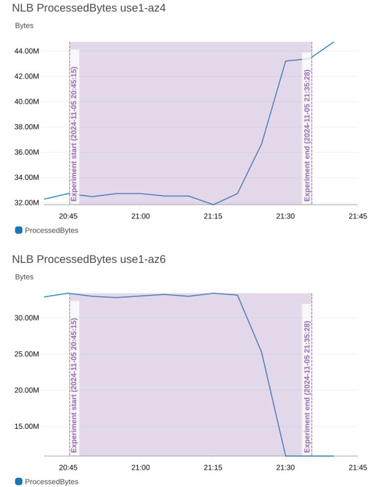

# Experiment report configurations for AWS FIS

You can enable AWS Fault Injection Service (FIS) to generate reports for experiments, making it easier to produce evidence of resilience testing.
The experiment report is a PDF document that summarizes experiment actions and optionally captures application response from a
CloudWatch dashboard that you specify. To see an example experiment report, download the zip file [here](samples/FisExampleReport.pdf.md "samples/FisExampleReport.pdf.md").

To enable and configure the contents of the report generated for the experiment, you define the experiment report configuration for the experiment template. When you specify a CloudWatch dashboard, AWS FIS includes a snapshot graph of all the widgets in the given dashboard annotated with
experiment start and end time over a duration that you specify, as shown in the example below.

This example demonstrates the impact of a packet loss experiment in an Availability Zone (AZ).
When packet loss is introduced in AZ use1-az6, traffic shifts away from use1-az6 and towards use1-az4, so that the number of bytes processed by the load balancer in that AZ declines.


When the experiment ends, the report can be downloaded from the AWS FIS console and is also stored in an Amazon S3 bucket. If you include a CloudWatch dashboard in your report configuration, images of each widget are also delivered. Reports are not generated for experiments that are `cancelled`
or run as part of target preview (with **actionsMode** set to `skip-all`). Once the experiment exceeds the experiment data retention limit, the report will only be available from the Amazon S3 bucket. AWS FIS charges apply for each delivered report, except for those
that fail with internal errors. For more information, see [AWS Fault Injection Service pricing](https://aws.amazon.com/fis/pricing/ "https://aws.amazon.com/fis/pricing/") and [Quotas and limitations for AWS Fault Injection Service](fis-quotas.md "fis-quotas.md"). Ingest and storage charges for Amazon S3 and CloudWatch API charges
for **GetMetricWidgetImage** and **GetDashboard** requests may apply. For more information, see [Amazon S3 pricing](https://aws.amazon.com/s3/pricing/ "https://aws.amazon.com/s3/pricing/") and [CloudWatch pricing](https://aws.amazon.com/cloudwatch/pricing/ "https://aws.amazon.com/cloudwatch/pricing/").

###### Contents

- [Experiment report configuration syntax](#experiment-report-syntax "#experiment-report-syntax")
- [Experiment report permissions](#experiment-report-permissions "#experiment-report-permissions")
- [Experiment report best practices](#experiment-report-best-practices "#experiment-report-best-practices")

## Experiment report configuration syntax

The following is the syntax for the experiment report configuration, an optional section of the experiment template.

```
{
    "experimentReportConfiguration": {
        "outputs": {
            "s3Configuration": {
                "bucketName": "my-bucket-name",
                "prefix": "report-storage-prefix"
            }
        },
        "dataSources": {
            "cloudWatchDashboards": [
                {
                    "dashboardIdentifier": "arn:aws:cloudwatch::123456789012:dashboard/MyDashboard"
                }
            ]
        },
        "preExperimentDuration": "PT20M",
        "postExperimentDuration": "PT20M"
    }
}
```

Using the `experimentReportConfiguration`, you can customize the output destination, input data, and time windows for the data to include in the experiment report,
which can help you better understand the impact and results of your AWS FIS experiments. When you define the experiment report configuration, you provide the following:

**outputs**

Section of the `experimentReportConfiguration` that specifies where the experiment report will be delivered. In `outputs`, you specify the `s3Configuration` by providing the following:

- `bucketName` - The name of the Amazon S3 bucket where the report will be stored. The bucket must be in the same region as the experiment.
- `prefix` (Optional) - A prefix within the Amazon S3 bucket where the report will be stored. This field is strongly recommended so that you can limit access to the prefix only.

**dataSources**

Optional section of the `experimentReportConfiguration` that specifies the additional data sources that will be included in the experiment report.

- `cloudWatchDashboards` - An array of the CloudWatch dashboards that will be included in the report. Limited to one CloudWatch dashboard.
- `dashboardIdentifier`- The ARN of the CloudWatch dashboard. Snapshot graphs of every widget with the type `metric` in this dashboard will be included in the report, with the exception of cross-region metrics.

**preExperimentDuration**

Optional section of the `experimentReportConfiguration` that defines the pre-experiment duration for the CloudWatch dashboard metrics to include in the report, up to 30 minutes.
This should be a period that represents your application steady state. For example, a pre-experiment duration of 5 minutes means the snapshot graphs will include metrics 5 minutes before the experiment starts.
The format for the duration is ISO 8601 and the default is 20 minutes.

**postExperimentDuration**

Optional section of the `experimentReportConfiguration` that defines the post-experiment duration for the CloudWatch dashboard metrics to include in the report, up to 2 hours.
This should be a duration that represents your application steady state or recovery period. For example, if you specify a post-experiment duration of 5 minutes,
the snapshot graphs will include metrics until 5 minutes after the experiment ends. The format for the duration is ISO 8601 and the default is 20 minutes.

## Experiment report permissions

To enable AWS FIS to generate and store the experiment report, you need to allow the following operations from your AWS FIS experiment IAM role:

- `cloudwatch:GetDashboard`
- `cloudwatch:GetMetricWidgetImage`
- `s3:GetObject`
- `s3:PutObject`

We recommend you follow AWS security best practices and restrict the experiment role to the bucket and prefix. The following is an example policy statement that restricts the experiment role access.

JSON

```
`{
 "Version":"2012-10-17",
 "Statement":
 [
 {
 "Action": [
 "s3:PutObject",
 "s3:GetObject"
 ],
 "Resource": "arn:aws:s3:::my-experiment-report-bucket/my-prefix/*",
 "Effect": "Allow"
 },
 {
 "Action": [
 "cloudwatch:GetDashboard"
 ],
 "Resource": "arn:aws:cloudwatch::012345678912:dashboard/my-experiment-report-dashboard",
 "Effect": "Allow"
 },
 {
 "Action": [
 "cloudwatch:GetMetricWidgetImage"
 ],
 "Resource": "*",
 "Effect": "Allow"
 }
 ]
 }`

```

### Additional permissions for reports delivered to Amazon S3 buckets encrypted with customer managed keys (CMK)

If the Amazon S3 bucket you specify in the `S3Configuration` is encrypted with CMK, you need to grant the following additional permissions to the FIS experiment role on your KMS key policy:

- `kms:GenerateDataKey`
- `kms:Decrypt`

The following is an example KMS key policy statement that allows the FIS experiment role to write reports to encrypted buckets:

```
{
    "Sid": "Allow FIS experiment report",
    "Effect": "Allow",
    "Principal":
    {
        "AWS": [
            "arn:aws:iam::012345678912:role/FISExperimentRole",
        ]
    },
    "Action": [
        "kms:Decrypt",
        "kms:GenerateDataKey"
        ],
    "Resource": "*"
   }
```

## Experiment report best practices

The following are best practices for using the AWS FIS experiment report configuration:

- Before you start an experiment, generate a target preview to verify that your experiment template is configured as you expect.
  The target preview will give you information about the expected targets of your experiment.
  To learn more, see [Generate a target preview from an experiment template](generate-target-preview.md "generate-target-preview.md").
- The report should not be used for troubleshooting failed experiments. Instead, use experiment logs to troubleshoot experiment errors.
  We recommend that you rely on the report only for experiments that you have previously run and successfully completed.
- Restrict the experiment IAM role put and get object access to the S3 destination bucket and prefix.
  We recommend that you dedicate the bucket / prefix to AWS FIS experiment reports only, and do not grant other AWS services access to this bucket and prefix.
- Use Amazon S3 Object Lock to prevent the report from getting being deleted or overwritten for a fixed amount of time or indefinitely.
  To learn more, see [Locking objects with Object Lock](../../../AmazonS3/latest/userguide/object-lock.md "../../../AmazonS3/latest/userguide/object-lock.md").
- If your CloudWatch dashboard is in a separate account within the same region, you can use CloudWatch cross-account observability to enable your AWS FIS orchestrator account as the monitoring account and the
  separate account as the source account from the CloudWatch console or Observability Access Manager commands in the AWS CLI and API.
  To learn more, see [CloudWatch cross-account observability](../../../AmazonCloudWatch/latest/monitoring/CloudWatch-Unified-Cross-Account.md "../../../AmazonCloudWatch/latest/monitoring/CloudWatch-Unified-Cross-Account.md").
