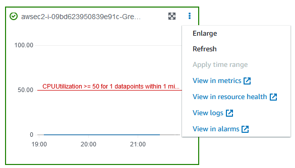
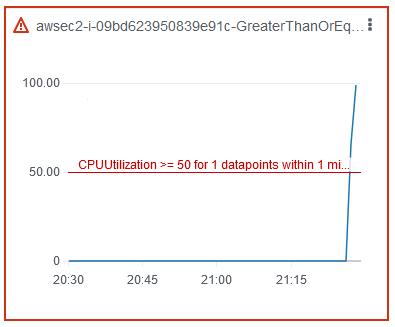

# Tutorial: Run CPU stress on an instance using

AWS FIS

You can use AWS Fault Injection Service (AWS FIS) to test how your applications handle CPU stress. Use this
tutorial to create an experiment template that uses AWS FIS to run a pre-configured SSM
document that runs CPU stress on an instance. The tutorial uses a stop condition to halt the
experiment when the CPU utilization of the instance exceeds a configured threshold.

For more information, see [Pre-configured AWS FIS SSM documents](actions-ssm-agent.md#fis-ssm-docs "actions-ssm-agent.md#fis-ssm-docs").

## Prerequisites

Before you can use AWS FIS to run CPU stress, complete the following
prerequisites.

###### Create an IAM role

Create a role and attach a policy that enables AWS FIS to use the
`aws:ssm:send-command` action on your behalf. For more information,
see [IAM roles for AWS FIS experiments](getting-started-iam-service-role.md "getting-started-iam-service-role.md").

###### Verify access to AWS FIS

Ensure that you have access to AWS FIS. For more information, see [AWS FIS policy
examples](security_iam_id-based-policy-examples.md "security_iam_id-based-policy-examples.md").

###### Prepare a test EC2 instance

- Launch an EC2 instance using Amazon Linux 2 or Ubuntu, as required by the
  pre-configured SSM documents.
- The instance must be managed by SSM. To verify that the instance is managed by
  SSM, open the [Fleet Manager console](https://console.aws.amazon.com/systems-manager/managed-instances "https://console.aws.amazon.com/systems-manager/managed-instances"). If the instance is not managed by SSM,
  verify that the SSM Agent is installed and that the instance has an attached
  IAM role with the **AmazonSSMManagedInstanceCore** policy. To
  verify the installed SSM Agent, connect to your instance and run the following
  command.

**Amazon Linux 2**

```
yum info amazon-ssm-agent
```

**Ubuntu**

```
apt list amazon-ssm-agent
```

- Enable detailed monitoring for the instance. This provides data in 1-minute
  periods, for an additional charge. Select the instance and choose
  **Actions**, **Monitor and troubleshoot**,
  **Manage detailed monitoring**.

## Step 1: Create a CloudWatch alarm for a stop

condition

Configure a CloudWatch alarm so that you can stop the experiment if CPU utilization exceeds
the threshold that you specify. The following procedure sets the threshold to 50% CPU
utilization for the target instance. For more information, see [Stop conditions](stop-conditions.md "stop-conditions.md").

###### To create an alarm that indicates when CPU utilization exceeds a

threshold

1. Open the Amazon EC2 console at
   [https://console.aws.amazon.com/ec2/](https://console.aws.amazon.com/ec2/ "https://console.aws.amazon.com/ec2/").
2. In the navigation pane, choose **Instances**.
3. Select the target instance and choose **Actions**,
   **Monitor and troubleshoot**, **Manage CloudWatch
   alarms**.
4. For **Alarm notification**, use the toggle to turn off Amazon SNS
   notifications.
5. For **Alarm thresholds**, use the following settings:
   - **Group samples by**:
     **Maximum**
   - **Type of data to sample**: **CPU
     utilization**
   - **Percent**: `50`
   - **Period**: `1 Minute`

6. When you're done configuring the alarm, choose
   **Create**.

## Step 2: Create an experiment template

Create the experiment template using the AWS FIS console. In the template,
you specify the following action to run: [aws:ssm:send-command/AWSFIS-Run-CPU-Stress](actions-ssm-agent.md#awsfis-run-cpu-stress "actions-ssm-agent.md#awsfis-run-cpu-stress").

###### To create an experiment template

1. Open the AWS FIS console at [https://console.aws.amazon.com/fis/](https://console.aws.amazon.com/fis/ "https://console.aws.amazon.com/fis/").
2. In the navigation pane, choose **Experiment
   templates**.
3. Choose **Create experiment template**.
4. For **Step 1, Specify template details**, do the following:
   1. For **Description and name**, enter a description for the template.
   2. Choose **Next**, and move to **Step 2, Specify actions and targets**.

5. For **Actions**, do the following:
   1. Choose **Add action**.
   2. Enter a name for the action. For example, enter
      `runCpuStress`.
   3. For **Action type**, choose
      **aws:ssm:send-command/AWSFIS-Run-CPU-Stress**.
      This automatically adds the ARN of the SSM document to
      **Document ARN**.
   4. For **Target** keep the target that AWS FIS creates for
      you.
   5. For **Action parameters**, **Document
      parameters**, enter the following:

   ```
   {"DurationSeconds":"120"}
   ```

   6. For **Action parameters**,
      **Duration**, specify 5 minutes (PT5M).
   7. Choose **Save**.

6. For **Targets**, do the following:
   1. Choose **Edit** for the target that AWS FIS
      automatically created for you in the previous step.
   2. Replace the default name with a more descriptive name. For example,
      enter `testInstance`.
   3. Verify that **Resource type** is
      **aws:ec2:instance**.
   4. For **Target method**, choose **Resource
      IDs**, and then choose the ID of the test instance.
   5. For **Selection mode**, choose
      **All**.
   6. Choose **Save**.

7. Choose **Next** to move to **Step 3, Configure service access**.
8. For **Service Access**, choose **Use an existing
   IAM role**, and then choose the IAM role that you created as
   described in the prerequisites for this tutorial. If your role is not displayed,
   verify that it has the required trust relationship. For more information, see
   [IAM roles for AWS FIS experiments](getting-started-iam-service-role.md "getting-started-iam-service-role.md").
9. Choose **Next** to move to **Step 4, Configure optional settings**.
10. For **Stop conditions**, select the CloudWatch alarm that
    you created in Step 1.
11. (Optional) For **Tags**, choose **Add new
    tag** and specify a tag key and tag value. The tags that you
    add are applied to your experiment template, not the experiments that are
    run using the template.
12. Choose **Next** to move to **Step 5, Review and create**.
13. Review the template and choose **Create experiment template**.
    When prompted for confirmation, enter `create`, Then choose **Create experiment template**.

###### (Optional) To view the experiment template JSON

Choose the **Export** tab. The following is an example of the
JSON created by the preceding console procedure.

```
{
    "description": "Test CPU stress predefined SSM document",
    "targets": {
        "testInstance": {
            "resourceType": "aws:ec2:instance",
            "resourceArns": [
                "arn:aws:ec2:`region`:`123456789012`:instance/`instance_id`"
            ],
            "selectionMode": "ALL"
        }
    },
    "actions": {
        "runCpuStress": {
            "actionId": "aws:ssm:send-command",
            "parameters": {
                "documentArn": "arn:aws:ssm:`region`::document/AWSFIS-Run-CPU-Stress",
                "documentParameters": "{\"DurationSeconds\":\"120\"}",
                "duration": "PT5M"
            },
            "targets": {
                "Instances": "testInstance"
            }
        }
    },
    "stopConditions": [
        {
            "source": "aws:cloudwatch:alarm",
            "value": "arn:aws:cloudwatch:`region`:`123456789012`:alarm:awsec2-`instance_id`-GreaterThanOrEqualToThreshold-CPUUtilization"
        }
    ],
    "roleArn": "arn:aws:iam::`123456789012`:role/`AllowFISSSMActions`",
    "tags": {}
}
```

## Step 3: Start the experiment

When you have finished creating your experiment template, you can use it to start an
experiment.

###### To start an experiment

1. You should be on the details page for the experiment template that you just
   created. Otherwise, choose **Experiment templates** and then
   select the ID of the experiment template to open the details page.
2. Choose **Start experiment**.
3. (Optional) To add a tag to your experiment, choose **Add new
   tag** and enter a tag key and a tag value.
4. Choose **Start experiment**. When prompted for confirmation,
   enter `start`. Choose **Start
   experiment**.

## Step 4: Track the experiment

progress

You can track the progress of a running experiment until the experiment completes,
stops, or fails.

###### To track the progress of an experiment

1. You should be on the details page for the experiment that you just started.
   Otherwise, choose **Experiments** and then select the ID of the
   experiment to open the details page for the experiment.
2. To view the state of the experiment, check **State** in the
   **Details** pane. For more information, see [experiment states](view-experiment-progress.md#experiment-states "view-experiment-progress.md#experiment-states").
3. When the experiment state is **Running**, go to the next
   step.

## Step 5: Verify the experiment

results

You can monitor the CPU utilization of your instance while the experiment is running.
When the CPU utilization reaches the threshold, the alarm is triggered and the
experiment is halted by the stop condition.

###### To verify the results of the experiment

1. Choose the **Stop conditions** tab. The green border and
   green checkmark icon indicate that the initial state of the alarm is
   `OK`. The red line indicates the alarm threshold. If you prefer a
   more detailed graph, choose **Enlarge** from the widget
   menu.

 2. When CPU utilization exceeds the threshold, the red border and red exclamation
point icon in the **Stop conditions** tab indicate that the
alarm state changed to `ALARM`. In the **Details**
pane, the state of the experiment is **Stopped**. If you select
the state, the message displayed is "Experiment halted by stop
condition".

 3. When CPU utilization decreases below the threshold, the green border and green
checkmark icon indicate that the alarm state changed to `OK`. 4. (Optional) Choose **View in alarms** from the widget menu.
This opens the alarm details page in the CloudWatch console, where you can get more
detail about the alarm or edit the alarm settings.

## Step 6: Clean up

If you no longer need the test EC2 instance that you created for this experiment, you
can terminate it.

###### To terminate the instance

1. Open the Amazon EC2 console at
   [https://console.aws.amazon.com/ec2/](https://console.aws.amazon.com/ec2/ "https://console.aws.amazon.com/ec2/").
2. In the navigation pane, choose **Instances**.
3. Select the test instances and choose **Instance state**,
   **Terminate instance**.
4. When prompted for confirmation, choose **Terminate**.

If you no longer need the experiment template, you can delete it.

###### To delete an experiment template using the AWS FIS console

1. Open the AWS FIS console at [https://console.aws.amazon.com/fis/](https://console.aws.amazon.com/fis/ "https://console.aws.amazon.com/fis/").
2. In the navigation pane, choose **Experiment
   templates**.
3. Select the experiment template, and choose **Actions**,
   **Delete experiment template**.
4. When prompted for confirmation, enter `delete` and then
   choose **Delete experiment template**.
