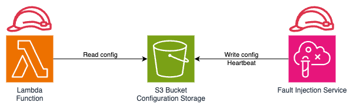
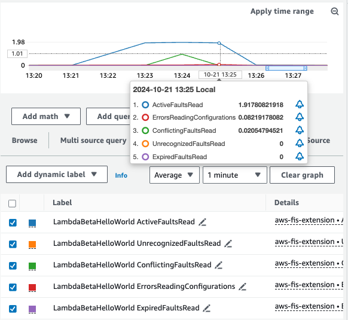
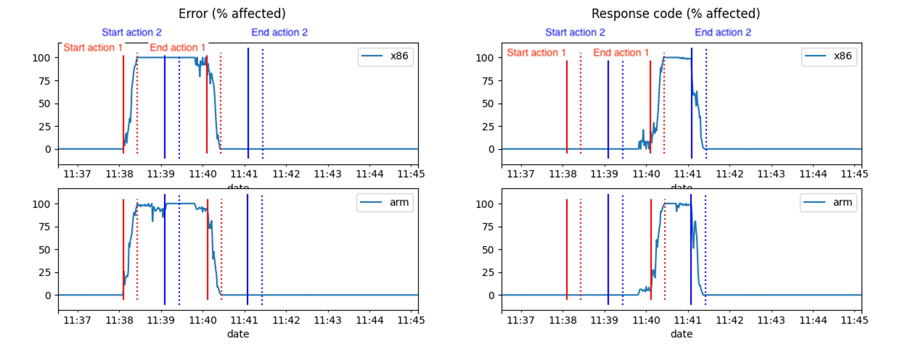
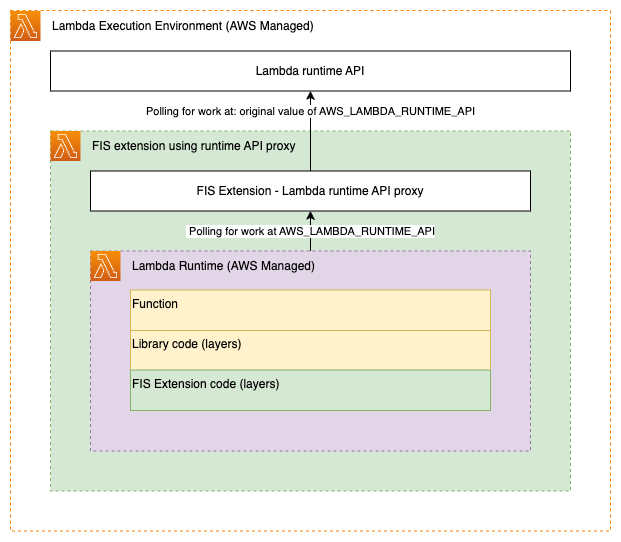
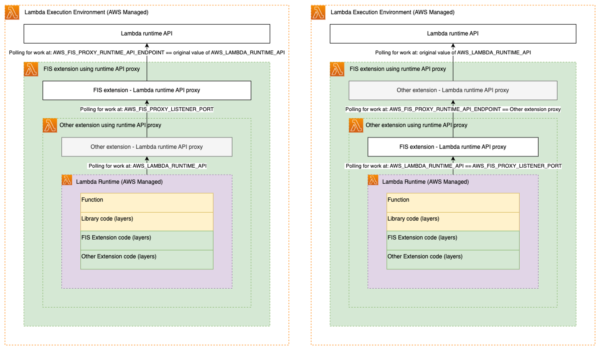

# Use the AWS FIS aws:lambda:function actions

You can use the **aws:lambda:function** actions to inject faults into invocations of your AWS Lambda functions.

These actions use an AWS FIS managed extension to inject faults. To use **aws:lambda:function** actions,
you will need to attach the extension as a layer to your Lambda functions and configure an Amazon S3 bucket to communicate between AWS FIS and the extension.

When you run an AWS FIS experiment targeting **aws:lambda:function**, AWS FIS reads the Amazon S3 configuration from your Lambda
function and writes fault injection information to the specified Amazon S3 location, as shown in the diagram below.



## Actions

- [aws:lambda:invocation-add-delay](fis-actions-reference.md#invocation-add-delay "fis-actions-reference.md#invocation-add-delay")
- [aws:lambda:invocation-error](fis-actions-reference.md#invocation-error "fis-actions-reference.md#invocation-error")
- [aws:lambda:invocation-http-integration-response](fis-actions-reference.md#invocation-http-integration-response "fis-actions-reference.md#invocation-http-integration-response")

## Limitations

- The AWS FIS Lambda extension cannot be used with functions that use response streaming. Even when no faults are applied, the AWS FIS Lambda extension will suppress streaming configurations.
  For more information, see [Response streaming for Lambda functions](../../../lambda/latest/dg/configuration-response-streaming.md "../../../lambda/latest/dg/configuration-response-streaming.md") in the _AWS Lambda user guide_.

## Prerequisites

Before using AWS FIS Lambda actions, ensure that you have completed these one-time tasks:

- **Create an Amazon S3 bucket in the region you plan to start an experiment from** ‐ You can use a single Amazon S3 bucket for multiple experiments and share the bucket between multiple AWS accounts. However, you must have a separate bucket for each AWS Region.
- **Create an IAM policy to grant read access for the Lambda extension to the Amazon S3 bucket** ‐ In the following template, replace
  `my-config-distribution-bucket` with the name of the Amazon S3 bucket you created above and `FisConfigs` with the name of a folder in your Amazon S3 bucket you want to use.

JSON

```
`{
 "Version":"2012-10-17",
 "Statement": [
 {
 "Sid": "AllowListingConfigLocation",
 "Effect": "Allow",
 "Action": ["s3:ListBucket"],
 "Resource": ["arn:aws:s3:::`my-config-distribution-bucket`"],
 "Condition": {
 "StringLike": {
 "s3:prefix": ["`FisConfigs`/*"]
 }
 }
 },
 {
 "Sid": "AllowReadingObjectFromConfigLocation",
 "Effect": "Allow",
 "Action": "s3:GetObject",
 "Resource": ["arn:aws:s3:::`my-config-distribution-bucket/FisConfigs`/*"]
 }
 ]
}`

```

- **Create an IAM policy to grant write access for the AWS FIS experiment to the Amazon S3 bucket** ‐ In the following template, replace
  `my-config-distribution-bucket` with the name of the Amazon S3 bucket you created above and `FisConfigs` with the name of a folder in your Amazon S3 bucket you want to use.

JSON

```
`{
 "Version":"2012-10-17",
 "Statement": [
 {
 "Sid": "AllowFisToWriteAndDeleteFaultConfigurations",
 "Effect": "Allow",
 "Action": [
 "s3:PutObject",
 "s3:DeleteObject"
 ],
 "Resource": "arn:aws:s3:::`my-config-distribution-bucket/FisConfigs/*`"
 },
 {
 "Sid": "AllowFisToInspectLambdaFunctions",
 "Effect": "Allow",
 "Action": [
 "lambda:GetFunction"
 ],
 "Resource": "*"
 },
 {
 "Sid": "AllowFisToDoTagLookups",
 "Effect": "Allow",
 "Action": [
 "tag:GetResources"
 ],
 "Resource": "*"
 }
 ]
}`

```

## Configure Lambda functions

Follow the steps below for every Lambda function that you want to impact:

1. Attach the Amazon S3 read access policy created above to the Lambda function.
2. Attach the AWS FIS extension as a layer to the function. For more information on the layer ARNs, see [Available versions of the AWS FIS extension for Lambda](actions-lambda-extension-arns.md "actions-lambda-extension-arns.md").
3. Set the `AWS_FIS_CONFIGURATION_LOCATION` variable to the ARN of the Amazon S3 configuration folder,
   for example `arn:aws:s3:::my-config-distribution-bucket/FisConfigs/`.
4. Set the `AWS_LAMBDA_EXEC_WRAPPER` variable to `/opt/aws-fis/bootstrap`.

## Configure an AWS FIS experiment

Before running your experiment, ensure that you have attached the Amazon S3 write access policy that you created in the prerequisites to the experiment roles
that will use AWS FIS Lambda actions. For more information on how to set up an AWS FIS experiment, see [Managing AWS FIS experiment templates](experiments.md "experiments.md").

## Logging

The AWS FIS Lambda extension writes logs to the console and CloudWatch logs. Logging can be configured using the `AWS_FIS_LOG_LEVEL` variable.
Supported values are `INFO`, `WARN`, and `ERROR`. Logs will be written in the log format configured for your Lambda function.

The following is an example of a log in text format:

```
2024-08-09T18:51:38.599984Z INFO AWS FIS EXTENSION - extension enabled 1.0.1
```

The following is an example of a log in JSON format:

```

{
  "timestamp": "2024-10-08T17:15:36.953905Z",
  "level": "INFO",
  "fields": {
    "message": "AWS FIS EXTENSION - adding 5000 milliseconds of latency to function invocation",
    "requestId":"0608bf70-908f-4a17-bbfe-3782cd783d8b"
  }
}
```

The emitted logs can be used with Amazon CloudWatch metric filters to generate custom metrics. For more information on metric filters, see
[Creating metrics from log events using filters](../../../AmazonCloudWatch/latest/logs/MonitoringLogData.md "../../../AmazonCloudWatch/latest/logs/MonitoringLogData.md") in the _Amazon CloudWatch Logs user guide_.

### Using CloudWatch Embedded Metric Format (EMF)

You can configure the AWS FIS Lambda extension to emit EMF logs by setting the `AWS_FIS_EXTENSION_METRICS` variable to `all`.
By default, the extension does not emit EMF logs, and `AWS_FIS_EXTENSION_METRICS` defaults to `none`.
EMF logs are published in the `aws-fis-extension namespace` on the CloudWatch console.

Within the `aws-fis-extension` namespace, you can select certain metrics to be displayed in a graph. The example below shows some of the available metrics in the `aws-fis-extension` namespace.



## Advanced topics

This section provides additional information on how AWS FIS works with the Lambda extension and special use cases.

###### Topics

- [Understanding polling](#understanding-polling "#understanding-polling")
- [Understanding concurrency](#understanding-concurrency "#understanding-concurrency")
- [Understanding invocation percentage](#understanding-invocation-percentage "#understanding-invocation-percentage")
- [Special considerations for SnapStart](#considerations-for-snapshot "#considerations-for-snapshot")
- [Special considerations for fast infrequent functions](#considerations-for-fast-infrequent-functions "#considerations-for-fast-infrequent-functions")
- [Configuring multiple extensions using Lambda Runtime API proxy](#configuring-multiple-extensions "#configuring-multiple-extensions")
- [Using AWS FIS with container runtimes](#container-runtimes "#container-runtimes")
- [AWS FIS Lambda environment variables](#fis-extension-environment-variables "#fis-extension-environment-variables")

### Understanding polling

You may notice a ramp-up period of up to 60s before faults begin to affect all invocations.
This is because the Lambda extension polls for configuration information infrequently while waiting for an experiment to start.
You can adjust the polling interval by setting the `AWS_FIS_SLOW_POLL_INTERVAL_SECONDS` environment variable (default 60s).
A lower value will poll more often but incur greater performance impact and cost.
You may also notice a ramp-down period of up to 20s after the fault has been injected.
This is because the extension polls more frequently while experiments are running.

### Understanding concurrency

You may target the same Lambda functions with multiple actions concurrently.
If the actions are all different from each other, then all actions will be applied. For example, you can add an initial delay before returning an error.
If two identical or conflicting actions are applied to the same function, then only the action with the earliest start date will be applied.

The figure below shows two conflicting actions, **aws:lambda:invocation-error** and **aws:lambda:invocation-http-integration-response**, overlapping.
Initially, **aws:lambda:invocation-error** ramps up at 11:38 and runs for 2 minutes.
Then, **aws:lambda:invocation-http-integration-response** attempts to start at 11:39, but does not come into effect until 11:40 after the first action has concluded.
To maintain experiment timing, **aws:lambda:invocation-http-integration-response** still finishes at the originally intended time of 11:41.



### Understanding invocation percentage

The AWS Fault Injection Service Lambda actions use an **aws:lambda:function** target which allows you to select one or more AWS Lambda function ARNs.
Using these ARNs, the AWS Fault Injection Service Lambda actions can inject faults in every invocation of the selected Lambda function.
To allow you to inject faults into only a fraction of invocations, each action allows you to specify an `invocationPercentage`
parameter with values from 0 to 100. Using the `invocationPercentage` parameter, you can ensure that actions are concurrent even for invocation percentages below 100%.

### Special considerations for SnapStart

AWS Lambda functions with SnapStart enabled will have a higher likelihood of waiting the full duration of
`AWS_FIS_SLOW_POLL_INTERVAL_SECONDS` before picking up the first fault configuration, even if an experiment is already running.
This is because Lambda SnapStart uses a single snapshot as the initial state for multiple execution environments and persists temporary storage.
For the AWS Fault Injection Service Lambda extension it will persist polling frequency and skip the initial configuration check on initialization of the execution environment.
For more information on Lambda SnapStart, see
[Improving startup performance with Lambda SnapStart](../../../lambda/latest/dg/snapstart.md "../../../lambda/latest/dg/snapstart.md") in the _AWS Lambda user guide._

### Special considerations for fast infrequent functions

If your Lambda function runs for less than the average poll duration of 70 milliseconds then the polling thread may need multiple invocations to
obtain fault configurations. If the function runs infrequently, for example once every 15 minutes, then the poll will never be completed.
To ensure the polling thread can finish, set the `AWS_FIS_POLL_MAX_WAIT_MILLISECONDS` parameter.
The extension will wait up to the duration that you set for an in-flight poll to finish before starting the function.
Note that this will increase the billed function duration and lead to an additional delay on some invocations.

### Configuring multiple extensions using Lambda Runtime API proxy

The Lambda extension uses the AWS Lambda Runtime API proxy to intercept function invocations before they reach the runtime.
It does this by exposing a proxy for the AWS Lambda Runtime API to the runtime and advertising its location in the `AWS_LAMBDA_RUNTIME_API` variable.

The following diagram shows the configuration for a single extension using the Lambda Runtime API proxy:



To use the AWS FIS Lambda extension with another extension using the AWS Lambda Runtime API proxy pattern,
you will need to chain the proxies using a custom bootstrap script. The AWS FIS Lambda extension accepts the following environment variables:

- `AWS_FIS_PROXY_RUNTIME_API_ENDPOINT` ‐ Takes a string in the form `127.0.0.1:9876` representing the local IP and
  listener port for the AWS Lambda Runtime API. This could be the original value of `AWS_LAMBDA_RUNTIME_API` or the location of another proxy.
- `AWS_FIS_PROXY_LISTENER_PORT` ‐ Takes a port number on which the AWS FIS extension should start its own proxy, by default `9100`.

With these settings you can chain the AWS FIS extension with another extension using the Lambda Runtime API proxy in two different orders.



For more information on the AWS Lambda Runtime API proxy, see
[Enhancing runtime security and governance with the AWS Lambda Runtime API proxy extension](https://aws.amazon.com/blogs/compute/enhancing-runtime-security-and-governance-with-the-aws-lambda-runtime-api-proxy-extension/ "https://aws.amazon.com/blogs/compute/enhancing-runtime-security-and-governance-with-the-aws-lambda-runtime-api-proxy-extension/") and
[Using the Lambda runtime API for custom runtimes](../../../lambda/latest/dg/runtimes-api.md "../../../lambda/latest/dg/runtimes-api.md") in the _AWS Lambda user guide_.

### Using AWS FIS with container runtimes

For AWS Lambda functions using container images that accept the `AWS_LAMBDA_RUNTIME_API` environment variable,
you can package the AWS FIS Lambda extension into your container image by following the steps below:

1. Determine the ARN of the layer from which to extract the extension. For more information on how to find the ARN, see [Configure Lambda functions](#configure-lambda-functions "#configure-lambda-functions").
2. Use the AWS Command Line Interface (CLI) to request details about the extension
   `aws lambda get-layer-version-by-arn --arn fis-extension-arn`.
   The response will contain a `Location` field containing a pre-signed URL from which you can download the FIS extension as a ZIP file.
3. Unzip the content of the extension into `/opt` of your Docker filesystem.
   The following is an example Dockerfile based on the NodeJS Lambda runtime:

```
# extension installation #
FROM amazon/aws-lambda-nodejs:12 AS builder
COPY extension.zip extension.zip
RUN yum install -y unzip
RUN mkdir -p /opt
RUN unzip extension.zip -d /opt
RUN rm -f extension.zip
FROM amazon/aws-lambda-nodejs:12
WORKDIR /opt
COPY --from=builder /opt .
# extension installation finished #
# JS example. Modify as required by your runtime
WORKDIR ${LAMBDA_TASK_ROOT}
COPY index.js package.json .
RUN npm install
CMD [ "index.handler" ]

```

For more information on container images, see
[Create a Lambda function using a container image](../../../lambda/latest/dg/images-create.md "../../../lambda/latest/dg/images-create.md") in the _AWS Lambda user guide_.

### AWS FIS Lambda environment variables

The following is a list of environment variables for the AWS FIS Lambda extension

- `AWS_FIS_CONFIGURATION_LOCATION` ‐ Required. Location where AWS FIS will write active fault configurations and the extension will read fault configurations.
  The locations should be in Amazon S3 ARN format including a bucket and path. For example, `arn:aws:s3:::my-fis-config-bucket/FisConfigs/`.
- `AWS_LAMBDA_EXEC_WRAPPER` ‐ Required. Location of the AWS Lambda [wrapper script](../../../lambda/latest/dg/runtimes-modify.md#runtime-wrapper "../../../lambda/latest/dg/runtimes-modify.md#runtime-wrapper") used to configure the AWS FIS Lambda extension.
  This should be set to the `/opt/aws-fis/bootstrap` script that is included with the extension.
- `AWS_FIS_LOG_LEVEL` ‐ Optional. Log level for messages emitted by AWS FIS Lambda extension.
  Supported values are `INFO`, `WARN`, and `ERROR`. If not set, AWS FIS extension will default to `INFO`.
- `AWS_FIS_EXTENSION_METRICS` ‐ Optional. Possible values are `all` and `none`.
  If set to `all` the extension will emit EMF metrics under the `aws-fis-extension namespace`.
- `AWS_FIS_SLOW_POLL_INTERVAL_SECONDS` ‐ Optional. If set will override the polling interval (in seconds) while the extension is not injecting faults and waiting for a fault configuration
  to be added to configuration location. Defaults to `60`.
- `AWS_FIS_PROXY_RUNTIME_API_ENDPOINT` ‐ Optional. If set will override the value of `AWS_LAMBDA_RUNTIME_API` to define where the AWS FIS extension interacts with the
  AWS Lambda runtime API to control function invocation. Expects IP:PORT, for example, `127.0.0.1:9000`.
  For more information on `AWS_LAMBDA_RUNTIME_API`, see
  [Using the Lambda runtime API for custom runtimes](../../../lambda/latest/dg/runtimes-api.md "../../../lambda/latest/dg/runtimes-api.md") in the _AWS Lambda user guide._
- `AWS_FIS_PROXY_LISTENER_PORT` ‐ Optional.
  Defines the port on which the AWS FIS Lambda extension exposes an AWS Lambda runtime API proxy that can be used by another extension or the runtime. Defaults to `9100`.
- `AWS_FIS_POLL_MAX_WAIT_MILLISECONDS` ‐ Optional.
  If set to non-zero value, this variable defines the number of milliseconds the extension will wait for an in-flight async poll to finish before evaluating
  fault configurations and starting the invocation of the runtime. Defaults to `0`.
