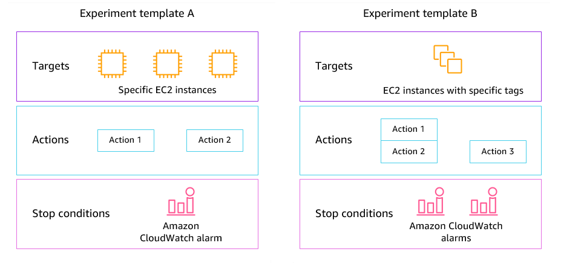

# What is AWS Fault Injection Service?

AWS Fault Injection Service (AWS FIS) is a managed service that enables you to perform fault injection
experiments on your AWS workloads. Fault injection is based on the principles of
chaos engineering. These experiments stress an application by creating disruptive events
so that you can observe how your application responds. You can then use this information
to improve the performance and resiliency of your applications so that they behave as
expected.

To use AWS FIS, you set up and run experiments that help you create the real-world
conditions needed to uncover application issues that can be difficult to find otherwise.
AWS FIS provides templates that generate disruptions, and the controls and guardrails that
you need to run experiments in production, such as automatically rolling back or stopping
the experiment if specific conditions are met.

###### Important

AWS FIS carries out real actions on real AWS resources in your system. Therefore,
before you use AWS FIS to run experiments in production, we strongly recommend that you
complete a planning phase and run the experiments in a pre-production environment.

For more information about planning your experiment, see [Test Reliability](../../../wellarchitected/latest/reliability-pillar/test-reliability.md "../../../wellarchitected/latest/reliability-pillar/test-reliability.md") and [Planning your AWS FIS experiments](getting-started-planning.md "getting-started-planning.md"). For more information about AWS FIS, see [AWS Fault Injection Service](https://aws.amazon.com/fis/ "https://aws.amazon.com/fis/").

## AWS FIS concepts

To use AWS FIS, you run _experiments_ on your AWS resources to test
your theory of how an application or system will perform under fault conditions. To run
experiments, you first create an _experiment template_. An experiment
template is the blueprint of your experiment. It contains the
_actions_, _targets_, and _stop
conditions_ for the experiment. After you create an experiment template,
you can use it to run an experiment. While your experiment is running, you can track its
progress and view its status. An experiment is complete when all of the actions in the
experiment have run.

### Actions

An _action_ is an activity that AWS FIS performs on an AWS
resource during an experiment. AWS FIS provides a set of preconfigured actions
based on the type of AWS resource. Each action runs for a specified duration
during an experiment, or until you stop the experiment. Actions can run
sequentially or simultaneously (in parallel).

### Targets

A _target_ is one or more AWS resources on which AWS FIS
performs an action during an experiment. You can choose specific resources, or you
can select a group of resources based on specific criteria, such as tags or
state.

### Stop conditions

AWS FIS provides the controls and guardrails that you need to run experiments
safely on your AWS workloads. A _stop condition_ is a mechanism
to stop an experiment if it reaches a threshold that you define as an Amazon CloudWatch alarm.
If a stop condition is triggered while the experiment is running, AWS FIS stops the
experiment.

## Supported AWS services

AWS FIS provides preconfigured actions for specific types of targets across AWS
services. For the list of supported services and their actions, see [AWS FIS Actions reference](fis-actions-reference.md "fis-actions-reference.md").

For single-account experiments, the target resources must be in the same AWS account as the experiment.
You can run AWS FIS experiments that target resources in a different AWS account account using AWS FIS multi-account experiments.

For more information, see [Actions for AWS FIS](action-sequence.md "action-sequence.md").

## Access AWS FIS

You can work with AWS FIS in any of the following ways:

- AWS Management Console — Provides a web interface
  that you can use to access AWS FIS. For more information, see [Working with the AWS Management Console](../../../awsconsolehelpdocs/latest/gsg/getting-started.md "../../../awsconsolehelpdocs/latest/gsg/getting-started.md").
- AWS Command Line Interface (AWS CLI) — Provides
  commands for a broad set of AWS services, including AWS FIS, and is supported on
  Windows, macOS, and Linux. For more information, see [AWS Command Line Interface](https://aws.amazon.com/cli/ "https://aws.amazon.com/cli/"). For more information about
  the commands for AWS FIS, see [fis](../../../cli/latest/reference/fis.md "../../../cli/latest/reference/fis.md") in the
  _AWS CLI Command Reference_.
- AWS CloudFormation — Create templates that describe
  your AWS resources. You use the templates to provision and manage these resources
  as a single unit. For more information, see the [AWS Fault Injection Service resource type reference](../../../AWSCloudFormation/latest/UserGuide/AWS_FIS.md "../../../AWSCloudFormation/latest/UserGuide/AWS_FIS.md").
- AWS SDKs — Provides language-specific
  APIs and takes care of many of the connection details, such as calculating
  signatures, handling request retries, and handling errors. For more information,
  see [AWS SDKs](http://aws.amazon.com/tools/#SDKs "http://aws.amazon.com/tools/#SDKs").
- HTTPS API — Provides low-level API
  actions that you can call using HTTPS requests. For more information, see the
  [AWS Fault Injection Service API
  Reference](../APIReference.md "../APIReference.md").

## Pricing for AWS FIS

You are charged per minute that an action runs, from start to finish, based on the number of target accounts for your experiment.
For more information, see [AWS FIS Pricing](https://aws.amazon.com/fis/pricing/ "https://aws.amazon.com/fis/pricing/").
