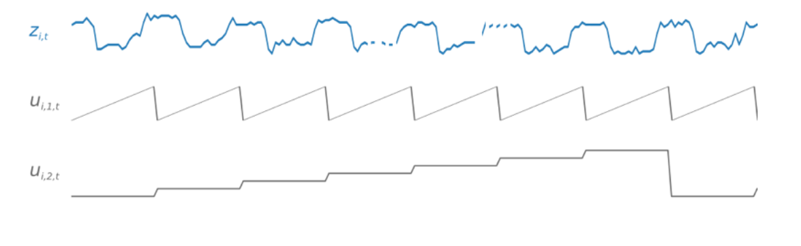
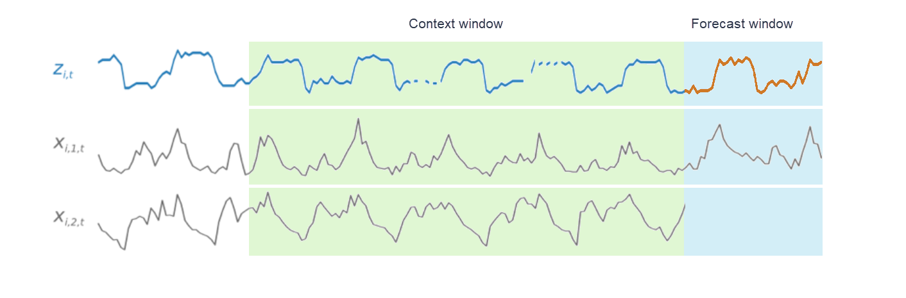

Amazon Forecast is no longer available to new customers. Existing customers of
Amazon Forecast can continue to use the service as normal.
[Learn more"](https://aws.amazon.com/blogs/machine-learning/transition-your-amazon-forecast-usage-to-amazon-sagemaker-canvas/ "https://aws.amazon.com/blogs/machine-learning/transition-your-amazon-forecast-usage-to-amazon-sagemaker-canvas/")

# CNN-QR Algorithm

Amazon Forecast CNN-QR, Convolutional Neural Network - Quantile Regression, is a
proprietary machine learning algorithm for forecasting scalar (one-dimensional) time series
using causal convolutional neural networks (CNNs). This supervised learning algorithm trains
one global model from a large collection of time series and uses a quantile decoder to make
probabilistic predictions.

###### Topics

- [Getting Started with CNN-QR](#aws-forecast-algo-cnnqr-getting-started "#aws-forecast-algo-cnnqr-getting-started")
- [How CNN-QR Works](#aws-forecast-algo-cnnqr-how-it-works "#aws-forecast-algo-cnnqr-how-it-works")
- [Using Related Data with CNN-QR](#aws-forecast-algo-cnnqr-using-rts "#aws-forecast-algo-cnnqr-using-rts")
- [CNN-QR Hyperparameters](#aws-forecast-algo-cnnqr-hyperparameters "#aws-forecast-algo-cnnqr-hyperparameters")
- [Tips and Best Practices](#aws-forecast-algo-cnnqr-tips "#aws-forecast-algo-cnnqr-tips")

## Getting Started with CNN-QR

You can train a predictor with CNN-QR in two ways:

1. Manually selecting the CNN-QR algorithm.
2. Choosing AutoML (CNN-QR is part of AutoML).

If you are unsure of which algorithm to use, we recommend selecting AutoML, and
Forecast will select CNN-QR if it is the most accurate algorithm for your data. To see
if CNN-QR was selected as the most accurate model, either use the [DescribePredictor](API_DescribePredictor.md "API_DescribePredictor.md") API or choose the predictor name in the console.

Here are some key use cases for CNN-QR:

- **Forecast with large and complex datasets** -
  CNN-QR works best when trained with large and complex datasets. The neural
  network can learn across many datasets, which is useful when you have related
  time series and item metadata.
- **Forecast with historical related time series** -
  CNN-QR does not require related time series to contain data points within the
  forecast horizon. This added flexibility allows you to include a broader range
  of related time series and item meta data, such as item price, events, web
  metrics, and product categories.

## How CNN-QR Works

CNN-QR is a sequence-to-sequence (Seq2Seq) model for probabilistic forecasting that
tests how well a prediction reconstructs the decoding sequence, conditioned on the
encoding sequence.

The algorithm allows for different features in the encoding and the decoding
sequences, so you can use a related time series in the encoder, and omit it from the
decoder (and vice versa). By default, related time series with data points in the
forecast horizon will be included in both the encoder and decoder. Related time series
without data points in the forecast horizon will only be included in the encoder.

CNN-QR performs quantile regression with a hierarchical causal CNN serving as a
learnable feature extractor.

To facilitate learning time-dependent patterns, such as spikes during weekends, CNN-QR
automatically creates feature time series based on time-series granularity. For example,
CNN-QR creates two feature time series (day-of-month and day-of-year) at a weekly
time-series frequency. The algorithm uses these derived feature time series along with
the custom feature time series provided during training and inference. The following
example shows a target time series, `zi,t`, and two
derived time-series features: `ui,1,t` represents the
hour of the day, and `ui,2,t` represents the day of
the week.

CNN-QR automatically includes these feature time series based on the data frequency
and the size of training data. The following table lists the features that can be
derived for each supported basic time frequency.

| Frequency of the Time Series | Derived Features                                                    |
| ---------------------------- | ------------------------------------------------------------------- |
| Minute                       | minute-of-hour, hour-of-day, day-of-week, day-of-month, day-of-year |
| Hour                         | hour-of-day, day-of-week, day-of-month, day-of-year                 |
| Day                          | day-of-week, day-of-month, day-of-year                              |
| Week                         | week-of-month, week-of-year                                         |
| Month                        | month-of-year                                                       |

During training, each time series in the training dataset consists of a pair of
adjacent context and forecast windows with fixed predefined lengths. This is shown in
the figure below, where the context window is represented in green, and the forecast
window is represented in blue.

You can use a model trained on a given training set to generate predictions for time
series in the training set, and for other time series. The training dataset consists of
a target time series, which may be associated with a list of related time series and
item metadata.

The figure below shows how this works for an element of a training dataset indexed by
`i`. The training dataset consists of a target time series,
`zi,t`, and two
associated related time series, `xi,1,t` and
`xi,2,t`. The first related time series,
`xi,1,t`, is a forward-looking time series,
and the second, `xi,2,t`, is a historical time series.

CNN-QR learns across the target time series, `zi,t`,
and the related time series, `xi,1,t` and
`xi,2,t`, to generate predictions in the
forecast window, represented by the orange line.

## Using Related Data with CNN-QR

CNNQR supports both historical and forward looking related time series datasets.
If you provide a forward looking related time series dataset, any missing value will be filled using the [future filling method](howitworks-missing-values.md "howitworks-missing-values.md").
For more information on historical and forward-looking related time series, see [Using Related Time Series Datasets](related-time-series-datasets.md "related-time-series-datasets.md").

You can also use item metadata datasets with CNN-QR. These are datasets with static
information on the items in your target time series. Item metadata is especially useful
for coldstart forecasting scenarios where there is little to no historical data. For
more information on item metadata, see [Item Metadata.](item-metadata-datasets.md "item-metadata-datasets.md")

## CNN-QR Hyperparameters

Amazon Forecast optimizes CNN-QR models on selected hyperparameters. When manually selecting
CNN-QR, you have the option to pass in training parameters for these hyperparameters. The
following table lists the tunable hyperparameters of the CNN-QR algorithm.

| Parameter Name      | Values                                                                                                                                                            | Description                                                                                                                                                                                                                                                                                                                                                                                                                                                                                                                                                                                                                                                                                      |
| ------------------- | ----------------------------------------------------------------------------------------------------------------------------------------------------------------- | ------------------------------------------------------------------------------------------------------------------------------------------------------------------------------------------------------------------------------------------------------------------------------------------------------------------------------------------------------------------------------------------------------------------------------------------------------------------------------------------------------------------------------------------------------------------------------------------------------------------------------------------------------------------------------------------------ |
| `context_length`    | Valid values Positive Integers Valid range 10 to 500 Typical values 2 \ • `ForecastHorizon` to 12 \* `ForecastHorizon` HPO tunable Yes | The number of time points that the model reads before making predictions. Typically, CNN-QR has larger values for `context_length` than DeepAR+ because CNN-QR does not use lags to look at further historical data. If the value for `context_length` is outside of a predefined range, CNN-QR will automatically set the default `context_length` to an appropriate value.                                                                                                                                                                                                                                                                                                   |
| `use_related_data`  | Valid values `ALL` `NONE` `HISTORICAL` `FORWARD_LOOKING` Default value `ALL` HPO tunable Yes                                              | Determines which kinds of related time series data to include in the model. Choose one of four options: • `ALL`: Include all provided related time series. • `NONE`: Exclude all provided related time series. • `HISTORICAL`: Include only related time series that *do not • extend into the forecast horizon. • `FORWARD_LOOKING`: Include only related time series that *do • extend into the forecast horizon. `HISTORICAL` includes all historical related time series, and `FORWARD_LOOKING` includes all forward-looking related time series. You cannot choose a subset of `HISTORICAL` or `FORWARD_LOOKING` related time series. |
| `use_item_metadata` | Valid values `ALL` `NONE` Default value `ALL` HPO tunable Yes                                                                                   | Determines whether the model includes item metadata. Choose one of two options: • `ALL`: Include all provided item metadata. • `NONE`: Exlude all provided item metadata. `use_item_metadata` includes either all provided item metadata or none. You cannot choose a subset of item metadata.                                                                                                                                                                                                                                                                                                                                                                                    |
| `epochs`            | Valid values Positive Integers Typical values 10 to 1000 Default value 100 HPO tunable No                                                    | The maximum number of complete passes through the training data. Smaller datasets require more epochs. For large values of `ForecastHorizon` and `context_length`, consider decreasing epochs to improve the training time.                                                                                                                                                                                                                                                                                                                                                                                                                                                          |

### Hyperparameter Optimization (HPO)

Hyperparameter optimization (HPO) is the task of selecting the optimal hyperparameter
values for a specific learning objective. With Forecast, you can automate this process
in two ways:

1. Choosing AutoML, and HPO will automatically run for CNN-QR.
2. Manually selecting CNN-QR and setting `PerformHPO = TRUE`.

Additional related time series and item metadata does not always improve the accuracy
of your CNN-QR model. When you run AutoML or enable HPO, CNN-QR tests the accuracy
of your model with and without the provided related time series and item metadata,
and selects the model with the highest accuracy.

Amazon Forecast automatically optimizes the following three hyperparameters during HPO
and provides you with the final trained values:

- **context_length** - determines how far into the past
  the network can see. The HPO process automatically sets a value for
  `context_length` that maximizes model accuracy, while taking training
  time into account.
- **use_related_data** - determines which forms of
  related time series data to include in your model. The HPO process
  automatically checks whether your related time series data improves the
  model, and selects the optimal setting.
- **use_item_metadata** - determines whether to include
  item metadata in your model. The HPO process automatically checks whether your item
  metadata improves the model, and chooses the optimal setting.

###### Note

If `use_related_data` is set to `NONE` or
`HISTORICAL` when the `Holiday` supplementary feature
is selected, this means that including holiday data does not improve model
accuracy.

You can set the HPO configuration for the `context_length` hyperparameter
if you set `PerformHPO = TRUE` during manual selection. However, you
cannot alter any aspect of the HPO configuration if you choose AutoML. For more
information on HPO configuration, refer to the [IntergerParameterRange](API_IntegerParameterRange.md "API_IntegerParameterRange.md") API.

## Tips and Best Practices

**Avoid large values for ForecastHorizon** -
Using values over 100 for the `ForecastHorizon` will increase training time and
can reduce model accuracy. If you want to forecast further into the future,
consider aggregating to a higher frequency. For example, use `5min` instead of
`1min`.

**CNNs allow for a higher context length** - With CNN-QR,
you can set the `context_length` slightly higher than that for DeepAR+, as
CNNs are generally more efficient than RNNs.

**Feature engineering of related data** - Experiment with
different combinations of related time series and item metadata when training your
model, and assess whether the additional information improves accuracy. Different
combinations and transformations of related time series and item metadata will deliver
different results.

**CNN-QR does not forecast at the mean quantile** – When
you set `ForecastTypes` to `mean` with the [CreateForecast](API_CreateForecast.md "API_CreateForecast.md") API, forecasts will instead be generated at the median
quantile (`0.5` or `P50`).
