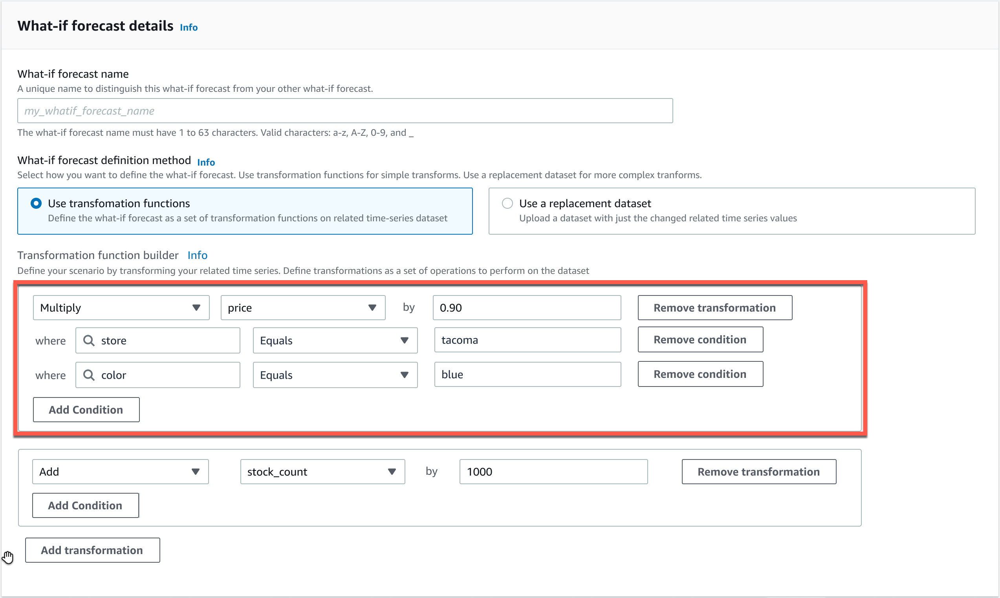

Amazon Forecast is no longer available to new customers. Existing customers of
Amazon Forecast can continue to use the service as normal.
[Learn more"](https://aws.amazon.com/blogs/machine-learning/transition-your-amazon-forecast-usage-to-amazon-sagemaker-canvas/ "https://aws.amazon.com/blogs/machine-learning/transition-your-amazon-forecast-usage-to-amazon-sagemaker-canvas/")

# Transformation Functions

A transformation function is a set of operations that select and modify the rows in a related time series. You
select the rows that you want with a condition operation. You then modify the rows with a transformation
operation. All conditions are joined with an AND operation, meaning that all conditions must be true for the
transformation to be applied. Transformations are applied in the order that they are listed.

When you create a what-if forecast, use the **Transformation function
builder** to specify the conditions and transformations that you want to apply. The
image below illustrates this functionality.


In the highlighted section, the `price` column is multiplied by 0.90 (i.e., a
10% discount) at the store in `tacoma` (i.e., Tacoma, Washington) for items that
are colored `blue`. To do this, Amazon Forecast first creates a subset of the baseline
related time series to contain only the rows of `store` that equal
`tacoma`.

That subset is further pared down to include only the rows of `color` that equal `blue`.
Finally, all values in the `price` column are multiplied by 0.90 to create a new related time series to
use in the what-if forecast.

Amazon Forecast supports the following conditions:

- `EQUALS` - The value in the column is the same as the value that was provided in the condition.
- `NOT_EQUALS` - The value in the column isn't the same as the value that was provided in the condition.
- `LESS_THAN` - The value in the column is less than the value that was provided in the condition.
- `GREATER_THAN` - The value in the column is greater than the value that was provided in the condition.
  Amazon Forecast supports the following actions:

- `ADD` - Adds the provided value to all rows in the column.
- `SUBTRACT` - Subtracts the provided value from all rows in the column.
- `MULTIPLY` - Multiplies all rows in the column by the value provided.
- `DIVIDE` - Divides all rows in the column by the value provided.
  What follows are examples of how you can specify a time series transformation using the SDK.

Example 1
This example applies a 10% discount to all items in Seattle store. Note that "City"
is a forecast dimension.

```
TimeSeriesTransformations=[
  {
    "Action": {
      "AttributeName": "price",
      "Operation": "MULTIPLY",
      "Value": 0.90
      },
    "TimeSeriesConditions": [
      {
        "AttributeName": "city",
        "AttributeValue": "seattle",
        "Condition": "EQUALS"
      }
    ]
  }
]

```

Example 2
This example applies a 10% discount on all items in the "electronics" category. Note
that "product_category" is an item metadata.

```
TimeSeriesTransformations=[
  {
    "Action": {
      "AttributeName": "price",
      "Operation": "MULTIPLY",
      "Value": 0.90
      },
    "TimeSeriesConditions": [
      {
        "AttributeName": "product_category",
        "AttributeValue": "electronics",
        "Condition": "EQUALS"
      }
    ]
  }
]

```

Example 3
This example applies a 20% markup on the specific item_id BOA21314K.

```
TimeSeriesTransformations=[
  {
    "Action": {
      "AttributeName": "price",
      "Operation": "MULTIPLY",
      "Value": 1.20
      },
    "TimeSeriesConditions": [
      {
        "AttributeName": "item_id",
        "AttributeValue": "BOA21314K",
        "Condition": "EQUALS"
      }
    ]
  }
]

```

Example 4
This example adds $1 to all items in the Seattle and Bellevue stores.

```
TimeSeriesTransformations=[
  {
    "Action": {
      "AttributeName": "price",
      "Operation": "ADD",
      "Value": 1.0
      },
    "TimeSeriesConditions": [
      {
        "AttributeName": "city",
        "AttributeValue": "seattle",
        "Condition": "EQUALS"
      }
    ]
  },
  {
    "Action": {
      "AttributeName": "price",
      "Operation": "ADD",
      "Value": 1.0
      },
    "TimeSeriesConditions": [
      {
        "AttributeName": "city",
        "AttributeValue": "bellevue",
        "Condition": "EQUALS"
      }
    ]
  }
]

```

Example 5
This example subtracts $1 from all items in Seattle in the month of September, 2022.

```
TimeSeriesTransformations=[
  {
    "Action": {
      "AttributeName": "price",
      "Operation": "SUBTRACT",
      "Value": 1.0
      },
    "TimeSeriesConditions": [
      {
        "AttributeName": "city",
        "AttributeValue": "seattle",
        "Condition": "EQUALS"
      },
      {
        "AttributeName": "timestamp",
        "AttributeValue": "2022-08-31 00:00:00",
        "Condition": "GREATER_THAN"
      },
      {
        "AttributeName": "timestamp",
        "AttributeValue": "2022-10-01 00:00:00",
        "Condition": "LESS_THAN"
      }
    ]
  }
]

```

Example 6
In this example, the price is first multiplied by 10, then $5 is subtracted from the
price. Note that actions are applied in the order that they are declared.

```
TimeSeriesTransformations=[
  {
    "Action": {
      "AttributeName": "price",
      "Operation": "MULTIPLY",
      "Value": 10.0
      },
    "TimeSeriesConditions": [
      {
        "AttributeName": "city",
        "AttributeValue": "seattle",
        "Condition": "EQUALS"
      }
    ]
    },
    {
    "Action": {
      "AttributeName": "price",
      "Operation": "SUBTRACT",
      "Value": 5.0
      },
    "TimeSeriesConditions": [
      {
        "AttributeName": "city",
        "AttributeValue": "seattle",
        "Condition": "EQUALS"
      }
    ]
   }
]

```

Example 7
This example creates an empty set, so the action is not applied to any time series.
This code tries to modify the price of all items at the stores in Seattle and Bellevue.
Because conditions are joined with the AND operation, and a store can exist in only one
city, the results are an empty set. Therefore, the action is not applied.

```
TimeSeriesTransformations=[
  {
    "Action": {
      "AttributeName": "price",
      "Operation": "MULTIPLY",
      "Value": 10.0
      },
    "TimeSeriesConditions": [
      {
        "AttributeName": "city",
        "AttributeValue": "seattle",
        "Condition": "EQUALS"
      },
      {
        "AttributeName": "city",
        "AttributeValue": "bellevue",
        "Condition": "EQUALS"
      },
    ]
  }
]

```

For an example of how to apply a condition to multiple attributes, see Example 4.

Example 8
Transformation conditions that use a timestamp apply to the boundary-aligned data,
not the raw data. For example, you input your data hourly and forecast daily. In this
case, Forecast aligns timestamps to the day, so `2020-12-31 01:00:00` is aligned
to `2020-12-31 00:00:00`. This code will create an empty set because it does
not specify the timestamp at the boundary-aligned timestamp.

```
TimeSeriesTransformations=[
  {
    "Action": {
      "AttributeName": "price",
      "Operation": "MULTIPLY",
      "Value": 10.0
      },
    "TimeSeriesConditions": [
      {
        "AttributeName": "timestamp",
        "AttributeValue": "2020-12-31 01:00:00",
        "Condition": "EQUALS"
      },
    ]
  }
]

```
