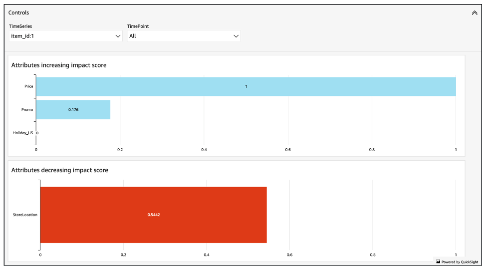
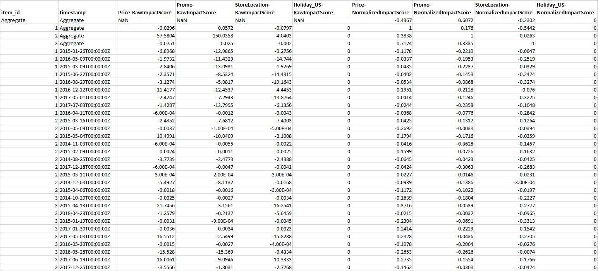

Amazon Forecast is no longer available to new customers. Existing customers of
Amazon Forecast can continue to use the service as normal.
[Learn more"](https://aws.amazon.com/blogs/machine-learning/transition-your-amazon-forecast-usage-to-amazon-sagemaker-canvas/ "https://aws.amazon.com/blogs/machine-learning/transition-your-amazon-forecast-usage-to-amazon-sagemaker-canvas/")

# Forecast Explainability

Forecast Explainability helps you better understand how the attributes in your datasets
impact forecasts for specific time series (item and dimension combinations) and time points.
Forecast uses a metric called Impact scores to quantify the relative impact of each
attribute and determine whether they increase or decrease forecast values.

For example, consider a forecasting scenario where the target is `sales` and
there are two related attributes: `price` and `color`. Forecast may
find that the item’s color has a high impact on sales for certain items, but a negligible
effect for other items. It may also find that a promotion in the summer has a high impact on
sales, but a promotion in the winter has little effect.

To enable Forecast Explainability, your predictor must include at least one of the
following: related time series, item metadata, or additional datasets like Holidays and the
Weather Index. See [Restrictions and best
practices](predictor-explainability.md#predictor-explainability-best-practices "predictor-explainability.md#predictor-explainability-best-practices") for more information.

To view aggregated Impact scores for all time series and time points in your datasets, use
Predictor Explainability instead of Forecast Explainability. See [Predictor Explainability](predictor-explainability.md "predictor-explainability.md").

###### Python notebooks

For a step-by-step guide on Forecast Explainability, see [Item-Level Explainability](https://github.com/aws-samples/amazon-forecast-samples/blob/main/notebooks/advanced/Item_Level_Explainability/Item_Level_Explanability.ipynb "https://github.com/aws-samples/amazon-forecast-samples/blob/main/notebooks/advanced/Item_Level_Explainability/Item_Level_Explanability.ipynb").

###### Topics

- [Interpreting Impact
  Scores](#forecast-explainability-impact-scores "#forecast-explainability-impact-scores")
- [Creating Forecast
  Explainability](#creating-forecast-explainability "#creating-forecast-explainability")
- [Visualizing Forecast
  Explainability](#visualizing-forecast-explainability "#visualizing-forecast-explainability")
- [Exporting Forecast
  Explainability](#exporting-forecast-explainability "#exporting-forecast-explainability")
- [Restrictions and best
  practices](#forecast-explainability-best-practices "#forecast-explainability-best-practices")

## Interpreting Impact

Scores

Impact scores measure the relative impact attributes have on forecast values. For
example, if the ‘price’ attribute has an impact score that is twice as large as the
‘store location’ attribute, you can conclude that the price of an item has twice the
impact on forecast values than the store location.

Impact scores also provide information on whether attributes increase or decrease
forecast values. In the console, this is denoted by the two graphs. Attributes with blue
bars increase forecast values, while attributes with red bars decrease forecast
values.



It is important to note that Impact scores measure the relative impact of attributes,
not the absolute impact. Therefore, Impact scores cannot be used to determine whether
particular attributes improve model accuracy. If an attribute has a low Impact score,
that does not necessarily mean that it has a low impact on forecast values; it means
that it has a lower impact on forecast values than other attributes used by the
predictor.

It is possible for all or some impact scores to be zero. This can occur if the features have no impact on forecast values,
the AutoPredictor used only a non-ML algorithm, or you did not provide related time series or item metadata.

For Forecast Explainability, Impact scores come in two forms: Normalized impact scores
and Raw impact scores. Raw impact scores are based on Shapley values and are not scaled
or bounded. Normalized impact scores scale the raw scores to a value between -1 and

1.

Raw impact scores are useful for combining and comparing scores across different
Explainability resources. For example, if your predictor contains over 50 time series or
over 500 time points, you can create multiple Forecast Explainability resources to cover
a greater combined number of time series or time points, and directly compare raw impact
scores for attributes. However, raw impact scores for Forecast Explainability resources
from different forecasts are not directly comparable.

When viewing Impact scores in the console, you will only see Normalized impact scores.
Exporting Explainability will provide you with both raw and normalized scores.

## Creating Forecast

Explainability

With Forecast Explainability, you can explore how attributes are impacting forecast
values for specific time series at specific time points. After specifying time series
and time points, Amazon Forecast calculates Impact scores for only those specific time
series and time points.

You can enable Forecast Explainability for a predictor using the Software Development
Kit (SDK) or the Amazon Forecast console. When using the SDK, use the [CreateExplainability](API_CreateExplainability.md "API_CreateExplainability.md") operation.

###### Topics

- [Specifying time series](#forecast-explainability-time-series "#forecast-explainability-time-series")
- [Specifying time points](#forecast-explainability-time-points "#forecast-explainability-time-points")

### Specifying time series

###### Note

A time series is a combination of the item (item_id) and all dimensions in
your datasets

When you specify time series (item and dimension combinations) for Forecast
Explainability, Amazon Forecast calculates Impact scores for attributes for only
those specific time series.

To specify a list of time series, upload a CSV file identifying the time series by
their item_id and dimension values to an S3 bucket. You can specify up to 50 time
series. You must also define the attributes and attribute types of the time series
in a schema.

For example, a retailer may want to know how a promotion impacts sales for a
specific item (`item_id`) at a specific store location
(`store_location`). In this use case, you would specify the time
series that is the combination of item_id and store_location.

The following CSV file selects the following five time series:

1. Item_id: 001, store_location: Seattle
2. Item_id: 001, store_location: New York
3. Item_id: 002, store_location: Seattle
4. Item_id: 002, store_location: New York
5. Item_id: 003, store_location: Denver

```
001, Seattle
001, New York
002, Seattle
002, New York
003, Denver
```

The schema defines the first column as `item_id` and the second column
as `store_location`.

You can specify time series using the Forecast console or the Forecast Software
Development Kit (SDK).

Console
**To specify time series for Forecast
Explainability**

1. Sign in to the AWS Management Console and open the Amazon Forecast console at [https://console.aws.amazon.com/forecast/](https://console.aws.amazon.com/forecast/ "https://console.aws.amazon.com/forecast/").
2. From **Dataset groups**, choose your dataset
   group.
3. In the navigation pane, choose
   **Insights**.
4. Choose **Create Explainability**.
5. In the **Explainability name** field, provide
   a unique name for the Forecast Explainability.
6. In the **Select forecast** field,
   choose your forecast.
7. In the **S3 location** field,
   enter the location of the file with your time series.
8. In the **Data schema** field, set
   the **attribute name** and
   **attribute type** of the item
   ID and dimensions used in your time series.
9. Choose **Create
   Explainability.**

SDK
**To specify time series for Forecast
Explainability**

Using the [CreateExplainability](API_CreateExplainability.md "API_CreateExplainability.md") operation, provide a unique name for
ExplainabilityName and provide your forecast ARN for ResourceArn.

Configure the following datatypes:

- `ExplainabilityConfig` - set values for
  TimeSeriesGranularity to “SPECIFIC” and TimePointGranularity to
  “ALL”. (To specify time points, set TimePointGranularity to
  “SPECIFIC”. See [Specifying
  time points](#forecast-explainability-time-points "#forecast-explainability-time-points"))
- `S3Config` - set the values for “Path” to the S3
  location of the time series file and “RoleArn” to a role with
  access to the S3 bucket.
- `Schema` - define the “AttributeName” and
  “AttributeType” for item_id and the dimensions in your time
  series.

The example below shows a schema for time series using a combination
of “item_id” and the “store_location” dimension.

```
{
    "ExplainabilityName" : [unique_name],
    "ResourceArn" : [forecast_arn],
    "ExplainabilityConfig" {
        "TimeSeriesGranularity": "SPECIFIC",
        "TimePointGranularity": "ALL"
    },
    "DataSource": {
         "S3Config": {
            "Path": [S3_path_to_file],
            "RoleArn":[role-to-access-s3-bucket]
         }
      },
    "Schema": {
         "Attributes": [
            {
               "AttributeName": "item_id",
               "AttributeType": "string"
            },
                        {
               "AttributeName": "store_location",
               "AttributeType": "string"
            }
         ]
      },
}
```

### Specifying time points

###### Note

If you do not specify time points (`"TimePointGranularity":
 "ALL"`), Amazon Forecast will consider the entire forecast horizon when
calculating Impact scores.

When you specify time points for Forecast Explainability, Amazon Forecast
calculates Impact scores for attributes for that specific time range. You can
specify up to 500 consecutive time points within the forecast horizon.

For example, a retailer may want to know how their attributes impact sales during
the winter. In this use case, they would specify the time points to span only the
winter period in the forecast horizon.

You can specify time points using the Forecast console or the Forecast Software
Development Kit (SDK).

Console
**To specify time series for Forecast
Explainability**

1. Sign in to the AWS Management Console and open the Amazon Forecast console at [https://console.aws.amazon.com/forecast/](https://console.aws.amazon.com/forecast/ "https://console.aws.amazon.com/forecast/").
2. From **Dataset groups**, choose your dataset
   group.
3. In the navigation pane, choose
   **Insights**.
4. Choose **Create Explainability**.
5. In the **Explainability name** field, provide
   a unique name for the Forecast Explainability.
6. In the **Select forecast** field,
   choose your forecast.
7. In the **S3 location** field,
   enter the location of the file with your time series.
8. In the **Data schema** field, set
   the _attribute name_ an
   _attribute type_ of the
   item ID and dimensions used in your time series.
9. In the **Time duration** field,
   specify the start date and end date within the calendar.
10. Choose **Create
    Explainability.**

SDK
**To specify time series for Forecast
Explainability**

Using the [CreateExplainability](API_CreateExplainability.md "API_CreateExplainability.md") operation, provide a unique name for
ExplainabilityName and provide your forecast ARN for ResourceArn. Set
the start date (`StartDateTime`) and end date
(`EndDateTime`) using the following timestamp format:
`yyyy-MM-ddTHH:mm:ss` (example: 2015-01-01T20:00:00).

Configure the following datatypes:

- `ExplainabilityConfig` - set values for
  TimeSeriesGranularity to “SPECIFIC” and TimePointGranularity to
  “SPECIFIC”.
- `S3Config` - set the values for “Path” to the S3
  location of the time series file and “RoleArn” to a role with
  access to the S3 bucket.
- `Schema` - define the “AttributeName” and
  “AttributeType” for item_id and the dimensions in your time
  series.

The example below shows a schema for time series using a combination
of “item_id” and the “store_location” dimension.

```
{
    "ExplainabilityName" : [unique_name],
    "ResourceArn" : [forecast_arn],
    "ExplainabilityConfig" {
        "TimeSeriesGranularity": "SPECIFIC",
        "TimePointGranularity": "SPECIFIC"
    },
    "DataSource": {
         "S3Config": {
            "Path": [S3_path_to_file],
            "RoleArn":[role-to-access-s3-bucket]
         }
      },
    "Schema": {
         "Attributes": [
            {
               "AttributeName": "item_id",
               "AttributeType": "string"
            },
                        {
               "AttributeName": "store_location",
               "AttributeType": "string"
            }
         ]
      },
    "StartDateTime": "string",
    "EndDateTime": "string",
}
```

## Visualizing Forecast

Explainability

When creating Forecast Explainability in the console, Forecast automatically
visualizes your Impact scores. When creating Forecast Explainability with the [CreateExplainability](API_CreateExplainability.md "API_CreateExplainability.md") operation, set
`EnableVisualization` to "true" and impact scores for that Explainability
resource will be visualized within the console.

Impact score visualizations last for 30 days from the date of Explainability creation.
To recreate the visualization, create a new Forecast Explainability.

## Exporting Forecast

Explainability

###### Note

Export files can directly return information from the Dataset Import. This makes
the files vulnerable to CSV injection if the imported data contains formulas or
commands. For this reason, exported files can prompt security warnings. To avoid
malicious activity, disable links and macros when reading exported files.

Forecast enables you to export a CSV file of Impact scores to an S3 location.

The export contains raw and normalized impact scores for the specified time series, as
well as normalized aggregated impact scores for all specified time series and all
specified time points. If you didn’t specify time points, the impact scores are already
aggregated for all time points in your forecast horizon.



You can export Forecast Explainability using the Amazon Forecast Software Development
Kit (SDK) and the Amazon Forecast console.

Console
**To export Forecast Explainability**

1. Sign in to the AWS Management Console and open the Amazon Forecast console at [https://console.aws.amazon.com/forecast/](https://console.aws.amazon.com/forecast/ "https://console.aws.amazon.com/forecast/").
2. From **Dataset groups**, choose your dataset
   group.
3. In the navigation pane, choose
   **Insights**.
4. Select your Explainability.
5. From the **Actions** drop-down, choose
   **Export**.
6. In the **Export name** field, provide a unique
   name for the Forecast Explainability export.
7. In the **S3 explainability export
   location**field, enter the S3 location to export the
   CSV file.
8. In the **IAM Role** field, choose a
   role with access to the chosen S3 location.
9. Choose **Create Explainability
   Export**.

SDK
**To export Forecast Explainability**

Using the [CreateExplainabilityExport](API_CreateExplainabilityExport.md "API_CreateExplainabilityExport.md") operation, specify your S3 location
and IAM role in the `Destination` object, along with the
`ExplainabilityArn` and
`ExplainabilityExportName`.

For example:

```
{
   "Destination": {
      "S3Config": {
         "Path": "s3://bucket/example-path/",
         "RoleArn": "arn:aws:iam::000000000000:role/ExampleRole"
      }
   },
   "ExplainabilityArn": "arn:aws:forecast:region:explainability/example",
   "ExplainabilityName": "Explainability-export-name",
}
```

## Restrictions and best

practices

Consider the following restrictions and best practices when working with Forecast
Explainability.

- **Forecast Explainability is only available for some Forecasts
  generated from AutoPredictor -** You cannot enable Forecast
  Explainability for Forecasts generated from legacy predictors (AutoML or manual
  selection). See [Upgrading to
  AutoPredictor](howitworks-predictor.md#upgrading-autopredictor "howitworks-predictor.md#upgrading-autopredictor").
- **Forecast Explainability is not available for all models** - The ARIMA (AutoRegressive Integrated Moving Average), ETS (Exponential Smoothing State Space Model), and NPTS (Non-Parametric Time Series) models do not incorporate external time series data. Therefore, these models do not create an explainability report, even if you include the additional datasets.
- **Explainability requires attributes** - Your
  predictor must include at least one of the following: related time series, item
  metadata, Holidays, or the Weather Index.
- **Impact scores of zero denote no impact** - If
  one or more attribute has an impact score of zero, then these attributes have no significant
  impact on forecast values.
  Scores can also be zero if the AutoPredictor used only a non-ML algorithm, or you did not provide related time series or item metadata.
- **Specify a maximum of 50 time series** - You can
  specify up to 50 time series per Forecast Explainability.
- **Specify a maximum of 500 time points** - You
  can specify up to 500 consecutive time points per Forecast
  Explainability.
- **Forecast also calculates some aggregated Impact
  scores** - Forecast will also provide aggregated impact scores for
  the specified time series and time points.
- **Create multiple Forecast Explainability resources for a
  single Forecast** - If you want impact scores for more than 50 time
  series or 500 time points, you can create Explainability resources in batches to
  span a larger range.
- **Compare Raw impact scores across different Forecast
  Explainability resources** - Raw impact scores can be directly
  compared across Explainability resources from the same forecast.
- **Forecast Explainability visualizations are available
  for 30 days after creation** - To view the visualization after 30
  days, create a new Forecast Explainability with the same configuration.
