Amazon Forecast is no longer available to new customers. Existing customers of
Amazon Forecast can continue to use the service as normal.
[Learn more"](https://aws.amazon.com/blogs/machine-learning/transition-your-amazon-forecast-usage-to-amazon-sagemaker-canvas/ "https://aws.amazon.com/blogs/machine-learning/transition-your-amazon-forecast-usage-to-amazon-sagemaker-canvas/")

# Getting Started (Console)

In this exercise, you use the Amazon Forecast console to import time-series data of electricity
usage, create an predictor based on the input dataset, and make predictions of future
electricity usage based on the forecast horizon.

For this exercise, you use a modified version the individual household electric power
consumption dataset. (Dua, D. and Karra Taniskidou, E. (2017). UCI Machine Learning Repository
[[http://archive.ics.uci.edu/ml](http://archive.ics.uci.edu/ml "http://archive.ics.uci.edu/ml")]. Irvine,
CA: University of California, School of Information and Computer Science.) We aggregate the
usage data hourly. The modified data is available as zip file, [electricityusagedata.zip](samples/electricityusagedata.md "samples/electricityusagedata.md").

**Prerequisites**

- An AWS account. If you don't already have an AWS account, create one as described in
  [Sign Up for AWS](aws-forecast-set-up-aws-account.md "aws-forecast-set-up-aws-account.md").
- Training data in your Amazon Simple Storage Service (Amazon S3) bucket. For more information, see [Prepare Input Data](getting-started.md#gs-upload-data-to-s3 "getting-started.md#gs-upload-data-to-s3").
- An AWS Identity and Access Management (IAM) role that allows Amazon Forecast to read and write to your S3 buckets.
  For more information, see [Create an IAM Role for
  Amazon Forecast (IAM Console)](aws-forecast-iam-roles.md#aws-forecast-create-iam-role-with-console "aws-forecast-iam-roles.md#aws-forecast-create-iam-role-with-console").
  Be aware that there are several steps in this exercise that require several minutes to a few hours to
  complete.

To import time-series data into Amazon Forecast, create a dataset group, choose a domain for
your dataset group, specify the details of your data, and point Amazon Forecast to the S3 location
of your data. The target time series used in this example is [historical electricity usage](getting-started.md#gs-upload-data-to-s3 "getting-started.md#gs-upload-data-to-s3") data.

###### Note

This exercise assumes that you have not created any dataset groups. If you previously
created a dataset group, what you see will vary slightly from the following screenshots
and instructions.

###### To import time-series data for forecasting

1.  Open the Amazon Forecast console at [https://console.aws.amazon.com/forecast/](https://console.aws.amazon.com/forecast/ "https://console.aws.amazon.com/forecast/").
2.  On the Amazon Forecast home page, choose **Create dataset group**.
3.  On the **Create dataset group** page, for **Dataset group
    details**, provide the following information:

        * **Dataset group name** – Enter a name for your dataset
         group.
        * **Forecasting domain** – From the drop-down menu, choose
         **Custom**. For more information about how to choose a
         forecasting domain, see [dataset domains and types](howitworks-domains-ds-types.md "howitworks-domains-ds-types.md").

    Leave the **Tags** section unchanged. Your screen should look similar to the following:

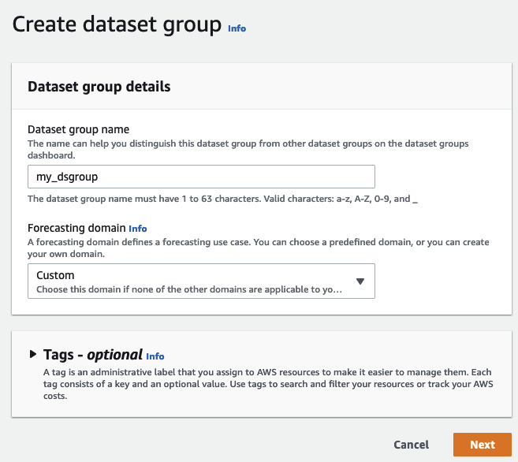 4. Choose **Next**. 5. On the **Create target time series dataset** page, for
**Dataset details**, provide the following information:

    * **Dataset name** – Enter a name for your dataset.
    * **Frequency of your data** – Keep the default value of
     `1`, and choose **hour** from the drop-down
     menu. This setting must be consistent with the input time series data. The time
     interval in the sample electricity-usage data is an hour.
    * **Data schema** – Choose **Schema
     builder** and drag the column components to match the time-series data
     order from top to bottom.

    	1. timestamp - Use the default **Timestamp Format** of
    	 `yyyy-MM-dd HH:mm:ss`.
    	2. target\_value
    	3. item\_id
     For the electricity usage input data, the columns correspond to: a timestamp,
     the electricity usage at the specified time (target\_value), and the ID of the
     customer charged for the electricity usage (string). The order of the columns and
     the timestamp format specified here must be consistent with the input time series
     data.

The **Dataset details** panel should look similar to the following:

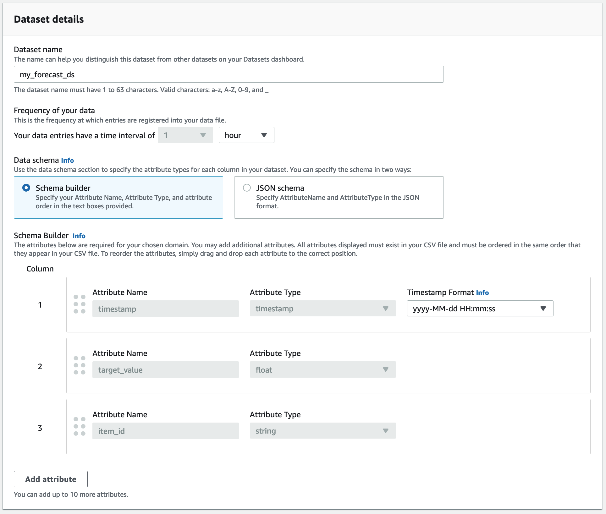 6. For **Dataset import details**, provide the following information:

    * **Dataset import name** – Enter a name for your dataset.
    * **Select time zone** – Leave the default selected (**Do not use time zone**).
    * **Data location** – Use the following format to enter
     the location of your .csv file on Amazon S3:

    `s3://<name of your S3 bucket>/<folder
     path>/<filename.csv>`
    * **IAM role** – Keep the default **Enter a custom
     IAM role ARN**.

    Alternatively, you can have Amazon Forecast create the required IAM role for you by
     choosing **Create a new role** from the drop-down menu and
     following the on-screen instructions.
    * **Custom IAM role ARN** – Enter the Amazon Resource Name
     (ARN) of the IAM role that you created in [Create an IAM Role for
     Amazon Forecast (IAM Console)](aws-forecast-iam-roles.md#aws-forecast-create-iam-role-with-console "aws-forecast-iam-roles.md#aws-forecast-create-iam-role-with-console").

The **Dataset import details** panel should look similar to the following:

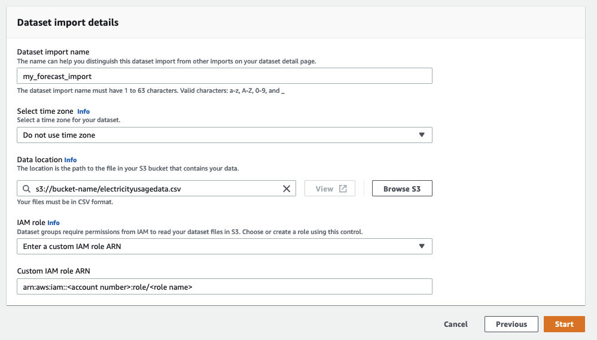 7. Choose **Start**. If you are returned to the Amazon Forecast home page, choose
**View dataset group**. 8. Click the name of the dataset group that you just created. The dataset group's
**Dashboard** page is displayed. Your screen should look similar to the following:

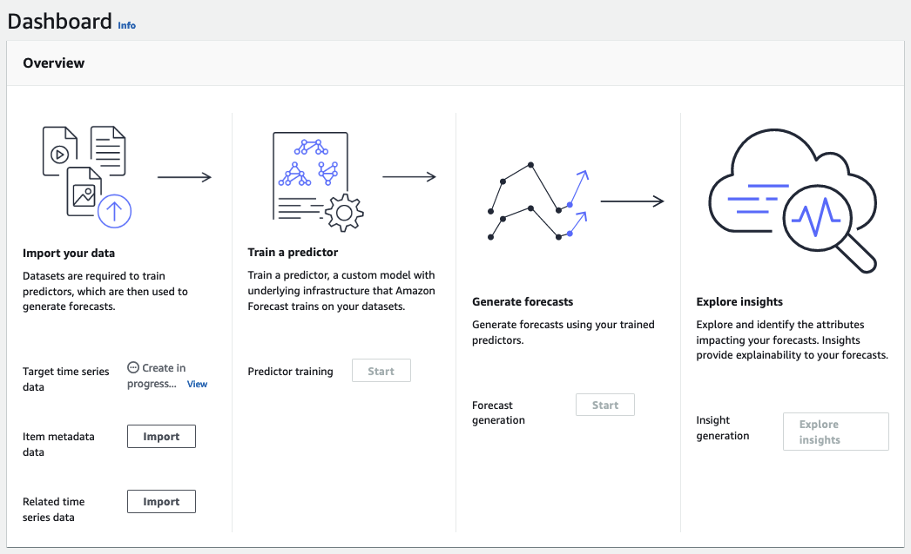

Next to **Target time series data**, you will see the status of the
import job. Wait for Amazon Forecast to finish importing your time series data. The process
can take several minutes or longer. When your dataset has been imported, the status
transitions to **Active** and the banner at the top of the dashboard
notifies you that you have successfully imported your data.

Now that your target time series dataset has been imported, you can create a
predictor.
Next you create a predictor, which you use to generate forecasts based on your
time series data. Forecast applies the optimal combination of algorithms
to each time series in your datasets

To create a predictor with the Forecast console, you specify a predictor name, a forecast
frequency, and define a forecast horizon. For more information about the additional fields
you can configure, see [Training Predictors](howitworks-predictor.md "howitworks-predictor.md").

###### To create a predictor

1. After your target time series dataset has finished importing, your dataset group's
   **Dashboard** should look similar to the following:

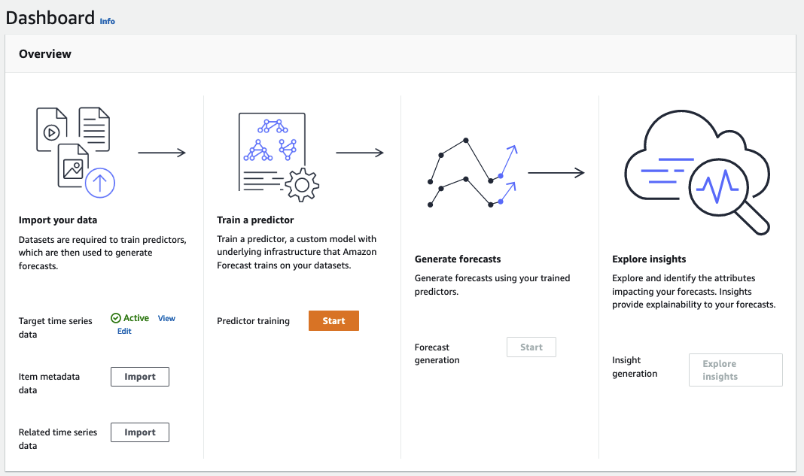

Under **Train a predictor**, choose **Start**. The
**Train predictor** page is displayed.

###### Note

The `Status` of the **Target time series data** must
be `Active`, which signifies that the import successfully finished, before
you can train the predictor. 2. On the **Train predictor** page, for **Predictor
settings**, provide the following information:

    * **Predictor name** – Enter a name for your
     predictor.
    * **Forecast frequency** – Keep the default value of
     `1`. From the drop-down menu, choose
     **hour**. This setting must be consistent with the input time
     series data. The time interval in the sample electricity-usage data is an
     hour.
    * **Forecast horizon** – Choose how far into the future to
     make predictions. This number multiplied by the data entry frequency
     (`hourly`) that you specified in `Step 1: Import the Training
     Data` determines how far into the future to make predictions. For this
     exercise, set the number to `36`, to provide predictions for 36
     hours.
    * **Forecast dimensions** and **Forecast quantiles** –
     Leave the default values for these fields.

The remaining **Input data configuration** and **Tags** sections are optional, so leave the default values.
The **Predictor settings** sections should
look similar to the following:

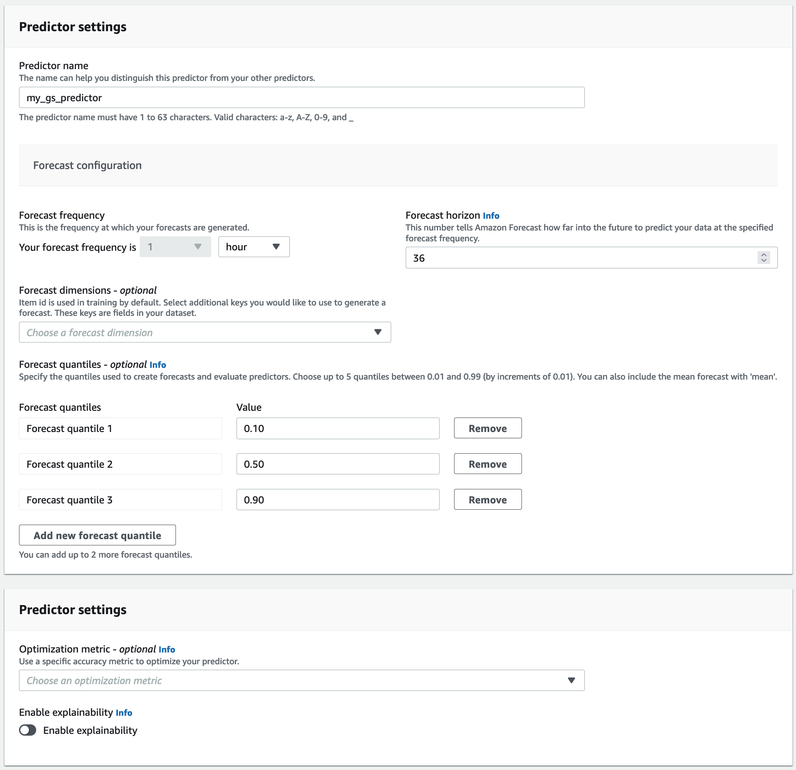 3. Choose **Create**. Your dataset group's
**Dashboard** page is displayed. Your screen should look similar to
the following:

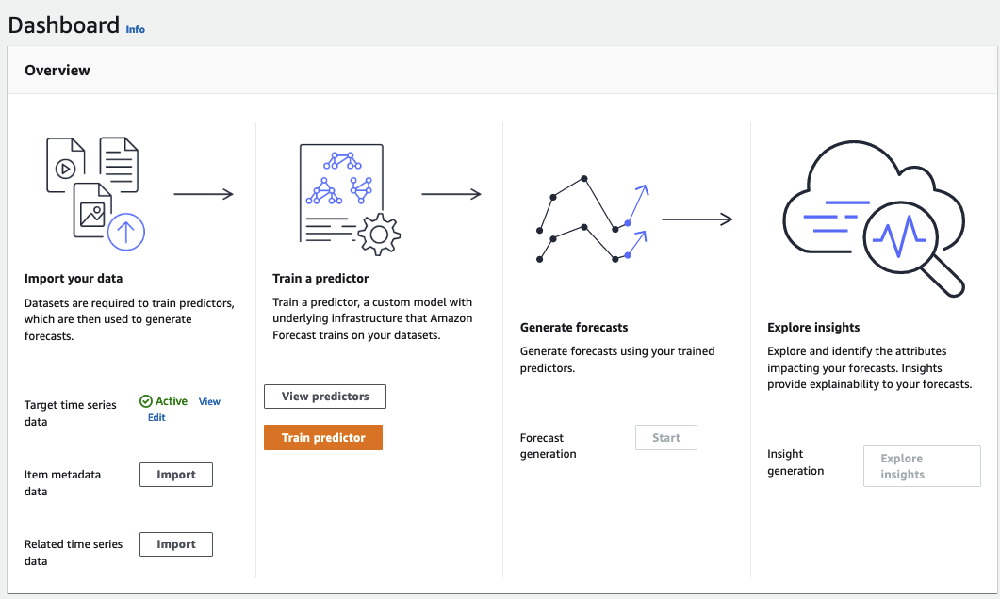 4. To find the status of your predictor, choose **View predictors**. 5. On the **Predictors** page find the status of your predictor in the **Training status**
column. Your screen should look similar to the following:

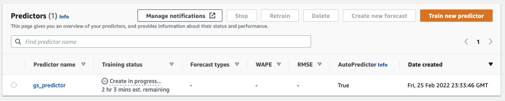

Wait for Amazon Forecast to finish training the predictor. The process can take several
minutes or longer. When your predictor has been trained, the status transitions to
**Active** and a banner displays notifying you that you can start generating
forecasts.
After your predictor is Active, you can create a forecast. A forecast
is a group of predictions, one for every item in the target dataset. To retrieve the complete forecast, you
create an export job.

###### To get and view your forecast

1. On your dataset group's **Dashboard**, under **Forecast generation**, choose **Start**.
   The **Create a forecast** page is displayed.

###### Note

The `Status` of **Predictor training** must be
`Active` before you can generate a forecast. 2. On the **Create a forecast** page, for **Forecast
details**, provide the following information:

    * **Forecast name** – Enter a name for your
     forecast.
    * **Predictor** – From the drop-down menu, choose the
     predictor that you created in `Step 2: Train a Predictor`.

The **Forecast quantiles** and **Tags** fields are optional, so leave the default value. Your screen should
look similar to the following:

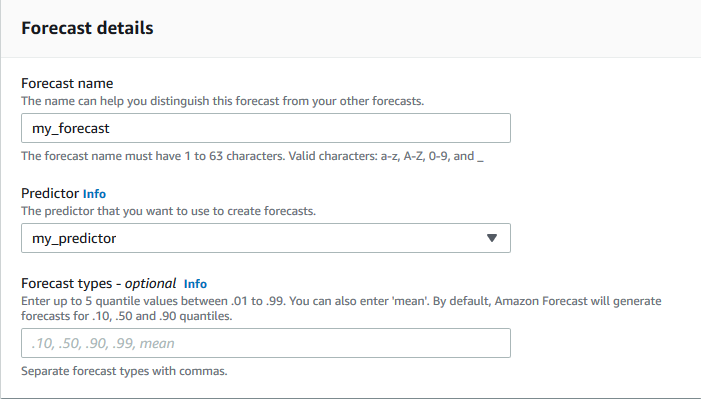

Click **Start**. 3. The **Forecasts** page is displayed. Your screen should look similar to the
following:

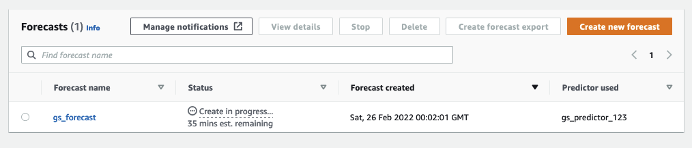

The **Status** column lists the status of your forecast.. Wait for Amazon Forecast to finish creating the forecast. The process can
take several minutes or longer. When your forecast has been created, the status
transitions to **Active**.

Now that your forecast has been created, you can export the
forecast.
After the forecast has been created, you can export the
complete forecast.

###### To export the complete forecast

1.  On the dataset groups page, click the dataset group that you created in `Step 1: Import Training
Data`.
2.  Click
    
    in the upper left corner of the screen to open the navigation pane. Under your dataset
    group, click **Forecasts**.
3.  Choose the radio button next to the forecast that you created in `Step 3:
Create a Forecast`.
4.  Choose **Create forecast export**. The **Create forecast
    export** page is displayed.
5.  On the **Create forecast export** page, for **Export
    details**, provide the following information.

        * **Export name** – Enter a name for your forecast export
         job.
        * **IAM role** – Keep the default **Enter a custom
         IAM role ARN**.

        Alternatively, you can have Amazon Forecast create the required IAM role for you by
         choosing **Create a new role** from the drop-down menu and
         following the on-screen instructions.
        * **Custom IAM role ARN** – Enter the Amazon Resource Name
         (ARN) of the IAM role that you created in [Create an IAM Role for
         Amazon Forecast (IAM Console)](aws-forecast-iam-roles.md#aws-forecast-create-iam-role-with-console "aws-forecast-iam-roles.md#aws-forecast-create-iam-role-with-console").
        * **S3 forecast export location** – Use the following
         format to enter the location of your Amazon Simple Storage Service (Amazon S3) bucket or folder in the
         bucket:

        `s3://<name of your S3 bucket>/<folder
         path>/`

    Your screen should look similar to the following:

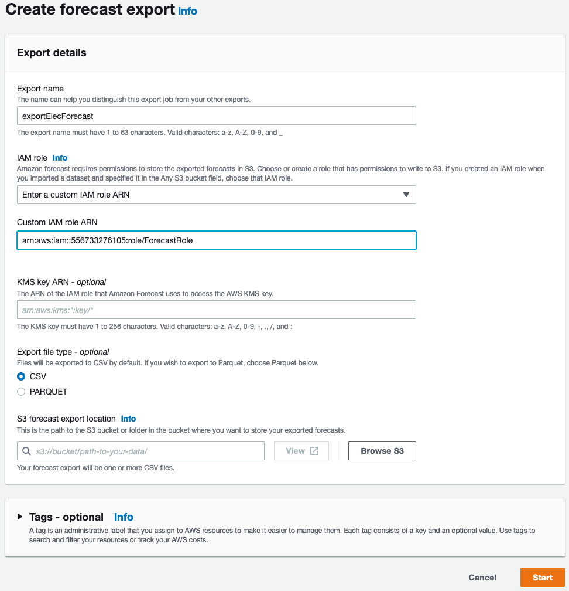 6. Click **Start**. The **Forecasts** page is displayed. 7. Click the forecast that you created in `Step 3: Create a Forecast`. Find the
**Exports** section. Your screen should look similar to the following:

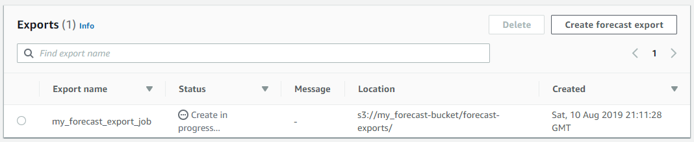

You should see the status progress. Wait for Amazon Forecast to finish
exporting the forecast. The process can take several minutes or longer. When your forecast has been
exported, the status transitions to **Active** and you can find the forecast files in your
S3 bucket.
