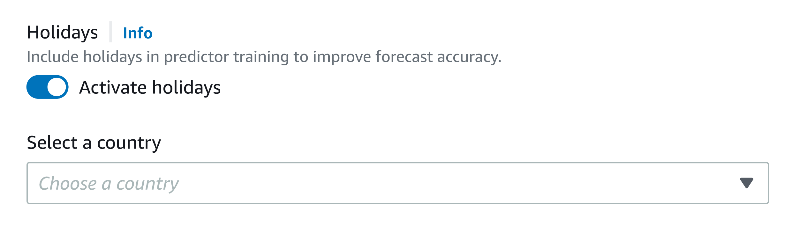

Amazon Forecast is no longer available to new customers. Existing customers of
Amazon Forecast can continue to use the service as normal.
[Learn more"](https://aws.amazon.com/blogs/machine-learning/transition-your-amazon-forecast-usage-to-amazon-sagemaker-canvas/ "https://aws.amazon.com/blogs/machine-learning/transition-your-amazon-forecast-usage-to-amazon-sagemaker-canvas/")

# Holidays Featurization

Holidays is a built-in featurization that incorporates a feature-engineered dataset of national holiday information into your model. It provides native support for the holiday calendars of over 250 countries. Amazon Forecast incorporates both the [Holiday API library](https://holidayapi.com/countries "https://holidayapi.com/countries") and [Jollyday API](https://jollyday.sourceforge.net/data.html "https://jollyday.sourceforge.net/data.html") to generate holiday calendars.

The Holidays featurization is especially useful in the retail domain, where public holidays can significantly affect demand.

The Holiday featurization supports a minimum forecast frequency of 5 minutes and a maximum of 1 month.

###### Topics

- [Enabling the Holidays Featurization](#enabling-holidays "#enabling-holidays")
- [Country Codes](#holidays-country-codes "#holidays-country-codes")
- [Additional Holiday Calendars](#holiday-calendars "#holiday-calendars")

## Enabling the Holidays Featurization

The Holidays featurization is included in Amazon Forecast as an [Additional Dataset](API_AdditionalDataset.md "API_AdditionalDataset.md"), and is enabled before training a predictor. It is recommended that your historical data contains at least two years of data. This allows Forecast to identify demand patters that are associated with specific holidays. After you choose a country, Holidays applies that country’s holiday calendar to every item in your dataset during training.

You can enable Holidays using the Amazon Forecast console or the Forecast Software Development Kit (SDK).

Forecast SDK
Using the [CreateAutoPredictor](API_CreateAutoPredictor.md "API_CreateAutoPredictor.md") operation, enable Holidays by adding `"Name": "holiday`" and setting `"Configuration"` to map `"CountryCode"` a two-letter country code. See [Country Codes](#holidays-country-codes "#holidays-country-codes").

For example, to include the USA holiday calendar, use the following code.

```
      "DataConfig": {
        "AdditionalDatasets": [
            {
                "Name": "holiday",
                "Configuration": {
                    "CountryCode" : ["US"]
                }
            },
          ]
        },
```

Forecast Console
Choose a country from the **Country for
Holidays** drop-down during the **Train
Predictor** stage.



## Country Codes

Amazon Forecast provides native support for the public holiday calendars of the following
countries. Use the **Country Code** when specifying a
country with the API.

Supported Countries
| Country | Country Code |
| --- | --- |
| Afghanistan | AF |
| Åland Islands | AX |
| Albania | AL |
| Algeria | DZ |
| American Samoa | AS |
| Andorra | AD |
| Angola | AO |
| Anguilla | AI |
| Antartica | AQ |
| Antigua and Barbuda | AG |
| Argentina | AR |
| Armenia | AM |
| Aruba | AW |
| Australia | AU |
| Austria | AT |
| Azerbaijan | AZ |
| Bahamas | BS |
| Bahrain | BH |
| Bangladesh | BD |
| Barbados | BB |
| Belarus | BY |
| Belgium | BE |
| Belize | BZ |
| Benin | BJ |
| Bermuda | BM |
| Bhutan | BT |
| Bolivia | BO |
| Bosnia and Herzegovina | BA |
| Botswana | BW |
| Bouvet Island | BV |
| Brazil | BR |
| British Indian Ocean Territory | IO |
| British Virgin Islands | VG |
| Brunei Darussalam | BN |
| Bulgaria | BG |
| Burkina Faso | BF |
| Burundi | BI |
| Cambodia | KH |
| Cameroon | CM |
| Canada | CA |
| Cape Verde | CV |
| Caribbean Netherlands | BQ |
| Cayman Islands | KY |
| Central African Republic | CF |
| Chad | TD |
| Chile | CL |
| China | CN |
| Christmas Island | CX |
| Cocos (Keeling) Islands | CC |
| Colombia | CO |
| Comoros | KM |
| Cook Islands | CK |
| Costa Rica | CR |
| Croatia | HR |
| Cuba | CU |
| Curaçao | CW |
| Cyprus | CY |
| Czechia | CZ |
| Democratic Republic of the Congo | CD |
| Denmark | DK |
| Djibouti | DJ |
| Dominica | DM |
| Dominican Republic | DO |
| Ecuador | EC |
| Egypt | EG |
| El Salvador | SV |
| Equatorial Guinea | GQ |
| Eritrea | ER |
| Estonia | EE |
| Eswatini | SZ |
| Ethiopia | ET |
| Falkland Islands | FK |
| Faroe Islands | FO |
| Fiji | FJ |
| Finland | FI |
| France | FR |
| French Guiana | GF |
| French Polynesia | PF |
| French Southern Territories | TF |
| Gabon | GA |
| Gambia | GM |
| Georgia | GE |
| Germany | DE |
| Ghana | GH |
| Gibraltar | GI |
| Greece | GR |
| Greenland | GL |
| Grenada | GD |
| Guadeloupe | GP |
| Guam | GU |
| Guatemala | GT |
| Guernsey | GG |
| Guinea | GN |
| Guinea-Bissau | GW |
| Guyana | GY |
| Haiti | HT |
| Heard Island and McDonald Islands | HM |
| Honduras | HN |
| Hong Kong | HK |
| Hungary | HU |
| Iceland | IS |
| India | IN |
| Indonesia | ID |
| Iran | IR |
| Iraq | IQ |
| Ireland | IE |
| Isle of Man | IM |
| Israel | IL |
| Italy | IT |
| Ivory Coast | CI |
| Jamaica | JM |
| Japan | JP |
| Jersey | JE |
| Jordan | JO |
| Kazakhstan | KZ |
| Kenya | KE |
| Kiribati | KI |
| Kosovo | XK |
| Kuwait | KW |
| Kyrgyzstan | KG |
| Laos | LA |
| Latvia | LV |
| Lebanon | LB |
| Lesotho | LS |
| Liberia | LR |
| Libya | LY |
| Liechtenstein | LI |
| Lithuania | LT |
| Luxembourg | LU |
| Macao | MO |
| Madagascar | MG |
| Malawi | MW |
| Malaysia | MY |
| Maldives | MV |
| Mali | ML |
| Malta | MT |
| Marshall Islands | MH |
| Martinique | MQ |
| Mauritania | MR |
| Mauritius | MU |
| Mayotte | YT |
| Mexico | MX |
| Micronesia | FM |
| Moldova | MD |
| Monaco | MC |
| Mongolia | MN |
| Montenegro | ME |
| Montserrat | MS |
| Morocco | MA |
| Mozambique | MZ |
| Myanmar | MM |
| Namibia | NA |
| Nauru | NR |
| Nepal | NP |
| Netherlands | NL |
| New Caledonia | NC |
| New Zealand | NZ |
| Nicaragua | NI |
| Niger | NE |
| Nigeria | NG |
| Niue | NU |
| Norfolk Island | NF |
| North Korea | KP |
| North Macedonia | MK |
| Northern Mariana Islands | MP |
| Norway | NO |
| Oman | OM |
| Pakistan | PK |
| Palau | PW |
| Palestine | PS |
| Panama | PA |
| Papua New Guinea | PG |
| Paraguay | PY |
| Peru | PE |
| Philippines | PH |
| Pitcairn Islands | PN |
| Poland | PL |
| Portugal | PT |
| Puerto Rico | PR |
| Qatar | QA |
| Republic of the Congo | CG |
| Réunion | RE |
| Romania | RO |
| Russian Federation | RU |
| Rwanda | RW |
| Saint Barthélemy | BL |
| "Saint Helena, Ascension and Tristan da Cunha " | SH |
| Saint Kitts and Nevis | KN |
| Saint Lucia | LC |
| Saint Martin | MF |
| Saint Pierre and Miquelon | PM |
| Saint Vincent and the Grenadines | VC |
| Samoa | WS |
| San Marino | SM |
| Sao Tome and Principe | ST |
| Saudi Arabia | SA |
| Senegal | SN |
| Serbia | RS |
| Seychelles | SC |
| Sierra Leone | SL |
| Singapore | SG |
| Sint Maarten | SX |
| Slovakia | SK |
| Slovenia | SI |
| Solomon Islands | SB |
| Somalia | SO |
| South Africa | ZA |
| South Georgia and the South Sandwich Islands | GS |
| South Korea | KR |
| South Sudan | SS |
| Spain | ES |
| Sri Lanka | LK |
| Sudan | SD |
| Suriname | SR |
| Svalbard and Jan Mayen | SJ |
| Sweden | SE |
| Switzerland | CH |
| Syrian Arab Republic | SY |
| Taiwan | TW |
| Tajikistan | TJ |
| Tanzania | TZ |
| Thailand | TH |
| Timor-Leste | TL |
| Togo | TG |
| Tokelau | TK |
| Tonga | TO |
| Trinidad and Tobago | TT |
| Tunisia | TN |
| Turkey | TR |
| Turkmenistan | TM |
| Turks and Caicos Islands | TC |
| Tuvalu | TV |
| Uganda | UG |
| Ukraine | UA |
| United Arab Emirates | AE |
| United Kingdom | GB |
| United Nations | UN |
| United States | US |
| United States Minor Outlying Islands | UM |
| United States Virgin Islands | VI |
| Uruguay | UY |
| Uzbekistan | UZ |
| Vanuatu | VU |
| Vatican City | VA |
| Venezuela | VE |
| Vietnam | VN |
| Wallis and Futuna | WF |
| Western Sahara | EH |
| Yemen | YE |
| Zambia | ZM |
| Zimbabwe | ZW | ## Additional Holiday Calendars Amazon Forecast also supports holidays for India, Korea, and United Arab Emirates. Their holidays are listed below. India - "IN" January 26 - Republic Day August 15 - Independence Day October 2 - Gandhi Jayanti Korea - "KR" January 1 - New Year March 1 - Independence Movement Day May 5 - Children's Day June 6 - Memorial Day August 15 - Liberation Day October 3 - National Foundation Day October 9 - Hangul Day December 25 - Christmas Day United Arab Emirates - "AE" January 1 - New Year December 1 - Commemoration Day December 2-3 - National Day Ramadan\* Eid al-Fitr\* Eid al-Adha\* Islamic New Year\* \*Islamic Holidays are determined by lunar cycles.
