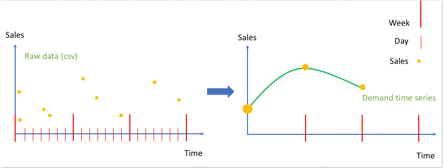

Amazon Forecast is no longer available to new customers. Existing customers of
Amazon Forecast can continue to use the service as normal.
[Learn more"](https://aws.amazon.com/blogs/machine-learning/transition-your-amazon-forecast-usage-to-amazon-sagemaker-canvas/ "https://aws.amazon.com/blogs/machine-learning/transition-your-amazon-forecast-usage-to-amazon-sagemaker-canvas/")

# How Aggregation Works

During training, Amazon Forecast aggregates any data that does not align with the forecast frequency you specify.
For example, you might have some daily data but specify a weekly forecast frequency. Forecast aligns the daily data
based on the week that it belongs in. Forecast then combines it into single record for each week. Forecast determines
what week (or month or day and so on) data belongs in based on its relation to a time boundary. Time boundaries
specify the beginning of a unit of time, such as what hour a day begins or what day a week begins.

For hourly and minutely forecasts, or unspecified time boundaries, Forecast uses a default time boundary based
on your frequency's unit of time. For auto predictors with daily, weekly, monthly, or yearly forecast frequencies,
you can specify a custom time boundary. For more information about time boundaries, see [Time Boundaries](data-aggregation.md#time-boundaries "data-aggregation.md#time-boundaries").

During aggregation, the default transformation method is to sum the data. You can configure the
transformation when you create your predictor. You do this in the **Input data configuration**
section on the **Create predictor** page in the Forecast console. Or you can set the transformation
method in the `Transformations` parameter in the [AttributeConfig](API_AttributeConfig.md "API_AttributeConfig.md") of the CreateAutoPredictor operation.

The following tables show an example aggregation for an hourly forecast frequency using the default time
boundary: Each hour begins at the top of the hour.

**Pre-transformation**

| Time                  | Data  | At Top of the Hour |
| --------------------- | ----- | ------------------ |
| `2018-03-03 01:00:00` | `100` | Yes                |
| `2018-03-03 02:20:00` | `50`  | No                 |
| `2018-03-03 02:45:00` | `20`  | No                 |
| `2018-03-03 04:00:00` | `120` | Yes                |

**Post-transformation**

| Time                  | Data  | Notes                                                 |
| --------------------- | ----- | ----------------------------------------------------- |
| `2018-03-03 01:00:00` | `100` |                                                       |
| `2018-03-03 02:00:00` | `70`  | Sum of the values between 02:00:00-02:59:59 (50 + 20) |
| `2018-03-03 03:00:00` | Empty | No values between 03:00:00-03:59:59                   |
| `2018-03-03 04:00:00` | `120` |                                                       |

The following figure shows how Forecast transforms data to fit the default weekly time boundary.

