Amazon Forecast is no longer available to new customers. Existing customers of
Amazon Forecast can continue to use the service as normal.
[Learn more"](https://aws.amazon.com/blogs/machine-learning/transition-your-amazon-forecast-usage-to-amazon-sagemaker-canvas/ "https://aws.amazon.com/blogs/machine-learning/transition-your-amazon-forecast-usage-to-amazon-sagemaker-canvas/")

# Evaluating Predictor Accuracy

Amazon Forecast produces accuracy metrics to evaluate predictors and help you choose which to use
to generate forecasts. Forecast evaluates predictors using Root Mean Square Error (RMSE),
Weighted Quantile Loss (wQL), Mean Absolute Percentage Error (MAPE), Mean Absolute Scaled Error
(MASE), and Weighted Absolute Percentage Error (WAPE) metrics.

Amazon Forecast uses backtesting to tune parameters and produce accuracy metrics. During
backtesting, Forecast automatically splits your time-series data into two sets: a training set and
a testing set. The training set is used to train a model and generate forecasts for data points
within the testing set. Forecast evaluates the model's accuracy by comparing forecasted values
with observed values in the testing set.

Forecast enables you to evaluate predictors using different forecast types, which can be a set
of quantile forecasts and the mean forecast. The mean forecast provides a point estimate,
whereas quantile forecasts typically provide a range of possible outcomes.

###### Python notebooks

For a step-by-step guide on evaluating predictor metrics, see [Computing Metrics Using Item-level Backtests.](https://github.com/aws-samples/amazon-forecast-samples/blob/master/notebooks/advanced/Item_Level_Accuracy/Item_Level_Accuracy_Using_Bike_Example.ipynb "https://github.com/aws-samples/amazon-forecast-samples/blob/master/notebooks/advanced/Item_Level_Accuracy/Item_Level_Accuracy_Using_Bike_Example.ipynb").

###### Topics

- [Interpreting Accuracy Metrics](#predictor-metrics "#predictor-metrics")
- [Weighted Quantile Loss (wQL)](#metrics-wQL "#metrics-wQL")
- [Weighted Absolute Percentage Error (WAPE)](#metrics-WAPE "#metrics-WAPE")
- [Root Mean Square Error (RMSE)](#metrics-RMSE "#metrics-RMSE")
- [Mean Absolute Percentage Error (MAPE)](#metrics-mape "#metrics-mape")
- [Mean Absolute Scaled Error (MASE)](#metrics-mase "#metrics-mase")
- [Exporting Accuracy Metrics](#backtest-exports "#backtest-exports")
- [Choosing Forecast Types](#forecast-types "#forecast-types")
- [Working With Legacy Predictors](#legacy-metrics "#legacy-metrics")

## Interpreting Accuracy Metrics

Amazon Forecast provides Root Mean Square Error (RMSE), Weighted Quantile Loss (wQL), Average
Weighted Quantile Loss (Average wQL), Mean Absolute Scaled Error (MASE), Mean Absolute
Percentage Error (MAPE), and Weighted Absolute Percentage Error (WAPE) metrics to evaluate
your predictors. Along with metrics for the overall predictor, Forecast calculates metrics for
each backtest window.

You can view accuracy metrics for your predictors using the Amazon Forecast Software Development
Kit (SDK) and the Amazon Forecast console.

Forecast SDK
Using the [GetAccuracyMetrics](API_GetAccuracyMetrics.md "API_GetAccuracyMetrics.md")
Operation, specif y your `PredictorArn` to view the RMSE, MASE, MAPE, WAPE,
Average wQL, and wQL metrics for each backtest.

```
{
    "PredictorArn": "arn:aws:forecast:region:acct-id:predictor/example-id"
}

```

Forecast Console
Choose your predictor on the **Predictors** page.
Accuracy metrics for the predictor are shown in the **Predictor
metrics** section.

###### Note

For Average wQL, wQL, RMSE, MASE, MAPE, and WAPE metrics, a lower value indicates a
superior model.

###### Topics

- [Weighted Quantile Loss (wQL)](#metrics-wQL "#metrics-wQL")
- [Weighted Absolute Percentage Error (WAPE)](#metrics-WAPE "#metrics-WAPE")
- [Root Mean Square Error (RMSE)](#metrics-RMSE "#metrics-RMSE")
- [Mean Absolute Percentage Error (MAPE)](#metrics-mape "#metrics-mape")
- [Mean Absolute Scaled Error (MASE)](#metrics-mase "#metrics-mase")
- [Exporting Accuracy Metrics](#backtest-exports "#backtest-exports")
- [Choosing Forecast Types](#forecast-types "#forecast-types")
- [Working With Legacy Predictors](#legacy-metrics "#legacy-metrics")

## Weighted Quantile Loss (wQL)

The Weighted Quantile Loss (wQL) metric measures the accuracy of a model at a specified
quantile. It is particularly useful when there are different costs for underpredicting and
overpredicting. By setting the weight (_τ_) of the wQL function, you can
automatically incorporate differing penalties for underpredicting and overpredicting.

The loss function is calculated as follows.

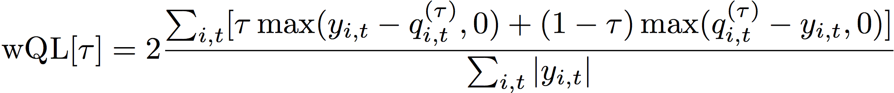

Where:

_τ_ - a quantile in the set {0.01, 0.02, ..., 0.99}

qi,t(τ) - the τ-quantile that the
model predicts.

yi,t - the observed value at point (i,t)

The quantiles (τ) for wQL can range from 0.01 (P1) to 0.99 (P99). The wQL metric cannot be
calculated for the mean forecast.

By default, Forecast computes wQL at `0.1` (P10), `0.5` (P50), and
`0.9` (P90).

- **P10 (0.1)** - The true value is expected to be lower
  than the predicted value 10% of the time.
- **P50 (0.5)** - The true value is expected to be lower
  than the predicted value 50% of the time. This is also known as the median
  forecast.
- **P90 (0.9)** - The true value is expected to be lower
  than the predicted value 90% of the time.

In retail, the cost of being understocked is often higher than the cost of being
overstocked, and so forecasting at P75 (_τ_ = 0.75) can be more informative
than forecasting at the median quantile (P50). In these cases, wQL[0.75] assigns a larger
penalty weight to underforecasting (0.75) and a smaller penalty weight to overforecasting
(0.25).

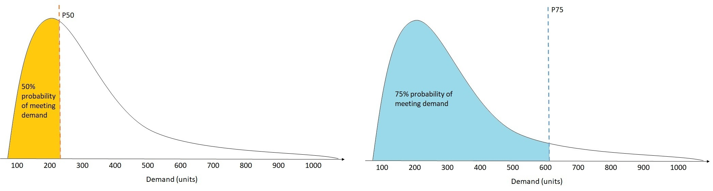

The figure above shows the differing demand forecasts at wQL[0.50] and wQL[0.75]. The
forecasted value at P75 is significantly higher than the forecasted value at P50 because the
P75 forecast is expected to meet demand 75% of the time, whereas the P50 forecast is only
expected to meet demand 50% of the time.

When the sum of observed values over all items and time points is approximately zero in a
given backtest window, the weighted quantile loss expression is undefined. In these cases,
Forecast outputs the unweighted quantile loss, which is the numerator in the wQL
expression.

Forecast also calculates the average wQL, which is the mean value of weighted quantile losses
over all specified quantiles. By default, this will be the average of wQL[0.10], wQL[0.50], and
wQL[0.90].

## Weighted Absolute Percentage Error (WAPE)

The Weighted Absolute Percentage Error (WAPE) measures the overall deviation of forecasted
values from observed values. WAPE is calculated by taking the sum of observed values and the
sum of predicted values, and calculating the error between those two values. A lower value
indicates a more accurate model.

When the sum of observed values for all time points and all items is approximately zero in a given backtest window,
the weighted absolute percentage error expression is undefined. In these cases, Forecast outputs the unweighted absolute error sum, which is the numerator in the WAPE expression.

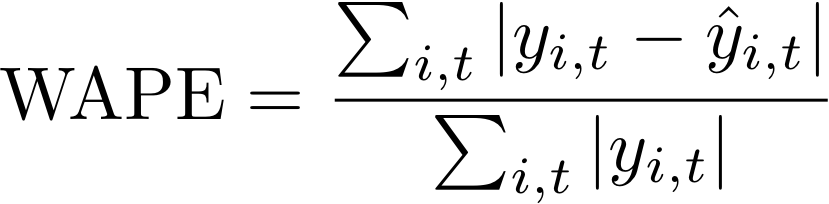

Where:

yi,t - the observed value at point (i,t)

ŷi,t - the predicted value at point (i,t)

Forecast uses the mean forecast as the predicted value, ŷi,t.

WAPE is more robust to outliers than Root Mean Square Error (RMSE) because it uses the
absolute error instead of the squared error.

Amazon Forecast previously referred to the WAPE metric as the Mean Absolute Percentage Error
(MAPE) and used the median forecast (P50) as the predicted value. Forecast now uses the mean
forecast to calculate WAPE. The wQL[0.5] metric is equivalent to the WAPE[median] metric, as
shown below:

![Mathematical equation showing the equivalence of wQL[0.5] and WAPE[median] metrics.](images/wql-to-wape.PNG)

## Root Mean Square Error (RMSE)

Root Mean Square Error (RMSE) is the square root of the average of squared errors, and is
therefore more sensitive to outliers than other accuracy metrics. A lower value indicates a
more accurate model.

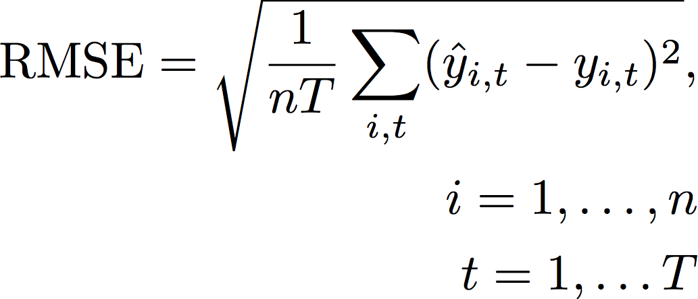

Where:

yi,t - the observed value at point (i,t)

ŷi,t - the predicted value at point (i,t)

nT - the number of data points in a testing set

Forecast uses the mean forecast as the predicted value, ŷi,t. When
calculating predictor metrics, nT is the number of data points in a backtest window.

RMSE uses the squared value of the residuals, which amplifies the impact of outliers. In
use cases where only a few large mispredictions can be very costly, the RMSE is the more
relevant metric.

Predictors created before November 11, 2020 calculated RMSE using the 0.5 quantile (P50)
by default. Forecast now uses the mean forecast.

## Mean Absolute Percentage Error (MAPE)

Mean Absolute Percentage Error (MAPE) takes the absolute value of the percentage error
between observed and predicted values for each unit of time, then averages those values. A
lower value indicates a more accurate model.

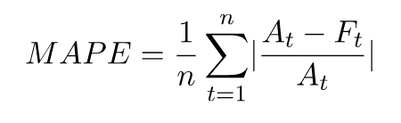

Where:

At - the observed value at point _t_

Ft - the predicted value at point _t_

n - the number of data points in the time series

Forecast uses the mean forecast as the predicted value, Ft.

MAPE is useful for cases where values differ significantly between time points and
outliers have a significant impact.

## Mean Absolute Scaled Error (MASE)

Mean Absolute Scaled Error (MASE) is calculated by dividing the average error by a scaling
factor. This scaling factor is dependent on the seasonality value, _m_, which is selected based on the forecast frequency. A lower value indicates a
more accurate model.

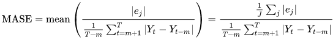

Where:

Yt - the observed value at point _t_

Yt-m - the observed value at point _t-m_

ej - the error at point _j_
(observed value - predicted value)

m - the seasonality value

Forecast uses the mean forecast as the predicted value.

MASE is ideal for datasets that are cyclical in nature or have seasonal properties. For
example, forecasting for items that are in high demand during summers and in low demand during
winters can benefit from taking into account the seasonal impact.

## Exporting Accuracy Metrics

###### Note

Export files can directly return information from the Dataset Import. This makes
the files vulnerable to CSV injection if the imported data contains formulas or
commands. For this reason, exported files can prompt security warnings. To avoid
malicious activity, disable links and macros when reading exported files.

Forecast enables you to export forecasted values and accuracy metrics generated during
backtesting.

You can use these exports to evaluate specific items at specific time points and
quantiles, and better understand your predictor. The backtest exports are sent to a specified
S3 location and contains two folders:

- **forecasted-values**: Contains CSV or Parquet files with forecasted
  values at each forecast type for each backtest.
- **accuracy-metrics-values**: Contains CSV or Parquet files with
  metrics for each backtest, along with the average across all backtests. These metrics
  include wQL for each quantile, Average wQL,RMSE, MASE, MAPE, and WAPE.

The `forecasted-values` folder contains forecasted values at each forecast type
for each backtest window. It also includes information on item IDs, dimensions, timestamps,
target values, and backtest window start and end times.

The `accuracy-metrics-values` folder contains accuracy metrics for each
backtest window, as well as the average metrics across all backtest windows. It contains wQL
metrics for each specified quantile, as well as Average wQL, RMSE, MASE, MAPE, and WAPE
metrics.

Files within both folders follow the naming convention:
`<ExportJobName>_<ExportTimestamp>_<PartNumber>.csv`.

You can export accuracy metrics using the Amazon Forecast Software Development Kit (SDK) and the
Amazon Forecast console.

Forecast SDK
Using the [CreatePredictorBacktestExportJob](API_CreatePredictorBacktestExportJob.md "API_CreatePredictorBacktestExportJob.md") operation, specify your S3
location and IAM role in the [DataDestination](API_DataDestination.md "API_DataDestination.md") object, along with the
`PredictorArn` and `PredictorBacktestExportJobName`.

For example:

```
{
   "Destination": {
      "S3Config": {
         "Path": "s3://bucket/example-path/",
         "RoleArn": "arn:aws:iam::000000000000:role/ExampleRole"
      }
   },
   "Format": PARQUET;
   "PredictorArn": "arn:aws:forecast:region:predictor/example",
   "PredictorBacktestExportJobName": "backtest-export-name",
}

```

Forecast Console
Choose your predictor on the **Predictors** page. In
the **Predictor metrics** section, choose **Export backtest
results**.

During the **Create predictor backtest export** stage,
set the **Export name**, **IAM
Role**, and **S3 predictor backtest export
location** fields.

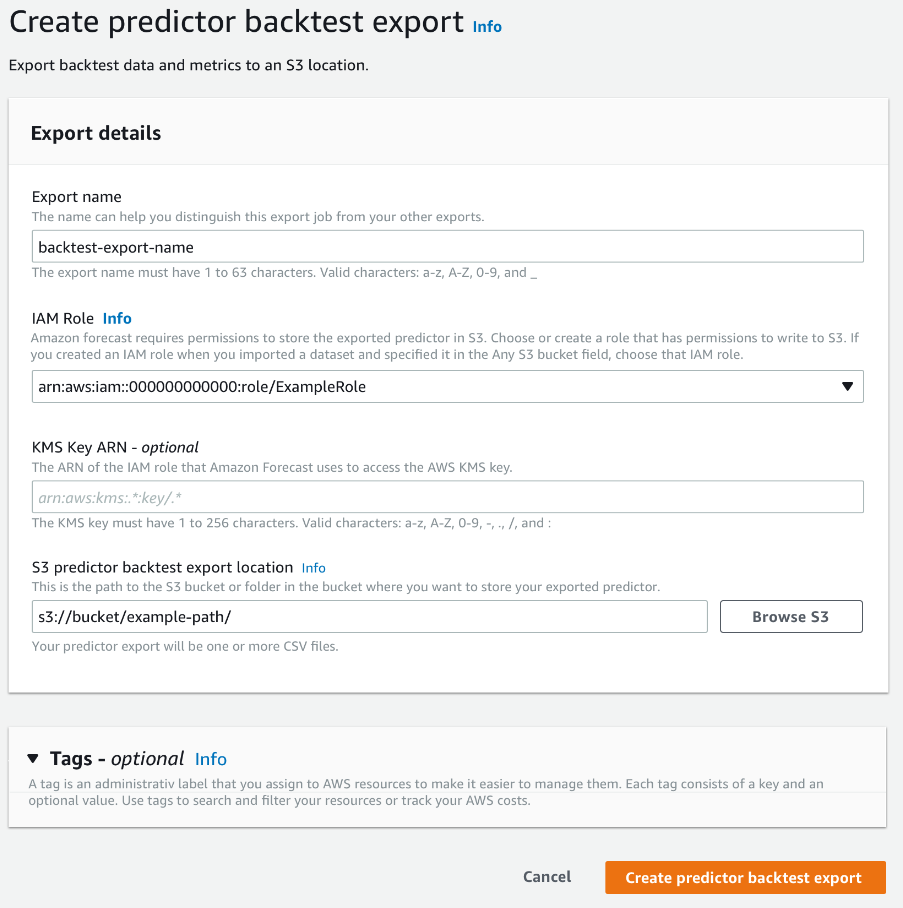

## Choosing Forecast Types

Amazon Forecast uses forecast types to create predictions and evaluate predictors. Forecast
types come in two forms:

- **Mean forecast type** - A forecast using the mean as the
  expected value. Typically used as point forecasts for a given time point.
- **Quantile forecast type** - A forecast at a specified
  quantile. Typically used to provide a prediction interval, which is a range of possible
  values to account for forecast uncertainty. For example, a forecast at the
  `0.65` quantile will estimate a value that is lower than the observed value
  65% of the time.

By default, Forecast uses the following values for the predictor forecast types:
`0.1` (P10), `0.5` (P50), and `0.9` (P90). You can choose
up to five custom forecast types, including `mean` and quantiles ranging from
`0.01` (P1) to `0.99` (P99).

Quantiles can provide an upper and lower bound for forecasts. For example, using the
forecast types `0.1` (P10) and `0.9` (P90) provides a range of values
known as an 80% confidence interval. The observed value is expected to be lower than the P10
value 10% of the time, and the P90 value is expected to be higher than the observed value 90%
of the time. By generating forecasts at p10 and P90, you can expect the true value to fall
between those bounds 80% of the time. This range of values is depicted by the shaded region
between P10 and P90 in the figure below.

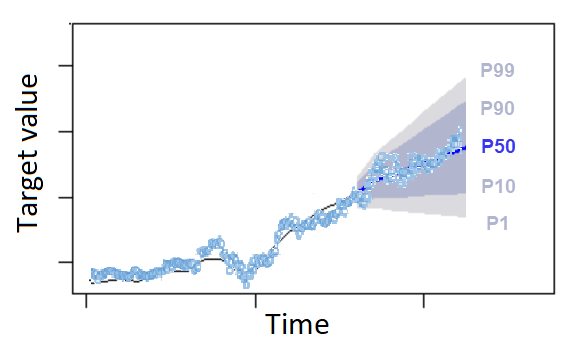

You can also use a quantile forecast as a point forecast when the cost of underpredicting
differs from the cost of overpredicting. For example, in some retail cases the cost of being
understocked is higher than the cost of being overstocked. In these cases, the forecast at
0.65 (P65) is more informative than the median (P50) or mean forecast.

When training a predictor, you can choose custom forecast types using the Amazon Forecast
Software Development Kit (SDK) and Amazon Forecast console.

Forecast SDK
Using the [CreateAutoPredictor](API_CreateAutoPredictor.md "API_CreateAutoPredictor.md") operation, specify the custom forecast types
in the `ForecastTypes` parameter. Format the parameter as an array of
strings.

For example, to create a predictor at the `0.01`, `mean`,
`0.65`, and `0.99` forecast types, use the following
code.

```
{
    "ForecastTypes": [ "0.01", "mean", "0.65", "0.99" ],
},
```

Forecast Console
During the **Train Predictor** stage, specify the
custom forecast types in the **Forecast types** field. Choose
**Add new forecast type** and enter a forecast type value.

For example, to create a predictor using the `0.01`, `mean`,
`0.65`, and `0.99` forecast types, enter the following values in
the **Forecast types** fields shown below.

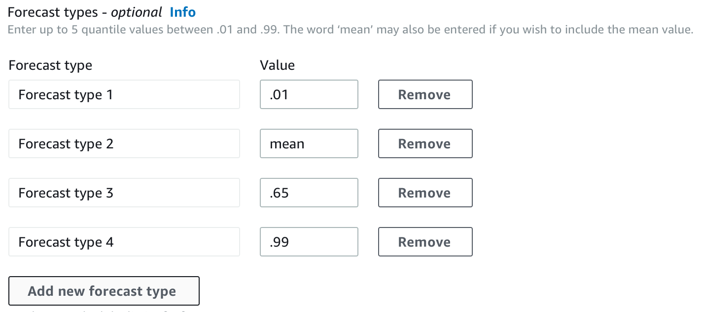

## Working With Legacy Predictors

### Setting Backtesting Parameters

Forecast uses backtesting to calculate accuracy metrics. If you run multiple backtests,
Forecast averages each metric over all backtest windows. By default, Forecast computes one
backtest, with the size of the backtest window (testing set) equal to the length of the
forecast horizon (prediction window). You can set both the _backtest
window length_ and the _number of backtest
scenarios_ when training a predictor.

Forecast omits filled values from the backtesting process, and any item with filled values
within a given backtest window will be excluded from that backtest. This is because Forecast
only compares forecasted values with observed values during backtesting, and filled values
are not observed values.

The backtest window must be at least as large as the forecast horizon, and smaller than
half the length of the entire target time-series dataset. You can choose from between 1 and
5 backtests.

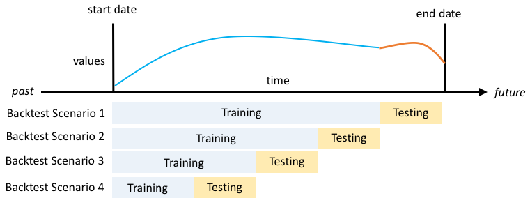

Generally, increasing the number of backtests produces more reliable accuracy metrics,
since a larger portion of the time series is used during testing and Forecast is able to take
an average of metrics across all backtests.

You can set the backtesting parameters using the Amazon Forecast Software Development Kit
(SDK) and the Amazon Forecast console.

Forecast SDK
Using the [CreatePredictor](API_CreatePredictor.md "API_CreatePredictor.md") operation,
set the backtest parameters in the [EvaluationParameters](API_EvaluationParameters.md "API_EvaluationParameters.md") datatype. Specify the length of the testing set during
backtesting with the `BackTestWindowOffset` parameter, and the number of
backtest windows with the `NumberOfBacktestWindows` parameter.

For example, to run 2 backtests with a testing set of 10 time points, use the
follow code.

```
"EvaluationParameters": {
    "BackTestWindowOffset": 10,
    "NumberOfBacktestWindows": 2
}

```

Forecast Console
During the **Train Predictor** stage, set the length
of the testing set during backtesting with the **Backtest window
offset** field, and the number of backtest windows with the
**Number of backtest windows** field.

For example, to run 2 backtests with a testing set of 10 time points, set the
following values.

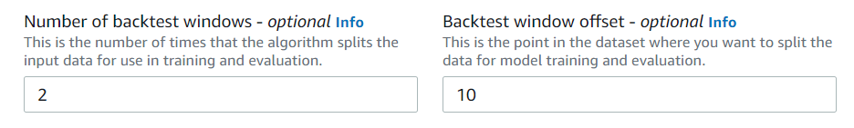

### HPO and AutoML

By default, Amazon Forecast uses the `0.1` (P10), `0.5` (P50), and
`0.9` (P90) quantiles for hyperparameter tuning during hyperparameter
optimization (HPO) and for model selection during AutoML. If you specify custom forecast
types when creating a predictor, Forecast uses those forecast types during HPO and AutoML.

If custom forecast types are specified, Forecast uses those specified forecast types to
determine the optimal outcomes during HPO and AutoML. During HPO, Forecast uses the first
backtest window to find the optimal hyperparameter values. During AutoML, Forecast uses the
averages across all backtest windows and the optimal hyperparameters values from HPO to find
the optimal algorithm.

For both AutoML and HPO, Forecast chooses the option that minimizes the average losses over
the forecast types. You can also optimize your predictor during AutoML and HPO with one of
the following accuracy metrics: Average Weighted Quantile loss (Average wQL), Weighted
Absolute Percentage Error (WAPE), Root Mean Squared Error (RMSE), Mean Absolute Percentage
Error (MAPE), or Mean Absolute Scaled Error (MASE).

You can choose an optimization metric using the Amazon Forecast Software Development Kit (SDK)
and Amazon Forecast console.

Forecast SDK
Using the [CreatePredictor](API_CreatePredictor.md "API_CreatePredictor.md") operation, specify the custom forecast types in
the `ObjectiveMetric` parameter.

The `ObjectiveMetric` parameter accepts the following values:

- `AverageWeightedQuantileLoss` - Average Weighted Quantile
  loss
- `WAPE` - Weighted Absolute Percentage Error
- `RMSE` - Root Mean Squared Error
- `MAPE` - Mean Absolute Percentage Error
- `MASE` - Mean Absolute Scaled Error

For example, to create a predictor with AutoML and optimize using the Mean
Absolute Scaled Error (MASE) accuracy metric, use the following code.

```
{
    ...
    "PerformAutoML": "true",
    ...
    "ObjectiveMetric": "MASE",
},
```

Forecast Console
During the **Train Predictor** stage, choose
**Automatic (AutoML)**. In the **Objective
metric** section, choose the accuracy metric to use to optimize your
predictor.

For example, the following image shows a predictor created with AutoML and
optimized using the Mean Absolute Scaled Error (MASE) accuracy metric.

When using the console, you can only specify the Objective metric when you create
a predictor using AutoML. If you manually select an algorithm, you cannot specify the
Objective metric for HPO.
