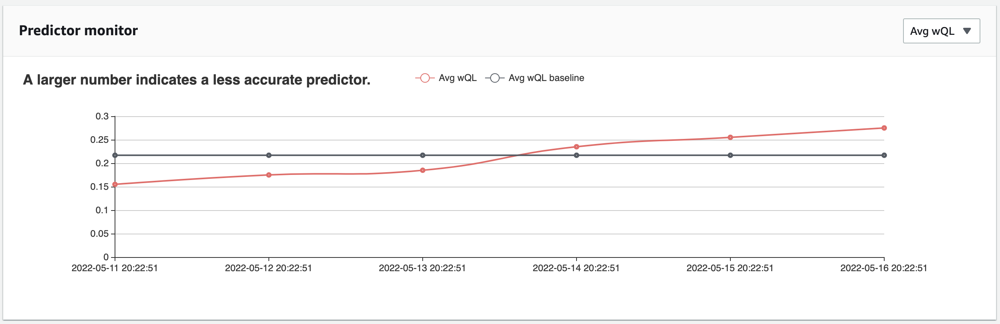

Amazon Forecast is no longer available to new customers. Existing customers of
Amazon Forecast can continue to use the service as normal.
[Learn more"](https://aws.amazon.com/blogs/machine-learning/transition-your-amazon-forecast-usage-to-amazon-sagemaker-canvas/ "https://aws.amazon.com/blogs/machine-learning/transition-your-amazon-forecast-usage-to-amazon-sagemaker-canvas/")

# Viewing Monitoring Results

After you generate a forecast and then import more data, you can view the results of
predictor monitoring. You can see a visualization of results with the Forecast console or
you can programmatically retrieve results with the [ListMonitorEvaluations](API_ListMonitorEvaluations.md "API_ListMonitorEvaluations.md")
operation.

The Forecast console displays graphs of results for each [predictor metric](metrics.md "metrics.md").
Graphs include how each metric
has changed over the lifetime of your predictor and predictor events, such as retraining.

The [ListMonitorEvaluations](API_ListMonitorEvaluations.md "API_ListMonitorEvaluations.md") operation returns metric results and predictor events for different windows of time.

Console

###### To view predictor monitoring results

1. Sign in to the AWS Management Console and open the Amazon Forecast console at [https://console.aws.amazon.com/forecast/](https://console.aws.amazon.com/forecast/ "https://console.aws.amazon.com/forecast/").
2. From **Dataset groups**, choose your dataset
   group.
3. In the navigation pane, choose
   **Predictors**.
4. Choose the predictor and choose the **Monitoring** tab.
   - The **Monitoring results** section shows how
     different accuracy metrics have changed over time. Use the dropdown list
     to change which metric the graph tracks.
   - The **Monitoring history**
     section lists the details for the different events tracked in the results.
     The following is an example of a graph of how the `Avg
wQL` score for a predictor has changed over time. In this
     graph, notice that the `Avg wQL` value is increasing over
     time. This increase indicates that the predictor accuracy is
     decreasing. Use this information to determine whether you need to
     revalidate the model and take action.



SDK for Python (Boto3)

To get monitoring results with the SDK for Python (Boto3), use the `list_monitor_evaluations` method. Provide the Amazon Resource Name (ARN) of the monitor,
and optionally specify the maximum number of results to retrieve with the `MaxResults` parameter. Optionally specify a `Filter` to filter
results. You can filter evaluations by a `EvaluationState` of either `SUCCESS` or `FAILURE`.
The following code gets at maximum 20 successful monitoring evaluations.

```
import boto3

forecast = boto3.client('forecast')

monitor_results = forecast.list_monitor_evaluations(
    MonitorArn = '`monitor_arn`',
    MaxResults = 20,
    Filters = [
      {
         "Condition": "IS",
         "Key": "EvaluationState",
         "Value": "SUCCESS"
      }
   ]
)
print(monitor_results)

```

The following is an example JSON response.

```

{
  "NextToken": "string",
  "PredictorMonitorEvaluations": [
    {
      "MonitorArn": "MonitorARN",
      "ResourceArn": "PredictorARN",
      "EvaluationTime": "2020-01-02T00:00:00Z",
      "EvaluationState": "SUCCESS",
      "WindowStartDatetime": "2019-01-01T00:00:00Z",
      "WindowEndDatetime": "2019-01-03T00:00:00Z",
      "PredictorEvent": {
        "Detail": "Retrain",
        "Datetime": "2020-01-01T00:00:00Z"
      },
      "MonitorDataSource": {
        "DatasetImportJobArn": "arn:aws:forecast:`region`:`accountNumber`:dataset-import-job/`*`",
        "ForecastArn": "arn:aws:forecast:`region`:`accountNumber`:forecast/`*`",
        "PredictorArn": "arn:aws:forecast:`region`:`accountNumber`:predictor/`*`",

      },
      "MetricResults": [
        {
          "MetricName": "AverageWeightedQuantileLoss",
          "MetricValue": 0.17009070456599376
        },
        {
          "MetricName": "MAPE",
          "MetricValue": 0.250711322309796
        },
        {
          "MetricName": "MASE",
          "MetricValue": 1.6275608734888485
        },
        {
          "MetricName": "RMSE",
          "MetricValue": 3100.7125081405547
        },
        {
          "MetricName": "WAPE",
          "MetricValue": 0.17101159704738722}
      ]
    }
  ]
}

```
