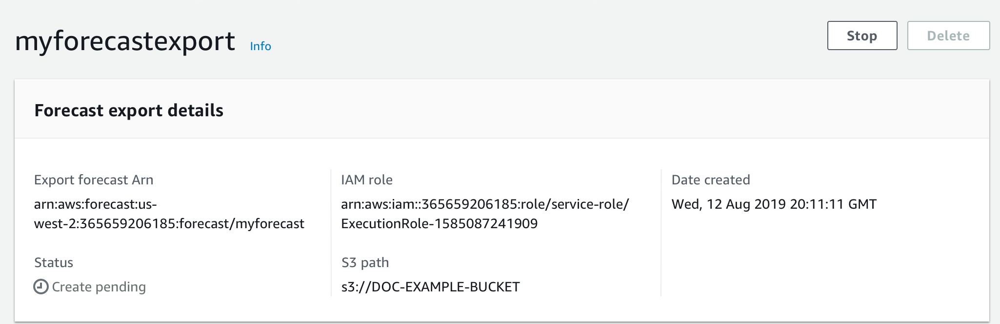

Amazon Forecast is no longer available to new customers. Existing customers of
Amazon Forecast can continue to use the service as normal.
[Learn more"](https://aws.amazon.com/blogs/machine-learning/transition-your-amazon-forecast-usage-to-amazon-sagemaker-canvas/ "https://aws.amazon.com/blogs/machine-learning/transition-your-amazon-forecast-usage-to-amazon-sagemaker-canvas/")

# Stopping Resources

The Amazon Forecast `Stop Resource` ([StopResource](API_StopResource.md "API_StopResource.md")) operation stops a resource job that is in
progress. You can stop the following resource jobs:

- Dataset group import (`CreateDatasetImportJob`)
- Predictor training (`CreateAutoPredictor` and
  `CreatePredictor`)
- Predictor backtest export (`CreatePredictorBacktestExportJob`)
- Forecast (`CreateForecast`)
- Forecast export (`CreateForecastExportJob`)
- What-if analysis (`CreateWhatIfAnalysis`)
- What-if forecast (`CreateWhatIfForecast`)
- What-if forecast export (`CreateWhatIfForecastExportJob`)
  You can't resume a resource job after it has stopped.

Stopping a resource ends its workflow, but doesn't delete the resource.
You can still preview the resource parameters in the console and with the [Describe](API_Operations_Amazon_Forecast_Service.md "API_Operations_Amazon_Forecast_Service.md") operation.

When you stop a predictor or forecast job, you are billed for resources
used up to the point when the job stopped.

You can stop a resource job using the Forecast console or the AWS Software Development Kit
(SDK).

Console
**To stop a resource job**

1. Sign in to the AWS Management Console and open the Amazon Forecast console at [https://console.aws.amazon.com/forecast/](https://console.aws.amazon.com/forecast/ "https://console.aws.amazon.com/forecast/").
2. In the navigation pane, choose the resource type.
3. Choose the resource job.
4. Choose **Stop**.



SDK
**To stop a resource job**

Using the [StopResource](API_StopResource.md "API_StopResource.md") operation, set
the value of `ResourceArn` to the Amazon Resource Name (ARN) that
identifies the resource job that you want to stop.

```
        {
            "ResourceArn": "arn:`partition:service:region:account-id:resource-id`"
        }
```
