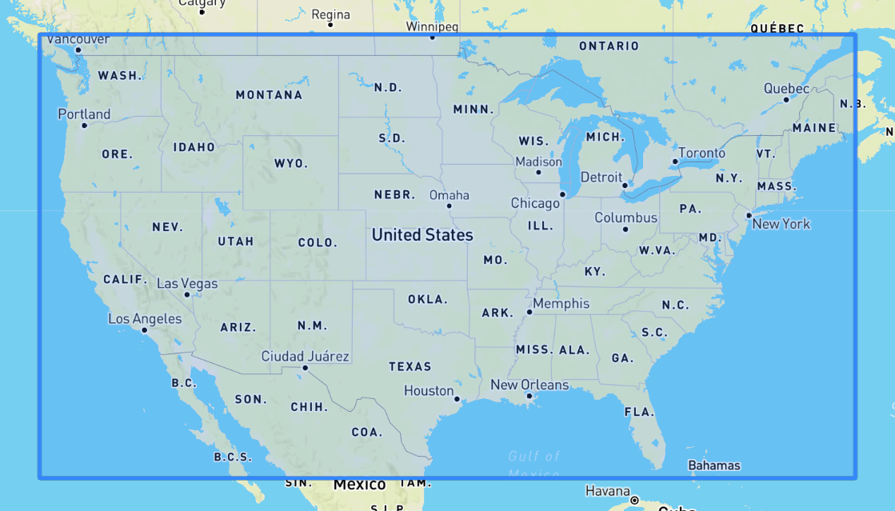
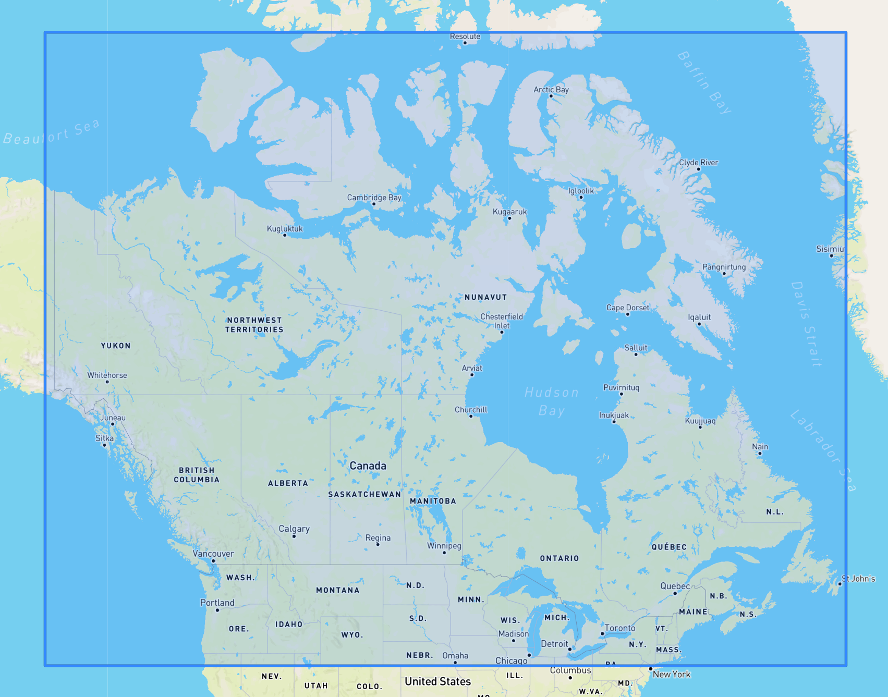
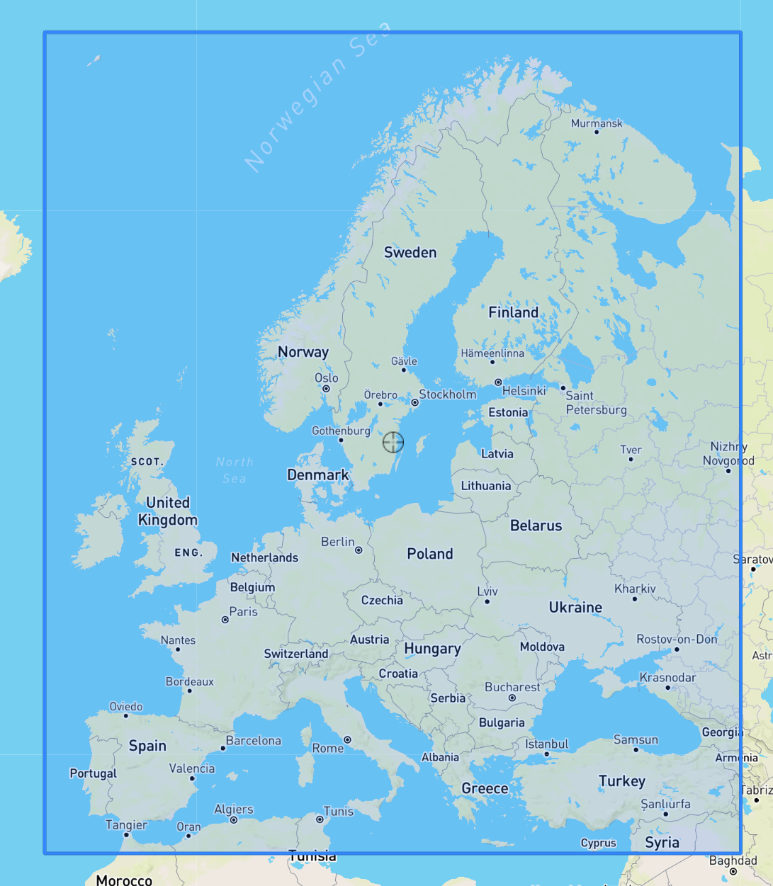
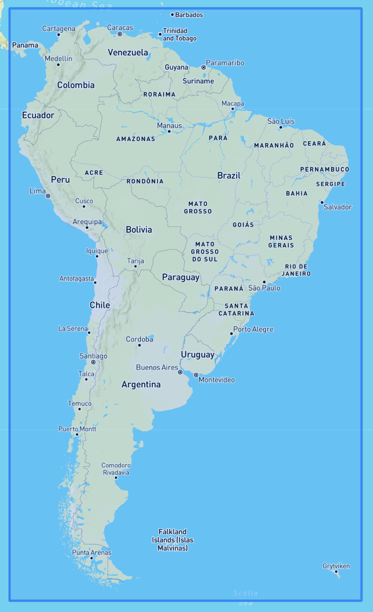
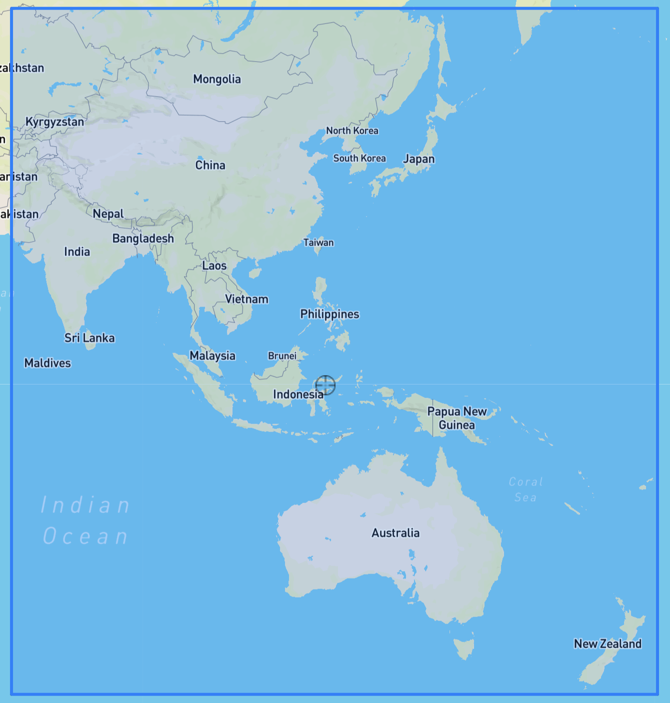
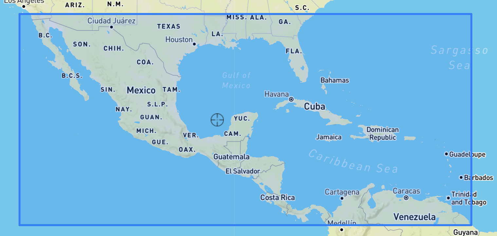
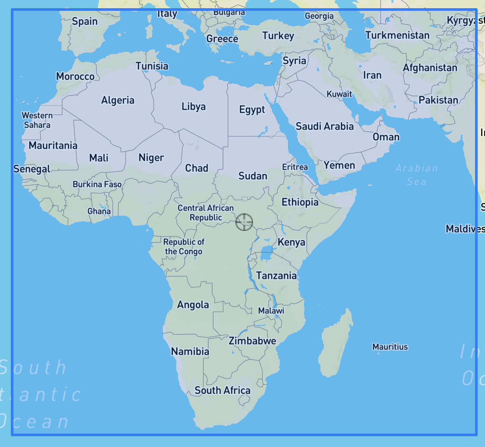
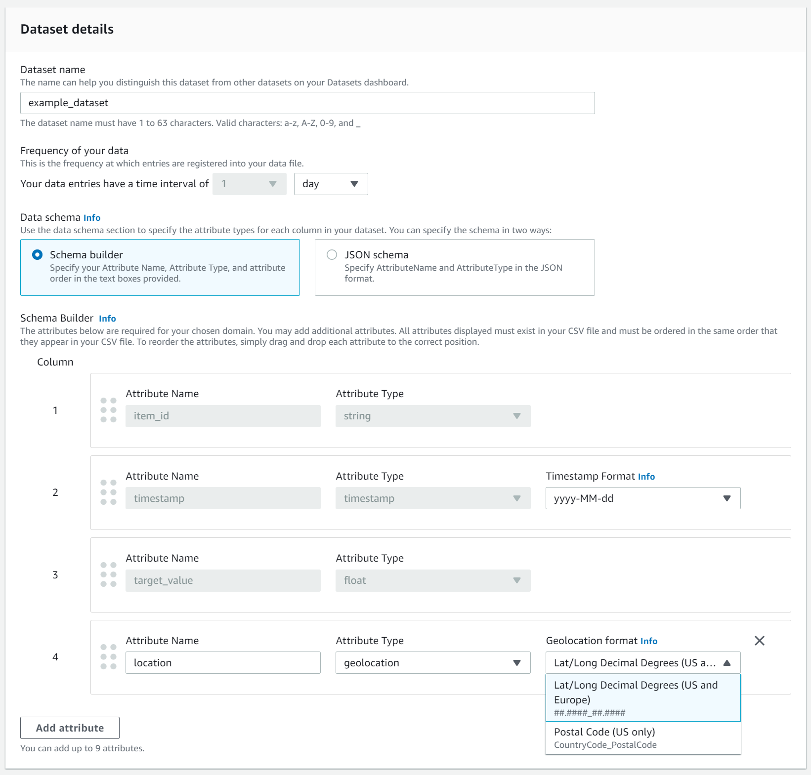
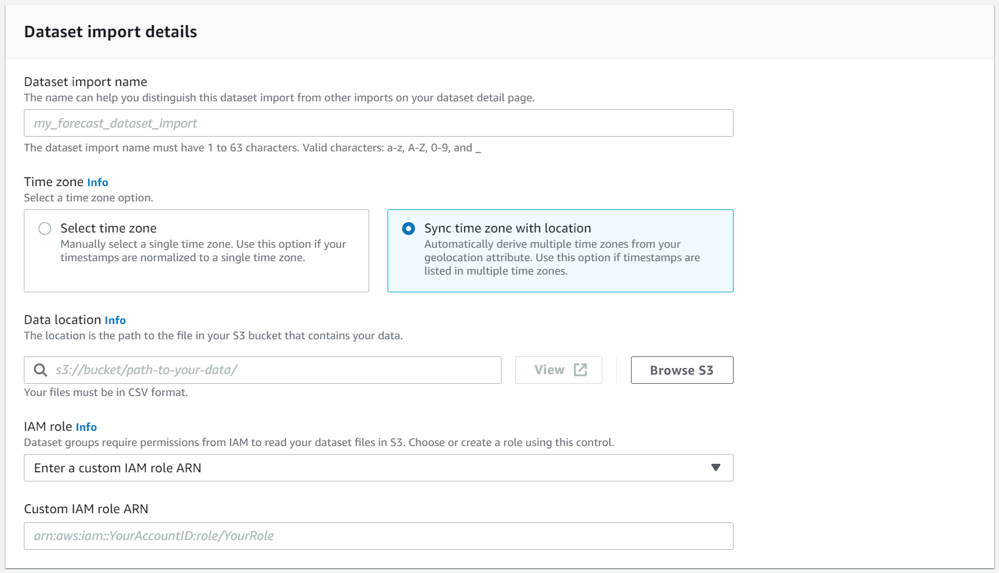
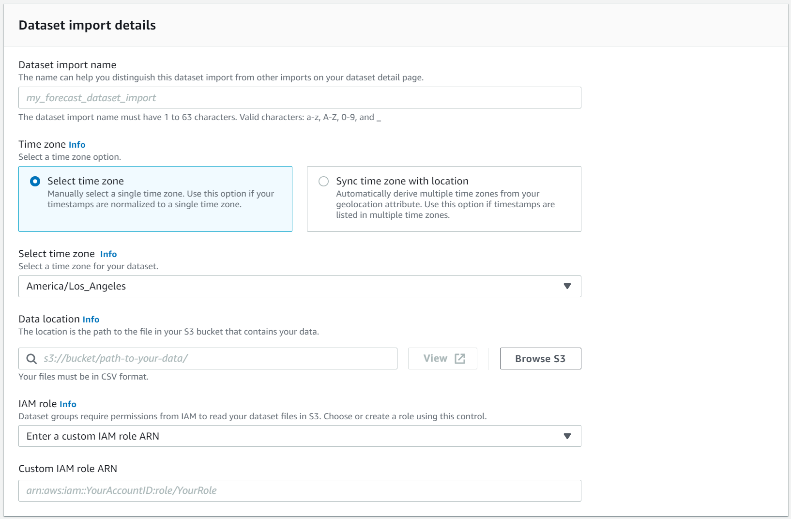

Amazon Forecast is no longer available to new customers. Existing customers of
Amazon Forecast can continue to use the service as normal.
[Learn more"](https://aws.amazon.com/blogs/machine-learning/transition-your-amazon-forecast-usage-to-amazon-sagemaker-canvas/ "https://aws.amazon.com/blogs/machine-learning/transition-your-amazon-forecast-usage-to-amazon-sagemaker-canvas/")

# Weather Index

The Amazon Forecast Weather Index is a built-in featurization that incorporates historical and
projected weather information into your model. It is especially useful for retail use cases,
where temperature and precipitation can significantly affect product demand.

When the Weather Index is enabled, Forecast applies the weather featurization only to time
series where it finds improvements in accuracy during predictor training. If supplementing a
time series with weather information does not improve its predictive accuracy during
backtesting, Forecast does not apply the Weather Index to that particular time series.

To apply the Weather Index, you must include a [geolocation attribute](#adding-geolocation "#adding-geolocation") in your target time series dataset and any related time
series datasets. You also need to specify [time
zones](#specifying-timezones "#specifying-timezones") for your target time-series timestamps. For more information regarding
dataset requirements, see [Conditions and
Restrictions](#weather-conditions-restrictions "#weather-conditions-restrictions").

###### Python notebooks

For a step-by-step guide on using the Weather Index, see [NY Taxi: Amazon Forecast with Weather Index](https://github.com/aws-samples/amazon-forecast-samples/tree/master/notebooks/advanced/Weather_index "https://github.com/aws-samples/amazon-forecast-samples/tree/master/notebooks/advanced/Weather_index").

###### Topics

- [Enabling the Weather Index](#enabling-weather "#enabling-weather")
- [Adding Geolocation Information to Datasets](#adding-geolocation "#adding-geolocation")
- [Specifying Time Zones](#specifying-timezones "#specifying-timezones")
- [Conditions and Restrictions](#weather-conditions-restrictions "#weather-conditions-restrictions")

## Enabling the Weather Index

The Weather Index is enabled during the predictor training stage.

When using the [CreateAutoPredictor](API_CreateAutoPredictor.md "API_CreateAutoPredictor.md") operation, the Weather Index is included in
the [AdditionalDataset](API_AdditionalDataset.md "API_AdditionalDataset.md") data
type.

Before enabling the Weather Index, you must include a geolocation attribute in your
target time series and related timeseries datasets, and define the time zones for your
timestamps. For more information, see [Adding
Geolocation Information](#adding-geolocation "#adding-geolocation") and [Specifying
Time Zones](#specifying-timezones "#specifying-timezones").

You can enable the Weather Index using the Forecast console or the Forecast Software
Development Kit (SDK) .

Console
**To enable the Weather Index**

1. Sign in to the AWS Management Console and open the Amazon Forecast console at [https://console.aws.amazon.com/forecast/](https://console.aws.amazon.com/forecast/ "https://console.aws.amazon.com/forecast/").
2. From **Dataset groups**, choose your dataset
   group.
3. In the navigation pane, choose
   **Predictors**.
4. Choose **Train new predictor**.
5. Choose **Enable Weather Index**.

SDK
**To enable the Weather Index**

Using the [CreateAutoPredictor](API_CreateAutoPredictor.md "API_CreateAutoPredictor.md") operation, enable the Weather
Index by adding `"Name": "weather"` and `"Value":
 "true"` in the [AdditionalDataset](API_AdditionalDataset.md "API_AdditionalDataset.md") data type.

```
    "DataConfig": {
        ...
        "AdditionalDatasets": [
            ...
            {
                "Name": "weather",
            }
            ]
        },
```

## Adding Geolocation Information to Datasets

To use the Weather Index, you must include a geolocation attribute for each item in
your target time series and related time series datasets. The attribute is defined with
the `geolocation` attribute type within the dataset schemas.

All geolocation values in a dataset must be exclusively within a single region. The
regions are: US (excluding Hawaii and Alaska), Canada, South America, Central America,
Asia Pacific, Europe, and Africa & Middle East.

Specify the geolocation attribute in one of two formats:

- **Latitude & Longitude** (All regions) -
  Specify the latitude and longitude in decimal format (Example:
  47.61\_-122.33)
- **Postal code** (US only) - Specify the country
  code (US), followed by the 5-digit ZIP code (Example: US_98121)

The Latitude & Longitude format is supported for all regions. The Postal code
format is only supported for the US region.

###### Topics

- [Latitude & Longitude Bounds](#geolocation-bounds "#geolocation-bounds")
- [Including Geolocation in the Dataset
  Schema](#geolocation-schema "#geolocation-schema")
- [Setting the Geolocation Format](#geolocation-format "#geolocation-format")

### Latitude & Longitude Bounds

The following are the latitudinal and longitudinal bounds for the accepted
regions:

US Region
**Bounds**: latitude (24.6, 50.0),
longitude (-126.0, -66.4).



Canada Region
**Bounds**: latitude (41.0, 75.0),
longitude (-142.0, -52.0).



Europe Region
**Bounds**: latitude (34.8, 71.8),
longitude (-12.6, 44.8).



South America Region
**Bounds**: latitude (-56.6, 14.0),
longitude (-82.4, -33.00).



Asia Pacific Region
**Bounds**: latitude (-47.8, 55.0),
longitude (67.0, 180.60).



Central America Region
**Bounds**: latitude (6.80, 33.20),
longitude (-118.80, -58.20).



Africa & Middle East Region
**Bounds**: latitude (-35.60, 43.40),
longitude (-18.80, -58.20).



### Including Geolocation in the Dataset

Schema

Using the console or [CreateDataset](API_CreateDataset.md "API_CreateDataset.md")
operation, define the location attribute type as 'geolocation' within the JSON
schema for the target time series and any related time series. The attributes in the
schema must be ordered as they appear in the datasets.

```
 {
  "Attributes":[
    {
       "AttributeName": "timestamp",
       "AttributeType": "timestamp"
    },
    {
       "AttributeName": "target_value",
       "AttributeType": "float"
    },
    {
       "AttributeName": "item_id",
       "AttributeType": "string"
    },
    {
       "AttributeName": "location",
       "AttributeType": "geolocation"
    }
  ]
}
```

### Setting the Geolocation Format

The format of the geolocation attribute can be in the **Postal
Code** or **Latitude & Longitude**
format. You can set the geolocation format using the Forecast console or the Forecast
Software Development Kit (SDK).

Console
**To add a geolocation attribute to a time series
dataset**

1. Sign in to the AWS Management Console and open the Amazon Forecast console at [https://console.aws.amazon.com/forecast/](https://console.aws.amazon.com/forecast/ "https://console.aws.amazon.com/forecast/").
2. Choose **Create dataset group**.
3. In the **Schema builder**, set your
   geolocation **Attribute type** to
   `geolocation`.
4. In the **Geolocation format** drop-down,
   choose your location format.



You can also define your attributes in JSON format and select a
location format from the **Geolocation format**
drop-down.

SDK
**To add a geolocation attribute to a time series
dataset**

Using the [CreateDatasetImportJob](API_CreateDatasetImportJob.md "API_CreateDatasetImportJob.md") operation, set the value of
`GeolocationFormat` to one of the following:

- **Latitude & longitude** (All
  regions): `"LAT_LONG"`
- **Postal code** (US Only):
  `"CC_POSTALCODE"`

For example, to specify the latitude & longitude format, include
the following in `CreateDatasetImportJob` request:

```
{
    ...
    "GeolocationFormat": "LAT_LONG"
}
```

## Specifying Time Zones

You can either let Amazon Forecast automatically synchronize your time zone information with
your geolocation attribute, or you can manually assign a single time zone to your entire
dataset.

###### Topics

- [Automatically Sync Time Zones with
  Geolocation](#timezones-automatic "#timezones-automatic")
- [Manually Select a Single Time Zone](#timezones-manual "#timezones-manual")

### Automatically Sync Time Zones with

Geolocation

This option is ideal for datasets that contain timestamps in multiple time zones,
and those timestamps are expressed in local time. Forecast assigns a time zone for
every item in the target time series dataset based on the item’s geolocation
attribute.

You can automatically sync your timestamps with your geolocation attribute using
the Forecast console or Forecast SDK.

Console
**To sync time zones with the geolocation
attribute**

1. Sign in to the AWS Management Console and open the Amazon Forecast console at [https://console.aws.amazon.com/forecast/](https://console.aws.amazon.com/forecast/ "https://console.aws.amazon.com/forecast/").
2. In the navigation pane, choose **Create dataset
   group**.
3. In **Dataset import details**, choose
   **Sync time zone with location**.



SDK
**To sync time zones with the geolocation
attribute**

Using the [CreateDatasetImportJob](API_CreateDatasetImportJob.md "API_CreateDatasetImportJob.md") operation, set
`"UseGeolocationForTimeZone"` to
`"true"`.

```
{
    ...
    "UseGeolocationForTimeZone": "true"
}
```

### Manually Select a Single Time Zone

###### Note

You can manually select a time zone outside of the _US
region_, _Canada region_,
_South America region_, _Central America region_, _Asia Pacific region_, _Europe
region_, and _Africa & Middle East
region_. However, all geolocation values must still be within one
of those regions.

This option is ideal for datasets with all timestamps within a single time zone,
or if all timestamps are normalized to a single time zone. Using this option applies
the same time zone to every item in the dataset.

The Weather Index accepts the following time zones:

**US region**

- America/Los_Angeles
- America/Phoenix
- America/Denver
- America/Chicago
- America/New_York

**Canada region**

- America/Vancouver
- America/Edmonton
- America/Regina
- America/Winnipeg
- America/Toronto
- America/Halifax
- America/St_Johns

**Europe region**

- Europe/London
- Europe/Paris
- Europe/Helsinki

**South America region**

- America/Buenos_Aires
- America/Noronha
- America/Caracas

**Asia Pacific region**

- Asia/Kabul
- Asia/Karachi
- Asia/Kolkata
- Asia/Kathmandu
- Asia/Dhaka
- Asia/Rangoon
- Asia/Bangkok
- Asia/Singapore
- Asia/Seoul
- Australia/Adelaide
- Australia/Melbourne
- Australia/Lord_Howe
- Australia/Eucla
- Pacific/Norfolk
- Pacific/Auckland

**Central America**

- America/Puerto_Rico

**Africa & Middle East**

- Africa/Nairobi
- Asia/Tehran
- Asia/Dubai

**Other**

- Pacific/Midway
- Pacific/Honolulu
- Pacific/Marquesas
- America/Anchorage
- Atlantic/Cape_Verde
- Asia/Anadyr
- Pacific/Chatham
- Pacific/Enderbury
- Pacific/Kiritimati

Select a time zone from the **Other** list if items
in your dataset are located within one of the accepted region, but your timestamps
are standardized to a time zone outside of that region.

For a complete list of valid time zone names, see [Joda-Time
library](http://joda-time.sourceforge.net/timezones.html "http://joda-time.sourceforge.net/timezones.html").

You can manually set a time zone for your datasets using the Forecast console or
Forecast SDK.

Console
**To select a single time zone for your
dataset**

1. Sign in to the AWS Management Console and open the Amazon Forecast console at [https://console.aws.amazon.com/forecast/](https://console.aws.amazon.com/forecast/ "https://console.aws.amazon.com/forecast/").
2. In the navigation pane, choose **Create dataset
   group**.
3. In **Dataset import details**, choose
   **Select time zone**.

For example, use the following to apply Los Angeles time (Pacific
Standard Time) to your datasets.



SDK
**To select a single time zone for your
dataset**

Using the [CreateDatasetImportJob](API_CreateDatasetImportJob.md "API_CreateDatasetImportJob.md") operation, set `"TimeZone"`
to a valid time zone.

For example, use the following to apply Los Angeles time (Pacific
Standard Time) to your datasets.

```
{
    ...
    "TimeZone": "America/Los_Angeles"
}
```

## Conditions and Restrictions

The following conditions and restrictions apply when using the Weather Index:

- **Available algorithms**: If using a legacy
  predictor, the Weather Index can be enabled when you train a predictor with the
  CNN-QR, DeepAR+, and Prophet algorithms. The Weather Index is not applied to
  ARIMA, ETS, and NPTS.
- **Forecast frequency**: The valid forecast
  frequencies are `Minutely`, `Hourly`, and `Daily`.
- **Forecast horizon**: The forecast horizon cannot
  span further than 14 days into the future. For forecast horizon limits for each
  forecast frequency, refer to the list below:
  - `1 minute` - 500
  - `5 minutes` - 500
  - `10 minutes` - 500
  - `15 minutes` - 500
  - `Hourly` - 330
  - `Daily` - 14

- **Time series length**: When training a model
  with the Weather Index, Forecast truncates all time series datasets with timestamps
  before the start date of the Forecast weather dataset featurization. The
  Forecast weather dataset featurization contains the following start dates:

      + **US region**: July 2, 2018
      + **Europe region**: July 2, 2018
      + **Asia Pacific region**: July 2, 2018
      + **Canada region**: July 2, 2019
      + **South America region**: January 2,
       2020
      + **Central America region**: September 2,
       2020
      + **Africa & Middle East region**:
       March 25, 2021

  With the Weather Index enabled, data points with timestamps before the start
  date will not be used during predictor training.

- **Number of locations**: The target time series
  dataset cannot exceed 2000 unique locations.
- **Region bounds**: All items in your datasets
  must be located within a single region.
- **Minimum time series length**: Due to additional
  data requirements when testing the Weather Index, the minimum length for a time
  series dataset is:

`3 × ForecastHorizon + (BacktestWindows + 1) ×
 BacktestWindowOffset`

If your time series datasets do not meet this requirement, consider decreasing
the following:

    + `ForecastHorizon` - Shorten your forecast horizon.
    + `BacktestWindowOffset` - Shorten the length of the testing
     set during backtesting.
    + `BacktestWindows` - Reduce the number of backtests.
