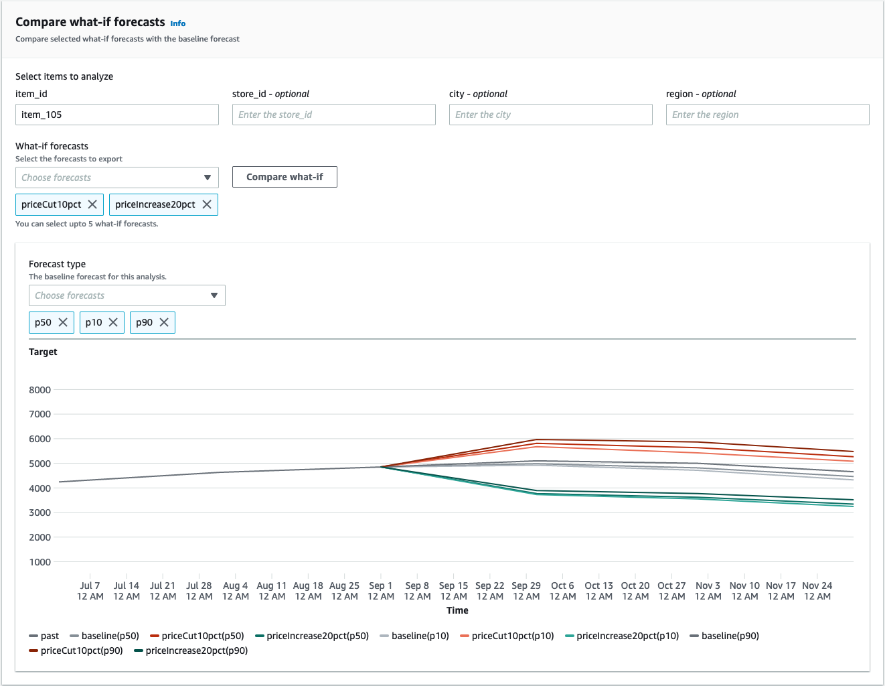

Amazon Forecast is no longer available to new customers. Existing customers of
Amazon Forecast can continue to use the service as normal.
[Learn more"](https://aws.amazon.com/blogs/machine-learning/transition-your-amazon-forecast-usage-to-amazon-sagemaker-canvas/ "https://aws.amazon.com/blogs/machine-learning/transition-your-amazon-forecast-usage-to-amazon-sagemaker-canvas/")

# What-if analysis

A what-if analysis is a tool to help investigate and explain how different scenarios might
affect the baseline forecast created by Amazon Forecast. The baseline forecast is the forecast that is
created by Amazon Forecast based on the original related time series that you provide.

A what-if analysis creates a series of what-if forecasts based on how you chose to modify the related time
series. Those what-if forecasts are compared and contrasted with the baseline forecast to help
you understand how specific changes might impact your model.

There are two methods for creating a modified related time series. You can either provide a
modified related time series in an Amazon S3 path or specify a set of transformations to the existing
related time series. When you specify a set of transformations, a copy of the original related
time series is created to contain these changes.

The transformations allow you to create a subset of the related time series and modify
specific attributes of the related time series. For more information, see [Replacement Dataset](replacement-series.md "replacement-series.md") and [Transformation Functions](data-transformations.md "data-transformations.md").

###### Topics

- [Creating a what-if analysis](#how-what-if-works "#how-what-if-works")
- [Transformation Functions](data-transformations.md "data-transformations.md")
- [Replacement Dataset](replacement-series.md "replacement-series.md")

## Creating a what-if analysis

A what-if analysis explores how changes to the baseline related time series can impact a forecast. You can
only create a what-if analysis from a forecast that uses an AutoPredictor. After you create a what-if analysis,
you create one or more what-if forecasts. Compare the what-if forecasts and the baseline forecast, and then export
one or more what-if forecasts.

###### Note

Your data must be in comma-separated values (CSV) format to create a what-if analysis.

###### Topics

- [Create a what-if analysis](#create-analysis "#create-analysis")
- [Create a what-if forecast](#create-forecast "#create-forecast")
- [Compare your what-if forecasts](#compare-forecasts "#compare-forecasts")
- [Export your what-if forecasts](#export-forecasts "#export-forecasts")
- [Query your what-if forecasts](#query-wi-forecasts "#query-wi-forecasts")

### Create a what-if analysis

You can create a what-if analysis using the Forecast console or the Forecast Software
Development Kit (SDK).

Console
To create a what-if analysis, complete the following steps:

1. Create a forecast that is trained using an AutoPredictor.
2. Open the dataset group dashboard that contains the forecast
   you're
   interested in.
3. Choose **Explore what-if analysis**.
4. On the **What-if analysis** tab of the Insights page, choose
   **Create**.
5. Provide a unique name in the **What-if analysis name** field
   and choose the baseline forecast for this analysis.
6. In the **Item selection** area, select whether you want to
   automatically include all items in the analysis or specify the items to include
   with a file.

If you choose **Select items with file**, you must provide a
dataset that contains just the items that you want to modify in the what-if
forecasts. For more information, see [Specifying time series](forecast-explainability.md#forecast-explainability-time-series "forecast-explainability.md#forecast-explainability-time-series"). 7. Choose **Create what-if analysis**. A banner at the top of the What-if Analysis
page will display the status of the what-if analysis creation job.

SDK
Using the [CreateWhatIfAnalysis](API_CreateWhatIfAnalysis.md "API_CreateWhatIfAnalysis.md")operation, provide a unique name for
WhatIfAnalysisName and provide the forecast ARN of the baseline forecast for
ForecastArn. The example below shows a schema for time series using a combination of
“item_id” and the “store_location” dimension. For more information, see [Specifying time series](forecast-explainability.md#forecast-explainability-time-series "forecast-explainability.md#forecast-explainability-time-series").

```
{
  "ForecastArn": "arn:aws:forecast:region:acctNumber:forecast/baselineForecast",
  "WhatIfAnalysisName": "unique_name",
  "TimeSeriesSelector": {
    "TimeSeriesIdentifiers": {
      "DataSource": {
        "S3Config": {
          "Path": "s3://bucket/example-path",
          "RoleArn": "arn:aws:iam::000000000000:role/ExampleRole"
        }
      },
      "Schema": {
        "Attributes": [
          {
            "AttributeName": "item_id",
            "AttributeType": "string"
          }
          {
            "AttributeName": "store_location",
            "AttributeType": "string"
          }
        ]
      }
    }
  }
}

```

### Create a what-if forecast

You can create a what-if forecast using the Forecast console or the Forecast Software
Development Kit (SDK).

Console
To create a what-if forecast, complete the following steps:

1. On the **What-if analysis** tab of the Insights page, choose the what-if analysis
   that you are interested in.
2. In the **What-if forecast** section, choose **Create**.
3. On the Create what-if forecast page, provide a unique **What-if
   forecast name** and choose either **Use transformation
   functions** or **Define the what-if forecast with a
   replacement dataset**. For more information, see [Replacement Dataset](replacement-series.md "replacement-series.md") and [Transformation Functions](data-transformations.md "data-transformations.md").
   1. If you choose **Use transformation functions**, you
      must use the **Transformation function builder** to select
      and modify the rows that are included in the what-if forecast. All
      transformations are applied in the order they are specified. Conditions are
      applied in the order they are specified, and are joined with an AND operation.
      The transformation is applied only when all of the conditions are met.
   2. If you choose **Define the what-if forecast with a replacement
      dataset**, you must provide a replacement dataset that contains
      only the rows that you want to change for the what-if forecast.

4. Choose **Create**.

SDK - Transformation Function
Using the [CreateWhatIfForecast](API_CreateWhatIfForecast.md "API_CreateWhatIfForecast.md") operation, provide a unique name for
WhatIfAnalysisName and provide your forecast ARN for ForecastArn. The example below
shows a schema for a transformation to "price" when the "store_location" is not
"tacoma".

```
{
  "WhatIfAnalysisArn": "arn:aws:forecast:us-west-2:666488130463:what-if-analysis/jan2020forecast/PromotionAnalysis_01G8MB3PZM89J9V1VEXCC0BS63",
  "WhatIfForecastName": "unique_name",
  "TimeSeriesTransformations": [
    {
      "Action": {
        "AttributeName": "price",
        "Operation": "MULTIPLY",
        "Value": 0.85
      },
      "TimeSeriesConditions": [
        {
          "AttributeName": "store_location",
          "AttributeValue": "tacoma",
          "Condition": "NOT_EQUALS"
        }
      ]
    }
  ]
}

```

In this example, `jan2020forecast` is the baseline forecast and
`PromotionAnalysis_01G8MB3PZM89J9V1VEXCC0BS63` is the what-if analysis
name.

You can also specify a replacement dataset with the [TimeSeriesReplacementsDataSource](API_TimeSeriesReplacementsDataSource.md "API_TimeSeriesReplacementsDataSource.md") operation.

SDK - Replacement Dataset
Using the [CreateWhatIfForecast](API_CreateWhatIfForecast.md "API_CreateWhatIfForecast.md") operation, provide a unique name for
WhatIfAnalysisName and provide your forecast ARN for ForecastArn. The example below
shows a schema for a replacement datasource.

```
{
  "WhatIfAnalysisArn": "arn:aws:forecast:us-west-2:666488130463:what-if-analysis/jan2020forecast/PromotionAnalysis_01G8MB3PZM89J9V1VEXCC0BS63",
  "WhatIfForecastName": "unique_name",
  "TimeSeriesReplacementsDataSource": {
    "S3config": {
      "Path" : "s3://`bucket-name`/replacementDatasource.csv",
      "RoleArn": "arn:aws:iam::`acct-id`:role/`Role`"
    },
    "Schema": {
      Attributes" : [
        {
          "AttributeName": "item_id",
          "AttributeType": "string"
        },
        {
          "AttributeName": "timestamp",
          "AttributeType": "timestamp"
        },
        {
          "AttributeName": "price",
          "AttributeType": "float"
        },
        {
          "AttributeName": "stock_count",
          "AttributeType": "integer"
        },
      ]
    }
  }
}

```

You can also specify changes to the related time series with the [TimeSeriesTransformation](API_TimeSeriesTransformation.md "API_TimeSeriesTransformation.md") operation.

### Compare your what-if forecasts

To compare the what-if forecasts, complete the following steps in the Forecast
console:

1. On the **What-if analysis** tab of the Insights page, choose the what-if analysis that
   you are interested in.
2. In the **Compare what-if forecasts** section, specify the item to
   analyze, one or more **What-if forecasts**, and at least one
   **Forecast type**.


In this example, there are two what-if forecasts, `priceCut10pct` and
`priceIncrease20pct`, that are compared at the `p50`,
`p10`, and `p90` forecast types for `item_105`. The
graph allows you to see how these forecasts compare against the baseline time series. 3. Hover over the chart to investigate how the what-if forecasts compare to the
baseline forecast.

### Export your what-if forecasts

You can export a what-if forecast using the Forecast console or the Forecast Software
Development Kit (SDK).

Console
To export the what-if forecasts, complete the following steps:

1. On the **What-if analysis** tab of the Insights page, choose the what-if analysis
   that you are interested in.
2. In the **What-if forecast export** section, choose **Create
   export**.
3. On the Create what-if forecast export page, provide a unique **What-if
   forecast export name**, specify the **What-if
   forecasts** to include, choose an **Export location**,
   and provide the **IAM role**.
4. Choose **Create export**.

SDK
Using the [CreateWhatIfForecastExport](API_CreateWhatIfForecastExport.md "API_CreateWhatIfForecastExport.md") operation, configure the "Destination" to point at the
Amazon S3 bucket that will contain the export. Specify which what-if forecasts to export, and provide a unique
name for the export.

```
{
  "WhatIfForecastArns": [ "arn:aws:forecast:region:acctNumber:what-if-forecast/id1" , "arn:aws:forecast:region:acctNumber:what-if-forecast/id2" ],
  "WhatIfForecastExportName": "unique_export_name",
  "Destination": {
    "S3Config": {
      "Path": "s3://bucket/example-path",
      "RoleArn": "arn:aws:iam::000000000000:role/ExampleRole"
    }
  },
}

```

### Query your what-if forecasts

You can query a what-if forecast using the [QueryWhatIfForecast](API_forecastquery_QueryWhatIfForecast.md "API_forecastquery_QueryWhatIfForecast.md") operation. By default, the complete range of the forecast is returned. You can request a specific date range within the complete forecast.

When you query a what-if forecast you must specify filtering criteria. A filter is a key-value pair. The key is one of the schema attribute names (including forecast dimensions) from one of the datasets used to create the forecast. The value is a valid values for the specified key. You can specify multiple key-value pairs. The returned what-if forecast will only contain items that satisfy all the criteria.

For example, use this code to get the what-if forecast for `product_42`.

```
{
          "Filters": {
          "item_id" : "product_42"
          },
          "WhatIfForecastArn": "arn:aws:forecast:region:acctNumber:what-if-forecast/id1"
}
```
