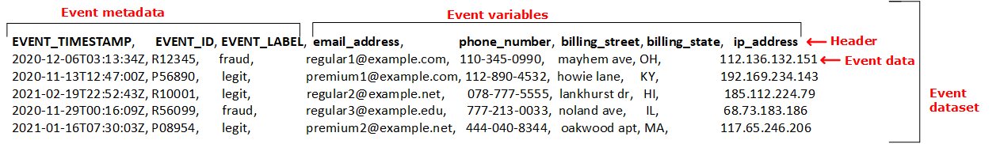

Amazon Fraud Detector will no longer be open to new customers starting November 7, 2025. If you would like to use Amazon Fraud Detector,
sign up prior to that date. For capabilities similar to Amazon Fraud Detector, explore Amazon SageMaker, AutoGluon, and AWS WAF.

# Event dataset

An event dataset is the historical fraud data for your company. You provide this data to Amazon Fraud Detector to create fraud detection models.

Amazon Fraud Detector uses machine learning models for generating fraud predictions. Each model is trained using a model type. The model type specifies the algorithms and transformations
that are used for training the model. Model training is the process of using a dataset that you provide to create a model that can predict fraudulent events.
For more information, see [How Amazon Fraud Detector works](how-frauddetector-works.md "how-frauddetector-works.md")

The dataset used for creating fraud detection model provides details of an event. An event is a business activity that is evaluated for fraud risk.
For example, an account registration can be an event. The data associated with the account registration event can be event dataset. Amazon Fraud Detector uses this dataset to
evaluate account registration fraud.

Before you provide your dataset to Amazon Fraud Detector for creating a model, make sure to define your goal for creating the model. You also need to determine how you want to
use the model and define your metrics for evaluating if the model is performing based on your specific requirements.

For example, your goals for creating a fraud detection model that evaluates account registration fraud can be the following:

- To auto-approve legitimate registrations.
- To capture fraudulent registrations for later investigation.
  After you determined your goal, the next step is to decide how you want to use the model. Some examples for using fraud detection model to evaluate registration
  fraud are the following:

- For real-time fraud detection for each account registration.
- For offline evaluation of all account registrations every hour.
  Some examples of metrics that can be used to measure the performance of the model include the following:

- Performs consistently better than the current baseline in production.
- Captures X% fraud registrations with Y% false positives rate.
- Accepts up to 5% of auto-approved registrations that are fraudulent.

## Event dataset structure

Amazon Fraud Detector requires that you provide your event dataset in a text file using comma-separated value (CSV) in the UTF-8 format. The first line of your CSV
dataset file must contain file headers. The file header consists of event metadata and event variables that describe each data element that’s associated
with the event. The header is followed by event data. Each line consists of data elements from a single event.

- **Event metadata**- provides information about the event. For example, EVENT_TIMESTAMP is a an
  event metadata that specifies the time event occurred. Depending on your business use case and the model type used for creating and training your fraud detection model,
  Amazon Fraud Detector requires you to provide specific event metadata. When specifying event metadata in your CSV file header, use the same event metadata name as specified by Amazon Fraud Detector and use upper case letters only.
- **Event variable**- represents the data elements that are specific to your event which you want to use for
  creating and training your fraud detection model. Depending on your business use case and and the model type used for creating and training a fraud detection model,
  Amazon Fraud Detector might require or recommend that you to provide specific event variables. You can also optionally provide other event variables from your event that you want to
  include in training the model. Some examples of event variables for an online registration event can be email address, ip address, and phone number. When specifying event variable name
  in your CSV file header, use any variable name of your choice and use lower case letters only.
- **Event data**- represents the data collected from the actual event. In your CSV file, each row
  following the file header consistes of data elements from a single event. For example, in an online registration event data file, each row contains data from a
  single registration. Each data element in the row must match withn the corresponding event metadata or the event variable.

The following is an example of a CSV file containing data from an account registration event. The header row contains both event metadata in uppercase and event variables in lowercase followed by the event data. Each row in the dataset
contains data elements associated with single account registration with each data element corresponding with the header.

## Get event dataset requirements using the Data models explorer

The model type you choose to create your model defines the requirements for your dataset. Amazon Fraud Detector uses the dataset you
provide to create and train your fraud detection model. Before Amazon Fraud Detector starts to create your model, it checks if the
dataset meets the size, format, and other requirements. If the dataset does not meet the requirements, the model creation and training fails.
You can use the **data models explorer** to identify a model type to use for your business use case and to
gain insights into the dataset requirements for the identified model type.

### Data models explorer

The **data models explorer** is a tool in Amazon Fraud Detector console that aligns your business use case with the model type supported by Amazon Fraud Detector.
The data models explorer also provides insights into the data elements required by Amazon Fraud Detector to create your fraud detection model. Before you start to
prepare your event dataset, use the data models explorer to figure out
the model type Amazon Fraud Detector recommends for your business use and also to see a list of mandatory, recommended, and optional data elements you will need to
create your dataset.

###### To use data models explorer,

1. Open the [AWS
   Management Console](https://console.aws.amazon.com "https://console.aws.amazon.com") and sign in to your account.
   Navigate to Amazon Fraud Detector.
2. In the left navigation pane, choose
   **Data models explorer**.
3. In the **Data models explorer** page, under **Business use case**, select the business use case you want to evaluate for fraud risk.
4. Amazon Fraud Detector displays the recommended model type that matches with your business use case.
   The model type defines the algorithms, enrichments, and transformations Amazon Fraud Detector will use to train your fraud detection model.

Make a note of the recommended model type. You will need this later when you create your model.

###### Note

If you do not find your business use case, use the **reach us** link in the description to provide us the details of your business use case.
We will recommend the model type to use for creating a fraud detection model for your business use case. 5. The **Data model insights** pane provides insight into the mandatory, recommended, and optional data elements required to create and train a fraud detection model for your business use case.
Use the information in the insights pane to gather your event data and to create your data set.

## Gather event data

Gathering your event data is an important step in creating your model. This is because the performance of your model in predicting fraud is dependent on the
quality of your dataset. As you start to gather your event data, keep in mind the list of data elements that the
**Data models explorer** provided for you to create your dataset.
You will need to gather all the mandatory (event metadata) data and decide what recommended and optional data elements (event variables) to include
based on your goals for creating the model. It’s also important to decide the format of each event variable you intend to include and the total size of your dataset.

**Event dataset quality**

To gather high quality dataset for your model, we recommend the following:

- **Collect mature data-** Using the most recent data helps to identity the most recent fraud pattern. However, to detect fraud use cases, allow the
  data to mature. The maturity period is dependent on your business, and can take anywhere from two weeks to three months. For example, if your event includes credit card transaction,
  then the maturity of the data might be determined by the chargeback period of the credit card or time taken by an investigator to make determination.

Ensure that the dataset used to train the model have had sufficient time to mature as per your business.

- **Make sure the data distribution doesn’t drift significantly-** Amazon Fraud Detector model training process samples and partitions your dataset based on EVENT_TIMESTAMP.
  For example, if your dataset consists of fraud events pulled from last 6 months, but only the last month of legitimate events are included, the data distribution is considered to be
  drifting and unstable. An unstable dataset might lead to biases in model performance evaluation. If you find the data distribution to be drifting significantly,
  consider balancing your dataset by collecting data similar to the current data distribution.
- **Make sure the dataset is representative of the use case where the model is implemented/tested-** Otherwise, the estimated performance could be biased.
  Let us say that you are using a model to automatically decline all in-door applicants, but your model is trained with a dataset that has historical data/labels which were previously
  approved. Then, your model's evaluation might be inaccurate because the evaluation is based on the dataset that does not have representation from declined applicants.

  **Event data format**

Amazon Fraud Detector transforms most of your data to the required format as part of its model training process. However, there are some standard formats you can easily use for providing your data that
can help avoid issues later when Amazon Fraud Detector validates your dataset. The following table provides guidance on the formats for providing the recommended event metadata.

###### Note

When you create your CSV file, make sure to enter event metadata name as listed below, in uppercase letters.

| Metadata name   | Format                                                                                                                                                                                                                                                                                                                                                                                                                                                                                                                                                                                                                                                                                                                                                                                                                                                                                                                                                                                                                                                                                                                                                                                                                                                                                                                                                                   | Required                                |
| --------------- | ------------------------------------------------------------------------------------------------------------------------------------------------------------------------------------------------------------------------------------------------------------------------------------------------------------------------------------------------------------------------------------------------------------------------------------------------------------------------------------------------------------------------------------------------------------------------------------------------------------------------------------------------------------------------------------------------------------------------------------------------------------------------------------------------------------------------------------------------------------------------------------------------------------------------------------------------------------------------------------------------------------------------------------------------------------------------------------------------------------------------------------------------------------------------------------------------------------------------------------------------------------------------------------------------------------------------------------------------------------------------ | --------------------------------------- | ----------------------------------------------------------------------------------------------------------------------------------------------------------------------------------------------------------------------------------------------------------------------------------------------------------------------------------------------------------------------------------------------------------------------------------------------------------------------------------------------------------------------------------------------------------------------------------------------------------------------------------------------------------------------------------------------------------------------------------------------------------------------------------------------------------------------------------------------------------------------------------------------------------------------------------------------------------------------------------------------------------------------------------------------------------------------------------------------------------------------------------------------------------------------------------------------------------------------------------------------------------------------------------------------------------------------------------------------------------------------------------------------------------------------------------------------------------------------------------------------------------------------------------------------------------------------------------------------------------------------------------------------------------------------------------------------------------------------------------------------------------------------------------------------------------------------------------------------------------------------------------------------------------------------------------------------------------------------------------------------------------------------------------------------------------------------------------------------------------------------------------------------------------------------------------------------------------------------------------------------------------------------------------------------------------------------------------------------------------------------------------------------------------------------------------------------------------------------------------------------------------------------------------------------------------------------------------------------------------------------------------------------------------------------------------------------------------------------------------------------------------------------------------------------------------------------------------------------------------------------------------------------------------------------------------------------------------------------------------------------------------------------------------------------------------------------------------------------------------------------------------------------------------------------------------------------------------------------------------------------------------------------------------------------------------------------------------------------------------------------------------------------------------------------------------------------------------------------------------------------------------------------------------------------------------------------------------------------------------------------------------------------------------------------------------------------------------------------------------------------------------------------------------------------------------------------------------------------------------------------------------------------------------------------------------------------------------------------------------------------------------------------------------------------------------------------------------------------------------------------------------------------------------------------------------------------------------------------------------------------------------------------------------------------------------------------------------------------------------------------------------------------------------------------------------------------------------------------------------------------------------------------------------------------------------------------------------------------------------------------------------------------------------------------------------------------------------------------------------------------------------------------------------------------------------------------------------------------------------------------------------------------------------------------------------------------------------------------------------------------------------------------------------------------------------------------------------------- |
| EVENT_ID        | If provided, it must meet the following requirements:  • It is unique for that event.  • It represents information that’s meaningful to your business.  • It follows the regular expression pattern (for example, `^[0-9a-z_-]+$.)`  • In addition to the above requirements, we recommend that you do not append a timestamp to the EVENT_ID. Doing so might cause issues when you update the event. This because you must provide the exact same EVENT_ID if you do this.                                                                                                                                                                                                                                                                                                                                                                                                                                                                                                                                                                                                                                                                                                                                                                                                                                                                                  | Depends on the model type               |
| EVENT_TIMESTAMP |  • It must be specified in one of the following formats: + %yyyy-%mm-%ddT%hh:%mm:%ssZ (ISO 8601 standard in UTC only with no milliseconds) Example: 2019-11-30T13:01:01Z + %yyyy/%mm/%dd %hh:%mm:%ss (AM/PM) Examples: 2019/11/30 1:01:01 PM, or 2019/11/30 13:01:01 + %mm/%dd/%yyyy %hh:%mm:%ss Examples: 11/30/2019 1:01:01 PM, 11/30/2019 13:01:01 + %mm/%dd/%yy %hh:%mm:%ss Examples: 11/30/19 1:01:01 PM, 11/30/19 13:01:01  • Amazon Fraud Detector makes the following assumptions when parsing date/timestamp formats for event timestamps: + If you are using the ISO 8601 standard, it must be an exact match of the preceding specification + If you are using one of the other formats, there is additional flexibility:  • For months and days, you can provide single or double digits. For example, 1/12/2019 is a valid date.  • You do not need to include hh:mm:ss if you do not have them (that is, you can simply provide a date). You can also provide a subset of just the hour and minutes (for example, hh:mm). Just providing hour is not supported. Milliseconds are also not supported.  • If you provide AM/PM labels, a 12-hour clock is assumed. If there is no AM/PM information, a 24-hour clock is assumed.  • You can use “/” or “-” as delimiters for the date elements. “:” is assumed for the timestamp elements. | Yes                                     |
| ENTITY_ID       |  • It must follow the regular expression pattern: `^[0-9A-Za-z_.@+-]+$`.  • If the entity id isn’t available at the time of evaluation, specify the entity id as _unknown_.                                                                                                                                                                                                                                                                                                                                                                                                                                                                                                                                                                                                                                                                                                                                                                                                                                                                                                                                                                                                                                                                                                                                                                                        | Depends on the model type               |
| ENTITY_TYPE     | You can use any string                                                                                                                                                                                                                                                                                                                                                                                                                                                                                                                                                                                                                                                                                                                                                                                                                                                                                                                                                                                                                                                                                                                                                                                                                                                                                                                                                   | Depends on the model type               |
| EVENT_LABEL     | You can use any labels, such as "fraud", "legit", "1", or "0".                                                                                                                                                                                                                                                                                                                                                                                                                                                                                                                                                                                                                                                                                                                                                                                                                                                                                                                                                                                                                                                                                                                                                                                                                                                                                                           | Required if LABEL_TIMESTAMP is included |
| LABEL_TIMESTAMP | It must follow the timestamp format.                                                                                                                                                                                                                                                                                                                                                                                                                                                                                                                                                                                                                                                                                                                                                                                                                                                                                                                                                                                                                                                                                                                                                                                                                                                                                                                                     | Required if EVENT_LABEL is included     | For information about event variables, see [Variables](variables.md "variables.md"). ###### Important If you are creating Account Takeover Insights (ATI) model, see [Preparing data](account-takeover-insights.md#preparing-training-data-ATI "account-takeover-insights.md#preparing-training-data-ATI") for details on preparing and selecting data. **Null or missing values** The EVENT_TIMESTAMP and EVENT_LABEL variables must not contain any null or missing values. You can have null or missing values for other variables. However, we recommend that you only use a small number nulls for those variables. If Amazon Fraud Detector determines that there are too many null or missing values for an event variables, it will automatically omit variable from your model. **Minimum variables** When you create your model, the dataset must include at least two event variables in addition to the required event metadata. The two event variables must pass the validation check. **Event dataset size** Required Your dataset must meet the following basic requirements for successful model training.  • Data from atleast 100 events.  • Dataset must include at least 50 events (rows) classified as fraudulent. Recommended We recommend that your dataset includes the following for successful model training and a good model performance.  • Include a minimum of three weeks of historic data, but at best six months of data.  • Include a minimum of 10K total events data.  • Include at least 400 events (rows) classified as fraudulent and 400 events (rows) classified as legitimate.  • Include more than 100 unique entities, if your model type requires ENTITY_ID. ## Dataset validation Before Amazon Fraud Detector starts to create your model, it checks if the variables included in the dataset for training the model meets the size, format, and other requirements. If the dataset doesn’t pass the validation, model isn’t created. You must first fix the variables that didn’t pass the validation before you create the model. Amazon Fraud Detector provides you with a _Data profiler_ which you can use to help you identify and fix issues with your dataset before you start to train your model **Data profiler** Amazon Fraud Detector provides an open-source tool for profiling and preparing your data for model training. This automated data profiler helps you avoid common data preparation errors and identify potential issues like mis-mapped variable types that would negatively impact model performance. The profiler generates an intuitive and comprehensive report of your dataset, including variable statistics, label distribution, categorical and numeric analysis, and variable and label correlations. It provides guidance on variable types as well as an option to transform the dataset into a format that Amazon Fraud Detector requires. **Using data profiler** The automated data profiler is built with an AWS CloudFormation stack, which you can easily launch with a few clicks. All codes are available on [Github](https://github.com/aws-samples/aws-fraud-detector-samples "https://github.com/aws-samples/aws-fraud-detector-samples"). For information on how to use data profiler, follow directions in our blog [Train models faster with an automated data profiler for Amazon Fraud Detector](https://aws.amazon.com/blogs/machine-learning/train-models-faster-with-an-automated-data-profiler-for-amazon-fraud-detector/ "https://aws.amazon.com/blogs/machine-learning/train-models-faster-with-an-automated-data-profiler-for-amazon-fraud-detector/") **Common event dataset errors** The following are some of the common issues Amazon Fraud Detector comes across when validating an event dataset. After you run the data profiler, use this list to check your dataset for errors before creating your model.  • CSV file isn’t in the UTF-8 format.  • The number of events in the dataset is less than 100.  • The number of events identified as fraud or legitimate is less than 50.  • The number of unique entities associated to a fraud event is less than 100.  • More than 0.1% of values in EVENT_TIMESTAMP contains nulls or values other than the supported date/timestamp formats.  • More than 1% of the values in EVENT_LABEL contains nulls or values other than those defined in the event type.  • Less than two variables are available for model training. ## Dataset storage After you gathered your dataset, you store your dataset internally using Amazon Fraud Detector or externally with Amazon Simple Storage Service (Amazon S3). We recommend that you choose where to store your dataset based on the model you use for generating fraud predictions. For more information on model types, see [Choose a model type](choosing-model-type.md "choosing-model-type.md"). For more information on storing your dataset, see [Event data storage](event-data-storage.md "event-data-storage.md"). |
