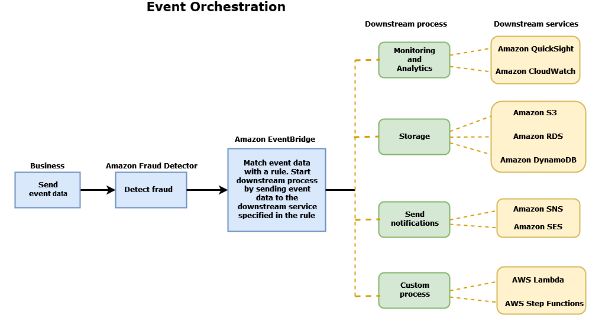

Amazon Fraud Detector is no longer open to new customers as of November 7, 2025. For capabilities similar to Amazon Fraud Detector, explore Amazon SageMaker, AutoGluon, and AWS WAF.

# Event orchestration

Event orchestration makes it easy for you to send events to AWS services for downstream
processing, using [Amazon EventBridge](../../../eventbridge/latest/userguide/eb-what-is.md "../../../eventbridge/latest/userguide/eb-what-is.md"). Amazon Fraud Detector provides you with simple rules you can use to automate
processing of events after fraud detection. With event orchestration, you can automate
downstream event processes such as, sending events to dashboards to get insights from event
data, generating notifications based on the fraud detection outcomes, and updating events
with a label based on the learning from fraud detection.

Event orchestration provides easy access to services in the AWS environment, through
Amazon EventBridge. You can configure Amazon EventBridge to either send events directly to AWS services or
indirectly using [API destinations](../../../eventbridge/latest/userguide/eb-api-destinations.md "../../../eventbridge/latest/userguide/eb-api-destinations.md"). The AWS services you use to orchestrate your downstream processes are also called _targets_. Some of the targets you can use to orchestrate
downstream processing are as follows:

- For monitoring and analytics — [Amazon QuickSight](../../../quicksight/latest/user/welcome.md "../../../quicksight/latest/user/welcome.md"), [Amazon CloudWatch](../../../AmazonCloudWatch/latest/monitoring/WhatIsCloudWatch.md "../../../AmazonCloudWatch/latest/monitoring/WhatIsCloudWatch.md")
- For storage — [Amazon S3](../../../AmazonS3/latest/userguide/Welcome.md "../../../AmazonS3/latest/userguide/Welcome.md"), [Amazon RDS](../../../AmazonRDS/latest/UserGuide/Welcome.md "../../../AmazonRDS/latest/UserGuide/Welcome.md"), [Amazon DynamoDB](../../../amazondynamodb/latest/developerguide/Introduction.md "../../../amazondynamodb/latest/developerguide/Introduction.md")
- For sending notifications — [Amazon SNS](../../../sns/latest/dg/welcome.md "../../../sns/latest/dg/welcome.md"), [Amazon SES](../../../ses/latest/dg/Welcome.md "../../../ses/latest/dg/Welcome.md")
- For custom processing — [AWS Lambda](../../../lambda/latest/dg/welcome.md "../../../lambda/latest/dg/welcome.md"), [AWS Step Functions](../../../step-functions/latest/dg/welcome.md "../../../step-functions/latest/dg/welcome.md")
  For more information on the orchestration targets supported by Amazon EventBridge, see [Amazon EventBridge targets](../../../eventbridge/latest/userguide/eb-targets.md "../../../eventbridge/latest/userguide/eb-targets.md").

The following diagram provides a high-level view of how event orchestration works.

