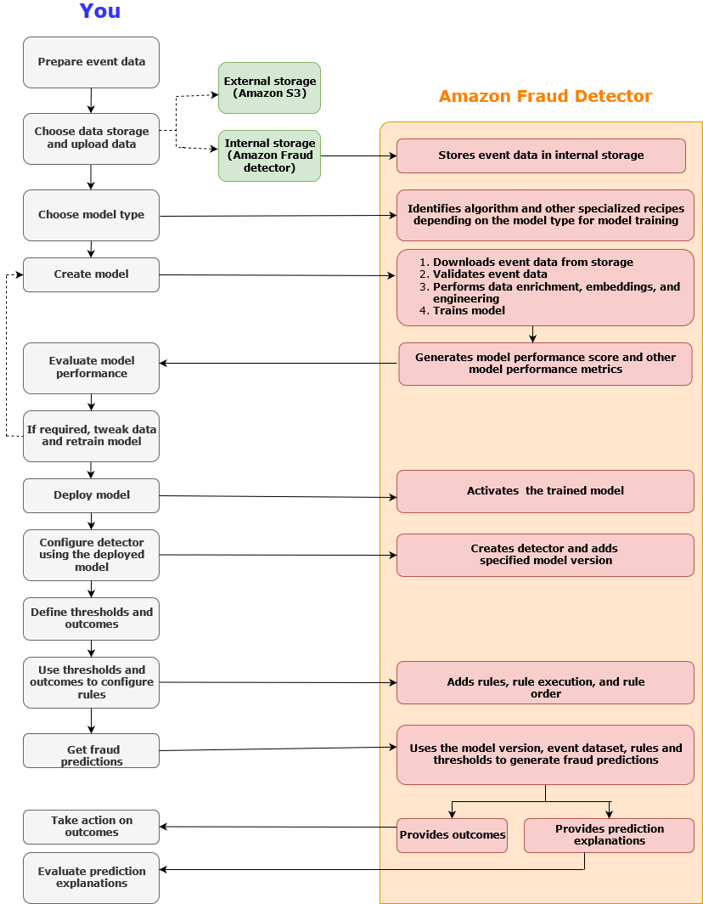

Amazon Fraud Detector will no longer be open to new customers starting November 7, 2025. If you would like to use Amazon Fraud Detector,
sign up prior to that date. For capabilities similar to Amazon Fraud Detector, explore Amazon SageMaker, AutoGluon, and AWS WAF.

# Detecting fraud with Amazon Fraud Detector

This section describes a typical workflow for detecting fraud with
Amazon Fraud Detector. It also summarizes how you can accomplish those tasks. The following
diagram provides a high-level view of the workflow for detecting fraud with
Amazon Fraud Detector.

Fraud detection is a continuous process. After you deploy your model, make sure to evaluate
its performance scores and metrics based on the prediction explanations.
By doing so, you can identify top risk indicators, narrow down root
causes that lead to false positives, and analyze fraud patterns across your dataset and
detect bias, if any exist. To increase the accuracy of the
predictions, you can tweak your dataset to include new or revised data.
Then, you can retrain your model with the updated dataset. As more data becomes
available, you continue retraining your model to increase accuracy.
