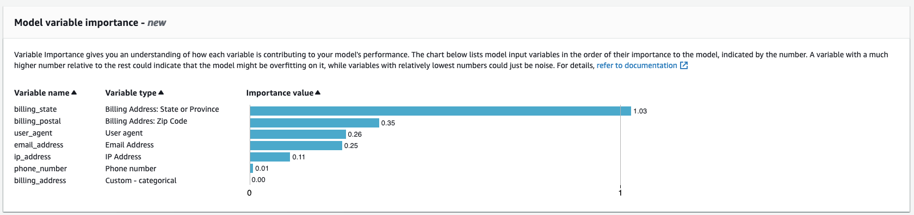

Amazon Fraud Detector will no longer be open to new customers starting November 7, 2025. If you would like to use Amazon Fraud Detector,
sign up prior to that date. For capabilities similar to Amazon Fraud Detector, explore Amazon SageMaker, AutoGluon, and AWS WAF.

# Model variable importance

_Model variable importance_ is a feature of Amazon Fraud Detector that ranks model
variables within a model version. Each model variable is provided a value based on its
relative importance to the overall performance of your model. The model variable with
the highest value is more important to the model than the other model variables in the
dataset for that model version, and is listed at the top by default. Likewise, the model
variable with the lowest value is listed at the bottom by default and is least important
compared to the other model variables. Using model variable importance values, you can
gain insight into what inputs are driving your model’s performance.

You can view model variable importance values for your trained model version in the
Amazon Fraud Detector console or by using the [DescribeModelVersion](../api/API_DescribeModelVersions.md "../api/API_DescribeModelVersions.md") API.

Model variable importance provides the following set of values for each [Variable](../api/API_TrainingDataSchema.md#FraudDetector-Type-TrainingDataSchema-modelVariables "../api/API_TrainingDataSchema.md#FraudDetector-Type-TrainingDataSchema-modelVariables") used to train the
[Model Version](../api/API_CreateModelVersion.md "../api/API_CreateModelVersion.md").

- **Variable Type**: Type of variable (for example, IP address or Email). For more information, see [Variable types](variables.md#variable-types "variables.md#variable-types").
  For Account Takeover Insights (ATI) models, Amazon Fraud Detector provides variable importance value for both raw and aggregate variable type. Raw variable types are assigned to the variables that you provide.
  Aggregate variable type is assigned to a set of raw variables that Amazon Fraud Detector has combined to calculate an aggregated importance value.
- **Variable Name**: Name of the event variable that was used to train the model version (for example, `ip_address`, `email_address`, `are_creadentials_valid`).
  For aggregated variable type, the names of all variables that were used to calculate the aggregated variable importance value are listed.
- **Variable Importance Value**: A number that represents the
  relative importance of the raw or aggregated variable to the model's performance. Typical range:
  0–10
  In the Amazon Fraud Detector console, the model variable importance values are displayed as follows for either an Online Fraud Insights (OFI) or an Transaction Fraud Insights (TFI) model.
  An Account Takeover Insight (ATI) model will provide aggregated variable importance values in addition to the raw variable's importance values.
  The visual chart makes it easy to see the relative importance between variables with the
  vertical dotted line providing reference to the importance value of the highest ranked
  variable.

Amazon Fraud Detector generates variable importance values for every Fraud Detector model version at no additional cost.

###### Important

Model versions that were created before _July 9, 2021_ do not
have variable importance values. You must train a new version of your model to
generate the model variable importance values.

## Using model variable importance values

You can use model variable importance values to gain insight into what is driving performance of your model up or down and which of variables contribute the most. And then tweak your model to improve overall performance.

More specifically, to improve your model performance, examine the variable
importance values against your domain knowledge and debug issues in the training
data. For example, if Account Id was used as an input to the model and it is listed
at the top, take a look at its variable importance value. If the variable importance
value is significantly higher than the rest of the values, then your model might be
overfitting on a specific fraud pattern (for example, all the fraud events are from
the same Account Id). However, it might also be the case that there is a label
leakage if the variable depends on the fraud labels. Depending on the outcome of
your analysis based on your domain knowledge, you might want to remove the variable
and train with a more diverse dataset, or keep the model as it is.

Similarly, take a look at the variables ranked last. If the variable importance
value is significantly lower than the rest of the values, then this model variable
might not have any importance in training your model. You could consider removing
the variable to train a simpler model version. If your model has few variables, such
as only two variables, Amazon Fraud Detector still provides the variable importance values and rank
the variables. However, the insights in this case will be limited.

###### Important

1. If you notice variables missing in the **Model variable importance** chart, it might be due to one of the following reasons.
   Consider modifying the variable in your dataset and retrain your model.
   - The count of unique values for the variable in the training dataset is lower than 100.
   - Greater than 0.9 of values for the variable are missing from the training data-set.

2. You need to train a new model version every time that you want to adjust your
   model’s input variables.

## Evaluating model variable importance values

We recommend that you consider the following when you evaluate model variable importance values:

- Variable importance values must always be evaluated in combination with the domain knowledge.
- Examine variable importance value of a variable relative to the variable importance value of the other variables within the model version.
  Do not consider variable importance value for a single variable independently.
- Compare variable importance values of the variables within the same model version.
  Do not compare variable importance values of the same variables across model versions because the variable importance
  value of a variable in a model version might differ from the value of the same variable in a different model version.
  If you use the same variables and dataset to train different model versions, this does not necessarily generate the same variable importance values.

## Viewing model variable importance ranking

After model training is complete, you can view model variable importance ranking of your trained model version in the Amazon Fraud Detector console or by using the [DescribeModelVersion](../api/API_DescribeModelVersions.md "../api/API_DescribeModelVersions.md") API.

###### To view the model variable importance ranking using console,

1. Open the AWS Console and sign in to your account. Navigate to
   Amazon Fraud Detector.
2. In the left navigation pane, choose **Models**.
3. Choose your model and then your model version.
4. Make sure that the **Overview** tab is selected.
5. Scroll down to view the **Model variable importance** pane.

## Understanding how the model variable importance

value is calculated

Upon completion of each model version training, Amazon Fraud Detector automatically generates
model variable importance values and model’s performance metrics. For this, Amazon Fraud Detector
uses SHapley Additive exPlanations ([SHAP](https://papers.nips.cc/paper/2017/file/8a20a8621978632d76c43dfd28b67767-Paper.pdf "https://papers.nips.cc/paper/2017/file/8a20a8621978632d76c43dfd28b67767-Paper.pdf")). SHAP is essentially the average expected contribution of a
model variable after all possible combinations of all model variables have been
considered.

SHAP first assigns contribution of each model variable for prediction of an event.
Then, it aggregates these predictions to create a ranking of the variables at the
model level. To assign contributions of each model variable for a prediction, SHAP
considers differences in model outputs among all possible variable combinations. By including all possibilities
of including or removing specific set of variables to generate a model output, SHAP can accurately access the importance
of each model variable. This is particularly important when the model variables are highly correlated with one another.

ML models, in most cases, do not allow you to remove variables. You can instead replace a removed or missing variable in the model
with the corresponding variable values from one or more baselines (for example, non-fraud events).
Choosing proper baseline instances can be difficult, but Amazon Fraud Detector makes
this easy by setting this baseline as the population average for you.
