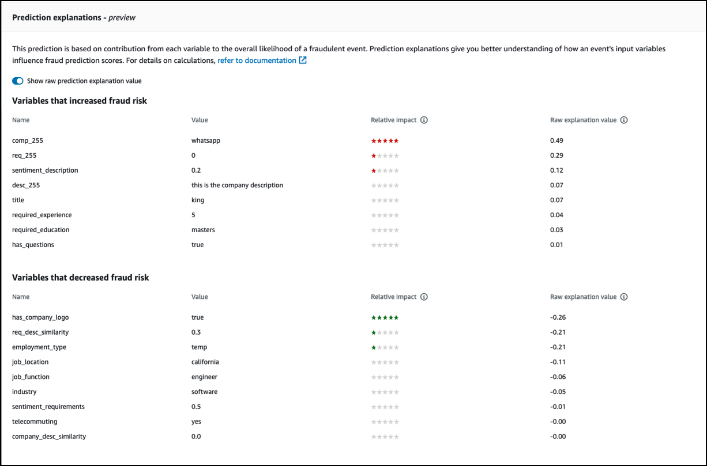

Amazon Fraud Detector will no longer be open to new customers starting November 7, 2025. If you would like to use Amazon Fraud Detector,
sign up prior to that date. For capabilities similar to Amazon Fraud Detector, explore Amazon SageMaker, AutoGluon, and AWS WAF.

# Prediction explanations

Prediction explanations provide insight into how each event variable impacted your model’s fraud prediction score, and are automatically generated as
part of the fraud prediction. Each fraud prediction comes with a risk score between 1 and 1000. Prediction explanations give you details of the influence
of each event variable on the risk scores in terms of magnitude (0-5, 5 being highest) and direction (drove score higher or lower). You can also use prediction
explanations for the following tasks:

- To identify top risk indicators during manual inverstigations when an event is flagged for review.
- To narrow down root causes that lead to false positive predictions (for example, high risk scores for legitimate events).
- To analyze fraud patterns across event data and detect bias, if any, in your dataset.

###### Important

Prediction explanations are automatically generated and available only for models trained on or after _June 30, 2021_. To receive prediction explanations
for models trained before _June 30, 2021_, retrain those models.

Prediction explanations provide the following set of values for each event variable that was used to train the model.

**Relative impact**

Provides a visual reference of the variable's impact in terms of magnitude on the fraud prediction scores. The relative impact values consist of a
star rating (0-5, 5 being the highest) and direction (increased/decreased) impact of the fraud risk.

- Variables that increased fraud risk are indicated by red colored stars. The higher the number of red colored stars, the more the
  variable drove up the fraud score and increased likelihood of fraud.
- Variables that decreased fraud risk are indicated by green colored stars. The higher the number of green colored starts, the more the variable drove down the fraud risk score and
  decreased likelihood of fraud.
- Zero stars for all variables indicate that none of the variables on their own significantly changed the fraud risk.
  **Raw explanation value**

Provides raw, uninterpreted value represented as log-odds of the fraud. These values are usually between -10 to +10, but range from - infinity to + infinity.

- A positive value indicates that the variable drove the risk score up.
- A negative value indicates that the variable drove the risk score down.
  In the Amazon Fraud Detector console, the prediction explanation values are displayed as follows. The colored star ratings and the corresponding raw numerical values
  make it easy to see the relative influence between variables.



## Viewing prediction explanations

After you generate fraud predictions, you can view prediction explanations in the Amazon Fraud Detector console. To view the prediction explanations using APIs from the AWS SDK,
you must first call the `ListEventPrediction` API to obtain the prediction timestamp for the event, and then call the `GetEventPredictionMetadata` API
to get the prediction explanations.

### View prediction explanations using Amazon Fraud Detector console

###### To view the prediction explanations using the console,

1. Open the AWS Console and sign in to your account. Navigate to
   Amazon Fraud Detector.
2. In the left navigation pane, choose **Search past predictions**.
3. Use the **Property**, **Operator**, and **Value** filters to select the prediction you want review.
4. In the top **Filter** pane, make sure to select the time period for when the prediction you want to review was generated.
5. The **Results** pane displays a list of all the predictions generated during the specified time period. Click the Event ID of the prediction to view the prediction explanations.
6. Scroll down to the **Prediction explanations** pane.
7. Set the **Show raw prediction explanation value** button **on** to view raw prediction explanation value of all the variables.

### View prediction explanations using the AWS SDK for Python (Boto3)

The following examples show sample requests for viewing prediction explanations using `ListEventPredictions` and `GetEventPredictionMetadata` APIs from the AWS SDK.

**Example 1: Get a list of most recent predictions using `ListEventPredictions` API**

```
import boto3
fraudDetector = boto3.client('frauddetector')
fraudDetector.list_event_predictions(
  maxResults = 10,
  predictionTimeRange = {
     end_time: '2022-01-13T23:18:21Z',
     start_time: '2022-01-13T20:18:21Z'
    }
 )

```

**Example 2; Get a list of past predictions for event type "registration" using `ListEventPredictions` API**

```
import boto3
fraudDetector = boto3.client('frauddetector')
fraudDetector.list_event_predictions(
   eventType = {
      value = 'registration'
    }
   maxResults = 70,
   nextToken = "10",
   predictionTimeRange = {
     end_time: '2021-07-13T23:18:21Z',
     start_time: '2021-07-13T20:18:21Z'
    }
 )

```

**Example 3: Get details of a past prediction for a specified event ID, event type, detector ID, and detector version ID that was generated in the specified time period using `GetEventPredictionMetadata` API.**

The `predictionTimestamp` specified for this request is obtained by first calling the `ListEventPredictions` API.

```
import boto3
fraudDetector = boto3.client('frauddetector')
fraudDetector.get_event_prediction_metadata (
   detectorId = 'sample_detector',
   detectorVersionId = '1',
   eventId = '802454d3-f7d8-482d-97e8-c4b6db9a0428',
   eventTypeName = 'sample_registration',
   predictionTimestamp = '2021-07-13T21:18:21Z'
 )

```

## Understanding how prediction explanations are calculated

Amazon Fraud Detector uses [SHAP (SHapeley Additive exPlanations)](https://arxiv.org/abs/1705.07874 "https://arxiv.org/abs/1705.07874") to explain individual event predictions by computing the **raw explanation values** of
each event variable used for model training. The raw explanation values are computed by the model as part of the classification algorithm when generating predictions.
These raw explanation values represent the contribution of each input to the logarithm of the odds of fraud. The raw explanation values (from -infinity to +infinity) are converted to
a **relative impact value** (-5 to +5) using a mapping. The relative impact value derived from raw explanation value represents
the number of times increase in odds of fraud (positive) or legit (negative), making it easier to understand the prediction explanations.
