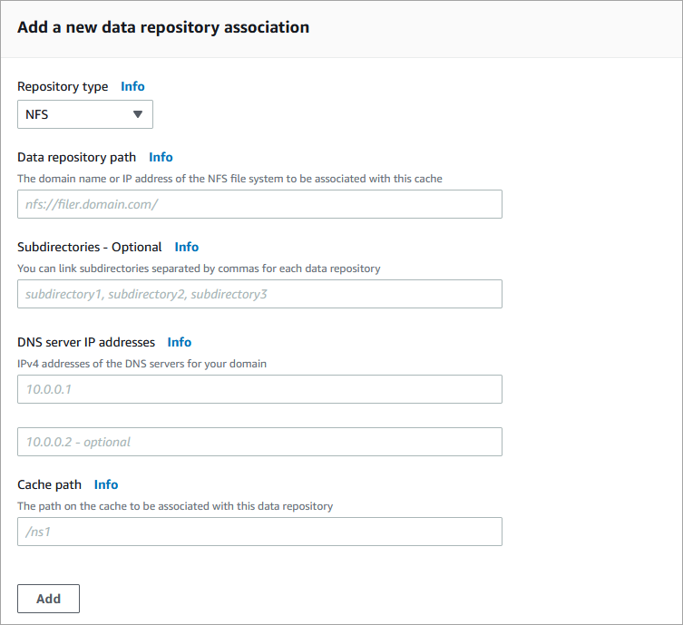

# Creating a link to a data repository

The following procedure walks you through the process of creating a data repository
association (DRA) while creating an Amazon File Cache resource, using the AWS Management Console. The DRA
links the cache to an existing Amazon S3 bucket or NFS file system.

Keep the following in mind when working with DRAs.

- You can link to a data repository only when you create
  the cache.
- You can't update an existing DRA.
- You can't delete an existing DRA. To remove a link to a data repository, delete the cache and
  create it again.
- You can link your cache to either S3 data repositories or NFS data repositories, but not to
  both types in a single cache.
  For information about using the AWS Command Line Interface (AWS CLI) to create a DRA while creating a
  cache, see [To create a cache (CLI)](managing-caches.md#create-file-system-cli "managing-caches.md#create-file-system-cli").

1. Open the AWS Management Console at [https://console.aws.amazon.com/fsx/](https://console.aws.amazon.com/fsx/ "https://console.aws.amazon.com/fsx/").
2. Follow the procedure for creating a new Amazon File Cache described in [Step 1: Create your cache](getting-started-step1.md "getting-started-step1.md").
3. In the **Data repository associations (DRAs)** section, the
   **Create a new data repository association** dialog box
   displays.

In the dialog box, provide information for the following fields.

    * **Repository type** – Choose the type of data
     repository to link to:

    	+ `NFS` – NFS file system that supports the NFSv3
    	 protocol.
    	+ `S3` – Amazon S3 bucket
    * **Data repository path** – Enter a path in either an
     S3 or NFS data repository to associate with your cache.

    	+ For S3, the path can be an S3 bucket or prefix in the format
    	 `s3://myBucket/myPrefix/`. Amazon File Cache will append a
    	 trailing "/" to your data repository path if you don't provide one. For
    	 example, if you provide a data repository path of
    	 `s3://myBucket/myPrefix`, Amazon File Cache will interpret it as
    	 `s3://myBucket/myPrefix/`.
    	+ For NFS, the path to the NFS data repository can be in one of two
    	 formats:

    		- If you're not using **Subdirectories**, the path is
    		 to an NFS Export directory (or one of its subdirectories) in the format
    		 `nfs://nfs-domain-name/exportpath`.
    		- If you're using **Subdirectories**, the path is the
    		 domain name of the NFS file system in the format
    		 `nfs://filer-domain-name`, which indicates the root of the
    		 NFS Export subdirectories specified with the `NFS Exports`
    		 field.
    Two data repository associations can't have overlapping data repository
     paths. For example, if a data repository with path
     `s3://myBucket/myPrefix/` is linked to the cache, you can't create
     another data repository association with data repository path
     `s3://myBucket/myPrefix/mySubPrefix`.
    * **Subdirectories** – (NFS only) You can
     optionally provide a list of comma-delimited NFS export paths in the NFS data
     repository. When this field is provided, **Data repository
     path** can only contain the NFS domain name, indicating the root of
     the subdirectories.
    * **DNS server IP addresses** – (NFS only) If you
     provided the domain name of the NFS file system for **Data repository
     path**, you can specify up to two IPv4 addresses of DNS servers used
     to resolve the NFS file system domain name. The provided IP addresses can either
     be the IP addresses of a DNS forwarder or resolver that the customer manages and
     runs inside the customer VPC, or the IP addresses of the on-premises DNS
     servers.
    * **Cache path** – Enter the name of a high-level
     directory (such as `/ns1`) or subdirectory (such as
     `/ns1/subdir`) within the Amazon File Cache that will be associated
     with the data repository. The leading forward slash in the path is required. Two
     data repository associations cannot have overlapping cache paths.
     The **Cache
     path** setting must be unique across all the data repository
     associations for the cache.

    ###### Note

    **Cache path** can only be set to root (/) on NFS DRAs
     when **Subdirectories** is specified. If you specify root (/)
     as the **Cache path**, you can create only one DRA on the
     cache.

    **Cache path** cannot be set to root (/) for an S3
     DRA.

4. When you finish configuring the DRA, choose **Add**.
5. You can add another data repository association using the same steps. You can
   create a maximum of 8 data repository associations, which must all be of the same
   repository type.
6. When you finish adding DRAs, choose **Next**.
7. Continue with the Amazon File Cache creation wizard.
