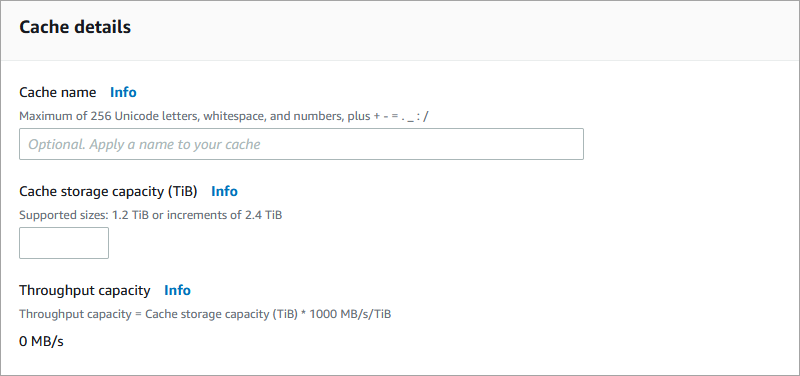

# Step 1: Create your cache

Next, you create your cache. For this exercise, there are instructions about creating
a data repository association to link to an Amazon S3 bucket when you create the File Cache.

1. Open the AWS Management Console at [https://console.aws.amazon.com/fsx/](https://console.aws.amazon.com/fsx/ "https://console.aws.amazon.com/fsx/").
2. Choose **Caches** in the navigation pane.
3. On the dashboard, choose **Create cache** to start the cache creation
   wizard.

Begin your configuration with the **Cache details** section.

 4. For **Cache name**, enter a name for your cache. We recommend using a
name that helps you to identify and manage the cache in the future. You can use a maximum
of 256 Unicode letters, white spaces, numbers, and these special characters: + - = . \_ :
/ 5. For **Cache storage capacity**, set the amount of storage capacity
for your cache, in TiB. Set this to a value of 1.2 TiB, 2.4 TiB, or
increments of 2.4 TiB.

Additionally, metadata storage capacity of 2.4 TiB is provisioned for all caches. 6. The amount of **Throughput capacity** is calculated by multiplying
the cache storage capacity by the throughput tier. For example, for a 1.2 TiB cache,
it's `1200` MBps; for a 9.6 TiB cache, it's `9600` MBps.

**Throughput capacity** is the sustained speed at which the file
server that hosts your cache can serve data. 7. In the **Network & security** section, provide
networking and security group information:

    * For **Virtual Private Cloud (VPC)**, choose the Amazon VPC that
     you want to associate with your cache.
    * For **VPC Security Groups**, the ID for the default security
     group for your VPC should already be added.
    * For **Subnet**, choose any value from the list of available
     subnets.

8. In the **Encryption** section, for **Encryption
   key**, choose the AWS Key Management Service (AWS KMS) encryption key that protects your
   cache's data at rest.
9. For **Tags - _optional_**, you can
   enter a key and value to add tags to your cache. A tag is a case-sensitive key-value pair
   that helps you to manage, filter, and search for your cache.
10. Choose **Next**.
11. In the **Data repository associations (DRAs)**
    section, there are no DRAs linking your cache to Amazon S3 or NFS data repositories. For
    detailed information about linking data repositories to Amazon File Cache, see [To link an S3 bucket or NFS file system while
    creating a cache (console)](create-linked-repo.md#link-new-repo-console "create-linked-repo.md#link-new-repo-console").

The following instructions describe how to link your cache to an existing Amazon S3 bucket
for this getting started exercise. In the **Data repository association**
dialog box, provide information for the following fields.

    1. For **Repository type**, choose `S3`.
    2. For **Data repository path**, enter the path of the existing S3
     bucket or prefix to associate with your cache (for example,
     `s3://my-bucket/my-prefix/`).
    3. For **Cache path**, enter the name of a high-level directory
     (such as `/ns1`) or subdirectory (such as `/ns1/subdir`) within
     Amazon File Cache to associate with the S3 data repository. The first forward slash in
     the path is required.

    ###### Note

    **Cache path** can only be set to root (/) on NFS DRAs when
     **Subdirectories** is specified. If you specify root (/) as the
     **Cache path**, you can create only one DRA on the cache.

    **Cache path** can't be set to root (/) for an S3 DRA.
    4. Choose **Add**.

12. Choose **Next**.
13. Review the cache configuration shown on the **Cache summary** page.
    For your reference, note which cache settings you can modify after the cache is
    created.
14. Choose **Create cache**.
    Now that you've created your cache, note its fully qualified domain name and mount name
    for a later step. You can find the fully qualified domain name and mount name for a cache by
    choosing the name of the cache in the **Caches** dashboard, and then choosing
    **Attach**.
