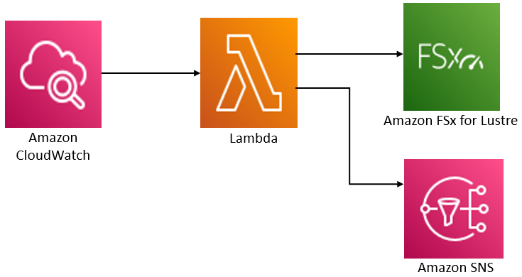

# Additional information

This section provides a reference of supported, but deprecated Amazon FSx features.

###### Topics

- [Setting up a custom backup schedule](#custom-backup-schedule "#custom-backup-schedule")

## Setting up a custom backup schedule

We recommend using AWS Backup to set up a custom backup schedule for your file system. The information provided here
is for reference purposes if you need to schedule backups more frequently than you can when using AWS Backup.

When enabled, Amazon FSx automatically takes a backup of your file system once a day during a daily backup
window. Amazon FSx enforces a retention period that you specify for these automatic backups. It also
supports user-initiated backups, so you can make backups at any point.

Following, you can find the resources and configuration to deploy custom backup scheduling.
Custom backup scheduling performs user-initiated backups on an Amazon FSx for Lustre file system on a custom
schedule that you define. Examples might be once every six hours, once every week, and so on. This script also
configures deleting backups older than your specified retention period.

The solution automatically deploys all the components needed, and takes in the following
parameters:

- The file system
- A CRON schedule pattern for performing backups
- The backup retention period (in days)
- The backup name tags

For more information on CRON schedule patterns, see [Schedule Expressions for Rules](../../../AmazonCloudWatch/latest/events/ScheduledEvents.md "../../../AmazonCloudWatch/latest/events/ScheduledEvents.md") in the
Amazon CloudWatch User Guide.

### Architecture overview

Deploying this solution builds the following resources in the
AWS Cloud.



This solution does the following:

1. The AWS CloudFormation template deploys an CloudWatch Event, a Lambda function, an Amazon SNS queue, and an IAM
   role. The IAM role gives the Lambda function permission to invoke the Amazon FSx for Lustre API
   operations.
2. The CloudWatch event runs on a schedule you define as a CRON pattern, during the initial
   deployment. This event invokes the solution’s backup manager Lambda function that invokes the
   Amazon FSx for Lustre `CreateBackup` API operation to initiate a backup.
3. The backup manager retrieves a list of existing user-initiated backups for the specified
   file system using `DescribeBackups`. It then deletes backups older than the retention
   period, which you specify during the initial deployment.
4. The backup manager sends a notification message to the Amazon SNS queue on a successful backup
   if you choose the option to be notified during the initial deployment. A notification is always
   sent in the event of a failure.

### AWS CloudFormation template

This solution uses AWS CloudFormation to automate the deployment of the Amazon FSx for Lustre custom backup scheduling
solution. To use this solution, download the [fsx-scheduled-backup.template](https://s3.amazonaws.com/solution-references/fsx/backup/fsx-scheduled-backup.template "https://s3.amazonaws.com/solution-references/fsx/backup/fsx-scheduled-backup.template") AWS CloudFormation template.

### Automated deployment

The following procedure configures and deploys this custom backup scheduling solution. It
takes about five minutes to deploy. Before you start, you must have the ID of an Amazon FSx for Lustre file
system running in an Amazon Virtual Private Cloud (Amazon VPC) in your AWS account. For more information on creating
these resources, see [Getting started with Amazon FSx for Lustre](getting-started.md "getting-started.md").

###### Note

Implementing this solution incurs billing for the associated AWS services. For more
information, see the pricing details pages for those services.

###### To launch the custom backup solution stack

1. Download the [fsx-scheduled-backup.template](https://s3.amazonaws.com/solution-references/fsx/backup/fsx-scheduled-backup.template "https://s3.amazonaws.com/solution-references/fsx/backup/fsx-scheduled-backup.template") AWS CloudFormation template. For more information on creating an
   AWS CloudFormation stack, see [Creating a Stack on
   the AWS CloudFormation Console](../../../AWSCloudFormation/latest/UserGuide/cfn-console-create-stack.md "../../../AWSCloudFormation/latest/UserGuide/cfn-console-create-stack.md") in the _AWS CloudFormation User Guide_.

###### Note

By default, this template launches in the US East (N. Virginia) AWS Region. Amazon FSx for Lustre is
currently only available in specific AWS Regions. You must launch this solution in an AWS
Region where Amazon FSx for Lustre is available. For more information, see the Amazon FSx section of [AWS Regions and Endpoints](../../../general/latest/gr/rande.md "../../../general/latest/gr/rande.md") in the
_AWS General Reference_. 2. For **Parameters**, review the parameters for the template and modify
them for the needs of your file system. This solution uses the following default values.

| Parameter                            | Default                  | Description                                                                                                                              |
| ------------------------------------ | ------------------------ | ---------------------------------------------------------------------------------------------------------------------------------------- |
| Amazon FSx for Lustre file system ID | No default value         | The file system ID for the file system that you want to back up.                                                                         |
| CRON schedule pattern for backups.   | 0 0/4 \<br>• \<br>• ? \* | The schedule to run the CloudWatch event, triggering a new backup and deleting old backups<br>outside of the retention period.           |
| Backup retention (days)              | 7                        | The number of days to keep user-initiated backups. The Lambda function deletes<br>user-initiated backups older than this number of days. |
| Name for backups                     | user-scheduled backup    | The name for these backups, which appears in the **Backup Name**<br>column of the Amazon FSx for Lustre Management Console.              |
| Backup notifications                 | Yes                      | Choose whether to be notified when backups are successfully initiated. A<br>notification is always sent if there's an error.             |
| Email address                        | No default value         | The email address to subscribe to the SNS notifications.                                                                                 |

3. Choose **Next**.
4. For **Options**, choose **Next**.
5. For **Review**, review and confirm the settings. You must select the
   check box acknowledging that the template create IAM resources.
6. Choose **Create** to deploy the stack.

You can view the status of the stack in the AWS CloudFormation console in the **Status**
column. You should see a status of **CREATE_COMPLETE** in about five
minutes.

### Additional options

You can use the Lambda function created by this solution to perform custom scheduled backups
of more than one Amazon FSx for Lustre file system. The file system ID is passed to the Amazon FSx for Lustre function in the
input JSON for the CloudWatch event. The default JSON passed to the Lambda function is as follows, where
the values for `FileSystemId` and `SuccessNotification` are passed from the
parameters specified when launching the AWS CloudFormation stack.

```
{
	"start-backup": "true",
	"purge-backups": "true",
	"filesystem-id": "${FileSystemId}",
	"notify_on_success": "${SuccessNotification}"
}

```

To schedule backups for an additional Amazon FSx for Lustre file system, create another CloudWatch event rule. You
do so using the Schedule event source, with the Lambda function created by this solution as the
target. Choose **Constant (JSON text)** under **Configure
Input**. For the JSON input, simply substitute the file system ID of the Amazon FSx for Lustre file
system to back up in place of `${FileSystemId}`. Also, substitute either
`Yes` or `No` in place of `${SuccessNotification}` in the JSON
above.

Any additional CloudWatch Event rules you create manually aren't part of the Amazon FSx for Lustre custom
scheduled backup solution AWS CloudFormation stack. Thus, they aren't removed if you delete the stack.
