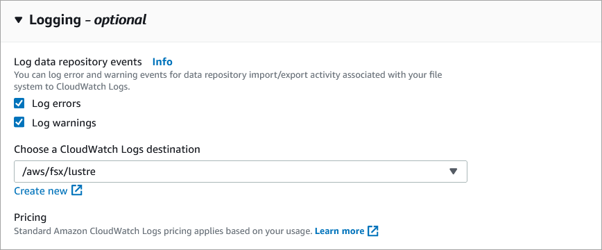

# Logging with Amazon CloudWatch Logs

FSx for Lustre supports logging of error and warning events for
data repositories associated with your file system to Amazon CloudWatch Logs.

###### Note

Logging with Amazon CloudWatch Logs is only available on Amazon FSx for Lustre file systems
created after 3pm PST on November 30, 2021.

###### Topics

- [Logging overview](#event-log-overview "#event-log-overview")
- [Log destinations](#event-log-destinations "#event-log-destinations")
- [Managing logging](#manage-logging "#manage-logging")
- [Viewing logs](#view-logs "#view-logs")

## Logging overview

If you have data repositories linked to your FSx for Lustre file
system, you can enable logging of data repository events
to Amazon CloudWatch Logs. Error and warning events can be logged for import, export,
and restore events. For more information on these operations and on linking to
data repositories, see
[Using data repositories with Amazon FSx for Lustre](fsx-data-repositories.md "fsx-data-repositories.md").

You can configure the log levels that Amazon FSx logs; that is, whether Amazon FSx will log
only error events, only warning events, or both error and warning events. You can
also turn event logging off at any time.

###### Note

We highly recommend that you enable logs for file systems that have any level
of critical functionality associated with them.

## Log destinations

When logging is enabled, FSx for Lustre must be configured with an Amazon CloudWatch Logs
destination. The event log destination is an Amazon CloudWatch Logs log group, and Amazon FSx
creates a log stream for your file system within this log group.
CloudWatch Logs allows you to store, view, and search audit event logs in the Amazon CloudWatch
console, run queries on the logs using CloudWatch Logs Insights, and trigger CloudWatch
alarms or Lambda functions.

You choose the log destination when you create your FSx for Lustre file
system or afterwards by updating it. For more information, see
[Managing logging](#manage-logging "#manage-logging").

By default, Amazon FSx will create and use a default CloudWatch Logs log group in your account
as the event log destination. If you want to use a custom CloudWatch Logs log group as the
event log destination, here are the requirements for the name and location of the
event log destination:

- The name of the CloudWatch Logs log group must begin with the `/aws/fsx/` prefix.
- If you don't have an existing CloudWatch Logs log group when you create or update a file
  system on the console, Amazon FSx for Lustre can create and use a default log stream in
  the CloudWatch Logs `/aws/fsx/lustre` log group. The log stream will be created with
  the format `datarepo_*file\_system\_id*`
  (for example, `datarepo_fs-0123456789abcdef0`).
- If you don't want to use
  the default log group, the configuration UI lets you create a CloudWatch Logs log group when
  you create or update your file system on the console.
- The destination CloudWatch Logs log group must be in the same AWS partition,
  AWS Region, and AWS account as your Amazon FSx for Lustre file system.

You can change the event log destination at any time. When you do so, new event
logs are sent only to the new destination.

## Managing logging

You can enable logging when you create a new FSx for Lustre file system or
afterwards by updating it. Logging is turned on by default when you create a
file system from the Amazon FSx console. However, logging is turned off by default
when you create a file system with the AWS CLI or Amazon FSx API.

On existing file systems that have logging enabled, you can change the event
logging settings, including which log level to log events for, and the log destination.
You can perform these tasks using the Amazon FSx console, AWS CLI, or Amazon FSx API.

1. Open the Amazon FSx console at [https://console.aws.amazon.com/fsx/](https://console.aws.amazon.com/fsx/ "https://console.aws.amazon.com/fsx/").
2. Follow the procedure for creating a new file system described in
   [Step 1: Create your FSx for Lustre file system](getting-started.md#getting-started-step1 "getting-started.md#getting-started-step1") in the Getting Started section.
3. Open the **Logging - optional** section. Logging
   is enabled by default.

 4. Continue with the next section of the file system creation wizard.
When the file system becomes **Available**, logging will be enabled.

1. When creating a new file system, use the `LogConfiguration` property
   with the [CreateFileSystem](../APIReference/API_CreateFileSystem.md "../APIReference/API_CreateFileSystem.md")
   operation to enable logging for the new file system.

```
`create-file-system --file-system-type LUSTRE \
 --storage-capacity 1200 --subnet-id subnet-08b31917a72b548a9 \
 --lustre-configuration "LogConfiguration={Level=WARN_ERROR, \
 Destination="arn:aws:logs:us-east-1:234567890123:log-group:/aws/fsx/testEventLogging"}"`
```

2. When the file system becomes **Available**, logging feature will be enabled.
1. Open the Amazon FSx console at [https://console.aws.amazon.com/fsx/](https://console.aws.amazon.com/fsx/ "https://console.aws.amazon.com/fsx/").
1. Navigate to **File systems**, and choose the Lustre file system that you
   want to manage logging for.
1. Choose the **Data repository** tab.
1. On the **Logging** panel, choose **Update**.
1. On the **Update logging configuration** dialog, change the desired settings.
   1. Choose **Log errors** to log only error events, or
      **Log warnings** to log only warning events, or both.
      Logging is disabled if you don't make a selection.
   2. Choose an existing CloudWatch Logs log destination or create a new one.

1. Choose **Save**.

- Use the [`update-file-system`](../../../cli/latest/reference/fsx/update-file-system.md "../../../cli/latest/reference/fsx/update-file-system.md")
  CLI command or the equivalent [`UpdateFileSystem`](../APIReference/API_UpdateFileSystem.md "../APIReference/API_UpdateFileSystem.md")
  API operation.

```
`update-file-system --file-system-id fs-0123456789abcdef0 \
 --lustre-configuration "LogConfiguration={Level=WARN_ERROR, \
 Destination="arn:aws:logs:us-east-1:234567890123:log-group:/aws/fsx/testEventLogging"}"`
```

## Viewing logs

You can view the logs after Amazon FSx has started emitting them. You can view
the logs as follows:

- You can view logs by going to the Amazon CloudWatch console and choosing the log
  group and log stream to which your event logs are sent. For more information,
  see [View log data sent to CloudWatch Logs](../../../AmazonCloudWatch/latest/logs/Working-with-log-groups-and-streams.md "../../../AmazonCloudWatch/latest/logs/Working-with-log-groups-and-streams.md") in the _Amazon CloudWatch Logs User Guide_.
- You can use CloudWatch Logs Insights to interactively search and analyze your log data.
  For more information, see
  [Analyzing log data with CloudWatch Logs Insights](../../../AmazonCloudWatch/latest/logs/AnalyzingLogData.md "../../../AmazonCloudWatch/latest/logs/AnalyzingLogData.md"), in the _Amazon CloudWatch Logs User Guide_.
- You can also export logs to Amazon S3. For more information, see
  [Exporting log data to Amazon S3](../../../AmazonCloudWatch/latest/logs/S3Export.md "../../../AmazonCloudWatch/latest/logs/S3Export.md"), in the _Amazon CloudWatch Logs User Guide_.

To learn about failure reasons, see
[Data repository event logs](data-repo-event-logs.md "data-repo-event-logs.md").
