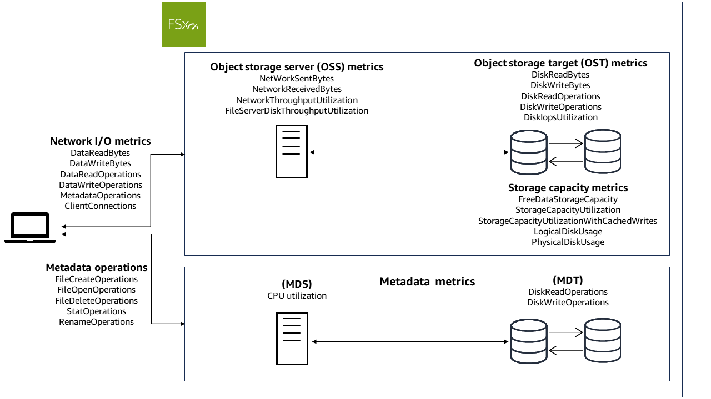

# How to use Amazon FSx for Lustre CloudWatch metrics

There are two primary architectural components of each Amazon FSx for Lustre file system:

- One or more **object storage servers (OSSs)**
  that serve data to clients that access the file system. Each OSS is attached to one or
  more storage volumes, known as **object storage targets (OSTs)**,
  that host the data in your file system.
- One or more **metadata servers (MDSs)** that
  serve metadata to clients that access the file system. Each MDS is attached to a storage
  volume, known as a **metadata target (MDT)**, that stores
  metadata such as filenames, directories, access permissions, and file layouts.
  FSx for Lustre reports metrics in CloudWatch that track performance and resource utilization for
  your file system's storage and metadata servers, and their associated storage volumes.
  The following diagram illustrates an Amazon FSx for Lustre file system with its architectural components,
  and the performance and resource CloudWatch metrics that are available for monitoring.

You can use the **Monitoring & performance** panel on your file system's
dashboard in the Amazon FSx for Lustre console to view the metrics that are described in the following tables.
For more information, see [Accessing CloudWatch metrics](accessingmetrics.md "accessingmetrics.md").

| File system activity (in Summary tab)                                                                                       | How do I...                                                             | Chart                                                                                      | Relevant metrics                                |
| --------------------------------------------------------------------------------------------------------------------------- | ----------------------------------------------------------------------- | ------------------------------------------------------------------------------------------ | ----------------------------------------------- | ----------- | ----- | ---------------- |
| ...determine the amount of available storage capacity on my file system?                                                    | Available storage capacity (bytes)                                      | `FreeDataStorageCapacity`                                                                  |
| ...determine my file system's total client throughput?                                                                      | Total client throughput (bytes/sec)                                     | SUM(`DataReadBytes` + `DataWriteBytes`)/PERIOD (in seconds)                                |
| …determine my file system’s total client IOPS?                                                                              | Total client IOPS (operations/sec)                                      | `SUM(`DataReadOperations`+`DataWriteOperations`+`MetadataOperations`)/PERIOD (in seconds)` |
| ...determine the number of connections that are established between clients and my file server?                             | Client connections (count)                                              | `ClientConnections`                                                                        |
| …determine my file system’s metadata performance utilization?                                                               | Metadata IOPS utilization (percent)                                     | `MAX(MDT Disk IOPS)`                                                                       | Storage tab                                     | How do I... | Chart | Relevant metrics |
| ---                                                                                                                         | ---                                                                     | ---                                                                                        |
| ...determine how much storage is available?                                                                                 | Available storage capacity (bytes)                                      | `FreeDataStorageCapacity`                                                                  |
| …determine the percentage of used storage for my file system, excluding space reserved for cached writes on clients?        | Total storage capacity utilization (percent)                            | `StorageCapacityUtilization`                                                               |
| …determine the percentage of used storage for my file system, including space reserved for cached writes on clients?        | Total storage capacity utilization (percent)                            | `StorageCapacityUtilizationWithCachedWrites`                                               |
| …determine the percentage of used storage for my file system’s OSTs excluding space reserved for cached writes on clients?  | Total storage capacity utilization per OST (percent)                    | `StorageCapacityUtilization`                                                               |
| …determine the percentage of used storage for my file system’s OSTs, including space reserved for cached writes on clients? | Total storage capacity utilization per OST with client grants (percent) | `StorageCapacityUtilizationWithCachedWrites`                                               |
| …determine my file system’s data compression ratio?                                                                         | Compression savings                                                     | 100\*(`LogicalDiskUsage` - `PhysicalDiskUSage`)/`LogicalDiskUsage`                         | Object storage performance (in Performance tab) | How do I... | Chart | Relevant metrics |
| ---                                                                                                                         | ---                                                                     | ---                                                                                        |
| …determine the network throughput between the clients and the OSSs as a percentage of the provisioned limit?                | Network throughput (percent)                                            | `NetworkThroughputUtilization`                                                             |
| …determine the disk throughput between the OSS and its OSTs as a percentage of the provisioned limit?                       | Disk throughput (percent)                                               | `FileServerDiskThroughputUtilization`                                                      |
| …determine the IOPS for operations that access OSTs as a percentage of the provisioned limit?                               | Disk IOPS (percent)                                                     | `DiskIopsUtilization`                                                                      | Metadata performance (in Performance tab)       | How do I... | Chart | Relevant metrics |
| ---                                                                                                                         | ---                                                                     | ---                                                                                        |
| …determine the metadata server's CPU utilization percentage?                                                                | CPU utilization (percent)                                               | `CPUUtilization`                                                                           |
| …determine the metadata IOPS utilization as a percentage of the provisioned limit?                                          | Metadata IOPS utilization                                               | `MAX(MDT Disk IOPS)`                                                                       |
