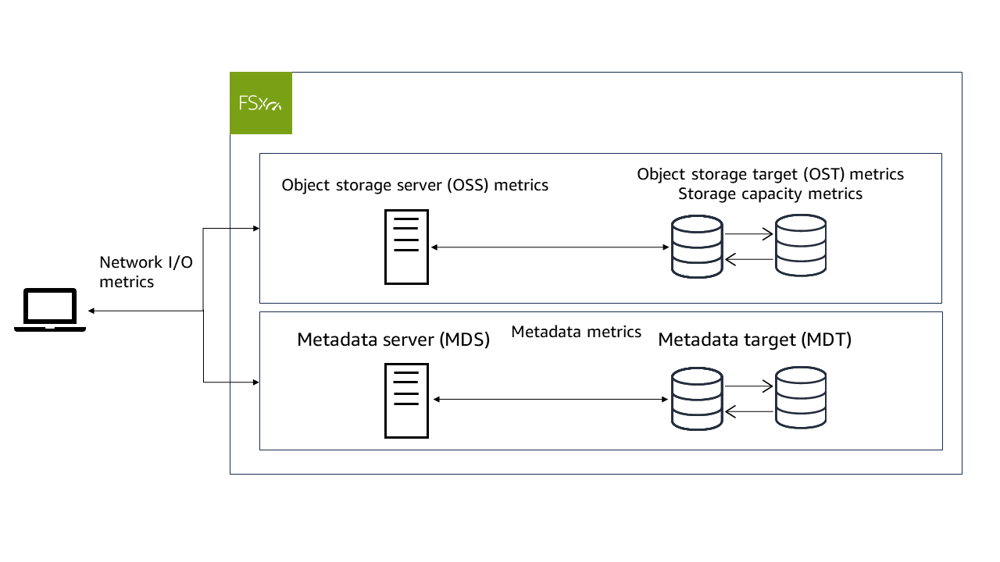

# Monitoring with Amazon CloudWatch

You can monitor Amazon FSx for Lustre using CloudWatch, which collects and processes raw data
from Amazon FSx for Lustre into readable, near real-time metrics. These statistics are
retained for a period of 15 months, so that you can access historical information and
gain a better perspective on how your application or service is performing. For more
information about CloudWatch, see
[What is
Amazon CloudWatch?](../../../AmazonCloudWatch/latest/monitoring/WhatIsCloudWatch.md "../../../AmazonCloudWatch/latest/monitoring/WhatIsCloudWatch.md") in the _Amazon CloudWatch User Guide_.

CloudWatch metrics for FSx for Lustre are organized into six categories:

- **Network I/O metrics** – Measure activity between clients
  and your file system.
- **Object storage server metrics** – Measure object storage
  server (OSS) network throughput and disk throughput utilization.
- **Object storage target metrics** – Measure object storage
  target (OST) disk throughput and disk IOPS utilization.
- **Metadata metrics** – Measure metadata server (MDS) CPU
  utilization, metadata target (MDT) IOPS utilization, and client metadata operations.
- **Storage capacity metrics** – Measure storage
  capacity utilization.
- **S3 data repository metrics** – Measure age of oldest message
  waiting to be imported or exported, and renames processed by the file system.
  The following diagram illustrates an FSx for Lustre file system, its components, and its
  metric categories.

FSx for Lustre sends metric data to CloudWatch at 1-minute intervals.

###### Note

Metrics may not be published during file system maintenance windows
for your Amazon FSx for Lustre file system.

###### Topics

- [How to use Amazon FSx for Lustre CloudWatch metrics](how_to_use_metrics.md "how_to_use_metrics.md")
- [Accessing CloudWatch metrics](accessingmetrics.md "accessingmetrics.md")
- [Amazon FSx for Lustre metrics and dimensions](fs-metrics.md "fs-metrics.md")
- [Performance warnings and recommendations](performance-insights.md "performance-insights.md")
- [Creating CloudWatch alarms to monitor metrics](creating_alarms.md "creating_alarms.md")
