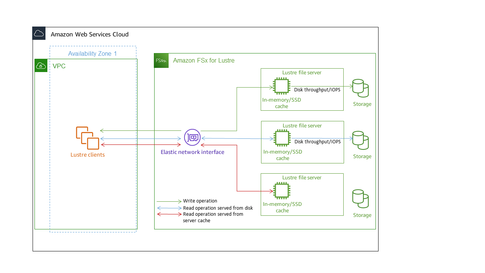

# Amazon FSx for Lustre performance

This chapter provides Amazon FSx for Lustre performance topics, including some important tips
and recommendations for maximizing the performance of your file system.

###### Topics

- [Overview](#performance-overview "#performance-overview")
- [How FSx for Lustre file systems work](#how-lustre-fs-work "#how-lustre-fs-work")
- [File system metadata performance](#dne-metadata-performance "#dne-metadata-performance")
- [Throughput to individual client instances](#throughput-clients "#throughput-clients")
- [File system storage layout](#storage-layout "#storage-layout")
- [Striping data in your file system](#striping-data "#striping-data")
- [Monitoring performance and usage](#performance-monitoring "#performance-monitoring")
- [Performance characteristics of SSD and HDD storage classes](ssd-storage.md "ssd-storage.md")
- [Performance characteristics of Intelligent-Tiering storage class](intelligent-tiering-file-systems.md "intelligent-tiering-file-systems.md")
- [Performance tips](performance-tips.md "performance-tips.md")

## Overview

Amazon FSx for Lustre, built on Lustre, the popular high-performance file system, provides
scale-out performance that increases linearly with a file system’s size. Lustre file systems
scale horizontally across multiple file servers and disks. This scaling gives each client direct
access to the data stored on each disk to remove many of the bottlenecks present in traditional
file systems. Amazon FSx for Lustre builds on the Lustre scalable architecture to support high levels of
performance across large numbers of clients.

## How FSx for Lustre file systems work

Each FSx for Lustre file system consists of the file servers that the clients communicate
with, and a set of disks attached to each file server that store your data. Each file server
employs a fast, in-memory cache to enhance performance for the most frequently accessed data.
Depending on the storage class, your file server can be provisioned with an optional SSD read cache.
When a client accesses data that's
stored in the in-memory or SSD cache, the file server doesn't need to read it from disk,
which reduces latency and increases the total amount of throughput you can drive. The
following diagram illustrates the paths of a write operation, a read operation served from
disk, and a read operation served from in-memory or SSD cache.

When you read data that is stored on the file server's in-memory or SSD cache, file
system performance is determined by the network throughput. When you write data to your file
system, or when you read data that isn't stored on the in-memory cache, file system
performance is determined by the lower of the network throughput and disk throughput.

To learn more about network throughput, disk throughput, and IOPS characteristics of SSD
and HDD storage classes, see
[Performance characteristics of SSD and HDD storage classes](ssd-storage.md "ssd-storage.md") and
[Performance characteristics of Intelligent-Tiering storage class](intelligent-tiering-file-systems.md "intelligent-tiering-file-systems.md").

## File system metadata performance

File system metadata IO operations per second (IOPS) determine the number of files and
directories that you can create, list, read, and delete per second.

Persistent 2 file systems allow you to provision Metadata IOPS independent from storage capacity
and provide increased visibility into the number and type of metadata IOPS client instances are driving
on your file system. With SSD file systems, Metadata IOPS are automatically provisioned based on the storage capacity that you
provision. Automatic mode is not supported on Intelligent-Tiering file systems.

With FSx for Lustre Persistent 2 file systems, the number of Metadata IOPS you provision and the type of metadata operation determine
the rate of metadata operations that your file system can support. The level of metadata IOPS you provision determines
the number of IOPS provisioned for your file system's metadata disks.

| Type of operation | Operations you can drive per second for each provisioned metadata IOPS
|
| --- | --- |
| File Create, Open and Close | 2 |
| File Delete | 1 |
| Directory Create, Rename | 0.1 |
| Directory Delete | 0.2 | For SSD file systems, you can choose to provision metadata IOPS using Automatic mode. In Automatic mode, Amazon FSx automatically provisions metadata IOPS based on the storage capacity of your file system according to the table below:
| File system storage capacity | Included metadata IOPS in Automatic mode |
| --- | --- |
| 1200 GiB | 1500 |
| 2400 GiB | 3000 |
| 4800–9600 GiB | 6000 |
| 12000–45600 GiB | 12000 |
| ≥48000 GiB | 12000 IOPS per 24000 GiB | In User-provisioned mode, you can optionally choose to specify the number of metadata IOPS to provision. Valid values are as follows:  • For SSD file systems, valid values are `1500`, `3000`, `6000`, `12000`, and multiples of `12000` up to a maximum of `192000`.  • For Intelligent-Tiering file systems, valid values are `6000` and `12000`. For information about how to configure Metadata IOPS, see [Managing metadata performance](managing-metadata-performance.md "managing-metadata-performance.md"). Note that you pay for Metadata IOPS provisioned above the default number of Metadata IOPS for your file system. ## Throughput to individual client instances If you are creating a file system with over 10 GBps of throughput capacity, we recommend enabling Elastic Fabric Adapter (EFA) to optimize throughput per client instance. To further optimize throughput per client instance, EFA-enabled file systems also support GPUDirect Storage for EFA-enabled NVIDIA GPU-based client instances and ENA Express for ENA Express-enabled client instances. The throughput that you can drive to a single client instance depends on your choice of file system type and the network interface on your client instance.
| File system type | Client instance network interface | Maximum throughput per client, Gbps |
| --- | --- | --- |
| Non EFA-enabled | Any | 100 Gbps\* |
| EFA-enabled | ENA | 100 Gbps\* |
| EFA-enabled | ENA Express | 100 Gbps |
| EFA-enabled | EFA | 700 Gbps |
| EFA-enabled | EFA with GDS | 1200 Gbps | ###### Note \* The traffic between an individual client instance and an individual FSx for Lustre object storage server is limited to 5 Gbps. Refer to the [IP addresses for file systems](using-fsx-lustre.md#ip-addesses-for-fs "using-fsx-lustre.md#ip-addesses-for-fs") for the number of object storage servers underpinning your FSx for Lustre file system. ## File system storage layout All file data in Lustre is stored on storage volumes called _object storage targets_ (OSTs). All file metadata (including file names, timestamps, permissions, and more) is stored on storage volumes called _metadata targets_ (MDTs). Amazon FSx for Lustre file systems are composed of one or more MDTs and multiple OSTs. Amazon FSx for Lustre spreads your file data across the OSTs that make up your file system to balance storage capacity with throughput and IOPS load. To view the storage usage of the MDT and OSTs that make up your file system, run the following command from a client that has the file system mounted. `` lfs df -h `mount/path` `` The output of this command looks like the following. ``UUID                             bytes       Used   Available Use% Mounted on `mountname`-MDT0000_UUID           68.7G       5.4M       68.7G   0% /fsx[MDT:0] `mountname`-OST0000_UUID            1.1T       4.5M        1.1T   0% /fsx[OST:0] `mountname`-OST0001_UUID            1.1T       4.5M        1.1T   0% /fsx[OST:1] filesystem_summary:               2.2T       9.0M        2.2T   0% /fsx`` ## Striping data in your file system You can optimize your file system's throughput performance with file striping. Amazon FSx for Lustre automatically spreads out files across OSTs in order to ensure that data is served from all storage servers. You can apply the same concept at the file level by configuring how files are striped across multiple OSTs. Striping means that files can be divided into multiple chunks that are then stored across different OSTs. When a file is striped across multiple OSTs, read or write requests to the file are spread across those OSTs, increasing the aggregate throughput or IOPS your applications can drive through it. Following are the default layouts for Amazon FSx for Lustre file systems.  • For file systems created before December 18, 2020, the default layout specifies a stripe count of 1. This means that unless a different layout is specified, each file created in Amazon FSx for Lustre using standard Linux tools is stored on a single disk.  • For file systems created after December 18, 2020, the default layout is a progressive file layout in which files under 1GiB in size are stored in one stripe, and larger files are assigned a stripe count of 5.  • For file systems created after August 25, 2023, the default layout is a 4-component progressive file layout which is explained in [Progressive file layouts](#striping-pfl "#striping-pfl").  • For all file systems regardless of their creation date, files imported from Amazon S3 don't use the default layout, but instead use the layout in the file system's `ImportedFileChunkSize` parameter. S3-imported files larger than the `ImportedFileChunkSize` will be stored on multiple OSTs with a stripe count of `(FileSize / ImportedFileChunksize) + 1`. The default value of `ImportedFileChunkSize` is 1GiB. You can view the layout configuration of a file or directory using the `lfs getstripe` command. `` lfs getstripe `path/to/filename` `` This command reports a file's stripe count, stripe size, and stripe offset. The _stripe count_ is how many OSTs the file is striped across. The _stripe size_ is how much continuous data is stored on an OST. The _stripe offset_ is the index of the first OST that the file is striped across. ### Modifying your striping configuration A file's layout parameters are set when the file is first created. Use the `lfs setstripe` command to create a new, empty file with a specified layout. `` lfs setstripe `filename` --stripe-count `number_of_OSTs` `` The `lfs setstripe` command affects only the layout of a new file. Use it to specify the layout of a file before you create it. You can also define a layout for a directory. Once set on a directory, that layout is applied to every new file added to that directory, but not to existing files. Any new subdirectory you create also inherits the new layout, which is then applied to any new file or directory you create within that subdirectory. To modify the layout of an existing file, use the `lfs migrate` command. This command copies the file as needed to distribute its content according to the layout you specify in the command. For example, files that are appended to or are increased in size don't change the stripe count, so you have to migrate them to change the file layout. Alternatively, you can create a new file using the `lfs setstripe` command to specify its layout, copy the original content to the new file, and then rename the new file to replace the original file. There may be cases where the default layout configuration is not optimal for your workload. For example, a file system with tens of OSTs and a large number of multi-gigabyte files may see higher performance by striping the files across more than the default stripe count value of five OSTs. Creating large files with low stripe counts can cause I/O performance bottlenecks and can also cause OSTs to fill up. In this case, you can create a directory with a larger stripe count for these files. Setting up a striped layout for large files (especially files larger than a gigabyte in size) is important for the following reasons:  • Improves throughput by allowing multiple OSTs and their associated servers to contribute IOPS, network bandwidth, and CPU resources when reading and writing large files.  • Reduces the likelihood that a small subset of OSTs become hot spots that limit overall workload performance.  • Prevents a single large file from filling an OST, possibly causing disk full errors. There is no single optimal layout configuration for all use cases. For detailed guidance on file layouts, see [Managing File Layout (Striping) and Free Space](https://doc.lustre.org/lustre_manual.xhtml#managingstripingfreespace "https://doc.lustre.org/lustre_manual.xhtml#managingstripingfreespace") in the Lustre.org documentation. The following are general guidelines:  • Striped layout matters most for large files, especially for use cases where files are routinely hundreds of megabytes or more in size. For this reason, the default layout for a new file system assigns a striped count of five for files over 1GiB in size.  • Stripe count is the layout parameter that you should adjust for systems supporting large files. The stripe count specifies the number of OST volumes that will hold chunks of a striped file. For example, with a stripe count of 2 and a stripe size of 1MiB, Lustre writes alternate 1MiB chunks of a file to each of two OSTs.  • The effective stripe count is the lesser of the actual number of OST volumes and the stripe count value you specify. You can use the special stripe count value of `-1` to indicate that stripes should be placed on all OST volumes.  • Setting a large stripe count for small files is sub-optimal because for certain operations Lustre requires a network round trip to every OST in the layout, even if the file is too small to consume space on all the OST volumes.  • You can set up a progressive file layout (PFL) that allows the layout of a file to change with size. A PFL configuration can simplify managing a file system that has a combination of large and small files without you having to explicitly set a configuration for each file. For more information, see [Progressive file layouts](#striping-pfl "#striping-pfl").  • Stripe size by default is 1MiB. Setting a stripe offset may be userful in special circumstances, but in general it is best to leave it unspecified and use the default. ### Progressive file layouts You can specify a progressive file layout (PFL) configuration for a directory to specify different stripe configurations for small and large files before populating it. For example, you can set a PFL on the top-level directory before any data is written to a new file system. To specify a PFL configuration, use the `lfs setstripe` command with `-E` options to specify layout components for different sized files, such as the following command: `` lfs setstripe -E 100M -c 1 -E 10G -c 8 -E 100G -c 16 -E -1 -c 32 `/mountname/directory` `` This command sets four layout components:  • The first component (`-E 100M -c 1`) indicates a stripe count value of 1 for files up to 100MiB in size.  • The second component (`-E 10G -c 8`) indicates a stripe count of 8 for files up to 10GiB in size.  • The third component (`-E 100G -c 16`) indicates a stripe count of 16 for files up to 100GiB in size.  • The fourth component (`-E -1 -c 32`) indicates a stripe count of 32 for files larger than 100GiB. ###### Important Appending data to a file created with a PFL layout will populate all of its layout components. For example, with the 4-component command shown above, if you create a 1MiB file and then add data to the end of it, the layout of the file will expand to have a stripe count of -1, meaning all the OSTs in the system. This does not mean data will be written to every OST, but an operation such as reading the file length will send a request in parallel to every OST, adding significant network load to the file system. Therefore, be careful to limit the stripe count for any small or medium length file that can subsequently have data appended to it. Because log files usually grow by having new records appended, Amazon FSx for Lustre assigns a default stripe count of 1 to any file created in append mode, regardless of the default stripe configuration specified by its parent directory. The default PFL configuration on Amazon FSx for Lustre file systems created after August 25, 2023 is set with this command: `` lfs setstripe -E 100M -c 1 -E 10G -c 8 -E 100G -c 16 -E -1 -c 32 `/mountname` `` Customers with workloads that have highly concurrent access on medium and large files are likely to benefit from a layout with more stripes at smaller sizes and striping across all OSTs for the largest files, as shown in the four-component example layout. ## Monitoring performance and usage Every minute, Amazon FSx for Lustre emits usage metrics for each disk (MDT and OST) to Amazon CloudWatch. To view aggregate file system usage details, you can look at the Sum statistic of each metric. For example, the Sum of the `DataReadBytes` statistic reports the total read throughput seen by all the OSTs in a file system. Similarly, the Sum of the `FreeDataStorageCapacity` statistic reports the total available storage capacity for file data in the file system. For more information on monitoring your file system’s performance, see [Monitoring Amazon FSx for Lustre file systems](monitoring_overview.md "monitoring_overview.md").
