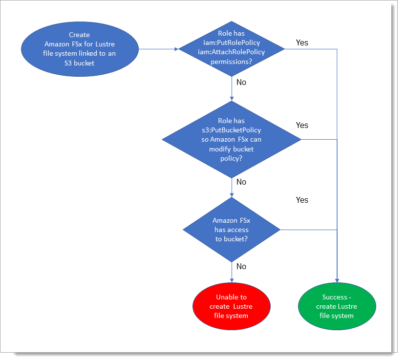

# Setting up Amazon FSx for Lustre

Before you use Amazon FSx for Lustre for the first time, complete the tasks
in the [Sign up for Amazon Web Services](#setting-up-aws "#setting-up-aws") section.
To complete the [Getting started tutorial](getting-started.md "getting-started.md"), make
sure the Amazon S3 bucket that you'll link to your file system has the permissions listed
in [Adding permissions to use data repositories in Amazon S3](#fsx-adding-permissions-s3 "#fsx-adding-permissions-s3").

###### Topics

- [Sign up for Amazon Web Services](#setting-up-aws "#setting-up-aws")
- [Adding permissions to use data repositories in Amazon S3](#fsx-adding-permissions-s3 "#fsx-adding-permissions-s3")
- [How FSx for Lustre checks for access to linked S3 buckets](#fsx-lustre-permissions-s3-bucket "#fsx-lustre-permissions-s3-bucket")
- [Next step](#setting-up-next-step "#setting-up-next-step")

## Sign up for Amazon Web Services

To set up for AWS, complete the following tasks:

1. [Sign up for an AWS account](#sign-up-for-aws "#sign-up-for-aws")
2.

### Sign up for an AWS account

To get started with AWS, you need an AWS account. For information about creating an AWS account, see
[Getting started with an AWS account](../../../accounts/latest/reference/getting-started.md "../../../accounts/latest/reference/getting-started.md")
in the _AWS Account Management Reference Guide_.

## Adding permissions to use data repositories in Amazon S3

Amazon FSx for Lustre is deeply integrated with Amazon S3. This integration means that applications that access
your FSx for Lustre file system can also seamlessly access the objects stored in your linked Amazon S3 bucket.
For more information, see [Using data repositories with Amazon FSx for Lustre](fsx-data-repositories.md "fsx-data-repositories.md").

To use data repositories, you must first allow Amazon FSx for Lustre certain IAM permissions in a role
associated with the account for your administrator user.

###### To embed an inline policy for a role using the console

1. Sign in to the AWS Management Console and open the IAM console at [https://console.aws.amazon.com/iam/](https://console.aws.amazon.com/iam/ "https://console.aws.amazon.com/iam/").
2. In the navigation pane, choose **Roles**.
3. In the list, choose the name of the role to embed a policy in.
4. Choose the **Permissions** tab.
5. Scroll to the bottom of the page and choose **Add inline
   policy**.

###### Note

You can't embed an inline policy in a service-linked role in IAM. Because the
linked service defines whether you can modify the permissions of the role, you might
be able to add additional policies from the service console, API, or AWS CLI. To view
the service-linked role documentation for a service, see **AWS
Services That Work with IAM** and choose **Yes** in the **Service-Linked Role** column
for your service. 6. Choose **Creating Policies with the Visual Editor** 7. Add the following permissions policy statement.

JSON

```
`{
 "Version":"2012-10-17",
 "Statement": {
 "Effect": "Allow",
 "Action": [
 "iam:CreateServiceLinkedRole",
 "iam:AttachRolePolicy",
 "iam:PutRolePolicy"
 ],
 "Resource": "arn:aws:iam::*:role/aws-service-role/s3.data-source.lustre.fsx.amazonaws.com/*"
 }
}`

```

After you create an inline policy, it is automatically embedded in your role.
For more information about service-linked roles, see [Using service-linked roles for Amazon FSx](using-service-linked-roles.md "using-service-linked-roles.md").

## How FSx for Lustre checks for access to linked S3 buckets

If the IAM role that you use to create the FSx for Lustre file system does not have the
`iam:AttachRolePolicy` and `iam:PutRolePolicy` permissions, then
Amazon FSx checks whether it can update your S3 bucket policy. Amazon FSx can update your bucket
policy if the `s3:PutBucketPolicy` permission is included in your IAM role to
allow the Amazon FSx file system to import or export data to your S3 bucket. If allowed to
modify the bucket policy, Amazon FSx adds the following permissions to the bucket
policy:

- `s3:AbortMultipartUpload`
- `s3:DeleteObject`
- `s3:PutObject`
- `s3:Get*`
- `s3:List*`
- `s3:PutBucketNotification`
- `s3:PutBucketPolicy`
- `s3:DeleteBucketPolicy`

If Amazon FSx can't modify the bucket policy, it then checks if the existing bucket policy
grants Amazon FSx access to the bucket.

If all of these options fail, then the request to create the file system fails. The
following diagram illustrates the checks that Amazon FSx follows when determining whether a
file system can access the S3 bucket to which it will be linked.



## Next step

To get started using FSx for Lustre, see [Getting started with Amazon FSx for Lustre](getting-started.md "getting-started.md") for instructions to create your Amazon FSx for Lustre resources.
