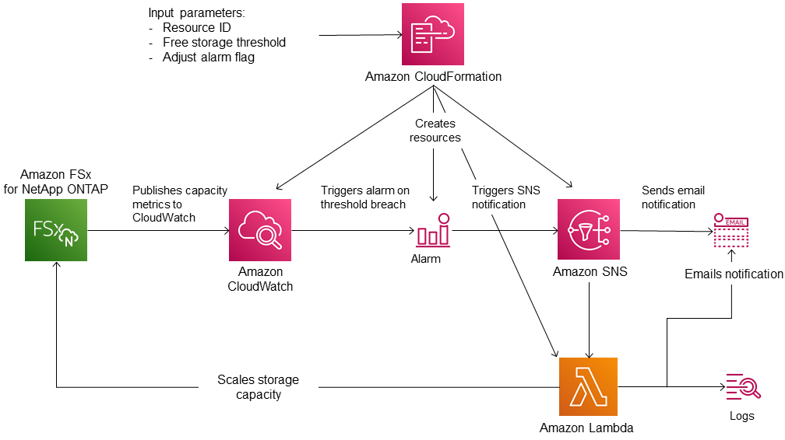
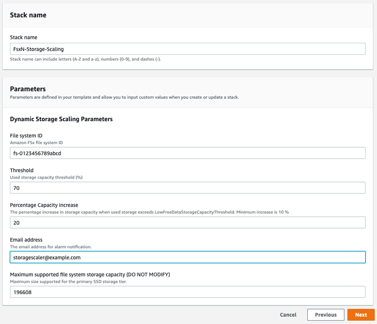

# Updating storage capacity dynamically

You can use the following solution to dynamically increase the SSD storage capacity of
an FSx for ONTAP file system when the amount of used SSD storage capacity exceeds a
threshold that you specify. This AWS CloudFormation template automatically deploys all of
the components that are required to define the storage capacity threshold, the
Amazon CloudWatch alarm based on this threshold, and the AWS Lambda function that
increases the file system’s storage capacity.

The solution automatically deploys all of the components needed, and uses the
following parameters:

- Your FSx for ONTAP file system ID.
- The used SSD storage capacity threshold (numerical value). This is the percentage
  at which the CloudWatch alarm will be triggered.
- The percentage by which to increase the storage capacity (%).
- The email address used to receive scaling notifications.

###### Topics

- [Architecture overview](#storage-inc-architecture "#storage-inc-architecture")
- [CloudFormation template](#storage-capacity-CFN-template "#storage-capacity-CFN-template")
- [Automated deployment with CloudFormation](#fsx-dynamic-storage-increase-deployment "#fsx-dynamic-storage-increase-deployment")

## Architecture overview

Deploying this solution builds the following resources in the AWS Cloud.

The diagram illustrates the following steps:

1. The CloudFormation template deploys a CloudWatch alarm, an AWS Lambda function, an Amazon Simple Notification Service (Amazon SNS) queue,
   and all required AWS Identity and Access Management (IAM) roles. The IAM role gives the Lambda
   function permission to invoke the Amazon FSx API operations.
2. CloudWatch triggers an alarm when the file system’s used storage capacity exceeds
   the specified threshold, and sends a message to the Amazon SNS queue. An alarm is triggered only
   when the file system’s used capacity exceeds the threshold continuously for a 5-minute period.
3. The solution then triggers the Lambda function that is subscribed to this Amazon SNS topic.
4. The Lambda function calculates the new file system storage capacity based on the specified percent increase
   value and sets the new file system storage capacity.
5. The original CloudWatch alarm state and results of the Lambda function operations are sent to the
   Amazon SNS queue.

To receive notifications about the actions that are performed as a response to the
CloudWatch alarm, you must confirm the Amazon SNS topic subscription by following the link
provided in the **Subscription Confirmation** email.

## CloudFormation template

This solution uses CloudFormation to automate deploying the components that are used to
automatically increase the storage capacity of an FSx for ONTAP file system. To use
this solution, download the [FSxOntapDynamicStorageScaling](https://solution-references.s3.amazonaws.com/fsx/DynamicScaling/FSxOntapDynamicStorageScaling.yaml "https://solution-references.s3.amazonaws.com/fsx/DynamicScaling/FSxOntapDynamicStorageScaling.yaml") CloudFormation template.

The template uses the **Parameters** described as follows. Review
the template parameters and their default values, and modify them for the needs of
your file system.

**FileSystemId**

No default value. The ID of the file system for which you want to automatically increase the storage capacity.

**LowFreeDataStorageCapacityThreshold**

No default value. Specifies the used storage capacity threshold at which
to trigger an alarm and automatically increase the file system's storage capacity,
specified in percentage (%) of the file system's current storage capacity.
The file system is considered to have low free storage capacity when the used
storage exceeds this threshold.

**EmailAddress**

No default value. Specifies the email address to use for the SNS
subscription and receives the storage capacity threshold
alerts.

**PercentIncrease**

Default is **20%**. Specifies the amount
by which to increase the storage capacity, expressed as a percentage of the
current storage capacity.

###### Note

Storage scaling is attempted once every time the CloudWatch alarm enters
the `ALARM` state. If your SSD storage capacity
utilization remains above the threshold after a storage
scaling operation is attempted, the storage scaling
operation isn't attempted again.

**MaxFSxSizeinGiB**

Default is **196608**. Specifies the maximum
supported storage capacity for the SSD storage.

## Automated deployment with CloudFormation

The following procedure configures and deploys an CloudFormation stack to automatically
increase the storage capacity of an FSx for ONTAP file system. It takes a few
minutes to deploy. For more information about creating a CloudFormation stack,
see [Creating a
stack on the AWS CloudFormation console](../../../AWSCloudFormation/latest/UserGuide/cfn-console-create-stack.md "../../../AWSCloudFormation/latest/UserGuide/cfn-console-create-stack.md") in the
_AWS CloudFormation User Guide_.

###### Note

Implementing this solution incurs billing for the associated AWS services. For
more information, see the pricing details pages for those services.

Before you start, you must have the ID of the Amazon FSx file system that's running in
the Amazon Virtual Private Cloud (Amazon VPC) in your AWS account. For more information about
creating Amazon FSx resources, see [Getting started with Amazon FSx for NetApp ONTAP](getting-started.md "getting-started.md").

###### To launch the automatic storage capacity increase solution stack

1. Download the [FSxOntapDynamicStorageScaling](https://solution-references.s3.amazonaws.com/fsx/DynamicScaling/FSxOntapDynamicStorageScaling.yaml "https://solution-references.s3.amazonaws.com/fsx/DynamicScaling/FSxOntapDynamicStorageScaling.yaml") CloudFormation template.

###### Note

Amazon FSx is currently only available in specific AWS Regions. You must
launch this solution in an AWS Region where Amazon FSx is available. For more
information, see [Amazon FSx endpoints and quotas](../../../general/latest/gr/fsxn.md "../../../general/latest/gr/fsxn.md") in the
_AWS General Reference_. 2. From the CloudFormation console, choose **Create stack > With new
resources**. 3. Choose **Template is ready**. In the **Specify
template** section, choose **Upload a template
file** and upload the template that you
downloaded. 4. In **Specify stack details**, enter the values for your automatic storage
capacity increase solution.

 5. Enter a **Stack name**. 6. For **Parameters**, review the parameters for the template and modify them to
meet the needs of your file system. Then choose
**Next**.

###### Note

To receive email notifications when scaling is attempted by this CloudFormation template, confirm
the SNS subscription email that you receive after deploying the
template. 7. Enter the **Options** settings that you want for your
custom solution, and then choose **Next**. 8. For **Review**, review and confirm the solution settings. You must select the
check box acknowledging that the template creates IAM resources. 9. Choose **Create** to deploy the stack.

You can view the status of the stack in the CloudFormation console in the
**Status** column. You should see a status of
**CREATE_COMPLETE** in a few minutes.

### Updating the

stack

After the stack is created, you can update it by using the same template and
providing new values for the parameters. For more information, see [Updating stacks directly](../../../AWSCloudFormation/latest/UserGuide/using-cfn-updating-stacks-direct.md "../../../AWSCloudFormation/latest/UserGuide/using-cfn-updating-stacks-direct.md") in the
_AWS CloudFormation User Guide_.
