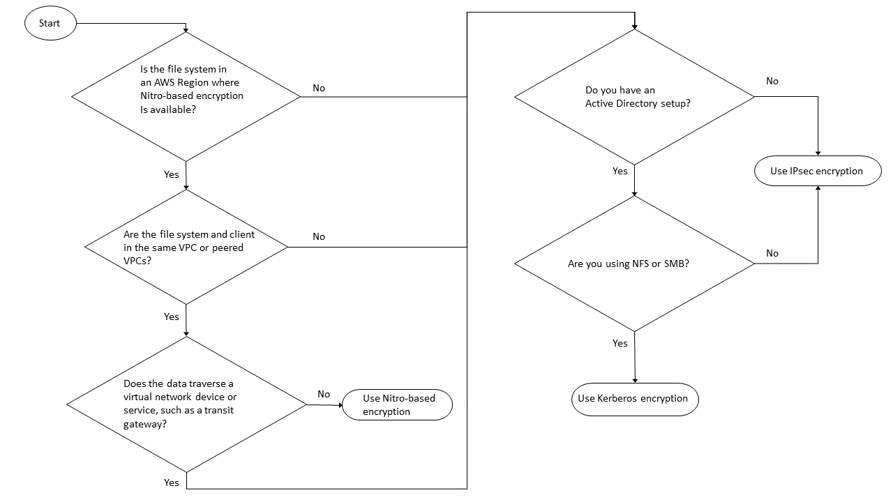

# Encrypting data in transit

This topic explains the different options available for encrypting your file data while it is in-transit between an FSx for ONTAP
file system and connected clients. It also provides guidance to help you choose which encryption method is best suited for your
workflow.

All data flowing across AWS Regions over the AWS global network is automatically encrypted at the physical layer before
it leaves AWS secured facilities. All traffic between Availability Zones is encrypted. Additional layers of encryption,
including those listed in this section, provide additional protections. For more information about how AWS provides protection
for data flowing across AWS Regions, Available Zones, and instances, see
[Encryption in transit](../../../AWSEC2/latest/UserGuide/data-protection.md#encryption-transit "../../../AWSEC2/latest/UserGuide/data-protection.md#encryption-transit")
in the Amazon Elastic Compute Cloud User Guide for Linux Instances.

Amazon FSx for NetApp ONTAP supports the following methods for encrypting data in transit between FSx for ONTAP file systems
and connected clients:

- Automatic Nitro-based encryption over all supported protocols and clients
  running on supported Amazon EC2 [Linux](../../../AWSEC2/latest/UserGuide/data-protection.md#encryption-transit "../../../AWSEC2/latest/UserGuide/data-protection.md#encryption-transit") and [Windows](../../../AWSEC2/latest/WindowsGuide/data-protection.md#encryption-transit "../../../AWSEC2/latest/WindowsGuide/data-protection.md#encryption-transit") instance types.
- Kerberos-based encryption over NFS and SMB protocols.
- IPsec-based encryption over NFS, iSCSI, and SMB protocols
  All of the supported methods for encrypting data in transit use industry standard AES-256 cryptographic algorithms that
  provide enterprise strength encryption.

###### Topics

- [Choosing a method for encrypting data in transit](#choosing-encryption-in-transit "#choosing-encryption-in-transit")
- [Encrypting data in transit with AWS Nitro System](#nitro-encryption "#nitro-encryption")
- [Encrypting data in-transit with Kerberos-based encryption](#kerberos-encryption "#kerberos-encryption")
- [Encrypting data in transit with IPsec encryption](#ipsec-encryption "#ipsec-encryption")
- [Enabling SMB encryption of data in transit](enable-smb-encryption.md "enable-smb-encryption.md")
- [Configuring IPsec using PSK authentication](config-ipsec-psk-auth.md "config-ipsec-psk-auth.md")
- [Configuring IPsec using certificate authentication](config-ipsec-ca-auth.md "config-ipsec-ca-auth.md")

## Choosing a method for encrypting data in transit

This section provides information that can help you decide which of the supported encryption in transit methods is best
for your workflow. Refer back to this section as you explore the supported options described in detail in the sections that follow.

There are several factors to consider when choosing how you are going to encrypt data in transit between your
FSx for ONTAP file system and connected clients. These factors include:

- The AWS Region that your FSx for ONTAP file system is running in.
- The instance type that the client is running on.
- The location of the client accessing your file system.
- Network performance requirements.
- The data protocol you want to encrypt.
- If you are using Microsoft Active Directory.

**AWS Region**
The AWS Region that your file system is running in determines whether or not you can use
Amazon Nitro-based encryption. For more information, see [Encrypting data in transit with AWS Nitro System](#nitro-encryption "#nitro-encryption").

**Client instance type**
You can use Amazon Nitro-based encryption if the client accessing your file system is running on any of the supported Amazon EC2
Mac, [Linux](../../../AWSEC2/latest/UserGuide/data-protection.md#encryption-transit "../../../AWSEC2/latest/UserGuide/data-protection.md#encryption-transit") or
[Windows](../../../AWSEC2/latest/WindowsGuide/data-protection.md#encryption-transit "../../../AWSEC2/latest/WindowsGuide/data-protection.md#encryption-transit") instance types,
and your workflow meets all other requirements for using [Nitro-based encryption](#nitro-encryption "#nitro-encryption").
There aren't any client instance type requirements for using Kerberos or IPsec encryption.

**Client location**

The location of the client accessing data with respect to the location of your file system impacts which in-transit encryption methods are available to use.
You can use any of the supported encryption methods if the client and file system are located in the same VPC. The same is true if the client and file system
are located in peered VPCs, as long as the traffic does not pass through a virtual network device or service, such as a transit gateway. Nitro-based encryption
is not an available option if the client is not in the same or peered VPC, or if the traffic passes through a virtual network device or service.

**Network performance**

Using Amazon Nitro-based encrypted has no impact on network performance. This is because the supported Amazon EC2 instances utilize the offload
capabilities of the underlying Nitro System hardware to automatically encrypt in-transit traffic between instances.

Using Kerberos or IPsec encryption has an impact on network performance. This is because both of these encryption methods are software-based,
which requires the client and server to use compute resources to encrypt and decrypt in-transit traffic.

**Data protocol**

You can use Amazon Nitro-based encryption and IPsec encryption with all of the supported protocols – NFS, SMB, and iSCSI. You can use
Kerberos encryption with the NFS and SMB protocols (with an Active Directory).

**Active Directory**
If you are using Microsoft Active Directory, you can use
[Kerberos encryption](#kerberos-encryption "#kerberos-encryption") over the NFS and SMB protocols.

Use the following diagram to help you decide which encryption in-transit method to use.

IPsec encryption is the only option available when all of the following conditions apply to your workflow:

- You are using the NFS, SMB, or iSCSI protocol.
- Your workflow does not support using Amazon Nitro-based encryption.
- You are not using a Microsoft Active Directory domain.

## Encrypting data in transit with AWS Nitro System

With Nitro-based encryption, data in-transit is encrypted automatically when clients accessing your file systems are running on
supported Amazon EC2 [Linux](../../../AWSEC2/latest/UserGuide/data-protection.md#encryption-transit "../../../AWSEC2/latest/UserGuide/data-protection.md#encryption-transit") or
[Windows](../../../AWSEC2/latest/WindowsGuide/data-protection.md#encryption-transit "../../../AWSEC2/latest/WindowsGuide/data-protection.md#encryption-transit")
instance types in AWS Regions where it's available on FSx for ONTAP.

Using Amazon Nitro-based encryption has no impact on network performance. This is because the supported Amazon EC2 instances utilize the offload
capabilities of the underlying Nitro System hardware to automatically encrypt in-transit traffic between instances.

Nitro-based encryption is enabled automatically when the supported client instance types are located in the same AWS Region
and in the same VPC or in a VPC peered with the file system's VPC. Additionally, if the client is in a peered VPC, then data cannot traverse
a virtual network device or service (such as a transit gateway) in order for Nitro-based encryption to be automatically enabled.
For more information about Nitro-based encryption, see the Encryption in transit section of the Amazon EC2 User Guide for
[Linux](../../../AWSEC2/latest/UserGuide/data-protection.md#encryption-transit "../../../AWSEC2/latest/UserGuide/data-protection.md#encryption-transit") or
[Windows](../../../AWSEC2/latest/WindowsGuide/data-protection.md#encryption-transit "../../../AWSEC2/latest/WindowsGuide/data-protection.md#encryption-transit") instance types.

The following table details the AWS Regions that Nitro-based encryption is available in.

| Support for Nitro-based encryption | Generation             | Deployment types                                                                                                                              | AWS Region                                                                                                                                                                                                                                                                                                                                                                                                                                                                                                                                                                                                                                                                                                                                                                                                                                                                                                                                                                                                                                                                                                                                                                                                                                                                                                                                                                                                                                                                                                                                                                                                                                                                                                                                                                                                                                                                                                                                                                                                                                                                                                                                                                                                                                                                                                                                                                                                                                                                                                                                                                                                                                                                                                                                                                                                                                                                                                                                                                                                                                                                                                                                                                                                                                                                                                                                                                                                                                                                                                                                                                                                                                                                                                                                                                                                                                                                                                                                                                                                                                                                                                                                                                                                                                                                                                                                                                                                                                                                                                                                                                                                                                                                                                                                                                                                                                                                                                                                                                                                                                                                                                                                                                                                                                                                                                                                                                                                                                                                                                |
| ---------------------------------- | ---------------------- | --------------------------------------------------------------------------------------------------------------------------------------------- | --------------------------------------------------------------------------------------------------------------------------------------------------------------------------------------------------------------------------------------------------------------------------------------------------------------------------------------------------------------------------------------------------------------------------------------------------------------------------------------------------------------------------------------------------------------------------------------------------------------------------------------------------------------------------------------------------------------------------------------------------------------------------------------------------------------------------------------------------------------------------------------------------------------------------------------------------------------------------------------------------------------------------------------------------------------------------------------------------------------------------------------------------------------------------------------------------------------------------------------------------------------------------------------------------------------------------------------------------------------------------------------------------------------------------------------------------------------------------------------------------------------------------------------------------------------------------------------------------------------------------------------------------------------------------------------------------------------------------------------------------------------------------------------------------------------------------------------------------------------------------------------------------------------------------------------------------------------------------------------------------------------------------------------------------------------------------------------------------------------------------------------------------------------------------------------------------------------------------------------------------------------------------------------------------------------------------------------------------------------------------------------------------------------------------------------------------------------------------------------------------------------------------------------------------------------------------------------------------------------------------------------------------------------------------------------------------------------------------------------------------------------------------------------------------------------------------------------------------------------------------------------------------------------------------------------------------------------------------------------------------------------------------------------------------------------------------------------------------------------------------------------------------------------------------------------------------------------------------------------------------------------------------------------------------------------------------------------------------------------------------------------------------------------------------------------------------------------------------------------------------------------------------------------------------------------------------------------------------------------------------------------------------------------------------------------------------------------------------------------------------------------------------------------------------------------------------------------------------------------------------------------------------------------------------------------------------------------------------------------------------------------------------------------------------------------------------------------------------------------------------------------------------------------------------------------------------------------------------------------------------------------------------------------------------------------------------------------------------------------------------------------------------------------------------------------------------------------------------------------------------------------------------------------------------------------------------------------------------------------------------------------------------------------------------------------------------------------------------------------------------------------------------------------------------------------------------------------------------------------------------------------------------------------------------------------------------------------------------------------------------------------------------------------------------------------------------------------------------------------------------------------------------------------------------------------------------------------------------------------------------------------------------------------------------------------------------------------------------------------------------------------------------------------------------------------------------------------------------------------------------------- |
| First-generation file systems1     | Single-AZ 1 Multi-AZ 1 | US East (N. Virginia), US East (Ohio), US West (Oregon), Europe (Ireland)                                                                     |
| Second-generation file systems     | Single-AZ 2 Multi-AZ 2 | US East (N. Virginia), US East (Ohio), US West (N. California), US West (Oregon), Europe (Frankfurt), Europe (Ireland), Asia Pacific (Sydney) | 1 First-generation file systems created on or after November 28, 2022 support Nitro-based in-transit encryption in the listed AWS Regions. For more information about the AWS Regions where FSx for ONTAP is available, see [Amazon FSx for NetApp ONTAP Pricing](https://aws.amazon.com/fsx/netapp-ontap/pricing/ "https://aws.amazon.com/fsx/netapp-ontap/pricing/"). For more information about the performance specifications for FSx for ONTAP file systems, see [Impact of throughput capacity on performance](performance.md#impact-throughput-cap-performance "performance.md#impact-throughput-cap-performance"). ## Encrypting data in-transit with Kerberos-based encryption If you are using Microsoft Active Directory, you can use Kerberos-based encryption over the NFS and SMB protocols to encrypt data in-transit for child volumes of [SVMs that are joined to a Microsoft Active Directory](ad-integration-ontap.md "ad-integration-ontap.md"). ### Encrypting data in transit over NFS using Kerberos Encryption of data in-transit using Kerberos is supported for NFSv3 and NFSv4 protocols. To enable encryption in transit using Kerberos for the NFS protocol, see [Using Kerberos with NFS for strong security](https://docs.netapp.com/us-en/ontap/pdfs/sidebar/Using_Kerberos_with_NFS_for_strong_security.pdf "https://docs.netapp.com/us-en/ontap/pdfs/sidebar/Using_Kerberos_with_NFS_for_strong_security.pdf") in the NetApp ONTAP Documentation Center. ### Encrypting data in transit over SMB using Kerberos Encrypting data in transit over the SMB protocol is supported on file shares that are mapped on a compute instance that supports SMB protocol 3.0 or newer. This includes all Microsoft Windows versions from Microsoft Windows Server 2012 and later, and Microsoft Windows 8 and later. When enabled, FSx for ONTAP automatically encrypts data in transit using SMB encryption as you access your file system without the need for you to modify your applications. FSx for ONTAP SMB supports 128 and 256 bit encryption, which is determined by the client session request. For descriptions of the different encryption levels, see the _Set the SMB server minimum authentication security level_ section of [Manage SMB with the CLI](https://docs.netapp.com/us-en/ontap/pdfs/sidebar/Manage_SMB_with_the_CLI.pdf "https://docs.netapp.com/us-en/ontap/pdfs/sidebar/Manage_SMB_with_the_CLI.pdf") in the NetApp ONTAP Documentation Center. ###### Note The client determines the encryption algorithm. Both NTLM and Kerberos authentication work with both 128 and 256 bit encryption. The FSx for ONTAP SMB Server accepts all standard Windows client requests, and the granular controls are handled by Microsoft Group Policy or Registry settings. You use the ONTAP CLI to manage the encryption in transit settings on FSx for ONTAP SVMs and volumes. To access the NetApp ONTAP CLI, establish an SSH session on the SVM on which you are making encryption in transit settings, as described in [Managing SVMs with the ONTAP CLI](managing-resources-ontap-apps.md#vsadmin-ontap-cli "managing-resources-ontap-apps.md#vsadmin-ontap-cli"). For instructions on how to enable SMB encryption on an SVM or volume, see [Enabling SMB encryption of data in transit](enable-smb-encryption.md "enable-smb-encryption.md"). ## Encrypting data in transit with IPsec encryption FSx for ONTAP supports using the IPsec protocol in transport mode to ensure data is continuously secure and encrypted, while in-transit. IPsec offers end-to-end encryption of data in-transit between clients and FSx for ONTAP file systems for all supported IP traffic – NFS, iSCSI, and SMB protocols. With IPsec encryption, you establish an IPsec tunnel between an FSx for ONTAP SVM configured with IPsec enabled, and an IPsec client running on the connected client accessing the data. We recommend that you use IPsec to encrypt data in transit over NFS, SMB, and iSCSI protocols when accessing your data from clients that do not support [Nitro-based encryption](#nitro-encryption "#nitro-encryption"), and if your client and SVMs are not joined to an Active Directory, which is required for Kerberos-based encryption. IPsec encryption is the only option available for encrypting data in-transit for iSCSI traffic when your iSCSI client doesn't support Nitro-based encryption. For IPsec authentication, you can use either pre-shared keys (PSKs) or certificates. If you are using a PSK, the IPsec client you use must support Internet Key Exchange version 2 (IKEv2) with a PSK. The high level steps for configuring IPsec encryption on both FSx for ONTAP and the client are as follows: 1. Enable and configure IPsec on your file system. 2. Install and configure IPsec on your client 3. Configure IPsec for multiple client access For more information about how to configure IPsec using PSK, see [Configure IP security (IPsec) over wire encryption](https://docs.netapp.com/us-en/ontap/networking/configure_ip_security_@ipsec@_over_wire_encryption.html "https://docs.netapp.com/us-en/ontap/networking/configure_ip_security_@ipsec@_over_wire_encryption.html") in the NetApp ONTAP documentation center. For more information about how to configure IPsec using certificates, see [Configuring IPsec using certificate authentication](config-ipsec-ca-auth.md "config-ipsec-ca-auth.md"). |
