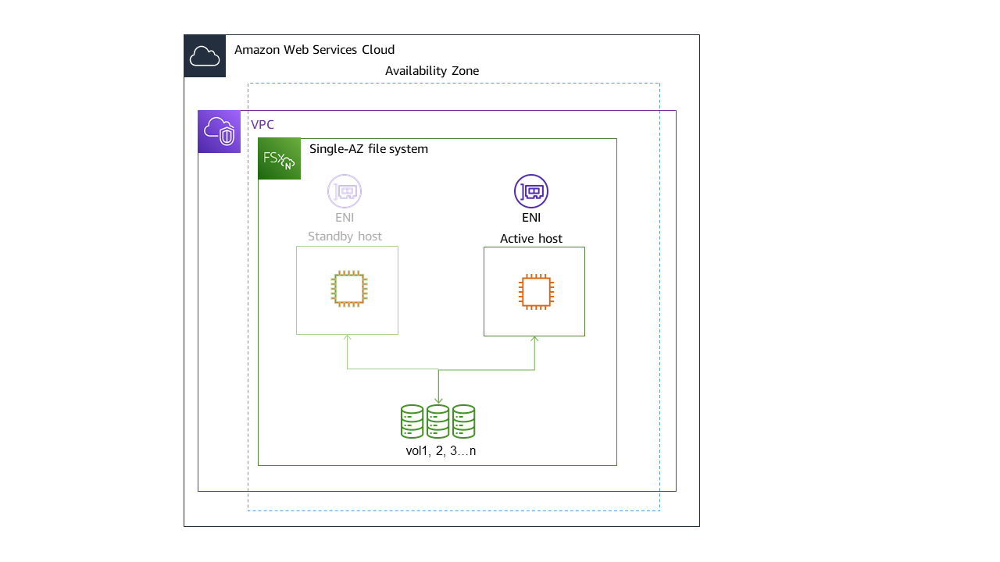
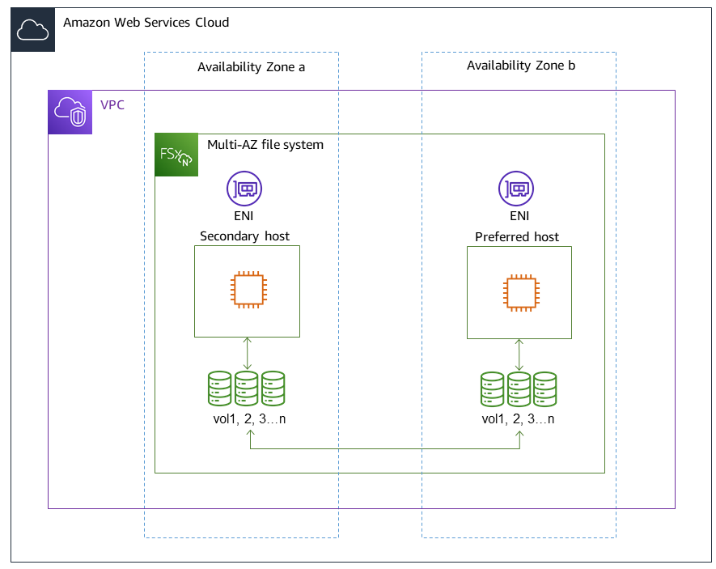

# Availability, durability, and deployment options

Amazon FSx for NetApp ONTAP uses Single-AZ and Multi-AZ deployment types. You can choose from four options: Single-AZ 1, Single-AZ 2, Multi-AZ 1, and Multi-AZ 2. This topic describes the availability and durability features
of each deployment type to help you choose the one that is right for your workloads.
For information on the service's availability SLA (Service Level Agreement),
see [Amazon FSx Service Level Agreement](https://aws.amazon.com/fsx/sla/ "https://aws.amazon.com/fsx/sla/").

###### Topics

- [Choosing a file system deployment type](#choosing-deployment-type "#choosing-deployment-type")
- [Choosing a file system generation](#choose-generation "#choose-generation")
- [Failover process for FSx for ONTAP](#Failover "#Failover")
- [Network resources](#single-multi-az-resources "#single-multi-az-resources")

## Choosing a file system deployment type

The availability and durability features of Single-AZ and Multi-AZ file system deployment types are
described in the following sections.

### Single-AZ deployment types

You can choose between Single-AZ 1 and Single-AZ 2 for your Single-AZ file system. Single-AZ 1 is a first-generation file system with one high-availability (HA)
pair, whereas Single-AZ 2 is a second-generation file system with 1–12 HA pairs. For more information, see [Choosing a file system generation](#choose-generation "#choose-generation").

When you create a Single-AZ file system, Amazon FSx automatically provisions one to twelve pairs of file servers
in an active-standby configuration, with the active and standby file servers in each pair located in separate fault domains
within a single Availability Zone in the AWS Region. During planned file system maintenance or an unplanned
service disruption of any active file server, Amazon FSx automatically and independently fails over that high-availability (HA) pair
to the standby file server, typically within a few seconds.
During a failover, you continue to have access to your data without manual intervention.

To ensure high availability, Amazon FSx continuously monitors for hardware failures, and automatically replaces
infrastructure components in the event of a failure. To achieve high durability, Amazon FSx automatically
replicates your data within an Availability Zone to protect it from component failure. In addition, you
have the option to configure automatic daily backups of your file system data. These backups
are stored across multiple Availability Zones to provide multi-AZ resiliency for all backup
data.

Single-AZ file systems are designed for use cases
that do not require the data resiliency model of a Multi-AZ file system. They provide a
cost-optimized solution for use cases such as development and test environments, or storing
secondary copies of data that is already stored on premises or in other AWS Regions, by only
replicating data within a single Availability Zone.

The following diagram illustrates the architecture for an FSx for ONTAP Single-AZ first-generation file system.

### Multi-AZ deployment types

You can choose between Multi-AZ 1 and Multi-AZ 2 for your Multi-AZ file system. Multi-AZ 1 is a first-generation file system and Multi-AZ 2 is a second-generation file system. Both options have one HA pair.
For more information, see [Choosing a file system generation](#choose-generation "#choose-generation").

Multi-AZ file systems support all the availability and durability features of Single-AZ file
systems. In addition, they are designed to provide continuous availability to data even when an
Availability Zone is unavailable. Multi-AZ deployments have a single HA pair of file servers, the standby file server is deployed in
a different Availability Zone from the active file server in the same AWS Region. Any changes
written to your file system are synchronously replicated across Availability Zones to the
standby.

Multi-AZ file systems are designed for use cases such as business-critical production
workloads that require high availability to shared ONTAP file data and need storage with
built-in replication across Availability Zones. The following diagram illustrates the
architecture for an FSx for ONTAP Multi-AZ first-generation file system.

## Choosing a file system generation

The following table illustrates the differences between first and second-generation Single-AZ and Multi-AZ FSx for ONTAP file systems.

| FSx for ONTAP file system generations | Dimension                                                       | First-generation                                       | Second-generation (single HA pair)                                           | Second-generation (multi-pair) |
| ------------------------------------- | --------------------------------------------------------------- | ------------------------------------------------------ | ---------------------------------------------------------------------------- | ------------------------------ |
| Deployment type                       | SINGLE_AZ_1 MULTI_AZ_1                                       | SINGLE_AZ_2 MULTI_AZ_2                              | SINGLE_AZ_2                                                                  |
| HA pairs                              | 1 HA pair                                                       | 1–12 HA pairs                                          |
| SSD storage                           | Minimum: 1 TiB Maximum: 192 TiB                              | Minimum: 1 TiB Maximum: 512 TiB                     | Minimum: 1 TiB (per HA pair) Maximum: 1 PiB (total)                       |
| SSD IOPS                              | Minimum: 3 IOPS/GIB of SSD Maximum: 160,000                  | Minimum: 3 IOPS/GIB of SSD Maximum: 200,000         | Minimum: 3 IOPS/GIB of SSD Maximum: 2,400,000 (200,000 per HA pair)       |
| Throughput capacity                   | 128 MBps; 256 MBps; 512 MBps; 1,024 MBps;2,048 MBps; 4,096 MBps | 384 MBps; 768 MBps; 1,536 MBps; 3,072 MBps; 6,144 MBps | 1,536 MBps (per HA pair); 3,072 MBps (per HA pair); 6,144 MBps (per HA pair) |

###### Note

You can't change your file system's deployment type after creation. If you want to change
the deployment type (for example, to move from Single-AZ 1 to Single-AZ 2), you can back up your data and restore
it on a new file system. You can also migrate your data with NetApp SnapMirror, with
AWS DataSync, or with a third-party data copying tool.
For more information, see [Migrating to FSx for ONTAP using NetApp SnapMirror](migrating-fsx-ontap-snapmirror.md "migrating-fsx-ontap-snapmirror.md") and
[Migrating to FSx for ONTAP using
AWS DataSync](migrate-files-to-fsx-datasync.md "migrate-files-to-fsx-datasync.md").

## Failover process for FSx for ONTAP

Single-AZ and Multi-AZ file systems automatically fail over a given HA pair from the preferred or active file server to the standby file
server if any of the following conditions occur:

- The preferred or active file server becomes unavailable
- The file system's throughput capacity is changed
- The preferred or active file server undergoes planned maintenance
- An Availability Zone outage occurs (Multi-AZ file systems only)

###### Note

For second-generation file systems with multiple HA pairs, each HA pair's failover behavior is independent. If the preferred file server for one HA pair is
unavailable, only that HA pair will fail over to its standby file server.

When failing over from one file server to another, the new active file server automatically
begins serving all file system read and write requests to that HA pair. For Multi-AZ file systems, when the preferred
file server is fully recovered and becomes available, Amazon FSx automatically fails back to it, with
failback usually completing in less than 60 seconds. For Single-AZ and Multi-AZ file systems, a failover typically completes in less than 60
seconds from the detection of the failure on the active file server to the promotion of the
standby file server to active status. Because the endpoint IP address that clients
use to access data over NFS or SMB remains the same, failovers are transparent to Linux, Windows,
and macOS applications, which resume file system operations without manual intervention.

To ensure that failovers are transparent to clients connected to your FSx for ONTAP Single-AZ and Multi-AZ file systems, see
[Accessing data from within the AWS Cloud](supported-fsx-clients.md#access-environments "supported-fsx-clients.md#access-environments").

### Testing failover on a file system

You can test failover on your file system by modifying its throughput capacity. When you
modify your file system's throughput capacity, Amazon FSx switches out the file system's file servers
serially. File systems automatically fail over to the secondary server while Amazon FSx replaces the
preferred file server first. Once updated, the file system automatically fails back to the new
primary server and Amazon FSx replaces the secondary file server.

You can monitor the progress of the throughput capacity update request in the Amazon FSx
console, the CLI, and the API. For more information about modifying your file system's
throughput capacity and monitoring the progress of the request, see [Managing throughput capacity](managing-throughput-capacity.md "managing-throughput-capacity.md").

## Network resources

This section describes the network resources consumed by Single-AZ and Multi-AZ file systems.

### Subnets

When you create a Single-AZ file system, you specify a single subnet for the file system. The
subnet you choose defines the Availability Zone in which the file system is created.
When you create a Multi-AZ file system, you specify two subnets, one for the preferred file
server, and one for the standby file server. The two subnets you choose must be in different
Availability Zones within the same AWS Region. For more information about Amazon VPC, see
[What is Amazon VPC?](../../../vpc/latest/userguide/what-is-amazon-vpc.md "../../../vpc/latest/userguide/what-is-amazon-vpc.md")
in the _Amazon Virtual Private Cloud User Guide_.

###### Note

Regardless of the subnet that you specify, you can access your file system from any
subnet within the file system's VPC.

### File system elastic network interfaces

For Single-AZ file systems, Amazon FSx provisions two [elastic network interfaces](../../../vpc/latest/userguide/VPC_ElasticNetworkInterfaces.md "../../../vpc/latest/userguide/VPC_ElasticNetworkInterfaces.md")
(ENI) in the subnet that you associate with your file system. For Multi-AZ file systems, Amazon FSx also provisions two
ENIs, one in each of the subnets that you associate with your file system. Clients communicate with
your Amazon FSx file system using the elastic network interface. The network interfaces are
considered to be within the service scope of Amazon FSx, despite being part of your account's
VPC. Multi-AZ file systems use floating internet protocol (IP) addresses so that connected clients
seamlessly transition between the preferred and standby file servers during a failover event.

###### Warning

- You must not modify or delete the elastic network interfaces associated with your file
  system. Modifying or deleting the network interface can cause a permanent loss of connection
  between your VPC and your file system.
- The elastic network interfaces associated with your file system will have routes
  automatically created and added to your default VPC and subnet route tables. Modifying or deleting
  these routes may cause temporary or permanent loss of connectivity for your file system clients.

The following table summarizes the subnet, elastic network interface, and IP address
resources for each of the FSx for ONTAP file system deployment types:

|                                      | First-generation Single-AZ                | Second-generation Single-AZ                                                          | Multi-AZ                                  |
| ------------------------------------ | ----------------------------------------- | ------------------------------------------------------------------------------------ | ----------------------------------------- |
| Number of subnets                    | 1                                         | 1                                                                                    | 2                                         |
| Number of elastic network interfaces | 2                                         | 2 per HA pair                                                                        | 2                                         |
| Number of IP addresses per ENI       | 1 + the number of SVMs in the file system | HA pair count + HA pair count multiplied by the number of SVMs in the file system | 1 + the number of SVMs in the file system |
| Number of VPC route table routes     | N/A                                       | N/A                                                                                  | 1 + the number of SVMs in the file system |

Once a file system or SVM is created, its IP addresses doesn't change until the file
system is deleted.

###### Important

Amazon FSx doesn't support accessing file systems from, or exposing file systems to the
public Internet. Amazon FSx automatically detaches any Elastic IP address which is a public IP address reachable from
the Internet, that gets attached to a file system's elastic network interface.
