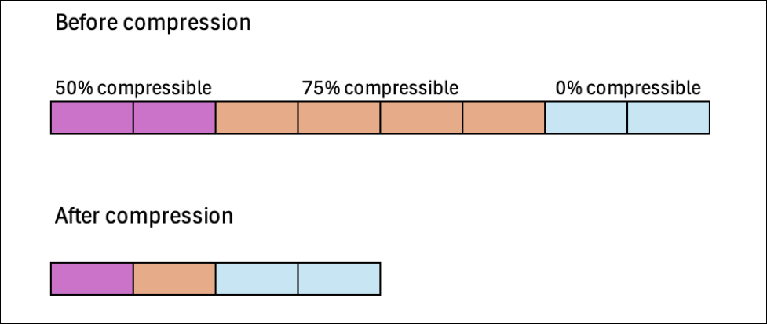
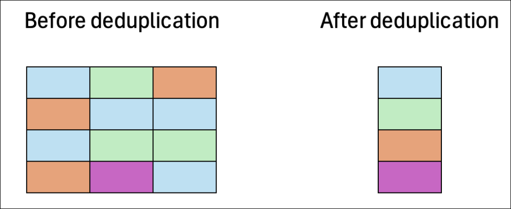
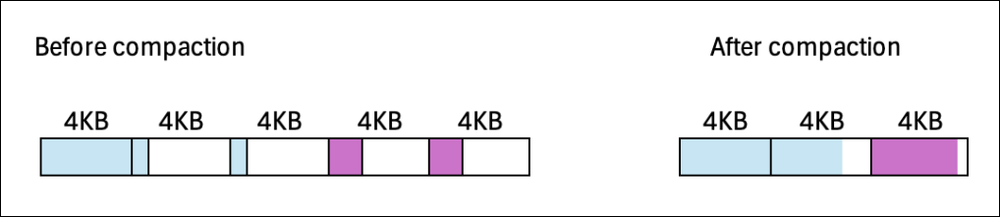
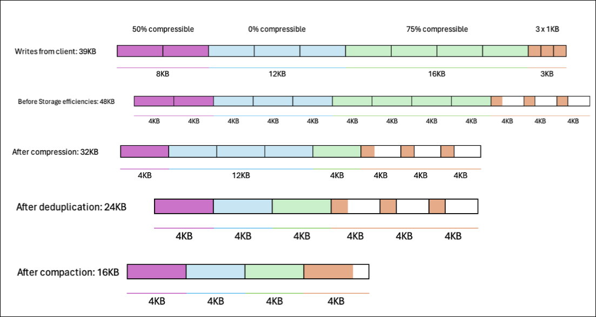

# Managing storage efficiencies

By enabling storage efficiencies on your FSx for ONTAP volumes, you can optimize storage utilization, reduce storage costs, and improve your file system's
performance overall.

###### Note

We recommend enabling storage efficiencies using the Amazon FSx console, API, or AWS CLI to ensure that the optimal storage efficiency settings are applied to your volumes.

ONTAP organizes files into 4 kibibyte (KiB) data blocks. Storage efficiencies take place at the data block level rather than at the level of individual
files. When storage efficiencies are enabled, ONTAP employs a combination of data reduction techniques to eliminate duplicate data, compress the size of data, and reorganize the layout of
data for optimal disk usage.

Storage efficiencies are applied in two ways. They are applied to data inline (before data is written to disk, in memory) to provide immediate storage savings.
They are also applied to data in the background (after the data is written to disk) in the SSD storage tier through periodic efficiency jobs to optimize storage utilization over time.
Background storage efficiencies don't run on data after it's tiered to the capacity pool. However, if the data had any storage savings while it was in SSD, these savings are preserved when the data
is tiered to the capacity pool.

###### Note

ONTAP doesn't support enabling storage efficiencies on data protection (DP) volumes.
However, storage savings achieved in the source read-writable (RW) volume are preserved when data is replicated to the destination DP volume.

## Compression of data blocks

Compression groups are logical groupings of data that are managed and compressed together as a single block. ONTAP automatically packs data blocks
into compression groups, which reduces the space consumed on disk. To optimize performance and storage utilization, ONTAP provides a balanced approach to
managing data by adjusting the degree of compression that's applied to the data based on its access patterns.

By default, data is compressed inline using 8 KB compression groups to ensure optimal performance when writing data to a volume. Optionally, you can apply heavier compression
to data by enabling inactive data compression on a volume to further compress data in SSD. Inactive data compression uses 32 KB compression groups on cold data for additional storage savings. For more information,
see the [`volume efficiency inactive-data-compression modify`](https://docs.netapp.com/us-en/ontap-cli-9131/volume-efficiency-inactive-data-compression-modify.html#description "https://docs.netapp.com/us-en/ontap-cli-9131/volume-efficiency-inactive-data-compression-modify.html#description") command in the NetApp ONTAP Documentation Center.

###### Note

Inactive data compression consumes additional CPU and disk IOPS and can be a resource-intensive task. We recommend that you evaluate the performance impact of running
inactive data compression on your workload before enabling this feature.

The following image illustrates the storage savings that can be achieved by compressing data blocks.

## Deduplication of data blocks

ONTAP detects and eliminates duplicate data blocks to reduce redundancies in data. The duplicate blocks are
replaced with references to shared unique blocks.

By default, data is deduplicated inline to reduce the storage footprint before data is written to disk. ONTAP also
runs a background deduplication scanner at specified intervals to identify and eliminate duplicate data after it's been written to disk.
During these scheduled scans, ONTAP processes a change log to identify new or modified data blocks since the last scan that
haven't been deduplicated yet. When duplicates are found, ONTAP updates the metadata to point to a single copy of the
duplicated blocks and marks the redundant blocks as free space that's ready to be reclaimed.

###### Note

ONTAP applies deduplication to 4 KB of incoming writes at a time, so you might see lower deduplication
savings when running workloads with writes that are smaller than 4 KB in size.

FSx for ONTAP doesn't support cross-volume deduplication.

The following image illustrates the storage savings that can be achieved with deduplication.

## Compaction of data blocks

ONTAP consolidates partially filled data blocks that are less than 4 KB each into a more efficiently utilized 4 KB block.

By default, data is compacted inline to optimize the layout of data as it's written to disk to minimize storage overhead, reduce fragmentation, and
improve read performance.

The following image illustrates the storage savings that can be achieved with compaction.

## Example: storage efficiencies

The following image illustrates how storage efficiencies are applied to data.

